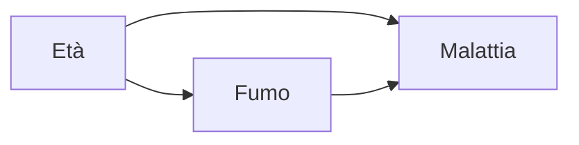

# Inferenza bayesiana e causale

## Bayesianesimo in 1 minuto

Per il bayesiano, i parametri **sono variabili aleatorie**. Tutto ruota attorno a:

$$P(\theta | D) = \frac{P(D | \theta) P(\theta)}{P(D)}$$

- **Prior** $P(\theta)$: conoscenza prima dei dati.
- **Likelihood** $P(D|\theta)$: probabilità dei dati dato $\theta$.
- **Posterior** $P(\theta|D)$: ciò che vuoi.

A differenza del frequentista, ottieni una **distribuzione** sul parametro, non una stima puntuale + IC. Puoi dire frasi tipo "c'è 95% di probabilità che $\mu \in [a, b]$" — cosa che il frequentista non può.

## PyMC: probabilistic programming

```bash
pip install pymc arviz
```

Esempio: stima media + varianza di dati gaussiani:

```python
import pymc as pm
import numpy as np
import arviz as az

data = np.random.normal(5, 2, 100)

with pm.Model() as model:
    mu = pm.Normal('mu', mu=0, sigma=10)
    sigma = pm.HalfNormal('sigma', sigma=10)
    y = pm.Normal('y', mu=mu, sigma=sigma, observed=data)
    trace = pm.sample(2000, tune=1000, chains=4)

az.summary(trace)
az.plot_posterior(trace)
```

`pm.sample()` usa MCMC (NUTS, No-U-Turn Sampler) per campionare dal posterior. Output: posterior per `mu` e `sigma`.

## Modelli gerarchici

L'arma segreta del bayesiano. Quando hai gruppi (es: città, scuole, prodotti) con pochi dati ciascuno:

```python
import pymc as pm
with pm.Model() as model:
    # iperparametri (global)
    mu_global = pm.Normal('mu_global', 0, 10)
    sigma_global = pm.HalfNormal('sigma_global', 5)
    # parametri per gruppo
    mu_group = pm.Normal('mu_group', mu_global, sigma_global, shape=n_groups)
    sigma_obs = pm.HalfNormal('sigma_obs', 5)
    y = pm.Normal('y', mu_group[group_idx], sigma_obs, observed=y_data)
    trace = pm.sample()
```

Il "**partial pooling**" trasferisce informazione tra gruppi: gruppi piccoli "prendono in prestito" dalla media globale. Migliore di "no pooling" (un modello per gruppo) e di "complete pooling" (un solo modello).

## A/B test bayesiano

Per due variazioni con conversion rate $p_A$ e $p_B$, prior Beta(1,1):

```python
import pymc as pm
with pm.Model():
    pA = pm.Beta('pA', 1, 1)
    pB = pm.Beta('pB', 1, 1)
    pm.Binomial('yA', n=nA, p=pA, observed=conv_A)
    pm.Binomial('yB', n=nB, p=pB, observed=conv_B)
    diff = pm.Deterministic('diff', pB - pA)
    trace = pm.sample(2000)
print(f"P(B > A): {(trace.posterior['diff'] > 0).mean().item():.3f}")
```

Output diretto: "B è migliore di A con probabilità 0.92". Più interpretabile del p-value.

## Quando scegliere il bayesiano

- Pochi dati per gruppo, molti gruppi → modelli gerarchici.
- Vuoi incorporare prior knowledge.
- Devi quantificare incertezza in modo "naturale".
- Modelli complessi non-lineari/non-standard.

Contro: lento (MCMC), curva di apprendimento.

## Causal inference

Una delle frontiere più importanti per data scientist senior.

### Correlazione ≠ causalità (di nuovo)

Il classico esempio: chi prende l'aspirina ha più probabilità di guarire dal mal di testa **rispetto a chi non la prende**. Ma chi la prende probabilmente aveva mal di testa più forte all'inizio. **Confondimento**.

Per stimare l'effetto causale serve un meccanismo che simuli "se avessimo dato l'aspirina a tutti / a nessuno", non solo correlazione osservata.

### Il gold standard: RCT

Randomized Controlled Trial. Assegni il trattamento a caso → gruppi sono comparabili in media. Differenza tra gruppi = effetto causale.

In tech, RCT = A/B test. In medicina = clinical trial.

> **Sempre preferire RCT** quando fattibile. Ogni metodo causale "observational" è una toppa quando non si può randomizzare.

### DAG e do-calculus

Pearl ha formalizzato il ragionamento causale via **DAG** (Directed Acyclic Graph). Una freccia $X \to Y$ = "X causa Y".

Il **back-door criterion**: per misurare l'effetto causale di $X$ su $Y$, controlla un set $Z$ che "blocca" tutte le path indirette $X \leftarrow ... \rightarrow Y$.

Esempio:



Se vuoi l'effetto di Fumo su Malattia, devi **controllare per Età** (è un confondente). Altrimenti la correlazione fumo-malattia include parte dell'effetto età.

### Quasi-experimental designs

Quando non puoi randomizzare:

- **Difference-in-differences (DiD)**: confronta variazioni nel tempo tra trattati e controllo.
- **Regression discontinuity (RD)**: usa una soglia che separa trattati e controlli.
- **Instrumental variables (IV)**: una variabile che influenza il trattamento ma non l'outcome direttamente.
- **Synthetic control**: costruisci un "controllo sintetico" come combinazione di non-trattati.
- **Propensity score matching**: abbina trattati e non-trattati con probabilità simili di ricevere il trattamento.

### DoWhy + EconML

```python
from dowhy import CausalModel
model = CausalModel(
    data=df, treatment='T', outcome='Y',
    common_causes=['age','income','education']
)
identified_estimand = model.identify_effect()
estimate = model.estimate_effect(identified_estimand, method_name="backdoor.propensity_score_matching")
refute = model.refute_estimate(identified_estimand, estimate, method_name="random_common_cause")
```

EconML aggiunge metodi ML-based (Double ML, Causal Forests).

## Ethics e fairness

Il modello affidabile non basta. Considera:

### Fairness metrics

- **Demographic parity**: stessa rate di positivo tra gruppi.
- **Equal opportunity**: stesso TPR tra gruppi.
- **Equalized odds**: stesso TPR e FPR tra gruppi.

Spesso queste metriche sono **mutuamente incompatibili** (impossibility theorem, Kleinberg 2016). Devi scegliere.

### Bias nei dati

- Storico (dati che riflettono discriminazioni passate).
- Selezione (chi è nel dataset?).
- Misurazione (l'etichetta è proxy del vero target?).

Tool: `fairlearn`, `aif360`.

### Linee guida

1. **Audit dei dati** prima del modello.
2. **Definisci gruppi protetti** rilevanti (etnia, genere, età).
3. **Misura** la performance per gruppo.
4. **Discuti i tradeoff** con stakeholder non tecnici.
5. **Documenta**: chi è stato escluso, perché.

## Esercizi

<details>
<summary>Esercizio 1 — Inferenza Bayesiana di una proporzione</summary>

```python
import pymc as pm
with pm.Model():
    p = pm.Beta('p', 1, 1)
    pm.Binomial('y', n=100, p=p, observed=18)
    trace = pm.sample(2000)
import arviz as az
print(az.summary(trace))
# stima ~ 0.18 con HDI 95% [0.11, 0.26]
```
</details>

<details>
<summary>Esercizio 2 — Modello gerarchico</summary>

Hai conversioni per 10 città con sample size molto diversi (alcune 5000 visitatori, altre 50). Stima conv rate per città con partial pooling.

Risultato atteso: città con pochi dati vengono "tirati verso la media globale", quelle con molti dati restano vicine al loro empirico.
</details>

<details>
<summary>Esercizio 3 — Identifica il confondente</summary>

I dati mostrano che bere caffè correla con cancro al polmone. Domanda: causale?

**Risposta**: probabilmente confondente = **fumo**. I fumatori bevono più caffè e fumano. Controlla per fumo nel modello, l'effetto del caffè svanisce.

Lezione: prima di modellare, disegna il DAG.
</details>

<details>
<summary>Esercizio 4 — Fairness audit</summary>

Su un modello di credit scoring, calcola TPR e FPR per gruppo (es: maschi vs femmine).

```python
from fairlearn.metrics import MetricFrame, true_positive_rate, false_positive_rate
mf = MetricFrame(
    metrics={'TPR': true_positive_rate, 'FPR': false_positive_rate},
    y_true=y_test, y_pred=y_pred,
    sensitive_features=df_test['gender']
)
print(mf.by_group)
```

Se differenze grandi → problema. Tecniche di mitigation: reweighing, adversarial debiasing, threshold per gruppo.
</details>

## Cosa portarti via

- Bayesiano = distribuzione su parametri, interpretazione diretta.
- Modelli gerarchici per dati con struttura "gruppi".
- RCT > metodi observational, sempre quando possibile.
- DAG e back-door criterion per analisi causale.
- Fairness non è opzionale: misura, documenta, discuti.

Prossimo: capstone e carriera.
