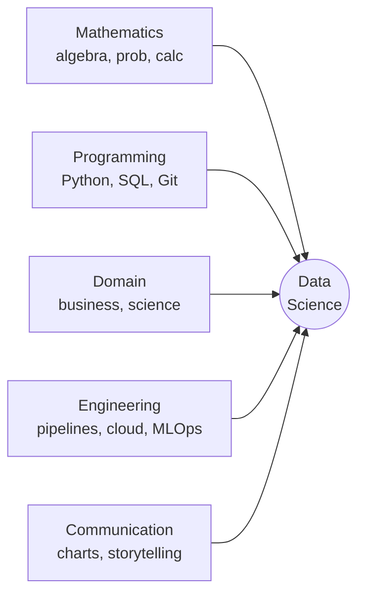
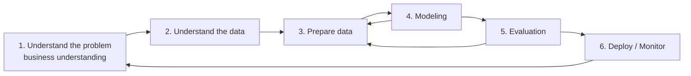
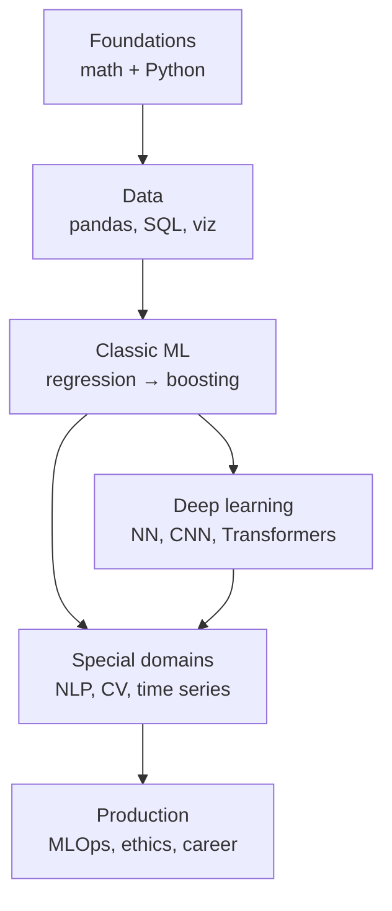
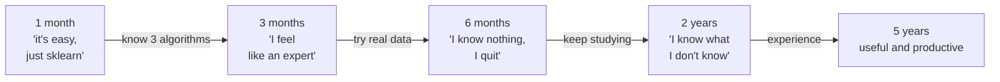

# What is data science (and what isn't)

## A definition that actually works

The most common definition — "intersection of statistics, computer science, and domain knowledge" — is true but useless. A more operational one:

> **Data science = turning raw data into repeatable decisions.**

Three keywords:

- **turning**: you write code. Extract, clean, model, evaluate. No magic.
- **raw data**: imperfect, missing, imbalanced. 70% of your time goes here.
- **repeatable decisions**: a metric only matters if someone uses it to choose. Otherwise it's art.

## The updated Venn diagram

Drew Conway's famous 2010 diagram split the world into three circles: math/statistics, hacking skills, domain. In 2026 we need five:

If any of these circles is weak you can still be good — but in a subset of problems. An academic data scientist is strong in M+D+C, weak in E. An ML engineer is strong in P+E+M, weak in D. Knowing where you're strong is half the job.

## Project lifecycle (CRISP-DM, updated)

The classic **CRISP-DM** model (Cross-Industry Standard Process for Data Mining, IBM 1996) is still the most sensible. Six iterative phases:

**Real-world numbers** (rough estimates any senior will confirm):

| Phase | % of time |
|---|---|
| Understand the problem | 5–15% |
| Understand and explore data | 20% |
| Prepare data | 30–50% |
| Modeling | 10–15% |
| Evaluation | 10% |
| Deploy/monitor | 10–20% |

The model is not the most important part. **Data cleaning** and **problem understanding** are. If you only remember one thing from this page, remember that.

## What data science is NOT

- **Not "fitting a model"**. That's one hour of work in an eight-week project.
- **Not "finding insights with a dashboard"**. That's business intelligence, useful but different.
- **Not "applying deep learning to everything"**. For 70% of real problems, a well-tuned logistic regression beats a poorly-specified neural network.
- **Not "working with Big Data"**. Most company datasets fit in RAM. Pandas, not Spark.
- **Not "AI"**. AI is a marketing term that today mostly means LLMs. Data science is far broader and older (Tukey wrote about "data analysis" in the 1960s).

## Roles you'll find on the job market

| Role | What they do | Typical stack |
|---|---|---|
| **Data analyst** | Answers questions with SQL and dashboards | SQL, Excel, Tableau/PowerBI |
| **Data scientist** | Builds predictive/inferential models | Python, scikit-learn, statsmodels |
| **ML engineer** | Puts models in production | Python, Docker, Kubernetes, MLflow |
| **Data engineer** | Builds pipelines that move data | SQL, Spark, Airflow, dbt |
| **Research scientist** | Invents new methods (PhD usually required) | PyTorch/JAX, papers |
| **Analytics engineer** | Models data for business intelligence | dbt, SQL, Snowflake |
| **AI engineer (2024+)** | Builds applications with LLMs | LangChain, vector DBs, APIs |

These are not rigid roles: at a startup one person does everything; in big tech they're separate. This path prepares you primarily to be a **generalist data scientist** with solid foundations everywhere.

## What you'll learn in this path

By the end you'll be able to:

1. Read an ML paper and understand what it does (not every detail right away).
2. Tackle a new dataset: understand it, clean it, find signal.
3. Pick the right model (not always the newest).
4. Evaluate honestly: don't lie to yourself about results.
5. Put a model in production and monitor it.
6. Communicate findings to people who don't speak math.

## What you WON'T learn (here)

- **PhD-level math**. You'll understand linear algebra and calculus at an "applied" level, not at a proof-writing level.
- **Frontend / mobile**. No React, no Swift. Backend Python yes.
- **All frameworks**. PyTorch yes, JAX and TensorFlow touched on. You can't know everything, and that's fine.
- **The latest NeurIPS paper**. Research moves faster than any course. We'll give you the foundations to read them yourself.

## The Dunning–Kruger curve of data science

If you find yourself at point C, don't quit. Everyone goes through it. It's the point where you start understanding **why** things work (or don't), and from there every month of study compounds.

## The one sentence to frame

> Your best model is useless if you can't explain what it does, why it works, and when it will stop working.

Accurate models are everywhere. **Reliable models** are rare — and they're what pays senior data scientist salaries.

## Exercises

Exercise 1 — Classify the problems

For each problem, identify which approach is best: A) data analysis, B) classic ML, C) deep learning, D) hand-coded rules, E) none of the above (wrong question).

1. "How many users opened our app last week?"
2. "Which customers will stop paying the subscription in the next 30 days?"
3. "Identify tumors in these 10000 MRI scans."
4. "If we add this button, will we sell more?"
5. "Generate a summary of this 5000-word article."
6. "Is the IBAN the user typed formally valid?"
7. "Why did John Smith stop using the app?"
8. "What price maximizes profits?"

**Solution:**
1. A (SQL). 2. B (logistic regression / gradient boosting). 3. C (CNN). 4. E (A/B test, not ML). 5. C (LLM). 6. D (regex/checksum). 7. E (not answerable from data alone, needs user research). 8. B+E (model + business sense).

Key point: not everything is ML. "What's the right tool?" precedes "what algorithm do I use?".

Exercise 2 — Time estimation

A company commissions you to build a system to predict which customers will churn in the next 90 days. You have 6 weeks.

Estimate how many hours you'll spend in each CRISP-DM phase. Include: stakeholder meetings, data exploration, feature engineering, modeling, evaluation, presentation, deploy.

**Reasonable estimate** (out of ~240 hours total):

- Understand problem + stakeholders: 30h (12%)
- Data exploration + SQL: 50h (21%)
- Cleaning + feature engineering: 70h (29%)
- Modeling: 30h (12%)
- Evaluation + iteration: 30h (12%)
- Presentation + deploy: 30h (12%)

If you estimated "150h modeling and 10h cleaning", think again. When a junior says "I didn't have time to do anything interesting", the problem is almost always underestimating phase 3, not phase 4.

Exercise 3 — Which role matches you?

Read these three job description excerpts and identify the role:

**A)** "5+ years experience with distributed systems, Kafka, Airflow. Build and maintain ELT pipelines moving 500GB/day from operational stores to Snowflake. Optimize dbt models for downstream analytics teams."

**B)** "PhD or equivalent in CS/Stat. Strong publication record in NeurIPS/ICML. Design and prototype novel architectures for multimodal foundation models. Familiarity with JAX preferred."

**C)** "Strong Python and SQL. Experience deploying scikit-learn or XGBoost models to production. Familiarity with Docker, Kubernetes, MLflow or similar. Owned model lifecycle end-to-end."

**Solution:** A=data engineer, B=research scientist, C=ML engineer. None of the three is a "pure data scientist" — that role is fading in big tech in favor of specialized ones. At smaller companies the "data scientist" does pieces of all three.

## What to read next

- **Andrew Ng** — "Machine Learning Yearning" (free PDF): project strategy, not algorithms.
- **Hadley Wickham, Garrett Grolemund** — "R for Data Science" (yes, even if we use Python): workflows are universal.
- **Trevor Hastie, Robert Tibshirani** — "An Introduction to Statistical Learning" (ISLR, free): the standard text. You'll use it across this path.
- **Cassie Kozyrkov** — Medium articles: the best critic of "everything is AI". Read her to keep your head.

## Next step

In the next section we set up Python and the work environment. If you already have a setup, read it anyway: most juniors misuse `pip` and `venv` and pay the price for years.
