# Probability distributions you'll meet

## Mental map

```mermaid
flowchart TD
    DISCRETE[Discrete] --> BER[Bernoulli<br/>1 trial]
    DISCRETE --> BIN[Binomial<br/>n trials, count successes]
    DISCRETE --> POIS[Poisson<br/>events in interval]
    DISCRETE --> GEO[Geometric<br/>trials until 1st success]
    DISCRETE --> NEG[Neg. Binomial<br/>variance &gt; mean]

    CONT[Continuous] --> NORM[Normal<br/>sums, errors]
    CONT --> EXP[Exponential<br/>time between events]
    CONT --> GAMMA[Gamma / Erlang<br/>sum of exponentials]
    CONT --> BETA[Beta<br/>proportions in 0,1]
    CONT --> LN[Lognormal<br/>products, incomes]
    CONT --> PAR[Pareto<br/>heavy tails]
    CONT --> TST[t-Student<br/>small samples]
    CONT --> FCH[F, χ²<br/>tests]
```



## Discrete distributions

### Bernoulli

A binary trial with success probability $p$.

$$P(X=1)=p, \quad P(X=0)=1-p$$

$E[X]=p$, $\text{Var}(X)=p(1-p)$. The basis of **logistic regression** and binary classification.

### Binomial

Number of successes in $n$ independent Bernoulli trials with the same $p$.

$$P(X=k) = \binom{n}{k} p^k (1-p)^{n-k}, \quad k=0,\dots,n$$

$E[X]=np$, $\text{Var}(X)=np(1-p)$.

Use: conversion rate, click rate, yes/no surveys, A/B tests.

```python
from scipy.stats import binom
binom(n=100, p=0.05).pmf(7)   # P(7 successes out of 100, p=0.05)
binom.rvs(100, 0.05, size=10) # 10 samples
```

### Poisson

Number of events in an interval (time, space) given rate $\lambda$.

$$P(X=k) = \frac{\lambda^k e^{-\lambda}}{k!}, \quad k=0,1,2,\dots$$

$E[X]=\lambda$, $\text{Var}(X)=\lambda$. **Mean equals variance** is Poisson's signature.

Use: call center calls per hour, clicks per hour, DNA mutations, earthquakes, queues.

> If data has variance >> mean, it's NOT Poisson — it's **overdispersed**, use **Negative Binomial**.

### Geometric

Number of trials until first success (Bernoulli with prob $p$).

$$P(X=k) = (1-p)^{k-1} p, \quad k=1,2,\dots$$

$E[X]=1/p$. "Memoryless": $P(X > a+b | X > a) = P(X > b)$.

### Negative Binomial

Number of failures before the $r$-th success. Generalizes Poisson allowing overdispersion. Used in count models (sales, calls) where Poisson underestimates the tail.

## Continuous distributions

### Normal (Gaussian)

$$f(x) = \frac{1}{\sigma \sqrt{2\pi}} \exp\left(-\frac{(x-\mu)^2}{2\sigma^2}\right)$$

Notation: $X \sim \mathcal{N}(\mu, \sigma^2)$.

**Why everywhere**: CLT guarantees that sums of many variables tend to normal. Measurement errors, model residuals, sample means.

Properties:
- 68% of data within $\mu \pm \sigma$, 95% within $\mu \pm 2\sigma$, 99.7% within $\mu \pm 3\sigma$.
- Sum of independent normals is normal: $X_1 + X_2 \sim \mathcal{N}(\mu_1+\mu_2, \sigma_1^2+\sigma_2^2)$.
- Linear transformation: $aX+b \sim \mathcal{N}(a\mu+b, a^2\sigma^2)$.

<div class="chart"><svg viewBox="0 0 400 180" xmlns="http://www.w3.org/2000/svg">
<line x1="20" y1="150" x2="380" y2="150" stroke="#555"/>
<path d="M 20 150 Q 100 150 160 140 Q 180 130 200 30 Q 220 130 240 140 Q 300 150 380 150" fill="rgba(122,162,255,0.2)" stroke="#7aa2ff" stroke-width="2"/>
<line x1="200" y1="30" x2="200" y2="150" stroke="#ffb347" stroke-dasharray="3,3"/>
<text x="200" y="170" fill="#ffb347" font-size="11" text-anchor="middle">μ</text>
<line x1="160" y1="140" x2="160" y2="150" stroke="#c084fc" stroke-width="2"/>
<line x1="240" y1="140" x2="240" y2="150" stroke="#c084fc" stroke-width="2"/>
<text x="160" y="170" fill="#c084fc" font-size="10" text-anchor="middle">μ-σ</text>
<text x="240" y="170" fill="#c084fc" font-size="10" text-anchor="middle">μ+σ</text>
</svg><div class="chart-caption">Standard Gaussian: 68% in the darker region, 95% around μ±2σ.</div></div>

### Exponential

Time between Poisson events with rate $\lambda$.

$$f(x) = \lambda e^{-\lambda x}, \quad x \geq 0$$

$E[X]=1/\lambda$, $\text{Var}(X)=1/\lambda^2$. Memoryless.

Use: lifetimes, time between calls, wait times.

### Gamma

Sum of $k$ exponentials (with shape $k$, rate $\lambda$).

$$f(x) = \frac{\lambda^k}{\Gamma(k)} x^{k-1} e^{-\lambda x}$$

When $k=1$, it's exponential. For integer $k$ it's called **Erlang**. Used for queue completion times, call durations.

### Beta

Distributed on $[0,1]$. Very flexible family, parameterized by $\alpha, \beta > 0$.

$$f(x) = \frac{x^{\alpha-1}(1-x)^{\beta-1}}{B(\alpha,\beta)}$$

Uses:
- Modeling proportions (conversion rate, success rate).
- **Conjugate prior** for Binomial (Bayesian analysis).
- Bayesian A/B test: posterior of a conversion rate is Beta.

<div class="chart"><svg viewBox="0 0 400 160" xmlns="http://www.w3.org/2000/svg">
<line x1="20" y1="140" x2="380" y2="140" stroke="#555"/>
<path d="M 20 140 L 380 140 L 380 100 L 20 100 Z" fill="rgba(94,226,196,0.2)" stroke="#5ee2c4" stroke-width="2"/>
<path d="M 20 140 Q 200 -10 380 140" fill="none" stroke="#ffb347" stroke-width="2"/>
<path d="M 20 60 Q 100 40 200 100 Q 300 130 380 140" fill="none" stroke="#7aa2ff" stroke-width="2"/>
<text x="60" y="80" fill="#5ee2c4" font-size="11">α=1,β=1 uniform</text>
<text x="200" y="20" fill="#ffb347" font-size="11" text-anchor="middle">α=5,β=5 centered peak</text>
<text x="50" y="55" fill="#7aa2ff" font-size="11">α=0.5,β=2 decreasing</text>
</svg></div>

### Lognormal

If $\log X \sim \mathcal{N}(\mu, \sigma^2)$, then $X$ is lognormal. Heavy right tail. Models:
- Incomes
- File sizes
- Biological concentrations
- User session durations

### Pareto

Extremely heavy tails. $f(x) \propto x^{-\alpha-1}$.

Models: wealth ("80/20"), CDN downloads, popularity of tweets/videos, earthquakes.

Lognormal vs Pareto difference: lognormal is "moderate" in the tails, Pareto is "extreme". Distinguish with a **log-log CCDF**: Pareto is a straight line.

### t-Student

$$T = \frac{Z}{\sqrt{V/k}}, \quad Z\sim\mathcal{N}(0,1), V \sim \chi^2_k$$

Heavier tails than normal, parameterized by degrees of freedom $k$. As $k \to \infty$ → normal.

Use: tests on means with small $n$ and unknown $\sigma$.

### Chi-squared ($\chi^2$)

Sum of $k$ standard normals squared.

$$Q = Z_1^2 + Z_2^2 + \dots + Z_k^2 \sim \chi^2_k$$

Use: independence test, sample variance.

### F (Fisher-Snedecor)

Ratio of two scaled $\chi^2$. ANOVA uses F.

## Conjugacies and Bayesian priors

Mnemonic table of conjugate priors (see Bayesian section for details):

| Likelihood | Conjugate prior | Posterior |
|---|---|---|
| Bernoulli/Binomial | Beta(α, β) | Beta(α+successes, β+failures) |
| Poisson | Gamma(α, β) | Gamma(α+sum, β+n) |
| Normal (σ known) | Normal | Normal |

## Which distribution for which data?

Practical workflow:

1. **Discrete variable?**
   - 0/1 → Bernoulli
   - bounded count in n trials → Binomial
   - count in interval → Poisson (if var ≈ mean), NegBin if variance high
2. **Continuous variable?**
   - symmetric → Normal
   - $> 0$, moderate right skew → Lognormal or Gamma
   - $> 0$, extremely long tail → Pareto / Weibull
   - in $[0, 1]$ → Beta
3. **Fit** with MLE, **evaluate** with Q-Q plot, AIC, KS test.

```python
from scipy import stats
# fit lognormal
shape, loc, scale = stats.lognorm.fit(data, floc=0)
# Q-Q plot
import statsmodels.api as sm
sm.qqplot(data, dist=stats.lognorm, sparams=(shape, loc, scale), line='45')
```

## Exercises

<details>
<summary>Exercise 1 — Identify the distribution</summary>

For each scenario, which distribution?

1. Number of clicks on a banner per hour (known rate).
2. Fraction of users who click (in $[0,1]$).
3. Time between arrivals at a tollbooth.
4. Annual income of a population.
5. Goals in a match.
6. Result of a coin flip.
7. Heights of adults.

**Solutions**: 1 Poisson, 2 Beta, 3 Exponential, 4 Lognormal (or Pareto in the tail), 5 Poisson, 6 Bernoulli, 7 Normal.
</details>

<details>
<summary>Exercise 2 — Poisson calculation</summary>

A call center receives an average of 4 calls every 10 minutes. What's the probability of receiving 7 in 10 minutes?

**Solution**:
$$P(X=7) = \frac{4^7 e^{-4}}{7!} \approx 0.0595$$

```python
from scipy.stats import poisson
poisson.pmf(7, mu=4)  # 0.0595
```
</details>

<details>
<summary>Exercise 3 — Bayesian A/B test with Beta</summary>

You have two variants. Variant A: 100 visitors, 12 conversions. Variant B: 100 visitors, 18 conversions. Using Beta(1,1) prior (uniform), compute posterior and P(B better than A).

```python
import numpy as np
from scipy.stats import beta
# posterior: Beta(α + successes, β + failures)
a_post = beta(1+12, 1+88)
b_post = beta(1+18, 1+82)

# Monte Carlo: P(B > A)
n = 100_000
sa = a_post.rvs(n); sb = b_post.rvs(n)
print((sb > sa).mean())   # ~0.89
```

89% probability B is better. Not yet "p<0.05" but gives a direct estimate of the probability of interest.
</details>

<details>
<summary>Exercise 4 — Lognormal fit to incomes</summary>

```python
import numpy as np
from scipy import stats
rng = np.random.default_rng(0)
income = rng.lognormal(10, 0.8, 1000)
shape, loc, scale = stats.lognorm.fit(income, floc=0)
print(f"σ̂ = {shape:.3f}, μ̂ = {np.log(scale):.3f}")
# expected: σ̂ ≈ 0.8, μ̂ ≈ 10
```
</details>

<details>
<summary>Exercise 5 — 68-95-99.7 rule</summary>

A variable $X \sim \mathcal{N}(100, 15^2)$ (e.g., IQ). Without calculator:

- P(X > 130)?
- P(70 < X < 130)?
- P(X < 55)?

**Solutions**:
- 130 = $\mu + 2\sigma$, so P(X>130) ≈ 2.5%.
- 70 and 130 are $\mu \pm 2\sigma$, so ~95%.
- 55 = $\mu - 3\sigma$, P(X < 55) ≈ 0.15%.
</details>

## Takeaways

- 8–10 distributions cover 95% of cases.
- Poisson and Normal are the pillars: know them by heart.
- Q-Q plot is the best way to test fit.
- Beta and Gamma are the most important "conjugate priors" — they live in Bayesian.

Next: NumPy, the numerical foundation of everything.
