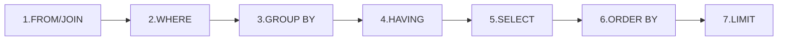
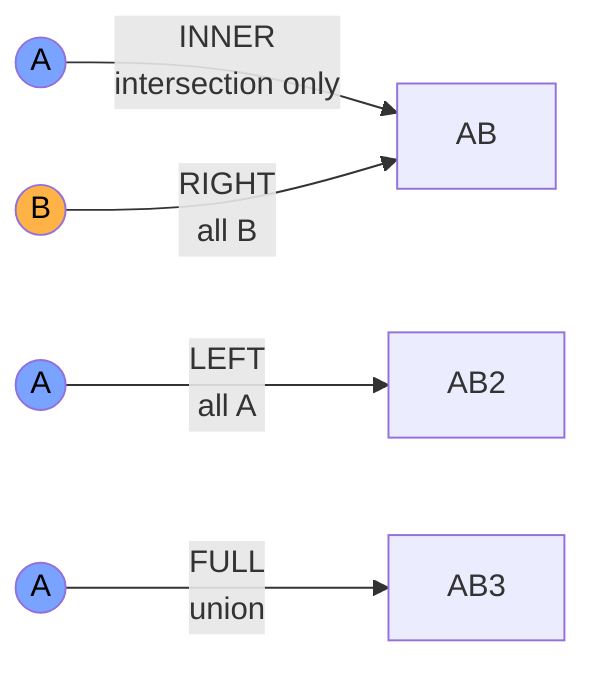

# SQL for data scientists

## Why learn it well

90% of company data lives in relational databases. Even if you'll use pandas or Spark, the first step is always `SELECT ... FROM ...`. You can't be a good data scientist without writing advanced SQL — at least window functions, CTEs, query plans.

> **DuckDB** (free, embedded, super-fast on CSV/Parquet files) is the best way to learn SQL in 2026 with no setup. `pip install duckdb`, then `duckdb.sql("SELECT * FROM 'data.csv'")`.

## Syntax: logical order differs from written order

The order you write a query (`SELECT`, `FROM`, `WHERE`, `GROUP BY`, `HAVING`, `ORDER BY`) **is not** the execution order:



Understanding this saves you from weird bugs. E.g.: **you can't use a SELECT alias in WHERE**, because WHERE runs before SELECT. You must repeat the expression or use a CTE.

## The 5 basic operations

### 1. Filters and ordering

```sql
SELECT name, age, salary
FROM employees
WHERE department = 'Engineering'
  AND salary > 50000
ORDER BY salary DESC
LIMIT 10;
```

### 2. Aggregations

```sql
SELECT
    department,
    COUNT(*) AS n,
    AVG(salary) AS avg_salary,
    PERCENTILE_CONT(0.5) WITHIN GROUP (ORDER BY salary) AS median_salary,
    MAX(salary) AS max_salary
FROM employees
GROUP BY department
HAVING COUNT(*) > 5
ORDER BY avg_salary DESC;
```

> `WHERE` filters rows before aggregation, `HAVING` filters after. Mixing them = classic bug.

### 3. JOIN

The 4 essential types:



```sql
-- INNER JOIN: matches only
SELECT o.id, o.amount, u.name
FROM orders o
INNER JOIN users u ON o.user_id = u.id;

-- LEFT JOIN: all orders, even from deleted users
SELECT o.id, o.amount, u.name
FROM orders o
LEFT JOIN users u ON o.user_id = u.id
WHERE u.name IS NULL;

-- self join
SELECT e1.name AS employee, e2.name AS manager
FROM employees e1
LEFT JOIN employees e2 ON e1.manager_id = e2.id;
```

### 4. CTE (Common Table Expression)

`WITH` makes queries readable like functions:

```sql
WITH top_customers AS (
    SELECT user_id, SUM(amount) AS total
    FROM orders
    WHERE order_date >= '2025-01-01'
    GROUP BY user_id
    HAVING SUM(amount) > 10000
),
top_with_emails AS (
    SELECT t.user_id, t.total, u.email
    FROM top_customers t
    JOIN users u ON t.user_id = u.id
)
SELECT * FROM top_with_emails ORDER BY total DESC;
```

Preferable to nested subqueries. More readable, more optimizable, reusable.

### 5. UNION

```sql
SELECT id, name FROM users_active
UNION ALL
SELECT id, name FROM users_archived;
```

`UNION` removes duplicates, `UNION ALL` doesn't (faster).

## Window functions: the superpower

Compute values **per row** considering a "window" of correlated rows. Without collapsing GROUP BY.

```sql
SELECT
    user_id,
    order_date,
    amount,
    SUM(amount) OVER (PARTITION BY user_id ORDER BY order_date) AS cum_total,
    ROW_NUMBER() OVER (PARTITION BY user_id ORDER BY order_date) AS order_num,
    LAG(amount, 1) OVER (PARTITION BY user_id ORDER BY order_date) AS prev_amount,
    AVG(amount) OVER (
        PARTITION BY user_id ORDER BY order_date
        ROWS BETWEEN 6 PRECEDING AND CURRENT ROW
    ) AS ma7
FROM orders;
```

### Use cases

| Function | What it does |
|---|---|
| `ROW_NUMBER()` | unique progressive number |
| `RANK()` / `DENSE_RANK()` | rank with/without ties gaps |
| `LAG(col, n)` / `LEAD(col, n)` | n rows back / forward |
| `FIRST_VALUE() / LAST_VALUE()` | first / last in window |
| `NTILE(n)` | divide into n equal buckets |
| `SUM / AVG / COUNT OVER (...)` | rolling aggregations |

### Example: top N per group

"For each department, the top 3 highest-paid employees":

```sql
WITH ranked AS (
    SELECT
        name, department, salary,
        ROW_NUMBER() OVER (
            PARTITION BY department ORDER BY salary DESC
        ) AS rn
    FROM employees
)
SELECT name, department, salary
FROM ranked
WHERE rn <= 3;
```

Heavily used pattern. Memorize.

## CASE WHEN: SQL if-else

```sql
SELECT
    name,
    age,
    CASE
        WHEN age < 18 THEN 'minor'
        WHEN age < 65 THEN 'adult'
        ELSE 'senior'
    END AS age_group
FROM users;
```

Combined with aggregation → conditional sum:

```sql
SELECT
    SUM(CASE WHEN status = 'paid' THEN amount END) AS revenue,
    SUM(CASE WHEN status = 'refunded' THEN amount END) AS refunds
FROM orders;
```

## Date and time

Syntax varies by DBMS, but concepts are universal.

```sql
-- PostgreSQL / DuckDB
SELECT
    DATE_TRUNC('month', order_date) AS month,
    EXTRACT(DOW FROM order_date) AS day_of_week,
    order_date + INTERVAL '7 days' AS next_week,
    AGE(order_date) AS time_since,
    NOW() AS current_timestamp
FROM orders;
```

```sql
SELECT
    DATE_TRUNC('month', order_date) AS month,
    COUNT(*) AS n,
    SUM(amount) AS revenue
FROM orders
GROUP BY 1
ORDER BY 1;
```

## Performance: understanding EXPLAIN

`EXPLAIN ANALYZE` shows the execution plan and real times. Things to look for:

- **Seq Scan** on large tables without index → suspect.
- **Hash Join** vs **Merge Join** vs **Nested Loop** — depend on sizes.
- **Index** on filter/join columns.
- `LIMIT` without `ORDER BY` on big tables — behavior not guaranteed.

```sql
EXPLAIN ANALYZE
SELECT * FROM orders WHERE user_id = 12345;
```

Tips:

1. Index columns used in `WHERE` and `JOIN`. **Never** index everything.
2. **Avoid SELECT \***: ask only for columns you need.
3. **Pre-aggregate** before join when possible.
4. **DISTINCT is often a bug**: you're saying "I created duplicates I don't understand".

## SQL ↔ pandas: the cheat sheet

| SQL | pandas |
|---|---|
| `SELECT * FROM t` | `df` |
| `SELECT a, b FROM t` | `df[['a','b']]` |
| `WHERE x > 5` | `df[df.x > 5]` |
| `GROUP BY g` | `df.groupby('g')` |
| `JOIN ON k` | `pd.merge(df1, df2, on='k')` |
| `ORDER BY x DESC` | `df.sort_values('x', ascending=False)` |
| `LIMIT 10` | `df.head(10)` |
| Window | `df.groupby('g').transform()` or rolling |

## Exercises

<details>
<summary>Exercise 1 — Top 3 per category</summary>

Given `products(id, category, price)`, query for top 3 most expensive products per category.

```sql
WITH ranked AS (
    SELECT *,
           DENSE_RANK() OVER (PARTITION BY category ORDER BY price DESC) AS r
    FROM products
)
SELECT * FROM ranked WHERE r <= 3;
```
</details>

<details>
<summary>Exercise 2 — Customer churn</summary>

Find users whose last order was more than 180 days ago.

```sql
SELECT user_id, MAX(order_date) AS last_order
FROM orders
GROUP BY user_id
HAVING MAX(order_date) < CURRENT_DATE - INTERVAL '180 days';
```
</details>

<details>
<summary>Exercise 3 — Funnel</summary>

Given `events(user_id, event_type, ts)`, compute visit → signup → purchase conversion.

```sql
SELECT
    COUNT(DISTINCT CASE WHEN event_type='view' THEN user_id END) AS step1,
    COUNT(DISTINCT CASE WHEN event_type='signup' THEN user_id END) AS step2,
    COUNT(DISTINCT CASE WHEN event_type='purchase' THEN user_id END) AS step3
FROM events
WHERE ts >= CURRENT_DATE - INTERVAL '30 days';
```

For percentages: `ROUND(100.0 * step2 / NULLIF(step1, 0), 2) AS conv_1_to_2`.
</details>

<details>
<summary>Exercise 4 — Day-N retention</summary>

For each user, did they generate an event on day N (for N=1, 7, 30) after signup?

```sql
WITH signup AS (
    SELECT user_id, DATE_TRUNC('day', signup_ts) AS d0
    FROM users
),
activity AS (
    SELECT
        s.user_id, s.d0,
        BOOL_OR(DATE_TRUNC('day', e.ts) = s.d0 + INTERVAL '1 day')  AS active_d1,
        BOOL_OR(DATE_TRUNC('day', e.ts) = s.d0 + INTERVAL '7 days') AS active_d7,
        BOOL_OR(DATE_TRUNC('day', e.ts) = s.d0 + INTERVAL '30 days') AS active_d30
    FROM signup s
    LEFT JOIN events e ON e.user_id = s.user_id
    GROUP BY s.user_id, s.d0
)
SELECT
    AVG(active_d1::int)  AS retention_d1,
    AVG(active_d7::int)  AS retention_d7,
    AVG(active_d30::int) AS retention_d30
FROM activity;
```
</details>

<details>
<summary>Exercise 5 — Sessionization</summary>

From `events(user_id, ts)`, define a session as a sequence of events with no gap > 30 minutes. Count sessions per user.

```sql
WITH ev AS (
    SELECT
        user_id, ts,
        LAG(ts) OVER (PARTITION BY user_id ORDER BY ts) AS prev_ts
    FROM events
),
flagged AS (
    SELECT
        user_id, ts,
        CASE WHEN prev_ts IS NULL OR ts - prev_ts > INTERVAL '30 min' THEN 1 ELSE 0 END AS is_new_session
    FROM ev
),
sessions AS (
    SELECT
        user_id, ts,
        SUM(is_new_session) OVER (PARTITION BY user_id ORDER BY ts) AS session_id
    FROM flagged
)
SELECT user_id, COUNT(DISTINCT session_id) AS n_sessions
FROM sessions
GROUP BY user_id;
```

Refined pattern: cumulative sum of "start flags" assigns a progressive session ID. Heavily used in analytics.
</details>

## Takeaways

- Window functions: the superpower — can't do real analysis without them.
- CTEs make queries readable.
- `WHERE` before aggregation, `HAVING` after.
- `EXPLAIN ANALYZE` to understand performance.
- DuckDB = SQL on CSV/Parquet files with no setup. Use it to learn.

Next: data visualization.
