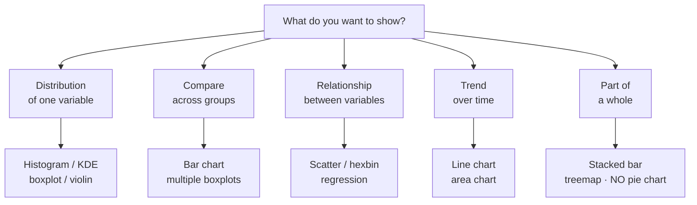

# Visualization: matplotlib, seaborn, plotly

## Why plotting matters more than you think

Plotting isn't "making the report pretty". It's **how you discover patterns, outliers, and bugs in your data**. Anscombe's quartet (seen in descriptive stats) proves it: same statistics, completely different distributions.

> Rule: when facing an unknown dataset, make 10 plots before writing a line of model code.

## Which chart for which question



> **Pie charts** are hard to read — the eye compares angles poorly. Use stacked bars or numerical tables.

## Matplotlib: the basics

The object-oriented API is more powerful than `plt.something()`. Learn it:

```python
import matplotlib.pyplot as plt
import numpy as np

fig, ax = plt.subplots(figsize=(8, 5))
x = np.linspace(0, 10, 100)
ax.plot(x, np.sin(x), label='sin', color='#7aa2ff', linewidth=2)
ax.plot(x, np.cos(x), label='cos', color='#ffb347', linewidth=2)
ax.set_xlabel("x")
ax.set_ylabel("y")
ax.set_title("sines and cosines")
ax.legend()
ax.grid(True, alpha=0.3)
plt.tight_layout()
plt.savefig("plot.png", dpi=150)
plt.show()
```

### Subplot grid

```python
fig, axes = plt.subplots(2, 3, figsize=(12, 7), sharex=True)
for i, ax in enumerate(axes.flat):
    ax.hist(data[:, i], bins=30)
    ax.set_title(f"feature {i}")
plt.tight_layout()
```

### Styles

```python
plt.style.use('seaborn-v0_8-darkgrid')
plt.style.use('ggplot')
plt.style.use('fivethirtyeight')
plt.rcParams['figure.dpi'] = 110
plt.rcParams['savefig.dpi'] = 150
```

## Seaborn: statistical grammar

Built on matplotlib, higher-level syntax for statistical charts:

```python
import seaborn as sns
tips = sns.load_dataset('tips')

sns.scatterplot(data=tips, x='total_bill', y='tip', hue='time', size='size')
sns.histplot(tips, x='total_bill', hue='sex', element='step', stat='density')
sns.boxplot(data=tips, x='day', y='total_bill', hue='smoker')
sns.violinplot(data=tips, x='day', y='total_bill', inner='quartile')
sns.regplot(data=tips, x='total_bill', y='tip')
sns.pairplot(tips, hue='sex')
sns.heatmap(tips.corr(numeric_only=True), annot=True, cmap='RdBu_r', center=0)
```

### FacetGrid and relplot/displot/catplot

For "small multiples":

```python
sns.relplot(
    data=tips, x='total_bill', y='tip',
    col='time', row='sex', hue='smoker',
    height=3.5
)
```

Creates a grid of scatters for each combination. Best way to explore interactions.

## Plotly: interactivity

When you want tooltips, zoom, and shareable HTML:

```python
import plotly.express as px
fig = px.scatter(tips, x='total_bill', y='tip', color='time', size='size',
                 hover_data=['day'], trendline='ols')
fig.show()
fig.write_html("plot.html")
```

```python
import plotly.graph_objects as go
fig = go.Figure()
fig.add_trace(go.Scatter(x=x, y=y, mode='lines+markers', name='sin'))
fig.update_layout(template='plotly_dark')
```

> Plotly is excellent for dashboards. For static publications (papers, PDF reports), matplotlib is better.

## The grammar of graphics (Leland Wilkinson, 1999)

Fundamental concept: every chart is the combination of:

- **Data** (a DataFrame)
- **Aesthetic mappings** (x, y, color, size, shape)
- **Geometries** (points, lines, bars)
- **Statistics** (identity, count, mean, regression)
- **Scales** (linear, log, categorical)
- **Faceting** (small multiples)
- **Coordinates** (Cartesian, polar)

In R, **ggplot2** embodies this explicitly. In Python, **plotnine** is a faithful port:

```python
from plotnine import *
(
    ggplot(tips, aes(x='total_bill', y='tip', color='time'))
    + geom_point(alpha=0.6)
    + geom_smooth(method='lm')
    + facet_wrap('~day')
    + theme_minimal()
)
```

## Best practices (and anti-patterns)

### Good habits

- **Title and labels always present**. Even for internal use.
- **Units** in labels: "Sales (€)" not "Sales".
- **Annotations** for outliers or important trends.
- **Semantic colors**: red = danger, green = ok. Not the reverse.
- **Colorblindness**: use safe palettes (`viridis`, `cividis`, `colorblind`).

### Anti-patterns

| ❌ | ✅ |
|---|---|
| Truncated Y axis exaggerating differences | start at 0 when meaningful |
| 8-slice pie chart | sorted bar chart |
| 3D bar/pie | 2D always |
| Dual Y axes | two side-by-side plots |
| Random colors | consistent palette |
| Legend covering data | move or shrink |
| Dense chart with no text | one chart = one idea |

## ML-specific visualizations

### Distributions and overlay

Compare train/test distributions, or feature-by-class:

```python
sns.histplot(data=df, x='age', hue='target', element='step', stat='density', common_norm=False)
```

### Confusion matrix

```python
from sklearn.metrics import ConfusionMatrixDisplay
ConfusionMatrixDisplay.from_predictions(y_true, y_pred, normalize='true')
```

### ROC and PR curve

```python
from sklearn.metrics import RocCurveDisplay, PrecisionRecallDisplay
RocCurveDisplay.from_estimator(model, X_test, y_test)
PrecisionRecallDisplay.from_estimator(model, X_test, y_test)
```

### Learning curve

```python
from sklearn.model_selection import LearningCurveDisplay
LearningCurveDisplay.from_estimator(model, X, y, train_sizes=np.linspace(0.1, 1, 10))
```

### Feature importance / SHAP

```python
import shap
explainer = shap.TreeExplainer(model)
shap_values = explainer.shap_values(X_sample)
shap.summary_plot(shap_values, X_sample)
```

## Saving: what is it for?

| Use | Format | Notes |
|---|---|---|
| Publication | PDF or SVG | vector, scales well |
| Static web | PNG (dpi=150) | universal |
| Dashboard | HTML (plotly) | interactive |
| Slides | PNG with transparent bg | `transparent=True` |
| Print | PDF at 300 dpi | publishers require |

```python
fig.savefig("plot.pdf", bbox_inches='tight')
fig.savefig("plot.png", dpi=150, bbox_inches='tight', transparent=True)
```

## Exercises

<details>
<summary>Exercise 1 — Iris pairplot</summary>

```python
import seaborn as sns
iris = sns.load_dataset('iris')
sns.pairplot(iris, hue='species', diag_kind='kde')
```

Which feature pairs best separate species? Hint: petal_length vs petal_width.
</details>

<details>
<summary>Exercise 2 — Boxplot with annotated outliers</summary>

```python
import seaborn as sns, matplotlib.pyplot as plt
tips = sns.load_dataset('tips')
fig, ax = plt.subplots(figsize=(8,5))
sns.boxplot(data=tips, x='day', y='total_bill', ax=ax)
import numpy as np
for day in tips.day.unique():
    sub = tips[tips.day == day].total_bill
    q1, q3 = sub.quantile([.25,.75])
    iqr = q3 - q1
    out = sub[(sub > q3+1.5*iqr) | (sub < q1-1.5*iqr)]
    for v in out:
        ax.annotate(f"€{v}", xy=(list(tips.day.unique()).index(day), v), fontsize=8)
plt.show()
```
</details>

<details>
<summary>Exercise 3 — Calendar heatmap</summary>

For daily data, a "github contributions heatmap":

```python
import pandas as pd, numpy as np, seaborn as sns, matplotlib.pyplot as plt
rng = np.random.default_rng(0)
dates = pd.date_range('2025-01-01', '2025-12-31')
values = rng.poisson(3, len(dates))
df = pd.DataFrame({'date': dates, 'v': values})
df['week'] = df.date.dt.isocalendar().week
df['dow']  = df.date.dt.dayofweek

pivot = df.pivot_table(index='dow', columns='week', values='v', fill_value=0)
fig, ax = plt.subplots(figsize=(16, 3))
sns.heatmap(pivot, cmap='Greens', cbar=False, ax=ax)
ax.set_yticklabels(['Mon','Tue','Wed','Thu','Fri','Sat','Sun'], rotation=0)
plt.show()
```
</details>

<details>
<summary>Exercise 4 — Spot the outlier</summary>

Plot a scatter and visually identify outliers:

```python
import numpy as np, matplotlib.pyplot as plt
rng = np.random.default_rng(0)
n = 200
x = rng.normal(0, 1, n)
y = 2*x + rng.normal(0, 0.5, n)
y[::40] = rng.normal(8, 1, n//40)

fig, ax = plt.subplots(figsize=(7,5))
ax.scatter(x, y, alpha=0.6)
mask = np.abs(y - (2*x)) > 4
ax.scatter(x[mask], y[mask], color='red', edgecolor='k', s=80, label='outlier')
ax.legend()
plt.show()
```
</details>

## Takeaways

- Distribution, comparison, relationship, trend, part of whole: 5 chart families.
- No pie charts, no 3D, no axis tricks.
- Seaborn for fast exploration, matplotlib for fine control, plotly for interactivity.
- Vector saves for publication, PNG for web.
- Plot 10 times before modeling 1 time.

Next: data cleaning and wrangling — the 50% of work nobody talks about.
