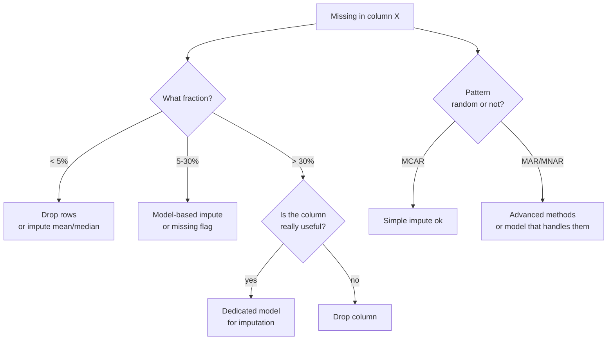

# Cleaning and data wrangling

## The dirty secret

> "Garbage in, garbage out." Everyone quotes. Few practice.

A senior data scientist spends 50% of their time understanding and cleaning data. Not because it's stupid — because real-world data **is dirty**: mixed formats, missing values, typos, encodings, time zones, systems that change over time.

## Initial diagnosis (first 10 minutes)

```python
import pandas as pd
df = pd.read_csv("data.csv")

df.shape
df.head()
df.tail()
df.info()
df.describe(include='all')
df.isna().sum().sort_values(ascending=False)
df.nunique().sort_values()
df.duplicated().sum()

df.memory_usage(deep=True).sum() / 1e6  # MB

df.hist(figsize=(12, 8))
```

Things to look out for:

- Columns with **one value** → useless (zero variance).
- Columns with **n distinct values = n rows** → probably IDs or free text.
- **Dtype `object`** on columns that look numeric → dirty (decimal commas, currency, %).
- **Dates as strings**.

## Missing values: 7 strategies



The three missing types (Rubin, 1976):

- **MCAR** (Missing Completely At Random): missingness independent of everything. Rare. Mean imputation OK.
- **MAR** (Missing At Random): depends on other **observed** variables. Model-based imputation (KNN, MICE) correct.
- **MNAR** (Missing Not At Random): depends on **unobserved** variables (e.g., rich people don't report income). Hard, needs domain knowledge.

### Code

```python
df.fillna(0)
df.fillna(df.median(numeric_only=True))
df['cat'].fillna('UNKNOWN')

from sklearn.impute import KNNImputer, IterativeImputer
imputer = KNNImputer(n_neighbors=5)
X_imp = imputer.fit_transform(X)

df['col_was_missing'] = df['col'].isna().astype(int)
df['col'] = df['col'].fillna(df['col'].median())
```

> Powerful trick: **keep missingness as information**. Create a binary column "originally NaN". Often the most predictive feature.

## Duplicates

```python
df.duplicated().sum()
df = df.drop_duplicates()

df = (
    df.sort_values('ts', ascending=False)
      .drop_duplicates(subset=['user_id', 'product_id'], keep='first')
)
```

Beware: duplicate IDs often signal a **join bug** or **dirty data**. Don't mask the problem by removing them: investigate.

## Date parsing (universal pain)

```python
df['date'] = pd.to_datetime(df['date_str'], errors='coerce')  # NaT on parse fail
df['date'] = pd.to_datetime(df['date_str'], format='%d/%m/%Y')  # much faster

df['ts'] = pd.to_datetime(df['ts'], utc=True)
df['ts'] = df['ts'].dt.tz_convert('Europe/Rome')

import dateparser
df['date'] = df['date_str'].apply(dateparser.parse)
```

Questions to always ask:

- What's the **time zone** of timestamps? UTC, local, naive?
- Do the data cross **DST changes**?
- Are dates **DD/MM** or **MM/DD**? Ambiguity is a landmine.

## Dirty strings

```python
s = df['email'].str
s.lower()
s.strip()
s.replace(r'\s+', ' ', regex=True)
s.contains(r'@\w+\.\w+', regex=True)
s.extract(r'@(\w+)')
s.split('@', expand=True)
s.normalize('NFKD').encode('ascii','ignore').decode('ascii')
```

### String numeric cleaning

```python
df['amount'] = (
    df['amount']
    .str.replace('€', '', regex=False)
    .str.replace('.', '', regex=False)
    .str.replace(',', '.', regex=False)
    .astype(float)
)
```

### Categoricals with typos

Cluster similar entries with **fuzzy matching**:

```python
from rapidfuzz import process, fuzz
candidates = df['city'].unique()
match = process.extractOne("Milno", candidates, scorer=fuzz.ratio)
# ('Milano', 91, 5)
```

## Categorical encoding

Depends on type:

| Type | Method |
|---|---|
| Binary (yes/no) | `astype(int)` |
| Ordinal (low/mid/high) | explicit numeric mapping |
| Nominal, few values | one-hot |
| Nominal, many values | target encoding, frequency encoding, embedding |

```python
pd.get_dummies(df, columns=['city', 'category'], drop_first=True)

order = {'low': 0, 'mid': 1, 'high': 2}
df['level'] = df['level'].map(order)

from category_encoders import TargetEncoder
te = TargetEncoder()
X_te = te.fit_transform(X[['city']], y)
```

> Target encoding without CV produces **leakage**: the target value bleeds into features. Use `KFoldTargetEncoder` or pipeline with CV.

## Normalization and scaling

When they matter: KNN, SVM, regularized regression, neural networks, PCA. When they don't: trees (Random Forest, XGBoost).

| Scaler | Formula | Use when |
|---|---|---|
| **StandardScaler** | $(x - \mu)/\sigma$ | ~normal distributions |
| **MinMaxScaler** | $(x - \min)/(\max-\min)$ | features in $[0,1]$ |
| **RobustScaler** | $(x - \text{median})/\text{IQR}$ | outliers present |
| **PowerTransformer** | Box-Cox/Yeo-Johnson | strong skew, want normality |

```python
from sklearn.preprocessing import StandardScaler, RobustScaler, PowerTransformer
sc = StandardScaler().fit(X_train)
X_train = sc.transform(X_train)
X_test = sc.transform(X_test)
```

> **Fit only on train**. Transform test with train's parameters. Otherwise: data leakage.

## Outliers: remove, cap, or keep?

| Strategy | When |
|---|---|
| Keep | They're real, important (fraud, rare events) |
| Cap at percentile (winsorize) | Moderate distortion, sensitive model |
| Remove | Sure they're errors (e.g., age = 999) |
| Transform (log) | Natural long tails |

```python
from scipy.stats.mstats import winsorize
df['amount_w'] = winsorize(df['amount'], limits=[0.01, 0.01])

low, high = df['amount'].quantile([0.01, 0.99])
df['amount'] = df['amount'].clip(low, high)
```

## Stratification and balancing (quick look)

```python
df['target'].value_counts(normalize=True)

from sklearn.model_selection import train_test_split
X_tr, X_te, y_tr, y_te = train_test_split(X, y, stratify=y, test_size=0.2)
```

Advanced balancing (SMOTE, class weights) in a dedicated section.

## Save the "data dictionary"

For each column, document:

- Type
- Meaning
- Units
- Expected range
- Missing handling
- Transformations applied

Simple Markdown or YAML works fine. It's **the** thing that future-you will thank you for in 6 months.

## Validation: assert everything

In pipeline scripts, use defensive assertions:

```python
import pandera as pa

schema = pa.DataFrameSchema({
    "user_id": pa.Column(int, checks=pa.Check.ge(0)),
    "email": pa.Column(str, checks=pa.Check.str_contains("@")),
    "age": pa.Column(int, checks=pa.Check.in_range(0, 120), nullable=True),
    "country": pa.Column(str, checks=pa.Check.isin(["IT","FR","DE","ES"])),
})

df_clean = schema.validate(df)
```

Alternative: **great_expectations** (heavier but more integrated).

## Exercises

<details>
<summary>Exercise 1 — Clean a messy price column</summary>

You have a `price` column with values like `"€ 1.299,99"`, `"€2,500.00"`, `"1500"`, `"N/A"`. Convert to float.

```python
import pandas as pd, re
def clean_price(s):
    if pd.isna(s) or s in ('N/A', '-', ''): return None
    s = str(s).strip().replace('€','').replace(' ','')
    if ',' in s and '.' in s:
        if s.rfind(',') > s.rfind('.'):
            s = s.replace('.','').replace(',', '.')
        else:
            s = s.replace(',','')
    elif ',' in s:
        s = s.replace(',','.')
    try:
        return float(s)
    except ValueError:
        return None
```
</details>

<details>
<summary>Exercise 2 — KNN imputation</summary>

```python
import numpy as np
from sklearn.impute import KNNImputer
rng = np.random.default_rng(0)
X = rng.standard_normal((100, 5))
mask = rng.random(X.shape) < 0.1
X_miss = X.copy()
X_miss[mask] = np.nan

imp = KNNImputer(n_neighbors=5)
X_filled = imp.fit_transform(X_miss)
print("MSE imputation:", ((X_filled - X)**2).mean())
```
</details>

<details>
<summary>Exercise 3 — Robust z-score anomaly detection</summary>

```python
import numpy as np
def robust_outliers(x, k=3.5):
    med = np.median(x)
    mad = np.median(np.abs(x - med)) + 1e-9
    return np.abs((x - med) / (1.4826 * mad)) > k

x = np.concatenate([np.random.randn(1000), [10, -8, 20]])
print(np.where(robust_outliers(x))[0])
```
</details>

<details>
<summary>Exercise 4 — Mixed date parsing</summary>

You have a column with: `"2024-01-15"`, `"15/01/2024"`, `"Jan 15, 2024"`, `"2024.01.15"`. Convert to uniform datetime.

```python
import pandas as pd
ser = pd.Series(["2024-01-15","15/01/2024","Jan 15, 2024","2024.01.15"])
parsed = pd.to_datetime(ser, errors='coerce')
import dateparser
parsed = parsed.fillna(ser.apply(lambda s: dateparser.parse(s, settings={'DATE_ORDER': 'DMY'})))
```
</details>

<details>
<summary>Exercise 5 — Pandera validation</summary>

Schema for a user dataset:

```python
import pandera as pa
schema = pa.DataFrameSchema({
    "user_id":  pa.Column(int, unique=True, checks=pa.Check.gt(0)),
    "email":    pa.Column(str, checks=pa.Check.str_matches(r'^[^@]+@[^@]+\.[^@]+$')),
    "country":  pa.Column(str, checks=pa.Check.isin(["IT","FR","DE","ES","UK"])),
    "age":      pa.Column(int, checks=pa.Check.in_range(13, 120), nullable=True),
})
```

Add to test: 1 user with email missing @, 1 with age=-5. Verify pandera rejects correctly.
</details>

## Takeaways

- 50% of time: cleaning. Don't skip — that's where the worst bugs come from.
- Missing is informative: add flags.
- Validate schema in production: pandera or great_expectations.
- Fit scaler only on train, never on the full dataset.
- Document the "data dictionary".

Next: feature engineering, the art that separates mediocre models from good ones.
