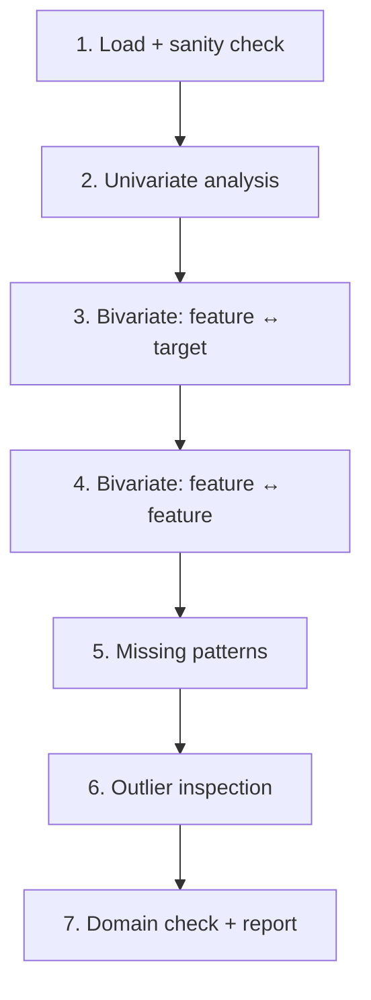

# EDA: Exploratory Data Analysis

## What it is

EDA is the phase where **you get to know the data**. Tukey invented it in the '70s as a reaction to blind modeling: before proposing a model, let the data speak. Golden rule:

> "Far better an approximate answer to the right question, than an exact answer to the wrong question." — John Tukey

All later choices (feature engineering, model, validation) depend on how well you understood the data here.

## Workflow in 7 steps



## Step 1 — Load and sanity check

```python
import pandas as pd
df = pd.read_csv("dataset.csv")

print(df.shape)
print(df.dtypes)
print(df.head())
print(df.tail())
df.info()
df.describe(include='all').T
df.isna().sum().sort_values(ascending=False)
df.nunique().sort_values()
df.duplicated().sum()
```

Questions:

- Are the **rows** how many I expected? (e.g., 1000 users = 1000 rows)
- Do the **columns** have the right types? (dates as datetime, not object)
- Any completely empty or duplicate rows?
- Any columns with one value (zero variance, useless)?

## Step 2 — Univariate analysis

For each column, understand the distribution.

```python
df.hist(figsize=(14, 10), bins=40)

for col in df.select_dtypes(include=['object', 'category']):
    print(f"\n=== {col} ===")
    print(df[col].value_counts(normalize=True).head(10))
```

What to look for:

- **Skew**: long tails → consider log or Box-Cox.
- **Bimodality**: two peaks suggest mixed population (e.g., male/female, before/after policy change).
- **Rare categories**: < 1% may be typos or noise.
- **Strange ranges**: age = 999, salary = -1 are NaN codes.

## Step 3 — Bivariate: feature vs target

The heart of EDA for ML. For each feature, see how it relates to the target.

### Categorical target

```python
for col in num_cols:
    sns.boxplot(data=df, x='target', y=col)

for col in cat_cols:
    pd.crosstab(df[col], df['target'], normalize='index').plot(kind='bar', stacked=True)
```

### Continuous target

```python
for col in num_cols:
    sns.scatterplot(data=df.sample(2000), x=col, y='target')
    sns.regplot(data=df.sample(2000), x=col, y='target', scatter=False, color='red')

df.corr(numeric_only=True)['target'].abs().sort_values(ascending=False)
```

> Suspiciously high correlations (>0.95): either **leakage** (target-derived feature) or **proxy** (e.g., `revenue` to predict `revenue_per_user`).

## Step 4 — Bivariate: feature ↔ feature

Multicollinearity is the devil of linear regression:

```python
import seaborn as sns
sns.heatmap(df.corr(method='spearman', numeric_only=True),
            annot=True, fmt='.2f', cmap='RdBu_r', center=0)
```

Pairs with $|\rho| > 0.9$: pick one, drop the other (unless both important for interpretation).

For nonlinearity, use **mutual information**:

```python
from sklearn.feature_selection import mutual_info_regression
mi = mutual_info_regression(X, y)
```

## Step 5 — Missing patterns

Are missing values random (MCAR) or patterned? Plot:

```python
import missingno as msno
msno.matrix(df)
msno.heatmap(df)
msno.dendrogram(df)
```

If two columns always missing together, they indicate the same missed event (e.g., user didn't complete form). Treat as one "incomplete form" feature.

## Step 6 — Outlier inspection

```python
df.select_dtypes(include='number').boxplot(figsize=(15, 6), rot=45)

from sklearn.ensemble import IsolationForest
iso = IsolationForest(contamination=0.05, random_state=0)
mask = iso.fit_predict(df.select_dtypes(include='number').fillna(0)) == -1
df_outliers = df[mask]
```

For each outlier: **investigate**. Is it a typo? Exceptional event (fraud)? Unforeseen use case?

## Step 7 — Domain check

Discuss with someone who knows the data. **Always**. Questions like:

- "I see sales halve in August. Normal?"
- "12 users' ages are > 100. Error or real elderly?"
- "There's a period (e.g., May 2024) where data looks broken. What happened?"

You often discover:
- System changes that invalidate historical data.
- Promotions that inflate metrics.
- Undocumented row deletions.

Without domain checks, you build models on legends.

## Tools for automated EDA

### ydata-profiling (formerly pandas-profiling)

```python
from ydata_profiling import ProfileReport
ProfileReport(df, title="EDA").to_file("profile.html")
```

Generates a complete HTML report: distributions, correlations, missing patterns, outliers, alerts.

> Useful as a **first pass**, but **doesn't replace** focused EDA. Think with your head, not just automated charts.

### sweetviz

Compare two datasets (e.g., train vs test) automatically:

```python
import sweetviz as sv
sv.compare([df_train, "Train"], [df_test, "Test"], target_feat="target").show_html("compare.html")
```

Essential for detecting **data drift** between train and production.

## Frequent patterns you'll discover

| Pattern | Meaning | What to do |
|---|---|---|
| Bimodality | mixed population | segment or add flag |
| Spike at 0 | "no answer" as 0 | flag `was_zero` |
| Peak at -1, 999, -9999 | NaN code | replace with real NaN |
| Lognormal distribution | typical of incomes, durations | log transform |
| Time trend | non-stationarity | temporal features, time-series CV |
| 0.99 correlation with target | LEAKAGE | investigate, likely remove |
| Huge "Other" category | aggregate of rares | expand if possible |

## Complete example: Titanic

```python
import seaborn as sns, pandas as pd, matplotlib.pyplot as plt
df = sns.load_dataset('titanic')

df.info(); print(df.isna().sum())

df['age'].hist(bins=40); plt.show()
df['sex'].value_counts(normalize=True)
df['class'].value_counts(normalize=True)

sns.barplot(data=df, x='class', y='survived', hue='sex')
sns.kdeplot(data=df, x='age', hue='survived', common_norm=False, fill=True)

sns.heatmap(df.corr(numeric_only=True), annot=True, cmap='RdBu_r')

import missingno as msno
msno.matrix(df)
```

Key insight:
- Female survival ~74%, male ~19%
- 1st class ~62%, 3rd class ~24%
- Intersection: male 3rd class ~14%, female 1st class ~97%

Given the pattern, **a naive rule** "survives if female or child in 1st/2nd class" gets ~78% accuracy. That's the **baseline to beat** with any model.

## Exercises

<details>
<summary>Exercise 1 — EDA on California housing</summary>

```python
from sklearn.datasets import fetch_california_housing
data = fetch_california_housing(as_frame=True).frame

data.info()
data.describe().T
data.hist(figsize=(15,10), bins=40)
data.corr()['MedHouseVal'].sort_values()
```

Which features predict `MedHouseVal` best? What's weird in `AveBedrms` or `Population`?
</details>

<details>
<summary>Exercise 2 — Detect leakage</summary>

You have a model predicting "loan default" with AUC = 0.99. Question: how do you suspect leakage?

**Answer**: AUC 0.99 on real problems is almost always suspicious. Clues:
- Feature correlation with target > 0.95.
- Feature whose value is "known only after the event" (e.g., `total_late_payments` for default — it's the result!).
- Feature derived from target (e.g., internal `risk_score`).

Cure: remove future features, retrain, AUC drops to ~0.75. Only then trust the model.
</details>

<details>
<summary>Exercise 3 — Automatic profile</summary>

```python
import seaborn as sns
from ydata_profiling import ProfileReport
df = sns.load_dataset('diamonds')
ProfileReport(df, title="Diamonds EDA").to_file("diamonds_profile.html")
```

Open the report. What alerts did it find? (Typical: high cardinality, skew, correlations.)
</details>

## Takeaways

- EDA before modeling, always.
- 7 steps: load → univariate → vs target → between features → missing → outliers → domain.
- Automated tools (ydata, sweetviz) = first pass, **not** a substitute for thinking.
- Suspicious model = leakage. AUC > 0.95 investigate.
- Talk to domain experts. Always.

Next: machine learning — fundamentals, bias-variance, validation.
