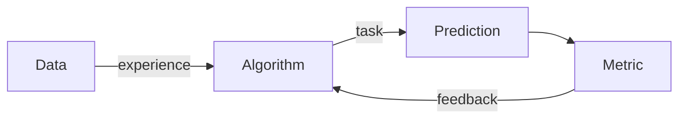
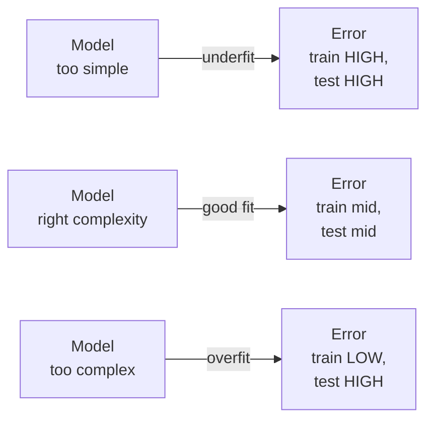
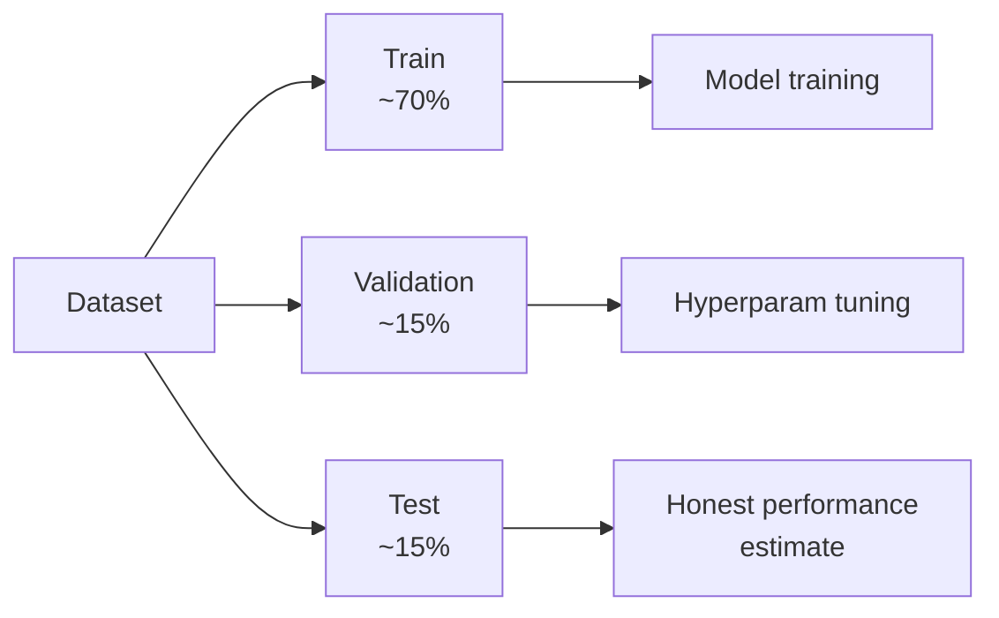
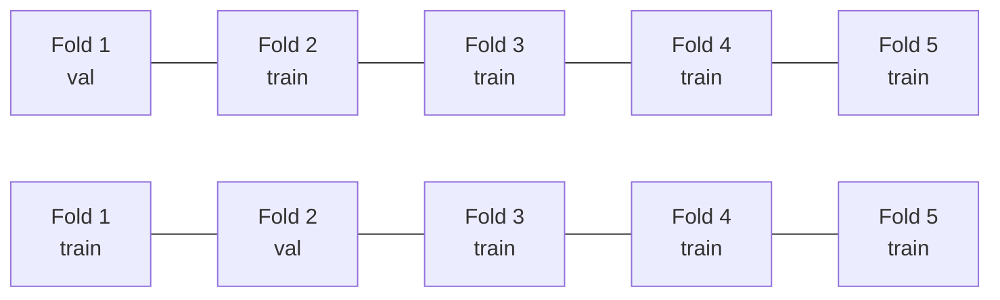
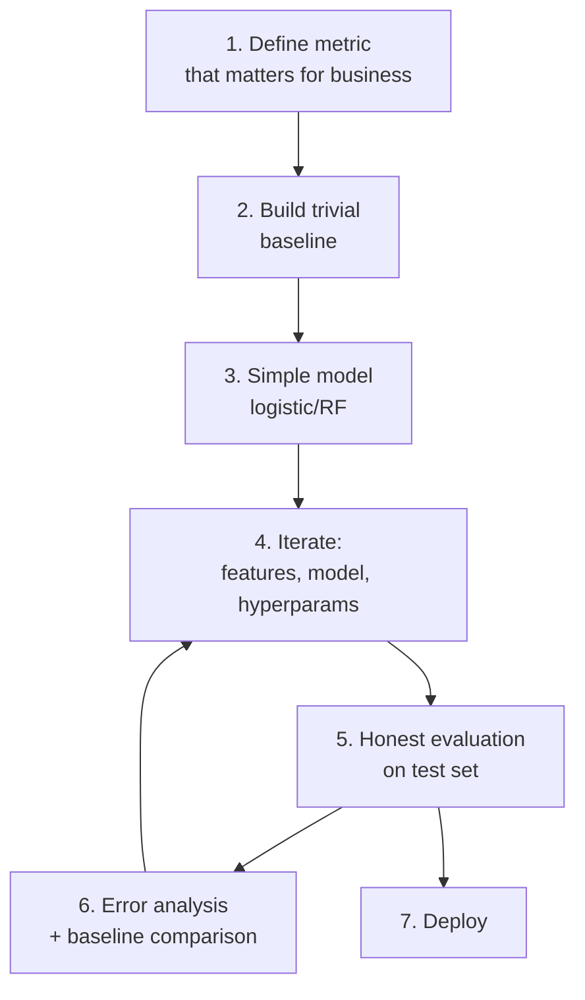

# ML: fundamentals — bias, variance, validation

## What machine learning is

Operational definition: **algorithms that improve their performance on a task with experience** (data).

More formally (Tom Mitchell, 1997): a program "learns" from experience E with respect to task T measured by P if its performance on T, measured by P, improves with E.



## The three families

### Supervised learning

Data has **known targets**. Learn $f: X \to y$.

- **Regression**: $y$ continuous (house price, temperature).
- **Classification**: $y$ discrete (spam/not-spam, cat/dog/hamster).

### Unsupervised learning

Only $X$. Look for **hidden structure**.

- **Clustering**: group similar (K-means, DBSCAN).
- **Dim reduction**: reduce dimensions (PCA, t-SNE).
- **Density estimation**: estimate $p(x)$ (GMM, KDE).

### Reinforcement learning

An agent takes **actions** in an environment, receives **rewards**, learns a policy. Differs from the above two: data isn't fixed but generated through interaction.

## Error: bias, variance, irreducible

For a model $\hat{f}$, expected error on a point $x$ decomposes:

$$E[(y - \hat{f}(x))^2] = \underbrace{\text{Bias}^2[\hat{f}(x)]}_{\text{wrong simplification}} + \underbrace{\text{Var}[\hat{f}(x)]}_{\text{data sensitivity}} + \underbrace{\sigma^2}_{\text{irreducible noise}}$$

- **Bias**: systematic error. Model too simple to capture reality.
- **Variance**: model changes a lot as training data changes.
- **Irreducible error**: intrinsic noise; no model removes it.

<div class="chart"><svg viewBox="0 0 400 220" xmlns="http://www.w3.org/2000/svg">
<line x1="40" y1="200" x2="380" y2="200" stroke="#555"/>
<line x1="40" y1="20" x2="40" y2="200" stroke="#555"/>
<text x="200" y="218" fill="#8b949e" font-size="11" text-anchor="middle">model complexity →</text>
<text x="20" y="105" fill="#8b949e" font-size="11" transform="rotate(-90 20 105)">error →</text>
<path d="M 60 40 C 130 40 230 190 340 190" fill="none" stroke="#7aa2ff" stroke-width="2"/>
<text x="80" y="35" fill="#7aa2ff" font-size="11">bias²</text>
<path d="M 60 190 C 130 190 230 40 340 40" fill="none" stroke="#ffb347" stroke-width="2"/>
<text x="310" y="50" fill="#ffb347" font-size="11">variance</text>
<path d="M 60 30 Q 200 110 340 30" fill="none" stroke="#5ee2c4" stroke-width="2.5"/>
<text x="120" y="60" fill="#5ee2c4" font-size="11">total</text>
<circle cx="200" cy="70" r="4" fill="#c084fc"/>
<text x="208" y="68" fill="#c084fc" font-size="11">sweet spot</text>
</svg><div class="chart-caption">Bias-variance tradeoff: too simple → high bias; too complex → high variance. Total minimum is between.</div></div>

## Underfitting vs overfitting



**Quick diagnosis**:

- $E_\text{train}$ high, $E_\text{val}$ high, similar → underfit → increase capacity.
- $E_\text{train}$ low, $E_\text{val}$ high → overfit → regularize, more data, simpler model.
- $E_\text{train}$ low, $E_\text{val}$ low, similar → all good.
- $E_\text{train}$ high, $E_\text{val}$ low → bug (mixed data? reverse leakage?).

## Train/val/test: workflow gold



**Rules**:

1. **Test set touched ONCE**, at the end, to report the final metric.
2. **Validation set** to choose hyperparameters.
3. **Train set** to learn the model's weights.

Breaking rule 1 = cheating yourself. Every decision made looking at the test set leaks the test set into the model.

### Cross-validation

For small datasets, train/val/test wastes data. **k-fold cross-validation**:



Train 5 times, each time changing the validation fold. Average the metrics.

```python
from sklearn.model_selection import cross_val_score, KFold
kf = KFold(n_splits=5, shuffle=True, random_state=0)
scores = cross_val_score(model, X, y, cv=kf, scoring='roc_auc')
print(f"AUC: {scores.mean():.3f} ± {scores.std():.3f}")
```

Variants:
- **StratifiedKFold**: maintains class proportions for classification.
- **GroupKFold**: same user_ids stay in the same fold (no inter-user leakage).
- **TimeSeriesSplit**: past → future only, never the reverse.

## No free lunch theorem (Wolpert, 1996)

> **Averaged over all possible problems**, no algorithm is better than any other.

Meaning: there's no "best model in absolute terms". Which model wins depends on data structure. That's why:

- You try multiple models.
- Stupid baselines sometimes beat complex models.
- Domain knowledge beats algorithmic power.

## Standard loss functions

| Task | Loss | Note |
|---|---|---|
| Regression | MSE — Mean Squared Error | sensitive to outliers |
| Regression | MAE — Mean Absolute Error | robust |
| Regression | Huber | mix MSE/MAE |
| Binary classif. | Binary Cross-Entropy / Log Loss | MLE derived |
| Multi classif. | Categorical Cross-Entropy | softmax + log |
| Classif. | Hinge | SVM |
| Ranking | Pairwise / Listwise | LTR |

MSE formula:
$$\text{MSE} = \frac{1}{n} \sum_i (y_i - \hat{y}_i)^2$$

Log Loss formula (binary):
$$L = -\frac{1}{n} \sum_i [y_i \log \hat{p}_i + (1 - y_i) \log(1 - \hat{p}_i)]$$

## Regularization (preview)

Adds a penalty on coefficient "size", trading a bit of bias for variance:

- **L2 (Ridge)**: penalty $\lambda \sum \beta_j^2$. Shrinks all coefficients.
- **L1 (Lasso)**: penalty $\lambda \sum |\beta_j|$. Zeros out irrelevant coefficients.
- **Elastic Net**: mix L1 + L2.

Details in the regression section.

## The data scientist's mental pipeline



The trivial baseline (e.g., "always predict majority class") is the floor below which you're unacceptable. Often the "complex" model beats it only marginally — signaling the problem is hardware-limited, or features aren't enough.

## Exercises

<details>
<summary>Exercise 1 — Identify overfitting</summary>

For each case, is it underfit, overfit, or OK:

1. Train accuracy 0.95, Val 0.94.
2. Train 0.99, Val 0.72.
3. Train 0.65, Val 0.64.
4. Train 0.70, Val 0.85.

**Answers**: 1 OK (maybe slight overfit), 2 strong overfit, 3 underfit, 4 suspect (val > train → leak or imbalanced split).
</details>

<details>
<summary>Exercise 2 — Trivial baselines</summary>

For each problem:

1. Predict if it rains tomorrow in Milan.
2. Estimate house price.
3. Identify credit card fraud (0.1% of transactions).

What's the dumbest baseline? What accuracy/MAE do you expect?

**Answers**:

1. "Always 'no rain'" → in Milan winter ~70% accuracy.
2. "Always median price" → MAE = MAD. Easily beaten.
3. "Always 'not fraud'" → 99.9% accuracy. **BUT**: precision and recall on fraud = 0. Lesson: accuracy is not enough on imbalanced classes.
</details>

<details>
<summary>Exercise 3 — Manual cross-validation</summary>

Implement 5-fold CV from scratch:

```python
import numpy as np
from sklearn.linear_model import LogisticRegression
from sklearn.metrics import accuracy_score
from sklearn.datasets import load_iris

X, y = load_iris(return_X_y=True)
n = len(X)
rng = np.random.default_rng(0)
idx = rng.permutation(n)
folds = np.array_split(idx, 5)

scores = []
for i in range(5):
    val = folds[i]
    tr = np.concatenate(folds[:i] + folds[i+1:])
    m = LogisticRegression(max_iter=500).fit(X[tr], y[tr])
    scores.append(accuracy_score(y[val], m.predict(X[val])))
print(f"{np.mean(scores):.3f} ± {np.std(scores):.3f}")
```
</details>

<details>
<summary>Exercise 4 — Bias/variance diagnosis</summary>

Plot a **learning curve**: train and val error vs training set size.

```python
from sklearn.model_selection import learning_curve
from sklearn.ensemble import RandomForestClassifier
import matplotlib.pyplot as plt
import numpy as np

sizes, train_sc, val_sc = learning_curve(
    RandomForestClassifier(n_estimators=100, random_state=0),
    X, y, cv=5, train_sizes=np.linspace(0.1, 1.0, 10), scoring='accuracy'
)
plt.plot(sizes, train_sc.mean(axis=1), label='train')
plt.plot(sizes, val_sc.mean(axis=1), label='val')
plt.xlabel("training size"); plt.ylabel("accuracy"); plt.legend()
plt.show()
```

Interpretation: if train and val converge to the same low value → high bias, model too simple. If train stays high and val low → high variance, need regularization or more data.
</details>

## Takeaways

- Bias-variance tradeoff = the key concept of all ML.
- Train/val/test: test is touched once. Always.
- Cross-validation for small datasets; sample split for large.
- No free lunch: try multiple models, don't fall in love with yours.
- Stupid baselines before complex models.

Next: linear regression in detail.
