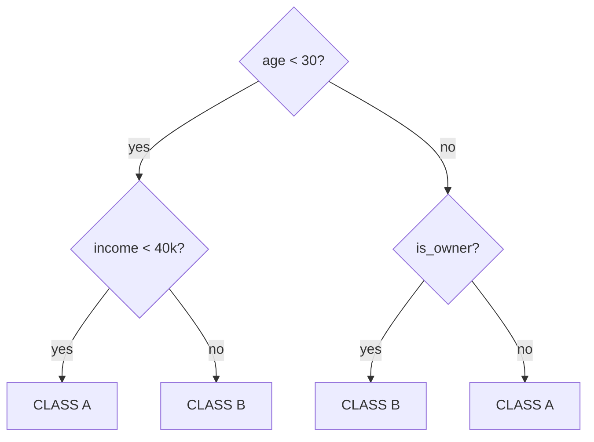

# Decision trees

## The intuition

A tree asks a series of "$x_j \leq t$?" questions splitting feature space into rectangular regions. In each region, it predicts the mean (regression) or majority class (classification).



Advantages: **interpretable**, handles categorical and numeric, no scaling needed, robust to outliers.

### How a tree "sees" the Cartesian plane

Think of a 2D dataset with 2 features $(x_1, x_2)$ and 2 classes. A tree draws **lines parallel to axes**, splitting space into rectangles, and in each rectangle predicts the majority class:

<div class="chart"><svg viewBox="0 0 480 260" xmlns="http://www.w3.org/2000/svg">
<rect x="40" y="20" width="400" height="200" fill="none" stroke="#555"/>
<text x="240" y="240" fill="#8b949e" font-size="11" text-anchor="middle">x₁</text>
<text x="22" y="120" fill="#8b949e" font-size="11">x₂</text>

<line x1="200" y1="20" x2="200" y2="220" stroke="#c084fc" stroke-width="2" stroke-dasharray="5,3"/>
<text x="205" y="34" fill="#c084fc" font-size="11">x₁ &lt; 5?</text>

<line x1="40" y1="120" x2="200" y2="120" stroke="#ffb347" stroke-width="2" stroke-dasharray="5,3"/>
<text x="50" y="115" fill="#ffb347" font-size="11">x₂ &lt; 3?</text>

<line x1="200" y1="80" x2="440" y2="80" stroke="#5ee2c4" stroke-width="2" stroke-dasharray="5,3"/>
<text x="280" y="75" fill="#5ee2c4" font-size="11">x₂ &lt; 6?</text>

<rect x="40" y="20" width="160" height="100" fill="rgba(122,162,255,0.10)"/>
<rect x="40" y="120" width="160" height="100" fill="rgba(255,179,71,0.15)"/>
<rect x="200" y="20" width="240" height="60" fill="rgba(255,179,71,0.15)"/>
<rect x="200" y="80" width="240" height="140" fill="rgba(122,162,255,0.10)"/>

<circle cx="90" cy="60" r="4" fill="#7aa2ff"/>
<circle cx="130" cy="90" r="4" fill="#7aa2ff"/>
<circle cx="170" cy="50" r="4" fill="#7aa2ff"/>
<circle cx="80" cy="100" r="4" fill="#7aa2ff"/>

<circle cx="110" cy="180" r="4" fill="#ffb347"/>
<circle cx="150" cy="200" r="4" fill="#ffb347"/>
<circle cx="80" cy="170" r="4" fill="#ffb347"/>

<circle cx="250" cy="50" r="4" fill="#ffb347"/>
<circle cx="320" cy="60" r="4" fill="#ffb347"/>
<circle cx="380" cy="40" r="4" fill="#ffb347"/>

<circle cx="280" cy="130" r="4" fill="#7aa2ff"/>
<circle cx="370" cy="170" r="4" fill="#7aa2ff"/>
<circle cx="240" cy="200" r="4" fill="#7aa2ff"/>
<circle cx="420" cy="100" r="4" fill="#7aa2ff"/>
</svg><div class="chart-caption">A tree splits the plane into rectangles. Each split adds an axis-parallel line — never oblique like SVM or logistic.</div></div>

Compare with logistic regression, which draws **one oblique line**. A tree can capture "staircase" boundaries, and with enough steps approximates almost any shape — at the cost of overfitting if you don't limit it.

## Construction: split criterion

For each node:

1. For each feature $j$ and threshold $t$, compute the "purity" of the two resulting subregions.
2. Pick $(j, t)$ maximizing purity gain.
3. Recurse on both children.
4. Stop when: max depth, pure node, or min samples.

### Impurity criteria (classification)

**Gini index**:
$$G = \sum_k p_k (1 - p_k) = 1 - \sum_k p_k^2$$

**Entropy**:
$$H = -\sum_k p_k \log_2 p_k$$

Both measure "how mixed" a region is. 0 = pure (one class), max = uniform.

### For regression

**Residual variance**:
$$L = \sum_i (y_i - \bar{y}_R)^2$$

where $\bar{y}_R$ is the mean in the region.

### Information gain

$$IG = L_\text{parent} - \frac{n_L}{n} L_L - \frac{n_R}{n} L_R$$

How much the split **reduces** impurity, weighted by child size.

## Overfitting and pruning

An unconstrained tree **memorizes** the training set: each leaf has one example, 100% train accuracy, disaster on test.

**Anti-overfit strategies**:

1. **Pre-pruning** (early stopping):
   - `max_depth`: max depth
   - `min_samples_split`: minimum to split
   - `min_samples_leaf`: minimum in a leaf
   - `max_leaf_nodes`: max number of leaves
   - `min_impurity_decrease`: minimum gain required

2. **Post-pruning** (cost-complexity pruning):
   $$L_\alpha(T) = L(T) + \alpha |T|$$
   where $|T|$ is the number of leaves. Increasing $\alpha$ removes less useful leaves.

```python
from sklearn.tree import DecisionTreeClassifier
tree = DecisionTreeClassifier(max_depth=5, min_samples_leaf=10, random_state=0)
tree.fit(X_tr, y_tr)
```

### Cost-complexity path

```python
path = tree.cost_complexity_pruning_path(X_tr, y_tr)
alphas = path.ccp_alphas
# train a tree per alpha, pick by CV
```

## Visualizing a tree

```python
from sklearn.tree import plot_tree, export_text
import matplotlib.pyplot as plt

plt.figure(figsize=(15, 8))
plot_tree(tree, feature_names=feature_names, class_names=['no','yes'],
          filled=True, rounded=True, fontsize=8)
plt.show()

print(export_text(tree, feature_names=list(feature_names)))
```

Trees are the **most interpretable** model available. In regulated domains (medicine, credit) often preferred for this.

## Single tree limitations

- **High variance**: small data changes → different tree.
- **"Step-wise" boundaries**: only perpendicular to axes.
- **Imbalance**: tend to favor continuous features with many possible splits.
- **No extrapolation** in regression: predictions limited to seen range.

Solution: **ensembles** (Random Forest, Boosting) — next sections.

## Complete example

```python
from sklearn.datasets import load_breast_cancer
from sklearn.tree import DecisionTreeClassifier
from sklearn.model_selection import train_test_split, cross_val_score
import numpy as np

X, y = load_breast_cancer(return_X_y=True)
X_tr, X_te, y_tr, y_te = train_test_split(X, y, stratify=y, random_state=0)

depths = range(1, 20)
scores = [cross_val_score(DecisionTreeClassifier(max_depth=d, random_state=0), X_tr, y_tr, cv=5).mean()
          for d in depths]
best_d = depths[np.argmax(scores)]
print(f"best max_depth: {best_d}")

tree = DecisionTreeClassifier(max_depth=best_d, random_state=0).fit(X_tr, y_tr)
print(f"Test acc: {tree.score(X_te, y_te):.3f}")
print(f"Top 5 features: {sorted(zip(tree.feature_importances_, range(30)), reverse=True)[:5]}")
```

## Feature importance

Measured by **total impurity reduced** by each feature, weighted by node frequency:

$$\text{Imp}_j = \sum_{\text{nodes splitting on } j} \frac{n_{\text{node}}}{n} \cdot \Delta L$$

Limitations:
- Favors continuous features (more possible splits) and features with many unique values.
- Permutation importance is **more reliable** (see feature engineering section).

## Trees for regression

Same structure, but:
- Loss = variance.
- Prediction = leaf mean.

```python
from sklearn.tree import DecisionTreeRegressor
reg = DecisionTreeRegressor(max_depth=6, min_samples_leaf=20)
```

## When to use a single tree

In practice, rarely. Useful as:

- **Maximum interpretability**: visualizable decision rule.
- **Baseline**: to see how much an ensemble gains.
- **Components** of Random Forest or Boosting.

For **performance**, always go to RF or XGBoost.

## Exercises

<details>
<summary>Exercise 1 — Compute Gini by hand</summary>

A node has 30 examples: 18 class A, 12 class B. Compute Gini.

**Solution**: $p_A = 0.6, p_B = 0.4$. $G = 1 - 0.36 - 0.16 = 0.48$.
</details>

<details>
<summary>Exercise 2 — Information gain</summary>

Parent: $n=100$, 50/50, Gini=0.5.
Left child: $n=40$, 30 A / 10 B, Gini = 1 - 0.5625 - 0.0625 = 0.375.
Right child: $n=60$, 20 A / 40 B, Gini = 1 - 0.111 - 0.444 = 0.444.

IG = $0.5 - (40/100) \cdot 0.375 - (60/100) \cdot 0.444 = 0.5 - 0.15 - 0.267 = 0.083$.
</details>

<details>
<summary>Exercise 3 — Tree from scratch (simplified)</summary>

```python
import numpy as np

def gini(y):
    p = np.bincount(y) / len(y)
    return 1 - (p**2).sum()

def best_split(X, y):
    best = (None, None, 1.0)
    for j in range(X.shape[1]):
        vals = np.unique(X[:, j])
        for t in vals[:-1]:
            mask = X[:, j] <= t
            if mask.sum() == 0 or mask.sum() == len(y): continue
            g = (mask.sum() * gini(y[mask]) + (~mask).sum() * gini(y[~mask])) / len(y)
            if g < best[2]: best = (j, t, g)
    return best

from sklearn.datasets import load_iris
X, y = load_iris(return_X_y=True)
print(best_split(X, y))
```

Compare with sklearn.
</details>

<details>
<summary>Exercise 4 — Cost-complexity pruning</summary>

```python
from sklearn.tree import DecisionTreeClassifier
from sklearn.datasets import load_breast_cancer
from sklearn.model_selection import train_test_split
import matplotlib.pyplot as plt

X, y = load_breast_cancer(return_X_y=True)
X_tr, X_te, y_tr, y_te = train_test_split(X, y, stratify=y, random_state=0)

tree = DecisionTreeClassifier(random_state=0).fit(X_tr, y_tr)
path = tree.cost_complexity_pruning_path(X_tr, y_tr)

trains, tests = [], []
for a in path.ccp_alphas:
    t = DecisionTreeClassifier(random_state=0, ccp_alpha=a).fit(X_tr, y_tr)
    trains.append(t.score(X_tr, y_tr))
    tests.append(t.score(X_te, y_te))

plt.plot(path.ccp_alphas, trains, label='train')
plt.plot(path.ccp_alphas, tests, label='test')
plt.xlabel('alpha'); plt.legend()
```

You'll see: as $\alpha$ grows, train accuracy drops and test first rises (reduce overfit) then falls (underfit).
</details>

## Takeaways

- Trees: series of splits, rectangular regions, super interpretable.
- Impurity: Gini for classification, variance for regression.
- Single tree: high variance, easy overfit. Limit with `max_depth`, `min_samples_leaf`.
- Almost never used alone — they're the **building blocks** of RF and Boosting.

Next: Random Forest and ensembles.
