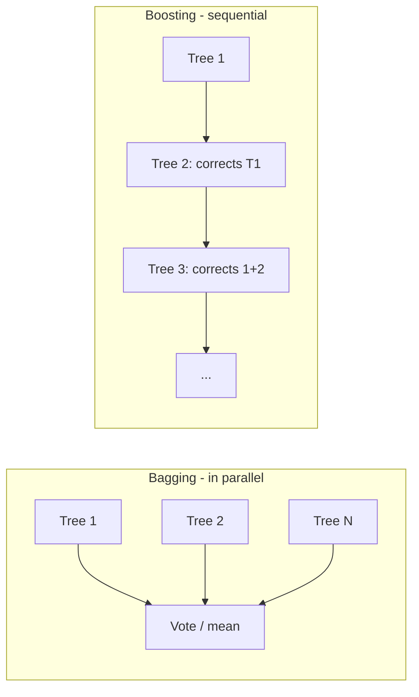

# Random Forest, Gradient Boosting, XGBoost

## Ensemble: two philosophies



- **Bagging** (Bootstrap AGGregating): trains independent models on bootstrap samples of the training set, averages results. Reduces **variance**.
- **Boosting**: trains models in sequence, each correcting the errors of the previous one. Reduces **bias** (and also variance, if well regularized).

## Random Forest

Bagging of trees, with a twist: at each split, only a **random subset** of features is considered. Decorrelating the trees makes the average more powerful.

### Algorithm

```
for b = 1..B:
    sample n examples with replacement (bootstrap)
    grow a deep tree:
        at each split, consider only k random features out of p
prediction = mean (regression) or vote (classification) of the B trees
```

### Main hyperparameters

| Param | Effect |
|---|---|
| `n_estimators` | number of trees. More = better (diminishing returns). 200–1000 OK. |
| `max_features` | $k$ per split. For classification ~$\sqrt{p}$, for regression ~$p/3$. |
| `max_depth` | max depth. `None` = unlimited. |
| `min_samples_leaf` | minimum leaf size. 1–5 default; increase to regularize. |
| `n_jobs` | parallelism (multi-core). `-1` = all cores. |

### Advantages

- Works great "out of the box" without serious tuning.
- Robust to outliers.
- No scaling needed.
- Handles categoricals with basic encoding.
- Free out-of-bag error estimate.

### When NOT to use it

- Huge $n$ with many features → slow.
- Want calibrated probabilities → mediocre.
- Structured image, text, sequence data → NNs better.

## Gradient Boosting (idea)

Build an incremental model $F(x)$:

$$F_m(x) = F_{m-1}(x) + \eta \cdot h_m(x)$$

where $h_m$ is a **weak learner** (usually a small tree) that approximates the negative gradient of the loss with respect to $F_{m-1}$. In practice, $h_m$ predicts the **residuals**:

$$h_m(x) \approx -\frac{\partial L}{\partial F(x)}\bigg|_{F=F_{m-1}}$$

For MSE, the gradient is $-(y - F(x))$ = residual. So: each new tree learns to correct what the model got wrong so far.

### XGBoost, LightGBM, CatBoost

Three modern, optimized implementations of gradient boosting on trees. They generally beat RF and everything else on tabular data.

| | XGBoost | LightGBM | CatBoost |
|---|---|---|---|
| Training speed | fast | very fast | medium |
| Categorical handling | manual | native | native (excellent) |
| Default tuning | medium | aggressive | conservative |
| Out-of-the-box | excellent | excellent | excellent for categoricals |

Basic code, interchangeable:

```python
import xgboost as xgb
m = xgb.XGBClassifier(
    n_estimators=500, max_depth=6, learning_rate=0.05,
    subsample=0.8, colsample_bytree=0.8,
    reg_alpha=0, reg_lambda=1,
    eval_metric='auc',
    early_stopping_rounds=50,
    random_state=0,
)
m.fit(X_tr, y_tr, eval_set=[(X_val, y_val)])
```

```python
import lightgbm as lgb
m = lgb.LGBMClassifier(
    n_estimators=500, num_leaves=31, learning_rate=0.05,
    feature_fraction=0.8, bagging_fraction=0.8, bagging_freq=5,
    reg_lambda=1, random_state=0,
)
m.fit(X_tr, y_tr, eval_set=[(X_val, y_val)], callbacks=[lgb.early_stopping(50)])
```

```python
from catboost import CatBoostClassifier
m = CatBoostClassifier(
    iterations=500, depth=6, learning_rate=0.05,
    cat_features=['city','plan'],   # categorical column names
    eval_metric='AUC', random_seed=0, verbose=0,
)
m.fit(X_tr, y_tr, eval_set=(X_val, y_val), early_stopping_rounds=50)
```

### Hyperparams that really matter

In order of impact:

1. **`learning_rate`** (eta): 0.01–0.1. Smaller = more trees, more stable.
2. **`n_estimators`**: used with `early_stopping_rounds`. Set a large number and let auto-stop handle it.
3. **`max_depth` / `num_leaves`**: typically 4–10. Deep = more expressive, more overfit.
4. **`subsample` / `colsample_bytree`**: 0.7–1.0. Random subsampling like internal bagging.
5. **`reg_alpha` (L1), `reg_lambda` (L2)**: regularization on leaf weights.
6. **`min_child_weight` / `min_data_in_leaf`**: like `min_samples_leaf` for trees.

> **Typical workflow**: lr=0.05, n_estim=2000 with early stopping at 50. Tune max_depth and regularization. Often 80% of accuracy comes from defaults.

## Early stopping

Grow trees as long as validation error improves. When it doesn't improve for $N$ consecutive iterations, stop.

```python
m.fit(X_tr, y_tr, eval_set=[(X_val, y_val)], early_stopping_rounds=50, verbose=False)
print("trees used:", m.best_iteration)
```

Essential practice: prevents overfit and auto-tunes `n_estimators`.

## Feature importance (boosting)

Three metrics:

- **gain**: average contribution to loss reduction (most reliable).
- **weight / cover**: number of splits / samples passed through.

```python
xgb.plot_importance(m, importance_type='gain')
# or
import shap
explainer = shap.TreeExplainer(m)
shap_values = explainer.shap_values(X_val)
shap.summary_plot(shap_values, X_val)
```

**SHAP values** is the modern standard for explaining tree models: contribution of each feature to the individual prediction. Robust, theoretically grounded (Shapley values, game theory).

## Categorical handling: CatBoost vs the others

CatBoost uses **Ordered Target Statistics**: for each category, it computes a "leak-free" version of target encoding. It excels when you have categoricals with medium-to-high cardinality.

LightGBM: uses "Gradient-based One-Side Sampling" and handles categoricals natively with the `categorical_feature` param.

XGBoost: historically required one-hot encoding; since 2024 supports categorical features (`enable_categorical=True`).

## When boosting beats NNs

On **tabular data** (i.e., most of the business world), tree-based boosting dominates. Various benchmarks (Borisov 2022, Grinsztajn 2022) show that XGBoost/LightGBM/CatBoost beat transformers and MLPs on "normal" tabular datasets (n < 1M, heterogeneous features).

> Tabular NNs (TabNet, FT-Transformer, SAINT) are actively researched but rarely the first choice in industry. Remember: Kaggle Grandmasters use boosting.

## Complete example

```python
import pandas as pd, numpy as np
from sklearn.model_selection import train_test_split
from sklearn.metrics import roc_auc_score
import lightgbm as lgb

X, y = load_data()
X_tr, X_val, y_tr, y_val = train_test_split(X, y, test_size=0.2, stratify=y, random_state=0)

m = lgb.LGBMClassifier(
    n_estimators=2000, learning_rate=0.05,
    num_leaves=31, max_depth=-1,
    feature_fraction=0.8, bagging_fraction=0.8, bagging_freq=5,
    reg_lambda=1.0, min_data_in_leaf=20,
    random_state=0, n_jobs=-1,
)
m.fit(X_tr, y_tr, eval_set=[(X_val, y_val)],
      callbacks=[lgb.early_stopping(50), lgb.log_evaluation(100)])

print("AUC:", roc_auc_score(y_val, m.predict_proba(X_val)[:, 1]))

# save
import joblib; joblib.dump(m, "model.pkl")
```

## Exercises

<details>
<summary>Exercise 1 — RF vs LR on Titanic</summary>

Compare Random Forest and Logistic Regression. Which wins in AUC? Which is more interpretable?

```python
import seaborn as sns
from sklearn.ensemble import RandomForestClassifier
from sklearn.linear_model import LogisticRegression
from sklearn.model_selection import cross_val_score
from sklearn.preprocessing import StandardScaler
from sklearn.pipeline import Pipeline

df = sns.load_dataset('titanic').dropna(subset=['age','embarked'])
y = df.survived
X = pd.get_dummies(df[['pclass','sex','age','sibsp','parch','fare','embarked']], drop_first=True)

rf = RandomForestClassifier(n_estimators=500, random_state=0)
lr = Pipeline([('sc', StandardScaler()), ('lr', LogisticRegression(max_iter=2000))])

print("RF AUC:", cross_val_score(rf, X, y, cv=5, scoring='roc_auc').mean())
print("LR AUC:", cross_val_score(lr, X, y, cv=5, scoring='roc_auc').mean())
```
</details>

<details>
<summary>Exercise 2 — Tuning XGBoost with Optuna</summary>

```python
import optuna, xgboost as xgb
from sklearn.model_selection import cross_val_score

def obj(trial):
    p = dict(
        n_estimators=trial.suggest_int('n_estimators', 200, 2000),
        max_depth=trial.suggest_int('max_depth', 3, 10),
        learning_rate=trial.suggest_float('lr', 1e-3, 0.3, log=True),
        subsample=trial.suggest_float('subsample', 0.5, 1.0),
        colsample_bytree=trial.suggest_float('cs', 0.5, 1.0),
        reg_lambda=trial.suggest_float('rl', 1e-3, 10, log=True),
    )
    m = xgb.XGBClassifier(**p, eval_metric='auc', random_state=0)
    return cross_val_score(m, X, y, cv=5, scoring='roc_auc', n_jobs=-1).mean()

study = optuna.create_study(direction='maximize')
study.optimize(obj, n_trials=50)
print(study.best_params)
```
</details>

<details>
<summary>Exercise 3 — SHAP to explain a model</summary>

```python
import shap
explainer = shap.TreeExplainer(m)
shap_values = explainer.shap_values(X_val.sample(500, random_state=0))
shap.summary_plot(shap_values, X_val.sample(500, random_state=0))   # beeswarm
shap.dependence_plot('age', shap_values, X_val.sample(500, random_state=0))
```

The beeswarm shows for each feature: distribution of SHAP impact per observation. One of the most powerful visualizations available.
</details>

<details>
<summary>Exercise 4 — Early stopping in practice</summary>

With `early_stopping_rounds`, plot train and validation loss per boosting iteration:

```python
import lightgbm as lgb
import matplotlib.pyplot as plt
m = lgb.LGBMClassifier(n_estimators=1000, learning_rate=0.05, random_state=0)
m.fit(X_tr, y_tr, eval_set=[(X_tr, y_tr), (X_val, y_val)],
      eval_metric='auc', callbacks=[lgb.early_stopping(50)])
plt.plot(m.evals_result_['training']['auc'], label='train')
plt.plot(m.evals_result_['valid_1']['auc'], label='val')
plt.legend(); plt.xlabel('iteration'); plt.ylabel('AUC')
```

Typically: train keeps rising, val rises then levels off. Early stopping halts at the last "improvement" on val.
</details>

## Takeaways

- Bagging reduces variance, Boosting reduces bias. Random Forest = bagging of trees, XGBoost = boosting of trees.
- On tabular data, gradient boosting beats everything else.
- Early stopping auto-tunes `n_estimators`.
- SHAP for explaining predictions.
- CatBoost if you have many categoricals. LightGBM if you want speed. XGBoost if you want ecosystem stability.

Next: clustering — the most widely used unsupervised method.
