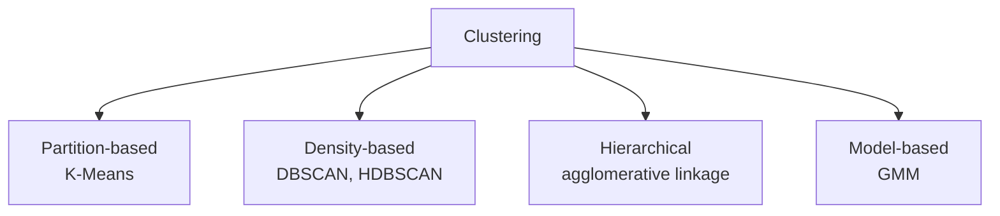
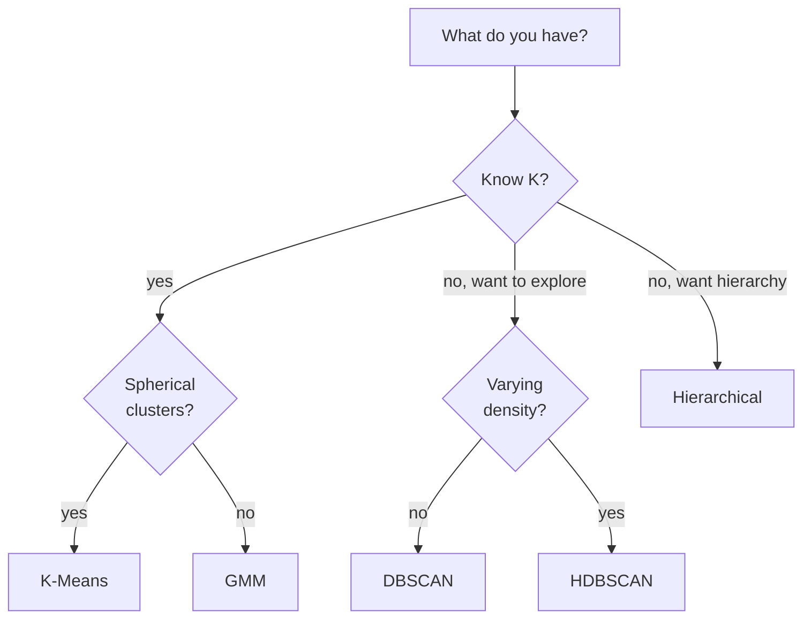

# Clustering: K-Means, DBSCAN, GMM, hierarchical

## What clustering is

Grouping points **without** labels, so that similar points are together and different points are in different clusters. Four main families:



## K-Means

The most common algorithm. Tries to divide $n$ points into $K$ clusters by minimizing the **sum of squared distances** from centers:

$$J = \sum_{k=1}^K \sum_{x \in C_k} \|x - \mu_k\|^2$$

### Algorithm (Lloyd, 1957)

```
1. Initialize K centers (random or K-Means++)
2. Repeat:
   a. Assign each point to the nearest center
   b. Recompute each center as the mean of its points
   until centers don't change
```

### Visually: 3 iterations of K-Means in action

<div class="chart"><svg viewBox="0 0 600 180" xmlns="http://www.w3.org/2000/svg">
<g transform="translate(10,10)">
  <text x="80" y="-2" fill="#7aa2ff" font-size="11" text-anchor="middle">iter 1: random centers</text>
  <rect x="0" y="5" width="160" height="140" fill="none" stroke="#444"/>
  <circle cx="30" cy="30" r="3" fill="#888"/>
  <circle cx="50" cy="40" r="3" fill="#888"/>
  <circle cx="40" cy="60" r="3" fill="#888"/>
  <circle cx="110" cy="100" r="3" fill="#888"/>
  <circle cx="130" cy="110" r="3" fill="#888"/>
  <circle cx="120" cy="130" r="3" fill="#888"/>
  <path d="M 60 80 L 65 70 L 70 80 L 65 90 Z" fill="#ffb347" stroke="#ffb347" stroke-width="2"/>
  <path d="M 100 50 L 105 40 L 110 50 L 105 60 Z" fill="#c084fc" stroke="#c084fc" stroke-width="2"/>
</g>
<g transform="translate(180,10)">
  <text x="80" y="-2" fill="#7aa2ff" font-size="11" text-anchor="middle">iter 2: assign + move</text>
  <rect x="0" y="5" width="160" height="140" fill="none" stroke="#444"/>
  <circle cx="30" cy="30" r="3" fill="#ffb347"/>
  <circle cx="50" cy="40" r="3" fill="#ffb347"/>
  <circle cx="40" cy="60" r="3" fill="#ffb347"/>
  <circle cx="110" cy="100" r="3" fill="#c084fc"/>
  <circle cx="130" cy="110" r="3" fill="#c084fc"/>
  <circle cx="120" cy="130" r="3" fill="#c084fc"/>
  <path d="M 40 43 L 45 33 L 50 43 L 45 53 Z" fill="#ffb347" stroke="#ffb347" stroke-width="2"/>
  <path d="M 120 113 L 125 103 L 130 113 L 125 123 Z" fill="#c084fc" stroke="#c084fc" stroke-width="2"/>
</g>
<g transform="translate(350,10)">
  <text x="80" y="-2" fill="#7aa2ff" font-size="11" text-anchor="middle">iter 3: convergence</text>
  <rect x="0" y="5" width="160" height="140" fill="none" stroke="#444"/>
  <circle cx="30" cy="30" r="3" fill="#ffb347"/>
  <circle cx="50" cy="40" r="3" fill="#ffb347"/>
  <circle cx="40" cy="60" r="3" fill="#ffb347"/>
  <circle cx="110" cy="100" r="3" fill="#c084fc"/>
  <circle cx="130" cy="110" r="3" fill="#c084fc"/>
  <circle cx="120" cy="130" r="3" fill="#c084fc"/>
  <path d="M 35 43 L 40 33 L 45 43 L 40 53 Z" fill="#ffb347" stroke="#ffb347" stroke-width="2"/>
  <path d="M 115 113 L 120 103 L 125 113 L 120 123 Z" fill="#c084fc" stroke="#c084fc" stroke-width="2"/>
</g>
</svg><div class="chart-caption">Each iteration: points pick the nearest diamond, diamonds move to the centroid of their group. Converges in a few steps.</div></div>

Convergence guaranteed in a few steps (to a local minimum, not global).

### K-Means++

"Smart" initialization (Arthur & Vassilvitskii, 2007):
- First center: random.
- Subsequent ones: probability proportional to $D(x)^2$, where $D$ is the distance to the nearest existing center.

Greatly reduces dependence on the seed. Default in sklearn.

### Limitations

- Assumes **spherical** clusters of **similar sizes**.
- Sensitive to outliers.
- $K$ must be chosen in advance.
- Doesn't discover non-convex cluster shapes.

### Choosing K: elbow method and silhouette

**Elbow method**: plot $J(K)$ for $K = 1, 2, \dots$. Look for the "elbow" — the point where adding a cluster no longer reduces J much.

**Silhouette score**: for each point, $(b - a) / \max(a, b)$ where $a$ = mean intra-cluster distance, $b$ = distance to the nearest other cluster. Range $[-1, 1]$, high = good clustering.

```python
from sklearn.cluster import KMeans
from sklearn.metrics import silhouette_score
import matplotlib.pyplot as plt

inertias = []; silhouettes = []
Ks = range(2, 11)
for K in Ks:
    km = KMeans(n_clusters=K, random_state=0, n_init=10).fit(X)
    inertias.append(km.inertia_)
    silhouettes.append(silhouette_score(X, km.labels_))

fig, ax = plt.subplots(1, 2, figsize=(12, 4))
ax[0].plot(Ks, inertias, 'o-'); ax[0].set_title('Elbow')
ax[1].plot(Ks, silhouettes, 'o-'); ax[1].set_title('Silhouette')
```

## DBSCAN

**Density-Based Spatial Clustering of Applications with Noise** (Ester et al, 1996).

Idea: a point is a **core** point if it has at least `min_samples` neighbors within radius `eps`. Clusters = connected components of core points. The rest = noise.

### Algorithm

```
for each unvisited point p:
    if p has >= min_samples neighbors within eps:
        create cluster, expand by including neighbors recursively
    else:
        mark p as noise
```

### Advantages

- **No K** needed as input.
- **Arbitrarily shaped** clusters (even concentric).
- Robust to noise (identifies it explicitly).

### Hyperparameters

- **eps**: neighborhood radius. Critical.
- **min_samples**: typically $2 \cdot \text{dim}$.

### Limitations

- Difficult with clusters of **different densities**.
- Sensitive to `eps` (rule of thumb: k-distance plot to choose it).
- Scales poorly on high-dimensional data (curse of dimensionality).

### HDBSCAN

Hierarchical extension of DBSCAN that handles varying densities. **Often the modern default** for exploratory clustering. Install with `pip install hdbscan`.

```python
import hdbscan
clusterer = hdbscan.HDBSCAN(min_cluster_size=15)
labels = clusterer.fit_predict(X)
```

## Gaussian Mixture Models (GMM)

Probabilistic model: assumes data generated from a **mixture** of $K$ multivariate Gaussians:

$$p(x) = \sum_{k=1}^K \pi_k \mathcal{N}(x | \mu_k, \Sigma_k)$$

Trained with **EM (Expectation-Maximization)**:

1. **E-step**: for each point, compute the probability of belonging to each cluster.
2. **M-step**: update $\mu_k, \Sigma_k, \pi_k$ given the soft assignment.

### Differences from K-Means

- Soft assignment: each point has a **probability** in each cluster, not a hard assignment.
- **Elliptical** cluster shapes (full covariances), not just spherical.
- Output: **modeled density**, useful for anomaly detection.

### Covariance types

- `'full'`: each cluster has its own full covariance matrix (most expressive).
- `'tied'`: all clusters share one.
- `'diag'`: diagonal only (faster).
- `'spherical'`: like K-Means.

```python
from sklearn.mixture import GaussianMixture
gmm = GaussianMixture(n_components=3, covariance_type='full', random_state=0).fit(X)
labels = gmm.predict(X)
proba = gmm.predict_proba(X)        # soft assignment
log_likelihood = gmm.score_samples(X)  # density (useful for anomalies)
```

### K selection via BIC / AIC

$$\text{BIC} = -2 \log L + k \log n$$

Lower = better. Penalizes models with too many parameters.

```python
ks = range(1, 11)
bics = [GaussianMixture(K, random_state=0).fit(X).bic(X) for K in ks]
plt.plot(ks, bics, 'o-')
```

## Hierarchical clustering

Builds a **dendrogram** — a tree of merges or splits.

- **Agglomerative (bottom-up)**: starts with $n$ clusters of 1 point each, merges the nearest ones.
- **Divisive (top-down)**: starts with 1 cluster of $n$ points, splits. Less common.

### Linkage criteria

How to measure distance between clusters?

- **Single**: minimum distance between two points of the clusters. Chain-effect, snake-like.
- **Complete**: maximum distance. Compact, spherical clusters.
- **Average**: average. Compromise.
- **Ward**: minimizes variance after merge. Tends to produce similarly-sized clusters, often the best default.

```python
from sklearn.cluster import AgglomerativeClustering
agg = AgglomerativeClustering(n_clusters=5, linkage='ward').fit(X)

from scipy.cluster.hierarchy import linkage, dendrogram
import matplotlib.pyplot as plt
Z = linkage(X, method='ward')
plt.figure(figsize=(12, 5))
dendrogram(Z, truncate_mode='lastp', p=20)
```

## Which algorithm to choose?



## Evaluation WITHOUT ground truth

- **Silhouette score** (internal): $-1$ to $1$, high is good.
- **Calinski-Harabasz**: ratio of between-cluster / within-cluster dispersion.
- **Davies-Bouldin**: average ratio of intra-dispersion/inter-distance. Low = good.

With ground truth (rare):

- **Adjusted Rand Index (ARI)**: -1..1.
- **Normalized Mutual Information (NMI)**: 0..1.

## Pre-processing: mandatory

1. **Scaling**: K-Means uses Euclidean distance. Features on different scales = dominated.
2. **Dimensionality reduction**: in high dim, distances become "all equal". Consider PCA first.
3. **Outlier handling**: K-Means is devastated by them. DBSCAN handles them.

## Example: customer segmentation

```python
from sklearn.preprocessing import StandardScaler
from sklearn.cluster import KMeans
from sklearn.decomposition import PCA
import matplotlib.pyplot as plt

# RFM features per customer
X = customers[['recency', 'frequency', 'monetary']].values
X_s = StandardScaler().fit_transform(X)

km = KMeans(n_clusters=4, random_state=0, n_init=10).fit(X_s)
customers['cluster'] = km.labels_

# visualize in 2D
X_2d = PCA(n_components=2).fit_transform(X_s)
plt.scatter(X_2d[:, 0], X_2d[:, 1], c=km.labels_, cmap='tab10', alpha=0.6)

# describe clusters
customers.groupby('cluster')[['recency','frequency','monetary']].mean()
```

Typically you'll get 4 segments like "champions", "low-value loyals", "at-risk", "one-timers". Useful for differentiated marketing campaigns.

## Exercises

<details>
<summary>Exercise 1 — Elbow + Silhouette on iris</summary>

```python
from sklearn.cluster import KMeans
from sklearn.metrics import silhouette_score
from sklearn.datasets import load_iris
import matplotlib.pyplot as plt

X = load_iris().data
inert = []; sil = []
for K in range(2, 10):
    km = KMeans(K, random_state=0, n_init=10).fit(X)
    inert.append(km.inertia_); sil.append(silhouette_score(X, km.labels_))

fig, ax = plt.subplots(1, 2, figsize=(10,4))
ax[0].plot(range(2,10), inert, 'o-'); ax[0].set_title('Elbow')
ax[1].plot(range(2,10), sil, 'o-'); ax[1].set_title('Silhouette')
```

The elbow is ambiguous (3 or 4), silhouette suggests 2. In reality the species are 3, but 2 of them are hard to separate without the target label.
</details>

<details>
<summary>Exercise 2 — DBSCAN on concentric circles</summary>

```python
from sklearn.datasets import make_circles
from sklearn.cluster import DBSCAN, KMeans
import matplotlib.pyplot as plt

X, _ = make_circles(n_samples=500, noise=0.05, factor=0.5, random_state=0)
fig, ax = plt.subplots(1, 2, figsize=(10, 4))

km = KMeans(2, random_state=0, n_init=10).fit(X)
ax[0].scatter(X[:,0], X[:,1], c=km.labels_); ax[0].set_title('K-Means')

db = DBSCAN(eps=0.2, min_samples=5).fit(X)
ax[1].scatter(X[:,0], X[:,1], c=db.labels_); ax[1].set_title('DBSCAN')
```

K-Means fails miserably (cuts in two halves), DBSCAN finds the two circles.
</details>

<details>
<summary>Exercise 3 — GMM for anomaly detection</summary>

Train a GMM on "normal" data, flag as anomalies the points with low density.

```python
from sklearn.mixture import GaussianMixture
import numpy as np
rng = np.random.default_rng(0)
X_normal = rng.standard_normal((1000, 2))
X_test = rng.standard_normal((200, 2))
X_test[:10] = rng.uniform(-5, 5, (10, 2))   # inserted outliers

gmm = GaussianMixture(n_components=3, random_state=0).fit(X_normal)
scores = gmm.score_samples(X_test)
threshold = np.percentile(scores, 5)
anomalies = scores < threshold
print(f"found {anomalies.sum()} anomalies out of 200")
```
</details>

<details>
<summary>Exercise 4 — Complete customer segmentation</summary>

On a transaction dataset, compute RFM, cluster with K-Means to 4, describe clusters.

```python
# pseudo: orders DataFrame with user_id, order_date, amount
ref = orders.order_date.max()
rfm = orders.groupby('user_id').agg(
    R=('order_date', lambda s: (ref-s.max()).days),
    F=('amount', 'count'),
    M=('amount', 'sum'),
)
from sklearn.preprocessing import StandardScaler
X = StandardScaler().fit_transform(np.log1p(rfm))
km = KMeans(4, random_state=0, n_init=10).fit(X)
rfm['cluster'] = km.labels_
print(rfm.groupby('cluster').agg(['mean','count']))
```
</details>

## Takeaways

- K-Means = fast default, but spherical shape and known K.
- DBSCAN/HDBSCAN for arbitrary shapes and noise detection.
- GMM for soft assignment and probabilistic model.
- Hierarchical for exploration and dendrogram.
- Without ground truth: silhouette + common sense + domain check.
- Scaling always mandatory. PCA before clustering if $d > 20$.

Next: dimensionality reduction.
