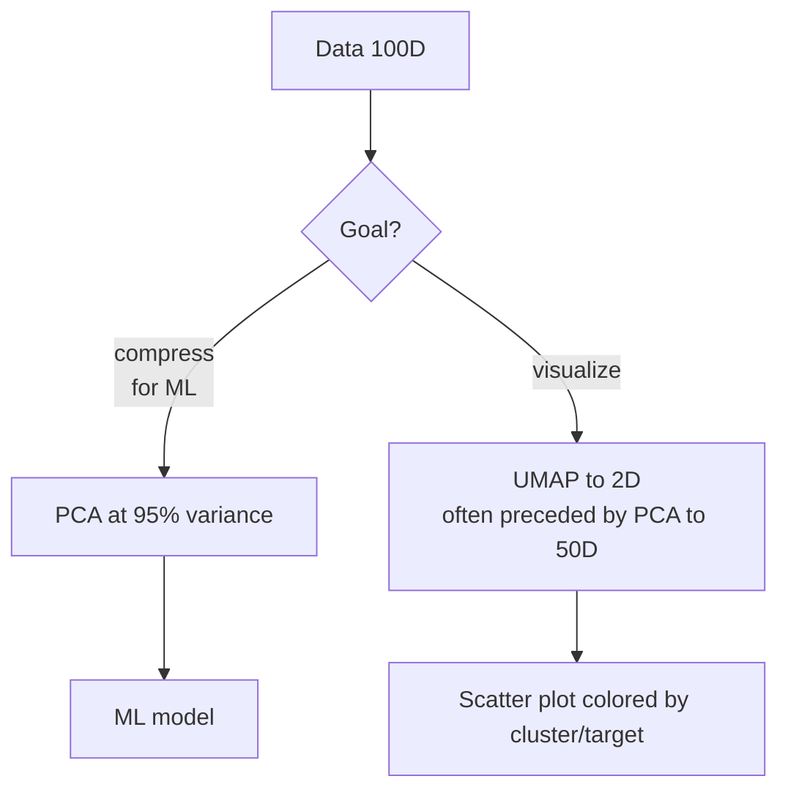

# Dimensionality reduction: PCA, t-SNE, UMAP

## Why reduce dimensions

Three reasons:

1. **Visualization**: 2D/3D is what you see on a screen.
2. **Compression**: fewer features = less RAM, less training time.
3. **Anti-curse-of-dimensionality**: KNN, K-Means, distances in general work better in low-dim.
4. **Denoising**: discarding low-variance components often removes noise.

## PCA — Principal Component Analysis

### Idea

Find the **directions along which data varies the most**. These directions are orthogonal (principal components) and orthonormal to each other.


### Derivation

1. Center $X$ (subtract mean). Optional: divide by std (standardized PCA).
2. Compute the **covariance matrix** $C = \frac{1}{n-1} X^T X$ (with $X$ centered).
3. Find eigenvalues and eigenvectors of $C$: $C v_k = \lambda_k v_k$.
4. The $v_k$ sorted by decreasing $\lambda_k$ are the **principal components**.
5. Project the data: $Z = X V_K$, where $V_K$ contains the first $K$ components.

### Equivalence with SVD

If $X = U \Sigma V^T$ (SVD), then $V$ are the principal components and $\Sigma^2 / (n-1)$ are the eigenvalues. In practice, SVD is always used (more stable).

### Explained variance

Each component has an explained variance $\lambda_k$. The cumulative fraction $\sum \lambda_k / \sum \lambda$ shows how much you can retain with $K$ components.

```python
from sklearn.decomposition import PCA
from sklearn.preprocessing import StandardScaler

X_s = StandardScaler().fit_transform(X)
pca = PCA().fit(X_s)
print(pca.explained_variance_ratio_.cumsum())
# e.g.: [0.42, 0.65, 0.78, 0.86, 0.92, 0.95, ...]
# choose K where the cumulative reaches 0.9 or 0.95
```

<div class="chart"><svg viewBox="0 0 360 180" xmlns="http://www.w3.org/2000/svg">
<line x1="40" y1="150" x2="340" y2="150" stroke="#555"/>
<line x1="40" y1="20" x2="40" y2="150" stroke="#555"/>
<path d="M 40 150 L 70 95 L 100 65 L 130 47 L 160 38 L 190 33 L 220 30 L 250 29 L 280 28 L 310 28 L 340 28" fill="none" stroke="#7aa2ff" stroke-width="2.5"/>
<line x1="40" y1="27" x2="340" y2="27" stroke="#5ee2c4" stroke-dasharray="3,3"/>
<text x="345" y="30" fill="#5ee2c4" font-size="10">95%</text>
<text x="180" y="170" fill="#8b949e" font-size="11" text-anchor="middle">number of components</text>
<text x="115" y="58" fill="#ffb347" font-size="10">elbow</text>
<circle cx="100" cy="65" r="3" fill="#ffb347"/>
</svg><div class="chart-caption">Scree plot: cumulative explained variance. Choose K at the elbow or at 95%.</div></div>

### Example

```python
from sklearn.decomposition import PCA
from sklearn.preprocessing import StandardScaler
import matplotlib.pyplot as plt

X_s = StandardScaler().fit_transform(X)
pca = PCA(n_components=2).fit(X_s)
X_2d = pca.transform(X_s)
plt.scatter(X_2d[:, 0], X_2d[:, 1], c=y, cmap='tab10')
```

### When it works

- Data with strong **linear correlations**.
- Want a **deterministic** and fast method.
- Want **interpretable** components (they are linear combinations of the original features).

### When it does NOT work

- **Non-linear** structures (e.g.: spirals, curved manifolds).
- Distributions with very separated but symmetric clusters (PCA doesn't see them).
- Extremely sparse data → use **TruncatedSVD** (for sparse matrices).

## Kernel PCA

Extension of PCA via the kernel trick (like SVM):

```python
from sklearn.decomposition import KernelPCA
kpca = KernelPCA(n_components=2, kernel='rbf', gamma=0.1).fit(X)
```

Captures non-linearities but expensive and less interpretable. Often superseded by t-SNE/UMAP.

## t-SNE — t-distributed Stochastic Neighbor Embedding

van der Maaten & Hinton (2008). **Visualization algorithm**, not a general compression method.

### Idea

Finds an embedding in 2D (or 3D) that **preserves local distances**:

1. In high dim, build a probability distribution over pairs of points (neighbors = high prob).
2. In low dim, do the same using a **t-Student** distribution (heavy tails to avoid crowding).
3. Minimize KL divergence between the two distributions.

### Hyperparameters

- **`perplexity`**: ~ number of neighbors considered. Typically 5–50. 30 default.
- **`learning_rate`**: 200–1000. Often `auto`.
- **`n_iter`**: 1000+ for convergence.

```python
from sklearn.manifold import TSNE
ts = TSNE(n_components=2, perplexity=30, init='pca', random_state=0)
X_2d = ts.fit_transform(X_s)
```

### IMPORTANT caveats

1. **Global distances NOT preserved**: clusters close in 2D are NOT necessarily similar in high dim. The plot shape is only locally informative.
2. **Stochastic**: each run produces a different result (set a seed).
3. **Slow**: $O(n^2)$ in naive version. Use Barnes-Hut or openTSNE for large datasets.
4. **Not for "supervised" applications**: don't use t-SNE features as input to a classifier.

> Distill.pub has an excellent article ("How to Use t-SNE Effectively") showing why it gets misunderstood. Read it.

## UMAP — Uniform Manifold Approximation and Projection

McInnes et al. (2018). Modern successor to t-SNE: faster, better preserves global structure, handles larger datasets.

### Idea (simplified)

Builds a neighbor graph in high dim, then seeks a layout in low dim that preserves its topology.

```python
import umap
um = umap.UMAP(n_neighbors=15, min_dist=0.1, n_components=2, random_state=0)
X_2d = um.fit_transform(X_s)
```

### Hyperparameters

- **`n_neighbors`** (default 15): local/global trade-off. Small = local focus, large = global structure.
- **`min_dist`** (default 0.1): how compact the clusters are. Small = compact clusters, large = sparse.
- **`metric`**: Euclidean (default), cosine, Manhattan, ...

### When to prefer UMAP over t-SNE

| | t-SNE | UMAP |
|---|---|---|
| Speed | slow | fast |
| Large datasets | difficult | OK up to 10⁶ |
| Global structure | lost | better preserved |
| Determinism | stochastic | stochastic but more stable |
| Modern standard | yes (history) | yes (present) |

UMAP is now the default for visualizations in many projects (e.g.: single-cell biology, document embeddings).

## Other methods

- **MDS (Multidimensional Scaling)**: preserves pairwise distances. Simpler but less effective than UMAP.
- **Isomap**: preserves geodesic distances on a manifold.
- **LLE (Locally Linear Embedding)**: preserves local linear relationships.
- **Autoencoder**: NN that learns a compressed representation. More powerful, but "black box".
- **TruncatedSVD**: PCA for sparse matrices (TF-IDF).

## Recommended workflow



Pattern used in single-cell genomics, document embeddings, image embeddings: **PCA to 50–100D + UMAP to 2D**. PCA removes noise, UMAP visualizes.

## Exercises

<details>
<summary>Exercise 1 — PCA on the digits dataset</summary>

```python
from sklearn.datasets import load_digits
from sklearn.decomposition import PCA
from sklearn.preprocessing import StandardScaler
import matplotlib.pyplot as plt

X, y = load_digits(return_X_y=True)
X_s = StandardScaler().fit_transform(X)
pca = PCA(n_components=2).fit(X_s)
X_2d = pca.transform(X_s)
plt.scatter(X_2d[:,0], X_2d[:,1], c=y, cmap='tab10', s=10)
plt.colorbar()
```

Shows that just 2 PCA components already separate many digits.
</details>

<details>
<summary>Exercise 2 — Choose K with explained variance</summary>

```python
pca_full = PCA().fit(X_s)
cum = pca_full.explained_variance_ratio_.cumsum()
k95 = (cum < 0.95).sum() + 1
print(f"K for 95% variance: {k95}")
```
</details>

<details>
<summary>Exercise 3 — t-SNE vs UMAP on digits</summary>

```python
from sklearn.manifold import TSNE
import umap
import matplotlib.pyplot as plt

ts = TSNE(n_components=2, random_state=0).fit_transform(X)
um = umap.UMAP(random_state=0).fit_transform(X)

fig, ax = plt.subplots(1, 2, figsize=(12, 5))
ax[0].scatter(ts[:,0], ts[:,1], c=y, cmap='tab10', s=8); ax[0].set_title('t-SNE')
ax[1].scatter(um[:,0], um[:,1], c=y, cmap='tab10', s=8); ax[1].set_title('UMAP')
```

UMAP is typically faster and produces more compact clusters.
</details>

<details>
<summary>Exercise 4 — Pipeline PCA + KNN</summary>

```python
from sklearn.pipeline import Pipeline
from sklearn.decomposition import PCA
from sklearn.preprocessing import StandardScaler
from sklearn.neighbors import KNeighborsClassifier
from sklearn.model_selection import cross_val_score

pipe = Pipeline([
    ('sc', StandardScaler()),
    ('pca', PCA(n_components=20)),
    ('knn', KNeighborsClassifier(5)),
])
print(cross_val_score(pipe, X, y, cv=5).mean())
```

Cross-validated, on digits reaches ~95% accuracy with only 20 components.
</details>

## Takeaways

- PCA: linear, deterministic, interpretable. For compression and denoising.
- t-SNE: visualization, local, stochastic, slow. Only for plots.
- UMAP: modern, faster, better global preservation. Today's default.
- PCA to 50D + UMAP to 2D = standard visualization pipeline.
- Never use t-SNE/UMAP features as input to supervised ML.

Next: metrics, cross-validation, leakage — evaluation done right.
