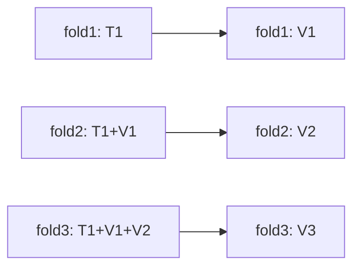
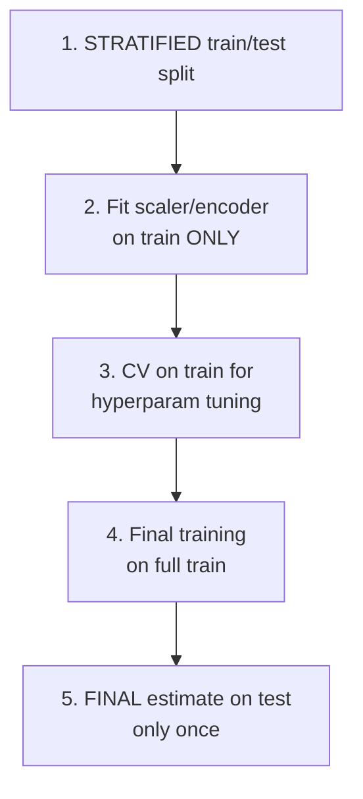

# Metrics, cross-validation, leakage

## Regression metrics

| Metric | Formula | Pros | Cons |
|---|---|---|---|
| **MSE** | $\frac{1}{n}\sum(y-\hat{y})^2$ | differentiable, MLE for normal | squared units; sensitive to outliers |
| **RMSE** | $\sqrt{\text{MSE}}$ | same units as $y$ | sensitive to outliers |
| **MAE** | $\frac{1}{n}\sum\|y-\hat{y}\|$ | robust, interpretable | not differentiable at 0 |
| **MAPE** | $\frac{1}{n}\sum\|y-\hat{y}\|/\|y\|$ | percentage | blows up with small $y$ |
| **SMAPE** | symmetric version of MAPE | handles 0 better | still tricky |
| **R²** | $1 - \text{SS}_\text{res}/\text{SS}_\text{tot}$ | scale-invariant | can be negative |
| **Adjusted R²** | penalizes for #features | model comparison | requires $n, p$ |
| **Quantile loss** | pinball loss for quantiles | for prediction intervals | less standard |

**When to prefer MAE over MSE**: when you expect outliers you do NOT want to emphasize. MSE gives 4× more weight to an error of 2 vs 1; MAE only 2×.

**MAPE pitfall**: if $y = 0$ in the test set, MAPE = ∞. Use SMAPE or MAE.

## Classification metrics

### Confusion matrix

Everything starts here:

| | Predicted 0 | Predicted 1 |
|---|---|---|
| **Actual 0** | TN | FP |
| **Actual 1** | FN | TP |

```python
from sklearn.metrics import confusion_matrix, ConfusionMatrixDisplay
cm = confusion_matrix(y_true, y_pred)
ConfusionMatrixDisplay(cm, display_labels=['negative','positive']).plot()
```

### The 5 basic metrics

$$\text{Accuracy} = \frac{TP + TN}{TP + TN + FP + FN}$$

$$\text{Precision} = \frac{TP}{TP + FP}\quad \text{(of all predicted positives, how many are truly positive?)}$$

$$\text{Recall (Sensitivity)} = \frac{TP}{TP + FN}\quad \text{(of all true positives, how many do I capture?)}$$

$$\text{Specificity} = \frac{TN}{TN + FP}\quad \text{(of all true negatives, how many do I predict as negative?)}$$

$$F_1 = 2 \cdot \frac{\text{Precision} \cdot \text{Recall}}{\text{Precision} + \text{Recall}}$$

### F_beta

Generalizes F1 by weighting recall:

$$F_\beta = (1 + \beta^2) \frac{P \cdot R}{\beta^2 P + R}$$

$\beta > 1$: recall matters more. $\beta = 0.5$: precision matters more.

### ROC and AUC

**ROC** (Receiver Operating Characteristic): plot TPR vs FPR as the threshold varies.

- TPR = Recall.
- FPR = $FP / (FP + TN)$ = 1 - Specificity.

**AUC** = area under the ROC. Interpretation: probability that the model assigns a higher score to a positive than to a random negative. $0.5$ = random, $1$ = perfect.

> **AUC misleading on imbalanced classes**: with 1% positives, even a mediocre model can have AUC 0.9 but precision 0.05. Use **AUC PR** or F1 in these cases.

### Precision-Recall curve and AUC-PR

Plot P vs R as the threshold varies. More informative than ROC on imbalanced classes.

```python
from sklearn.metrics import (roc_auc_score, average_precision_score,
                             roc_curve, precision_recall_curve, f1_score)
proba = model.predict_proba(X_te)[:, 1]
print("ROC AUC:", roc_auc_score(y_te, proba))
print("PR AUC:", average_precision_score(y_te, proba))
```

### Log loss

$$L = -\frac{1}{n} \sum_i [y_i \log p_i + (1 - y_i) \log(1 - p_i)]$$

Captures not just whether the class is correct, but how well **the probabilities are calibrated**. More informative than threshold-based metrics.

### Brier score

$$B = \frac{1}{n} \sum_i (p_i - y_i)^2$$

Also for calibration, but quadratic. Less commonly used in practice.

## Multi-class

**Macro avg**: unweighted average of per-class metrics. All classes count equally.
**Weighted avg**: weighted by support.
**Micro avg**: aggregates TP/FP/FN across all classes before computing.

```python
from sklearn.metrics import classification_report
print(classification_report(y_te, y_pred))
```

> On imbalanced classes, **macro F1** is the most informative metric: it reveals whether the model is "ignoring" small classes.

## Cross-validation: the types you need

### K-Fold

```python
from sklearn.model_selection import KFold
kf = KFold(n_splits=5, shuffle=True, random_state=0)
```

### Stratified K-Fold

Preserves class proportions. **Always** use for classification.

```python
from sklearn.model_selection import StratifiedKFold
skf = StratifiedKFold(n_splits=5, shuffle=True, random_state=0)
```

### Group K-Fold

When examples belong to "groups" (e.g.: user_id, patient). The same groups must not appear in both train and val.

```python
from sklearn.model_selection import GroupKFold
gkf = GroupKFold(n_splits=5)
for tr, va in gkf.split(X, y, groups=user_id):
    ...
```

### Time Series Split

For temporal data: train = past, val = future. Never mix.

```python
from sklearn.model_selection import TimeSeriesSplit
tscv = TimeSeriesSplit(n_splits=5, gap=7)   # 7-day gap between train and val
```



### Repeated K-Fold

Repeat K-fold with different seeds to reduce variance of the estimate.

## Nested cross-validation

When you need both **hyperparameter tuning** and **honest error estimation**:

```python
from sklearn.model_selection import GridSearchCV, cross_val_score
outer = StratifiedKFold(5, shuffle=True, random_state=0)
inner = StratifiedKFold(3, shuffle=True, random_state=0)
gs = GridSearchCV(model, param_grid, cv=inner, scoring='roc_auc')
scores = cross_val_score(gs, X, y, cv=outer, scoring='roc_auc')
print(f"AUC: {scores.mean():.3f} ± {scores.std():.3f}")
```

Expensive (5×3=15 fits), but this is the "true" cross-validation.

## Leakage: the ways you cheat on yourself

In other words: the test set "sees" the training set, accuracy inflates, and in production the model performs poorly.

### 1. Target leakage

A feature is derived from the target (explicitly or implicitly):

- You predict "loan default" and use `times_called_by_collection_dept` — that happened after the default!
- You predict subscription cancellation and use `last_login_date` — people who cancel often have last_login = cancellation date.

**Test**: feature with correlation > 0.95 with target → investigate.

### 2. Train-test contamination

Scaler/imputer/PCA fitted on the **entire** dataset before the split:

```python
# WRONG
X_scaled = StandardScaler().fit_transform(X)
X_tr, X_te = train_test_split(X_scaled, ...)

# CORRECT
X_tr, X_te = train_test_split(X, ...)
sc = StandardScaler().fit(X_tr)
X_tr_s = sc.transform(X_tr); X_te_s = sc.transform(X_te)
```

scikit-learn Pipeline saves you from this bug automatically.

### 3. Group leakage

Same user in train and test (or same patient, same document). "Normal" cross-val does not prevent it → use GroupKFold.

### 4. Time leakage

For time series: using features aggregated from the future in the past. E.g.: global mean of the target → contains "future" information about past samples.

### 5. Selection bias

You filtered the data in a way that makes the train/test set non-representative. E.g.: removing rows with NaN — but records with NaN are different from those without.

## Typical workflow



## Exercises

<details>
<summary>Exercise 1 — Manual metric computation</summary>

Confusion matrix:

|   | Pred 0 | Pred 1 |
|---|---|---|
| Actual 0 | 80 | 5 |
| Actual 1 | 10 | 30 |

Compute accuracy, precision, recall, F1.

**Solutions**:
- Accuracy = (80+30)/125 = 0.88
- Precision = 30/35 = 0.857
- Recall = 30/40 = 0.75
- F1 = 2 · 0.857 · 0.75 / (0.857 + 0.75) = 0.80
</details>

<details>
<summary>Exercise 2 — AUC on imbalanced classes</summary>

Generate a dataset with 1% positives. Train a mediocre model, compute accuracy, AUC, AP.

```python
from sklearn.datasets import make_classification
from sklearn.model_selection import train_test_split
from sklearn.linear_model import LogisticRegression
from sklearn.metrics import accuracy_score, roc_auc_score, average_precision_score

X, y = make_classification(20000, weights=[0.99, 0.01], random_state=0)
X_tr, X_te, y_tr, y_te = train_test_split(X, y, stratify=y, random_state=0)
m = LogisticRegression(max_iter=2000).fit(X_tr, y_tr)
proba = m.predict_proba(X_te)[:, 1]
pred = (proba > 0.5).astype(int)
print(f"Accuracy: {accuracy_score(y_te, pred):.3f}")
print(f"ROC AUC: {roc_auc_score(y_te, proba):.3f}")
print(f"PR AUC: {average_precision_score(y_te, proba):.3f}")
```

Often: accuracy 99%, ROC AUC 0.9, PR AUC 0.3. **PR AUC is the truth**.
</details>

<details>
<summary>Exercise 3 — Find the leakage</summary>

```python
from sklearn.preprocessing import StandardScaler
from sklearn.model_selection import cross_val_score
from sklearn.linear_model import LogisticRegression

# WRONG: scaling before split
sc = StandardScaler()
X_s = sc.fit_transform(X)
score_wrong = cross_val_score(LogisticRegression(), X_s, y, cv=5).mean()

# CORRECT: pipeline
from sklearn.pipeline import Pipeline
pipe = Pipeline([('sc', StandardScaler()), ('lr', LogisticRegression())])
score_right = cross_val_score(pipe, X, y, cv=5).mean()

print(score_wrong, score_right)
```

In practice the difference for StandardScaler is small, but for imputer, PCA, target encoding it can be huge.
</details>

<details>
<summary>Exercise 4 — TimeSeriesSplit</summary>

```python
import numpy as np
import pandas as pd
from sklearn.model_selection import TimeSeriesSplit, cross_val_score
from sklearn.linear_model import Ridge

ts = pd.date_range('2020-01-01', '2024-12-31', freq='D')
y = np.sin(np.arange(len(ts))/30) + np.random.randn(len(ts))*0.1
X = pd.DataFrame({'t': np.arange(len(ts))})

tscv = TimeSeriesSplit(n_splits=5, gap=30)
scores = cross_val_score(Ridge(), X, y, cv=tscv, scoring='r2')
print(scores)
```

Time-respecting cross-validation: in each fold the train comes "before" the val.
</details>

## Key takeaways

- Accuracy is misleading on imbalanced classes. Use F1, PR AUC.
- ROC AUC is threshold-independent. F1 is threshold-dependent.
- Stratified for classes, Group for repeated subjects, TimeSeries for temporal data.
- scikit-learn Pipeline = automatic train/test separation preservation.
- Leakage = enemy number 1. AUC > 0.95 is suspicious.

Next: class balancing and imbalance.
