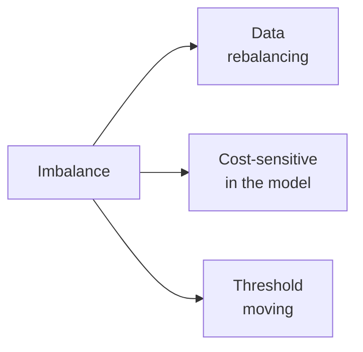

# Class imbalance

## The problem

Fraud: 0.1% of transactions. Cancer: 1% of screenings. Ad clicks: 2%. Loan defaults: 5%.

In these cases:

- **High accuracy = useless**: "always predict no" achieves 99.9%.
- The model tends to ignore the minority class.
- Default metrics (even ROC AUC) can be misleading.

Three families of remedies:



## 1. Data rebalancing

### Random oversampling

Duplicates examples from the minority class. Simple but prone to overfitting (the copies are identical).

### Random undersampling

Discards examples from the majority class. Fast but loses information.

### SMOTE (Synthetic Minority Oversampling Technique)

Generates synthetic examples in the minority class by interpolating between nearby points:

```python
from imblearn.over_sampling import SMOTE
sm = SMOTE(sampling_strategy=0.3, random_state=0)
X_res, y_res = sm.fit_resample(X_tr, y_tr)
```

Variants: **SMOTE-NC** (handles categoricals), **ADASYN** (denser where the class is already minority), **BorderlineSMOTE** (focus on boundaries).

### Combination

```python
from imblearn.pipeline import Pipeline
from imblearn.over_sampling import SMOTE
from imblearn.under_sampling import RandomUnderSampler

pipe = Pipeline([
    ('smote', SMOTE(sampling_strategy=0.3)),
    ('under', RandomUnderSampler(sampling_strategy=0.5)),
    ('clf', LogisticRegression(max_iter=2000)),
])
```

> **Important**: SMOTE / undersampling must be applied **inside the CV**, only on the training fold. Using `imblearn.Pipeline` (not `sklearn.Pipeline`) handles this correctly.

### Cluster-based undersampling (Tomek links, NearMiss)

Removes "borderline" examples from the majority class, keeping only the most representative ones.

```python
from imblearn.under_sampling import TomekLinks, NearMiss
```

## 2. Cost-sensitive learning

Modifies the loss to weight errors on the minority class more heavily.

### Class weight

Almost all sklearn models support `class_weight`:

```python
LogisticRegression(class_weight='balanced')
RandomForestClassifier(class_weight='balanced')
SVC(class_weight={0: 1, 1: 10})    # manual: class 1 counts 10x
```

`'balanced'` weights inversely to frequencies: $w_k = n / (K \cdot n_k)$.

### For XGBoost / LightGBM

Use `scale_pos_weight`:

```python
xgb.XGBClassifier(scale_pos_weight=99)   # 99 negatives per positive
```

### For custom gradient boosting

The loss function is modified directly.

## 3. Threshold moving

Often the **simplest and most effective solution**: instead of rebalancing the dataset, modify the **decision threshold**.

```python
proba = model.predict_proba(X_val)[:, 1]
# choose threshold that maximizes F1
from sklearn.metrics import precision_recall_curve, f1_score
import numpy as np
prec, rec, thr = precision_recall_curve(y_val, proba)
f1s = 2 * prec * rec / (prec + rec + 1e-9)
best_thr = thr[f1s[:-1].argmax()]
print(f"Optimal threshold: {best_thr:.3f}")
y_pred = (proba >= best_thr).astype(int)
```

Advantages:
- Does not change the model.
- Calibrated to the metric you care about.
- Fast.

## Which strategy works best?

Uncomfortable truth: **it depends**. Often threshold moving + class weight is enough. SMOTE and similar methods sometimes make things worse (they introduce artificial patterns).

Guidelines:

| Situation | First thing to try |
|---|---|
| Few data, moderate imbalance | class_weight='balanced' |
| Lots of data, strong imbalance | scale_pos_weight (boosting) + threshold |
| Complex boundary | SMOTE + boosting |
| Very asymmetric error costs | cost-sensitive + threshold |
| Extreme (<0.1%) | anomaly detection instead of classification |

## When it is NOT "imbalance"

Sometimes what you call imbalance is actually:

- **Minority class with little signal** — even balancing won't save you.
- **Wrong labels** on the minority — clean first.
- **Concept drift** — the positive pattern changes over time.

> Lesson: first understand **why** the model fails on the minority class. Maybe the features don't differentiate. In that case, oversampling is useless.

## Full cost-sensitive approach

If you know the real costs ($C_{FP}, C_{FN}$), find the threshold that minimizes the **expected total cost**:

$$\text{Cost} = C_{FP} \cdot \text{FP} + C_{FN} \cdot \text{FN}$$

```python
import numpy as np
from sklearn.metrics import confusion_matrix

C_fp, C_fn = 1, 100   # one FN costs 100x one FP
proba = model.predict_proba(X_val)[:, 1]
costs = []
ths = np.linspace(0, 1, 101)
for t in ths:
    tn, fp, fn, tp = confusion_matrix(y_val, (proba > t).astype(int)).ravel()
    costs.append(C_fp*fp + C_fn*fn)
best_t = ths[np.argmin(costs)]
```

Best practice in domains where costs are known (medicine, fraud, predictive maintenance).

## Complete example: fraud detection

```python
from sklearn.model_selection import train_test_split
from sklearn.metrics import (classification_report, roc_auc_score,
                             average_precision_score, precision_recall_curve)
import lightgbm as lgb
import numpy as np

X_tr, X_te, y_tr, y_te = train_test_split(X, y, test_size=0.2,
                                          stratify=y, random_state=0)
# class proportion: 0.5% fraud
scale_pos_weight = (y_tr == 0).sum() / (y_tr == 1).sum()

m = lgb.LGBMClassifier(
    n_estimators=2000, learning_rate=0.05,
    scale_pos_weight=scale_pos_weight,
    random_state=0
)
m.fit(X_tr, y_tr, eval_set=[(X_te, y_te)],
      callbacks=[lgb.early_stopping(100)])

proba = m.predict_proba(X_te)[:, 1]
print("PR AUC:", average_precision_score(y_te, proba))

# threshold for precision >= 0.5
prec, rec, thr = precision_recall_curve(y_te, proba)
mask = prec >= 0.5
idx = rec[mask].argmax()
best_t = thr[mask[:-1]][idx-1]
y_pred = (proba >= best_t).astype(int)
print(classification_report(y_te, y_pred))
```

## Exercises

<details>
<summary>Exercise 1 — Effect of class_weight</summary>

On an imbalanced dataset, compare:
- `LogisticRegression()`
- `LogisticRegression(class_weight='balanced')`

Plot P, R, F1 as the threshold varies.

```python
from sklearn.datasets import make_classification
from sklearn.linear_model import LogisticRegression
from sklearn.metrics import precision_recall_curve
import matplotlib.pyplot as plt

X, y = make_classification(20000, weights=[0.95, 0.05], random_state=0)
X_tr, X_te, y_tr, y_te = train_test_split(X, y, stratify=y, random_state=0)

for cw in [None, 'balanced']:
    m = LogisticRegression(max_iter=2000, class_weight=cw).fit(X_tr, y_tr)
    proba = m.predict_proba(X_te)[:, 1]
    p, r, _ = precision_recall_curve(y_te, proba)
    plt.plot(r, p, label=f"cw={cw}")
plt.legend(); plt.xlabel('recall'); plt.ylabel('precision')
```
</details>

<details>
<summary>Exercise 2 — SMOTE inside cross-validation</summary>

```python
from imblearn.pipeline import Pipeline
from imblearn.over_sampling import SMOTE
from sklearn.linear_model import LogisticRegression
from sklearn.model_selection import cross_val_score

# WRONG: SMOTE outside CV
X_res, y_res = SMOTE(random_state=0).fit_resample(X, y)
wrong = cross_val_score(LogisticRegression(), X_res, y_res, cv=5,
                        scoring='average_precision').mean()

# CORRECT
pipe = Pipeline([('smote', SMOTE(random_state=0)),
                 ('lr', LogisticRegression())])
right = cross_val_score(pipe, X, y, cv=5,
                       scoring='average_precision').mean()

print("wrong:", wrong, "right:", right)
```

`wrong` is optimistically inflated.
</details>

<details>
<summary>Exercise 3 — Cost-aware threshold</summary>

Find the threshold that minimizes a cost where a false negative costs 100× a false positive.

```python
import numpy as np
def find_threshold(y_true, y_proba, c_fp=1, c_fn=100):
    ths = np.linspace(0, 1, 101)
    costs = []
    for t in ths:
        y_pred = (y_proba > t).astype(int)
        fp = ((y_pred==1) & (y_true==0)).sum()
        fn = ((y_pred==0) & (y_true==1)).sum()
        costs.append(c_fp*fp + c_fn*fn)
    return ths[np.argmin(costs)], min(costs)
```
</details>

<details>
<summary>Exercise 4 — When SMOTE does NOT help</summary>

Create a dataset where the classes are **inseparable** (random features). SMOTE will make things worse or have no effect.

```python
import numpy as np
from sklearn.linear_model import LogisticRegression
from sklearn.model_selection import cross_val_score
from imblearn.over_sampling import SMOTE
from imblearn.pipeline import Pipeline
rng = np.random.default_rng(0)
X = rng.standard_normal((5000, 5))
y = rng.choice([0, 1], 5000, p=[0.95, 0.05])  # completely random

base = LogisticRegression(max_iter=1000)
smt = Pipeline([('s', SMOTE()), ('lr', LogisticRegression(max_iter=1000))])
print(cross_val_score(base, X, y, cv=5, scoring='average_precision').mean())
print(cross_val_score(smt, X, y, cv=5, scoring='average_precision').mean())
```

Close to PR AUC = baseline = prevalence (0.05). Nothing to do with data that has no signal.
</details>

## Key takeaways

- Accuracy is useless with imbalance. PR AUC and F1 are your metrics.
- class_weight / scale_pos_weight: first thing to try, simple and powerful.
- SMOTE is a useful but not magical tool; use it inside CV.
- Threshold moving is often the most effective solution.
- With known costs, optimize for cost, not F1.

Next: hyperparameter tuning.
