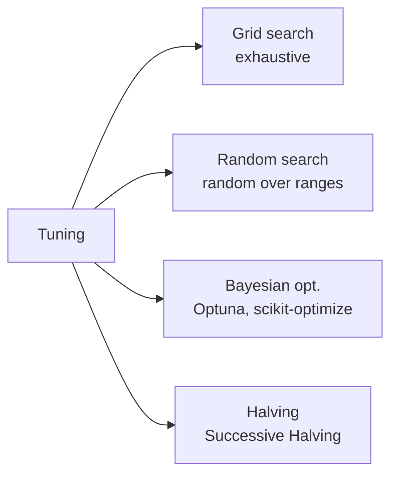
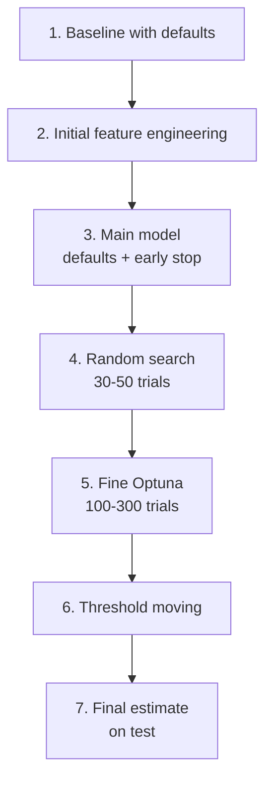

# Hyperparameter tuning

## What are hyperparameters

**Parameters** are learned during training (regression coefficients, NN weights).
**Hyperparameters** are fixed before training: regularization, tree depth, learning rate, number of neurons.

Hyperparameters control the model's **capacity**. Poorly tuned = under/overfit. Well tuned = sweet spot.

## Main strategies



## Grid search

Tries all combinations on a grid.

```python
from sklearn.model_selection import GridSearchCV
param_grid = {
    'n_estimators': [100, 300, 500],
    'max_depth': [3, 5, 7, None],
    'min_samples_leaf': [1, 5, 20],
}
gs = GridSearchCV(RandomForestClassifier(random_state=0), param_grid,
                  cv=5, scoring='roc_auc', n_jobs=-1)
gs.fit(X, y)
print(gs.best_params_, gs.best_score_)
```

**Pros**: deterministic, you see everything.
**Cons**: $4 \times 4 \times 3 \times 5\text{-fold} = 240$ fits. Explodes with more parameters.

## Random search

Samples randomly from the ranges. Often **more efficient** than grid:

> Bergstra & Bengio (2012): for the same trial budget, random search finds better hyperparameters than grid search.

Why: in general only a few hyperparameters "matter". Grid wastes trials on irrelevant variants.

```python
from sklearn.model_selection import RandomizedSearchCV
from scipy.stats import randint, loguniform
param_distributions = {
    'n_estimators': randint(100, 1000),
    'max_depth': randint(3, 15),
    'min_samples_leaf': randint(1, 50),
    'max_features': loguniform(0.1, 1.0),
}
rs = RandomizedSearchCV(RandomForestClassifier(random_state=0),
                        param_distributions, n_iter=50, cv=5,
                        scoring='roc_auc', random_state=0, n_jobs=-1)
rs.fit(X, y)
```

## Bayesian optimization

Builds a **surrogate model** of the "hyperparams → metric" function, and uses that model to choose the next trial. Often converges faster.

### Optuna (the modern standard)

```python
import optuna, lightgbm as lgb
from sklearn.model_selection import cross_val_score

def objective(trial):
    params = dict(
        n_estimators=trial.suggest_int('n_estimators', 100, 2000),
        learning_rate=trial.suggest_float('lr', 1e-3, 0.3, log=True),
        num_leaves=trial.suggest_int('num_leaves', 8, 256),
        max_depth=trial.suggest_int('max_depth', 3, 12),
        min_data_in_leaf=trial.suggest_int('min_data_in_leaf', 5, 100),
        feature_fraction=trial.suggest_float('feature_fraction', 0.4, 1.0),
        bagging_fraction=trial.suggest_float('bagging_fraction', 0.4, 1.0),
        bagging_freq=trial.suggest_int('bagging_freq', 0, 7),
        reg_lambda=trial.suggest_float('reg_lambda', 1e-3, 10, log=True),
        random_state=0, verbose=-1,
    )
    m = lgb.LGBMClassifier(**params)
    return cross_val_score(m, X, y, cv=5, scoring='roc_auc', n_jobs=-1).mean()

study = optuna.create_study(direction='maximize',
                            sampler=optuna.samplers.TPESampler(seed=0))
study.optimize(objective, n_trials=100, n_jobs=4)
print(study.best_params)
print(study.best_value)
```

### Optuna advantages

- Simple API: `trial.suggest_*` declares the search space.
- **Pruning**: stops unpromising trials early.
- Multi-objective optimization.
- DB storage to resume interrupted studies.
- Built-in visualization.

```python
optuna.visualization.plot_optimization_history(study)
optuna.visualization.plot_param_importances(study)
optuna.visualization.plot_parallel_coordinate(study)
```

## Halving search (sklearn)

Successive Halving: train all candidates on a small amount of data, discard the worst, double the data for the survivors, repeat.

```python
from sklearn.experimental import enable_halving_search_cv  # noqa
from sklearn.model_selection import HalvingRandomSearchCV
hs = HalvingRandomSearchCV(estimator, param_distributions, factor=3,
                          random_state=0, n_jobs=-1)
hs.fit(X, y)
```

Very efficient for large datasets or expensive models.

## How much tuning is needed?

Unpopular truth: for many models, **defaults + early stopping are enough** for 90% of the improvement. Serious hyperparameter tuning adds another 5–10%.

Recommendation: first do **feature engineering**. Then baseline models with defaults. **Only then** serious tuning.

> Among Kaggle Grandmasters, time is spent 70% on features, 20% on architecture/blending, 10% on tuning. Not the other way around.

## What NOT to tune

- **Decision threshold**: tune it separately in post-processing.
- **What to include in features**: use feature selection, not grid search over columns.
- **Random seed**: if your results change a lot with the seed, you have a variance problem, not a tuning problem.

## Pitfall: tuning on the test set

We said it before but it's the most common way to cheat on yourself:

```python
# WRONG
gs.fit(X_train, y_train)
best = gs.best_estimator_
score = best.score(X_test, y_test)
# if you now tweak hyperparams looking at the test score, you are contaminating yourself
```

**Rule**: one single final evaluation on the test set. If AUC is 0.82 and seems "low", do not go back to tuning with information from the test set. That becomes your number.

## Log-uniform distributions

For parameters that live on a logarithmic scale (learning rate, C, alpha):

```python
# correct
trial.suggest_float('lr', 1e-5, 1, log=True)
# samples uniformly in log space → equivalent to wide exploration
```

Not:

```python
trial.suggest_float('lr', 1e-5, 1)
# samples uniformly in [0,1] → 99% of trials around 0.5, useless
```

## Typical workflow



## Exercises

<details>
<summary>Exercise 1 — Grid vs Random vs Optuna</summary>

Measure time and best score for the three methods with the same budget of 30 trials.

```python
import time, optuna
from sklearn.datasets import load_breast_cancer
from sklearn.model_selection import GridSearchCV, RandomizedSearchCV, cross_val_score
from sklearn.ensemble import RandomForestClassifier
from scipy.stats import randint

X, y = load_breast_cancer(return_X_y=True)
base = RandomForestClassifier(random_state=0)

# grid
t = time.perf_counter()
grid = {'n_estimators': [100, 200, 500], 'max_depth': [3, 5, 7, 10],
        'min_samples_leaf': [1, 5, 20]}
gs = GridSearchCV(base, grid, cv=3, n_jobs=-1).fit(X, y)
print(f"Grid: {time.perf_counter()-t:.1f}s best={gs.best_score_:.3f}")

# random
t = time.perf_counter()
dist = {'n_estimators': randint(50, 500), 'max_depth': randint(2, 12),
        'min_samples_leaf': randint(1, 30)}
rs = RandomizedSearchCV(base, dist, n_iter=30, cv=3, random_state=0,
                        n_jobs=-1).fit(X, y)
print(f"Random: {time.perf_counter()-t:.1f}s best={rs.best_score_:.3f}")

# optuna
t = time.perf_counter()
def obj(tr):
    m = RandomForestClassifier(
        n_estimators=tr.suggest_int('n', 50, 500),
        max_depth=tr.suggest_int('d', 2, 12),
        min_samples_leaf=tr.suggest_int('l', 1, 30),
        random_state=0
    )
    return cross_val_score(m, X, y, cv=3, n_jobs=-1).mean()
study = optuna.create_study(direction='maximize')
optuna.logging.set_verbosity(optuna.logging.WARNING)
study.optimize(obj, n_trials=30)
print(f"Optuna: {time.perf_counter()-t:.1f}s best={study.best_value:.3f}")
```
</details>

<details>
<summary>Exercise 2 — Important hyperparameters via Optuna</summary>

```python
import optuna
optuna.visualization.plot_param_importances(study)
```

The chart shows which hyperparams contribute most to improvement. Often 2–3 dominate.
</details>

<details>
<summary>Exercise 3 — Pruning with Optuna</summary>

For models with a learning curve (boosting, NN), abandon unpromising trials early:

```python
import optuna, lightgbm as lgb

def obj(trial):
    p = dict(
        n_estimators=2000,
        learning_rate=trial.suggest_float('lr', 1e-3, 0.3, log=True),
        max_depth=trial.suggest_int('d', 3, 10),
    )
    m = lgb.LGBMClassifier(**p, random_state=0, verbose=-1)
    pruning_cb = optuna.integration.LightGBMPruningCallback(trial, 'auc')
    m.fit(X_tr, y_tr, eval_set=[(X_val, y_val)],
          eval_metric='auc', callbacks=[pruning_cb, lgb.early_stopping(50)])
    proba = m.predict_proba(X_val)[:, 1]
    return roc_auc_score(y_val, proba)

study = optuna.create_study(direction='maximize', pruner=optuna.pruners.MedianPruner())
study.optimize(obj, n_trials=100)
```
</details>

## Key takeaways

- Random > Grid in general.
- Optuna > Random in general.
- Defaults + early stopping = 90% of the improvement.
- Log-uniform for log-scale parameters.
- Tuning on the test set = cheating on yourself.
- 70% features, 20% architecture, 10% tuning.

Next: deep learning — neural networks from scratch.
