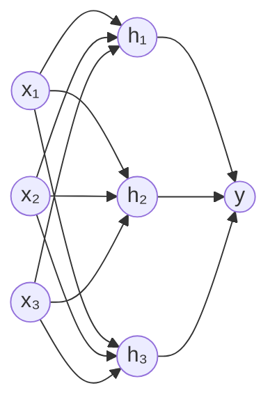

# Neural networks: from fundamentals to backprop

## The artificial neuron

A highly simplified model of the biological neuron:

$$y = \phi\left(\sum_j w_j x_j + b\right) = \phi(\mathbf{w}^T \mathbf{x} + b)$$

where $\phi$ is a non-linear **activation function**.

With $\phi$ = sigmoid, the neuron is exactly logistic regression. The novelty of NNs: **stacking** many neurons together.

## Multilayer Perceptron (MLP)



Formally, a 2-layer network:

$$\mathbf{h} = \phi(W_1 \mathbf{x} + \mathbf{b}_1)$$
$$y = W_2 \mathbf{h} + \mathbf{b}_2$$

With **enough** hidden neurons (and non-linear activations), a 2-layer MLP can approximate **any continuous function** (universal approximation theorem, Cybenko 1989, Hornik 1991).

> Translation: there is no "theoretical limit" to expressiveness. The challenge is making training converge, avoiding overfitting, and scaling.

## Activation functions

### Sigmoid and tanh (historical)

$$\sigma(z) = \frac{1}{1+e^{-z}}, \quad \tanh(z) = \frac{e^z - e^{-z}}{e^z + e^{-z}}$$

Problems:
- They saturate: derivative close to zero for large $|z|$ → **vanishing gradient**.
- Sigmoid is not centered at 0.

### ReLU (modern default)

$$\text{ReLU}(z) = \max(0, z)$$

Advantages: derivative 1 for $z > 0$, gradient does not vanish. Sparse (many zeros).
Drawback: "dying ReLU" — neurons stuck at 0 forever.

Variants: **Leaky ReLU** ($\max(\alpha z, z)$), **ELU**, **GELU** (used in Transformers).

### Softmax (multi-class output)

$$\text{softmax}(z)_i = \frac{e^{z_i}}{\sum_j e^{z_j}}$$

Converts logits into a probability distribution over $K$ classes.

<div class="chart"><svg viewBox="0 0 480 160" xmlns="http://www.w3.org/2000/svg">
<g transform="translate(20,10)">
  <line x1="0" y1="130" x2="120" y2="130" stroke="#555"/>
  <line x1="60" y1="20" x2="60" y2="130" stroke="#555"/>
  <path d="M 0 128 C 40 128 80 22 120 22" fill="none" stroke="#7aa2ff" stroke-width="2"/>
  <text x="60" y="148" fill="#7aa2ff" font-size="11" text-anchor="middle">sigmoid</text>
</g>
<g transform="translate(180,10)">
  <line x1="0" y1="130" x2="120" y2="130" stroke="#555"/>
  <line x1="60" y1="20" x2="60" y2="130" stroke="#555"/>
  <path d="M 0 128 L 60 128 L 120 25" fill="none" stroke="#ffb347" stroke-width="2"/>
  <text x="60" y="148" fill="#ffb347" font-size="11" text-anchor="middle">ReLU</text>
</g>
<g transform="translate(340,10)">
  <line x1="0" y1="130" x2="120" y2="130" stroke="#555"/>
  <line x1="60" y1="20" x2="60" y2="130" stroke="#555"/>
  <path d="M 0 128 C 30 128 50 125 60 120 C 75 110 95 50 120 28" fill="none" stroke="#5ee2c4" stroke-width="2"/>
  <text x="60" y="148" fill="#5ee2c4" font-size="11" text-anchor="middle">GELU</text>
</g>
</svg></div>

## Forward + backward on a 6-weight NN (complete numerical example)

Before writing any code, let's see literally what happens when a single example passes through a tiny network. **One careful reading is worth 10 tutorials.**

Architecture: 2 inputs → 2 hidden neurons (sigmoid) → 1 output (sigmoid). MSE loss.

<div class="chart"><svg viewBox="0 0 560 280" xmlns="http://www.w3.org/2000/svg">
<circle cx="60" cy="80" r="25" fill="rgba(122,162,255,0.18)" stroke="#7aa2ff" stroke-width="2"/>
<text x="60" y="85" fill="#7aa2ff" font-size="13" text-anchor="middle">x₁=1</text>
<circle cx="60" cy="200" r="25" fill="rgba(122,162,255,0.18)" stroke="#7aa2ff" stroke-width="2"/>
<text x="60" y="205" fill="#7aa2ff" font-size="13" text-anchor="middle">x₂=2</text>

<circle cx="260" cy="80" r="28" fill="rgba(192,132,252,0.18)" stroke="#c084fc" stroke-width="2"/>
<text x="260" y="76" fill="#c084fc" font-size="11" text-anchor="middle">h₁</text>
<text x="260" y="92" fill="#c084fc" font-size="9" text-anchor="middle">σ(z₁)</text>
<circle cx="260" cy="200" r="28" fill="rgba(192,132,252,0.18)" stroke="#c084fc" stroke-width="2"/>
<text x="260" y="196" fill="#c084fc" font-size="11" text-anchor="middle">h₂</text>
<text x="260" y="212" fill="#c084fc" font-size="9" text-anchor="middle">σ(z₂)</text>

<circle cx="460" cy="140" r="30" fill="rgba(255,179,71,0.18)" stroke="#ffb347" stroke-width="2"/>
<text x="460" y="136" fill="#ffb347" font-size="11" text-anchor="middle">ŷ</text>
<text x="460" y="152" fill="#ffb347" font-size="9" text-anchor="middle">σ(z₃)</text>

<line x1="85" y1="80" x2="232" y2="80" stroke="#888" stroke-width="1"/>
<text x="155" y="72" fill="#7aa2ff" font-size="10">w₁=0.5</text>
<line x1="85" y1="80" x2="232" y2="200" stroke="#888" stroke-width="1"/>
<text x="155" y="135" fill="#7aa2ff" font-size="10">w₃=-0.3</text>
<line x1="85" y1="200" x2="232" y2="80" stroke="#888" stroke-width="1"/>
<text x="155" y="160" fill="#7aa2ff" font-size="10">w₂=0.2</text>
<line x1="85" y1="200" x2="232" y2="200" stroke="#888" stroke-width="1"/>
<text x="155" y="218" fill="#7aa2ff" font-size="10">w₄=0.8</text>

<line x1="288" y1="80" x2="432" y2="135" stroke="#888" stroke-width="1"/>
<text x="350" y="100" fill="#ffb347" font-size="10">w₅=0.4</text>
<line x1="288" y1="200" x2="432" y2="148" stroke="#888" stroke-width="1"/>
<text x="350" y="180" fill="#ffb347" font-size="10">w₆=-0.6</text>

<text x="60" y="30" fill="#8b949e" font-size="11" text-anchor="middle">INPUT</text>
<text x="260" y="30" fill="#8b949e" font-size="11" text-anchor="middle">HIDDEN</text>
<text x="460" y="40" fill="#8b949e" font-size="11" text-anchor="middle">OUTPUT</text>

<text x="460" y="220" fill="#5ee2c4" font-size="11" text-anchor="middle">target y = 1</text>
</svg><div class="chart-caption">Tiny network with 6 weights. No biases for simplicity. All values are made up to allow hand calculation.</div></div>

### Step 1 — Forward pass

We compute the weighted inputs ("logits") for each hidden neuron:

$$z_1 = w_1 x_1 + w_2 x_2 = 0.5 \cdot 1 + 0.2 \cdot 2 = 0.9$$
$$z_2 = w_3 x_1 + w_4 x_2 = -0.3 \cdot 1 + 0.8 \cdot 2 = 1.3$$

We apply the sigmoid $\sigma(z) = 1/(1+e^{-z})$:

$$h_1 = \sigma(0.9) = \frac{1}{1+e^{-0.9}} \approx 0.711$$
$$h_2 = \sigma(1.3) \approx 0.786$$

Final output:

$$z_3 = w_5 h_1 + w_6 h_2 = 0.4 \cdot 0.711 + (-0.6) \cdot 0.786 = 0.284 - 0.472 = -0.188$$
$$\hat{y} = \sigma(-0.188) \approx 0.453$$

Target $y = 1$, predicted $\hat{y} \approx 0.453$. Far off. Let's compute the loss:

$$L = \tfrac{1}{2}(y - \hat{y})^2 = \tfrac{1}{2}(1 - 0.453)^2 \approx 0.150$$

### Step 2 — Backward pass (chain rule applied)

**Goal**: $\frac{\partial L}{\partial w_i}$ for each weight. We work backwards, layer by layer.

For the sigmoid: $\sigma'(z) = \sigma(z)(1-\sigma(z))$.

**Derivative of the loss with respect to the output**:
$$\frac{\partial L}{\partial \hat{y}} = \hat{y} - y = 0.453 - 1 = -0.547$$

**Derivative of $\hat{y}$ with respect to $z_3$**:
$$\frac{\partial \hat{y}}{\partial z_3} = \sigma(z_3)(1-\sigma(z_3)) = 0.453 \cdot 0.547 \approx 0.248$$

Combining, the "error signal" flowing back to $z_3$:
$$\delta_3 = \frac{\partial L}{\partial z_3} = -0.547 \cdot 0.248 \approx -0.136$$

**Gradient on the last layer weights**:
$$\frac{\partial L}{\partial w_5} = \delta_3 \cdot h_1 = -0.136 \cdot 0.711 \approx -0.097$$
$$\frac{\partial L}{\partial w_6} = \delta_3 \cdot h_2 = -0.136 \cdot 0.786 \approx -0.107$$

**Back to the hidden layer**:
$$\frac{\partial L}{\partial h_1} = \delta_3 \cdot w_5 = -0.136 \cdot 0.4 = -0.054$$
$$\frac{\partial L}{\partial h_2} = \delta_3 \cdot w_6 = -0.136 \cdot (-0.6) = 0.082$$

Multiply by the local sigmoid derivative to get $\delta_1, \delta_2$:
$$\delta_1 = \frac{\partial L}{\partial z_1} = -0.054 \cdot \sigma(z_1)(1-\sigma(z_1)) = -0.054 \cdot 0.711 \cdot 0.289 \approx -0.011$$
$$\delta_2 = 0.082 \cdot 0.786 \cdot 0.214 \approx 0.014$$

**Gradient on the first layer weights**:
$$\frac{\partial L}{\partial w_1} = \delta_1 \cdot x_1 = -0.011 \cdot 1 = -0.011$$
$$\frac{\partial L}{\partial w_2} = \delta_1 \cdot x_2 = -0.011 \cdot 2 = -0.022$$
$$\frac{\partial L}{\partial w_3} = \delta_2 \cdot x_1 = 0.014 \cdot 1 = 0.014$$
$$\frac{\partial L}{\partial w_4} = \delta_2 \cdot x_2 = 0.014 \cdot 2 = 0.028$$

### Step 3 — Update

With learning rate $\eta = 0.5$, each weight updates as: $w_i \leftarrow w_i - \eta \cdot \partial L / \partial w_i$.

| Weight | Old | $\partial L/\partial w$ | New |
|---|---|---|---|
| $w_1$ | 0.5 | -0.011 | 0.506 |
| $w_2$ | 0.2 | -0.022 | 0.211 |
| $w_3$ | -0.3 | +0.014 | -0.307 |
| $w_4$ | 0.8 | +0.028 | 0.786 |
| $w_5$ | 0.4 | -0.097 | 0.448 |
| $w_6$ | -0.6 | -0.107 | -0.547 |

**Verification**: redo the forward pass with the new weights. You'll get $\hat{y} \approx 0.477$, closer to 1 than 0.453. Loss has decreased. **This is how neural networks learn**, millions of times over.

> Everything you just did in 5 minutes, PyTorch does in microseconds with `loss.backward()`. But now you know *what* it's doing.

## Forward pass

Computes the prediction layer by layer:

```python
import numpy as np
def relu(x): return np.maximum(0, x)
def softmax(x):
    x = x - x.max(axis=-1, keepdims=True)
    e = np.exp(x)
    return e / e.sum(axis=-1, keepdims=True)

def forward(X, W1, b1, W2, b2):
    z1 = X @ W1 + b1
    h = relu(z1)
    z2 = h @ W2 + b2
    return softmax(z2), (z1, h)
```

## Backward pass: the chain rule in action

For each layer, compute the gradient of the loss with respect to the weights.

For a network with cross-entropy loss + softmax (convenient simplifications):

$$\frac{\partial L}{\partial z_2} = \mathbf{p} - \mathbf{y}$$
$$\frac{\partial L}{\partial W_2} = \mathbf{h}^T \frac{\partial L}{\partial z_2}, \quad \frac{\partial L}{\partial \mathbf{b}_2} = \frac{\partial L}{\partial z_2}$$
$$\frac{\partial L}{\partial \mathbf{h}} = \frac{\partial L}{\partial z_2} W_2^T$$
$$\frac{\partial L}{\partial z_1} = \frac{\partial L}{\partial \mathbf{h}} \odot \mathbb{1}[z_1 > 0]\quad\text{(ReLU derivative)}$$
$$\frac{\partial L}{\partial W_1} = \mathbf{X}^T \frac{\partial L}{\partial z_1}, \quad \frac{\partial L}{\partial \mathbf{b}_1} = \frac{\partial L}{\partial z_1}$$

Pattern: every gradient is $\text{input}^T \cdot \text{incoming gradient}$.

## NN from scratch in NumPy

```python
import numpy as np
rng = np.random.default_rng(0)

# toy data
n, d, h, k = 1000, 5, 32, 3
X = rng.standard_normal((n, d))
y = rng.integers(0, k, n)
Y = np.eye(k)[y]                    # one-hot

# weight init (He)
W1 = rng.standard_normal((d, h)) * np.sqrt(2/d)
b1 = np.zeros(h)
W2 = rng.standard_normal((h, k)) * np.sqrt(2/h)
b2 = np.zeros(k)

lr = 0.01
for epoch in range(200):
    # forward
    z1 = X @ W1 + b1
    h_ = np.maximum(0, z1)
    z2 = h_ @ W2 + b2
    z2 -= z2.max(axis=1, keepdims=True)
    p = np.exp(z2) / np.exp(z2).sum(axis=1, keepdims=True)

    loss = -np.mean(np.log(p[np.arange(n), y] + 1e-9))

    # backward
    dz2 = (p - Y) / n
    dW2 = h_.T @ dz2
    db2 = dz2.sum(0)
    dh = dz2 @ W2.T
    dz1 = dh * (z1 > 0)
    dW1 = X.T @ dz1
    db1 = dz1.sum(0)

    # update
    W1 -= lr*dW1; b1 -= lr*db1
    W2 -= lr*dW2; b2 -= lr*db2

    if epoch % 20 == 0:
        print(f"epoch {epoch}: loss={loss:.3f}")
```

The beauty of this example: every line has mathematical meaning. When you use PyTorch, these 30 lines will be wrapped by `loss.backward()`.

## Weight initialization

| Init | When |
|---|---|
| Zero | NEVER (symmetry only broken with random) |
| Random N(0, 1) | explodes/vanishes with many layers |
| **Xavier/Glorot** $\sqrt{1/n_\text{in}}$ | tanh/sigmoid |
| **He** $\sqrt{2/n_\text{in}}$ | ReLU |
| Orthogonal | RNN |

Wrong initialization → vanishing/exploding gradients → training fails. Sensible defaults are already implemented in PyTorch/Keras.

## Regularization in deep learning

### Dropout

During training, randomly "turns off" a fraction $p$ of neurons in each layer. Forces the network to be robust.

```python
import torch.nn as nn
nn.Dropout(p=0.2)
```

At inference it is automatically disabled.

### Batch normalization

Normalizes the output of each layer (mean 0, std 1) for each mini-batch. Stabilizes training, allows higher learning rates, acts as regularization.

```python
nn.BatchNorm1d(num_features=64)
```

In Transformers, **Layer Normalization** is used instead.

### Weight decay (L2)

Penalty $\lambda \|W\|^2$ in the loss. In PyTorch: the `weight_decay` parameter of the optimizer.

### Early stopping

Already seen: stop when val loss stops improving.

## Loss functions

| Task | Loss |
|---|---|
| Regression | MSE |
| Robust regression | Huber, MAE |
| Binary classification | BCEWithLogitsLoss (binary cross-entropy + sigmoid) |
| Multi-class classification | CrossEntropyLoss (softmax + neg log lik) |
| Embedding/Metric learning | Triplet, Contrastive |
| Image segmentation | Dice + BCE |

> In PyTorch, `CrossEntropyLoss` already includes softmax. Pass raw logits, NOT probabilities.

## Optimizer

Modern default: **Adam** or **AdamW**.

```python
import torch.optim as optim
opt = optim.AdamW(model.parameters(), lr=1e-3, weight_decay=0.01)
```

SGD + momentum is still valid (and sometimes better for generalization), especially for heavy Computer Vision. Like this:

```python
opt = optim.SGD(model.parameters(), lr=0.01, momentum=0.9, weight_decay=1e-4, nesterov=True)
```

## Exercises

<details>
<summary>Exercise 1 — XOR with a NN</summary>

XOR is not linearly separable. A NN with 2 hidden units can learn it. Implement:

```python
import numpy as np
X = np.array([[0,0],[0,1],[1,0],[1,1]])
y = np.array([[0],[1],[1],[0]])
# train a small NN and verify it learns XOR
```

What is the minimum number of hidden units? (Answer: 2 with tanh, provable.)
</details>

<details>
<summary>Exercise 2 — Implement Adam from scratch</summary>

```python
import numpy as np
class Adam:
    def __init__(self, lr=1e-3, b1=0.9, b2=0.999, eps=1e-8):
        self.lr, self.b1, self.b2, self.eps = lr, b1, b2, eps
        self.m = None; self.v = None; self.t = 0
    def step(self, w, g):
        if self.m is None:
            self.m = np.zeros_like(w); self.v = np.zeros_like(w)
        self.t += 1
        self.m = self.b1*self.m + (1-self.b1)*g
        self.v = self.b2*self.v + (1-self.b2)*g*g
        mh = self.m / (1 - self.b1**self.t)
        vh = self.v / (1 - self.b2**self.t)
        return w - self.lr * mh / (np.sqrt(vh) + self.eps)
```
</details>

<details>
<summary>Exercise 3 — Vanishing gradient with sigmoid</summary>

Train a 10-layer network with sigmoid. Measure the gradient magnitude per layer. You will see an exponential decay towards the first layer.

```python
# observe gradients after backward on a deep sigmoid network
# then redo with ReLU. ReLU does NOT vanish.
```
</details>

<details>
<summary>Exercise 4 — Learning rate influence</summary>

Train the NN from scratch (manual forward+backward) with `lr=1e-1, 1e-2, 1e-3, 1e-4`. Plot the loss. You will see overshoot, oscillations, and slow convergence.
</details>

## Key takeaways

- Neuron = logistic regression. NN = stacked neurons.
- Universal approximation: theoretically all-powerful. In practice, difficult.
- ReLU by default. Sigmoid only at binary output.
- He init for ReLU, Xavier for tanh.
- AdamW + weight decay = modern default.
- Dropout + batch norm = standard regularization.

Next: PyTorch.
