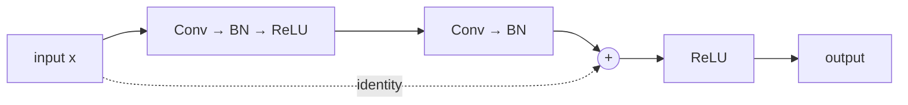

# CNN for computer vision

## Why not MLP on images

A 224×224×3 image has 150528 pixels. An MLP first layer with 1024 neurons would have 150M parameters right there. Inefficient.

Moreover, MLP does not exploit **two properties** of images:

1. **Locality**: nearby pixels are correlated (an eye is a cluster of dark nearby pixels).
2. **Translation invariance**: a cat on the left is still a cat on the right.

**CNNs** (LeCun, 1989) exploit both.

## Convolution

A small filter (kernel) (e.g.: 3×3 = 9 weights) slides over the image producing a **feature map**:

<div class="chart"><svg viewBox="0 0 400 180" xmlns="http://www.w3.org/2000/svg">
<g transform="translate(20,20)">
  <text x="55" y="-5" fill="#8b949e" font-size="11" text-anchor="middle">input 5×5</text>
  <g font-family="monospace" font-size="11" fill="#c9d1d9">
    <rect x="10" y="10" width="100" height="100" fill="none" stroke="#444"/>
    <line x1="30" y1="10" x2="30" y2="110" stroke="#333"/>
    <line x1="50" y1="10" x2="50" y2="110" stroke="#333"/>
    <line x1="70" y1="10" x2="70" y2="110" stroke="#333"/>
    <line x1="90" y1="10" x2="90" y2="110" stroke="#333"/>
    <line x1="10" y1="30" x2="110" y2="30" stroke="#333"/>
    <line x1="10" y1="50" x2="110" y2="50" stroke="#333"/>
    <line x1="10" y1="70" x2="110" y2="70" stroke="#333"/>
    <line x1="10" y1="90" x2="110" y2="90" stroke="#333"/>
    <rect x="10" y="10" width="60" height="60" fill="rgba(255,179,71,0.18)" stroke="#ffb347" stroke-width="2"/>
  </g>
</g>
<g transform="translate(170,30)">
  <text x="35" y="-5" fill="#8b949e" font-size="11" text-anchor="middle">kernel 3×3</text>
  <rect x="10" y="10" width="60" height="60" fill="rgba(122,162,255,0.15)" stroke="#7aa2ff" stroke-width="2"/>
  <line x1="30" y1="10" x2="30" y2="70" stroke="#333"/>
  <line x1="50" y1="10" x2="50" y2="70" stroke="#333"/>
  <line x1="10" y1="30" x2="70" y2="30" stroke="#333"/>
  <line x1="10" y1="50" x2="70" y2="50" stroke="#333"/>
</g>
<text x="260" y="80" fill="#8b949e" font-size="14">→</text>
<g transform="translate(290,30)">
  <text x="40" y="-5" fill="#8b949e" font-size="11" text-anchor="middle">output 3×3</text>
  <rect x="10" y="10" width="60" height="60" fill="rgba(94,226,196,0.15)" stroke="#5ee2c4" stroke-width="2"/>
  <line x1="30" y1="10" x2="30" y2="70" stroke="#333"/>
  <line x1="50" y1="10" x2="50" y2="70" stroke="#333"/>
  <line x1="10" y1="30" x2="70" y2="30" stroke="#333"/>
  <line x1="10" y1="50" x2="70" y2="50" stroke="#333"/>
</g>
</svg><div class="chart-caption">3×3 kernel slides over the 5×5 input (stride 1, no padding) producing a 3×3 output.</div></div>

Formally:

$$y_{i,j} = \sum_{u,v} x_{i+u, j+v} \cdot w_{u,v} + b$$

Advantages:
- **Parameter sharing**: the same kernel everywhere (vs fully connected MLP).
- **Local connectivity**: each output depends only on a small window.
- **Spatial invariance**: changing the position of an object does not change the kernel.

### Parameters of a conv layer

- **kernel_size** (e.g.: 3, 5, 7)
- **stride** (default 1): how far the kernel moves
- **padding** (e.g.: 'same'): to maintain output size
- **dilation** (default 1): "jumps" in the kernel
- **groups**: channel splitting (group conv, depthwise conv)
- **in_channels / out_channels**: input/output channels

```python
import torch.nn as nn
conv = nn.Conv2d(in_channels=3, out_channels=64, kernel_size=3, padding=1)
# input (B, 3, H, W) → output (B, 64, H, W)
```

### Receptive field

How much of the original input a neuron in the last layer "sees". It grows stack-by-stack: 2 conv 3×3 = receptive field 5×5. ResNet-50's final layer has a receptive field of ~500×500 (larger than the input!).

## Pooling

Reduces spatial resolution (and therefore computation) and introduces invariance to small shifts.

- **Max pooling**: takes the max within a window (e.g.: 2×2).
- **Average pooling**: takes the average.
- **Global average pooling**: average over the entire map.

```python
nn.MaxPool2d(kernel_size=2, stride=2)
nn.AdaptiveAvgPool2d((1, 1))   # global
```

> Modern architectures (ResNet, EfficientNet) use little explicit pooling, preferring strided convolutions.

## Typical architecture


Mantra: depth increases, spatial resolution decreases.

## Iconic architectures

### LeNet-5 (1998, LeCun)

First working CNN. 7 layers, MNIST digits.

### AlexNet (2012, Krizhevsky)

Won ImageNet with 60M parameters, ReLU, dropout. The deep learning "boom" moment.

### VGG (2014)

Standardizes: only 3×3 conv, deep blocks. VGG-16 / VGG-19. Heavy (138M parameters).

### Inception / GoogLeNet (2014)

Inception modules: parallel convolutions at various scales.

### ResNet (2015, He et al.)

Key idea: **skip connection**. Allows very deep networks (50, 101, 152 layers) without vanishing gradient.



The "trick": $y = F(x) + x$. If $F(x) \approx 0$, the model learns the identity — nothing to learn, nothing to break. Additional layers can only help.

```python
import torchvision.models as models
resnet50 = models.resnet50(weights='IMAGENET1K_V2')
```

### EfficientNet (2019)

Scales width, depth, and resolution together with compound scaling. Optimal accuracy/FLOPs trade-off.

### Vision Transformer (ViT, 2020)

Transfers the Transformer architecture to images. Splits the image into patches, treats them as a sequence. Current state of the art alongside modern CNNs.

### Hybrid / 2024-2026

ConvNeXt (2022), Swin Transformer, EVA-02, DINOv2: convolutions and attention blend together. The "CNN vs Transformer" distinction has blurred.

## Transfer learning: the superpower

Training a CNN from scratch on ImageNet takes weeks of GPU time. **You never do this**. Instead:

1. Take a pre-trained network (ResNet, ConvNeXt, ViT).
2. Replace the last layer with one for your number of classes.
3. Fine-tuning: train only the last layer (fast) or the entire network (slower, better accuracy).

```python
import torchvision.models as models, torch.nn as nn
m = models.resnet50(weights='IMAGENET1K_V2')
# freeze everything except the last layer
for p in m.parameters():
    p.requires_grad = False
m.fc = nn.Linear(m.fc.in_features, num_classes)   # new trainable head
```

For full fine-tuning, enable everything and use a small learning rate (1e-4 or 1e-5).

> **timm** (`pip install timm`) is Ross Wightman's library with hundreds of pre-trained models, often better than the base torchvision versions.

```python
import timm
m = timm.create_model('convnext_base.fb_in22k_ft_in1k', pretrained=True, num_classes=10)
```

## Data augmentation

Critical for generalization on few images:

```python
from torchvision import transforms

train_tf = transforms.Compose([
    transforms.RandomResizedCrop(224),
    transforms.RandomHorizontalFlip(),
    transforms.ColorJitter(0.2, 0.2, 0.2),
    transforms.RandAugment(),
    transforms.ToTensor(),
    transforms.Normalize(mean=[0.485, 0.456, 0.406],
                         std=[0.229, 0.224, 0.225]),
])
val_tf = transforms.Compose([
    transforms.Resize(256),
    transforms.CenterCrop(224),
    transforms.ToTensor(),
    transforms.Normalize(mean=[0.485, 0.456, 0.406],
                         std=[0.229, 0.224, 0.225]),
])
```

Advanced techniques: **Mixup**, **CutMix**, **AugMix**.

## Typical tasks

| Task | Loss | Typical architecture |
|---|---|---|
| Classification | CrossEntropy | ResNet, EfficientNet, ViT |
| Detection | Smooth L1 + Classif. | YOLO, Faster R-CNN, DETR |
| Segmentation | Dice + CE | U-Net, DeepLab, Mask2Former |
| OCR | CTC / sequence | CRNN, Transformer OCR |
| Self-supervised | Contrastive / mask | DINO, MAE, SimCLR |

## Exercises

<details>
<summary>Exercise 1 — Conv2d by hand</summary>

Implement 2D convolution without PyTorch:

```python
import numpy as np
def conv2d(x, k):
    h, w = x.shape
    kh, kw = k.shape
    out_h, out_w = h - kh + 1, w - kw + 1
    out = np.zeros((out_h, out_w))
    for i in range(out_h):
        for j in range(out_w):
            out[i, j] = (x[i:i+kh, j:j+kw] * k).sum()
    return out

x = np.arange(25).reshape(5, 5).astype(float)
k = np.array([[0, -1, 0], [-1, 4, -1], [0, -1, 0]])   # Laplacian: edge detect
print(conv2d(x, k))
```
</details>

<details>
<summary>Exercise 2 — CIFAR-10 with ResNet</summary>

```python
import torch, torch.nn as nn
from torchvision import datasets, transforms, models
from torch.utils.data import DataLoader

device = 'cuda' if torch.cuda.is_available() else 'cpu'

tf = transforms.Compose([
    transforms.Resize(64),
    transforms.ToTensor(),
    transforms.Normalize((0.5,)*3, (0.5,)*3),
])
tr = datasets.CIFAR10('.', train=True, download=True, transform=tf)
te = datasets.CIFAR10('.', train=False, transform=tf)
trl = DataLoader(tr, batch_size=128, shuffle=True, num_workers=4)
tel = DataLoader(te, batch_size=256, num_workers=4)

m = models.resnet18(weights=None, num_classes=10).to(device)
opt = torch.optim.AdamW(m.parameters(), lr=1e-3)
loss_fn = nn.CrossEntropyLoss()

for e in range(5):
    m.train()
    for x, y in trl:
        x, y = x.to(device), y.to(device)
        opt.zero_grad()
        loss_fn(m(x), y).backward(); opt.step()
    m.eval()
    with torch.no_grad():
        c = sum((m(x.to(device)).argmax(1) == y.to(device)).sum().item() for x, y in tel)
    print(f"epoch {e+1}: {c/len(te):.3f}")
```
</details>

<details>
<summary>Exercise 3 — Transfer learning on a custom dataset</summary>

Load a pre-trained ResNet classifier, replace the last layer for N classes of your dataset, fine-tune everything with a low learning rate:

```python
m = models.resnet50(weights='IMAGENET1K_V2')
m.fc = nn.Linear(m.fc.in_features, n_classes)
opt = torch.optim.AdamW([
    {'params': [p for n,p in m.named_parameters() if 'fc' not in n], 'lr': 1e-4},
    {'params': m.fc.parameters(), 'lr': 1e-3},
])
```

Higher learning rate on the last layer (needs to adapt to the new task), lower on the pre-trained layers.
</details>

<details>
<summary>Exercise 4 — Visualize CNN filters</summary>

```python
import matplotlib.pyplot as plt
filters = m.conv1.weight.data    # (64, 3, 7, 7) for ResNet
filters = (filters - filters.min()) / (filters.max() - filters.min())
fig, ax = plt.subplots(8, 8, figsize=(8, 8))
for i in range(64):
    ax[i//8][i%8].imshow(filters[i].permute(1, 2, 0))
    ax[i//8][i%8].axis('off')
```

The first layers learn "edge detector" and "color blob" filters. The deeper layers are more abstract.
</details>

## Key takeaways

- Conv = local filters with parameter sharing → well-suited for images.
- ResNet with skip connections = modern baseline.
- Transfer learning > training from scratch 99% of the time.
- Augmentation is essential.
- timm is your friend.
- Vision Transformer is also worth considering.

Next: RNN, LSTM, Transformer for sequences.
