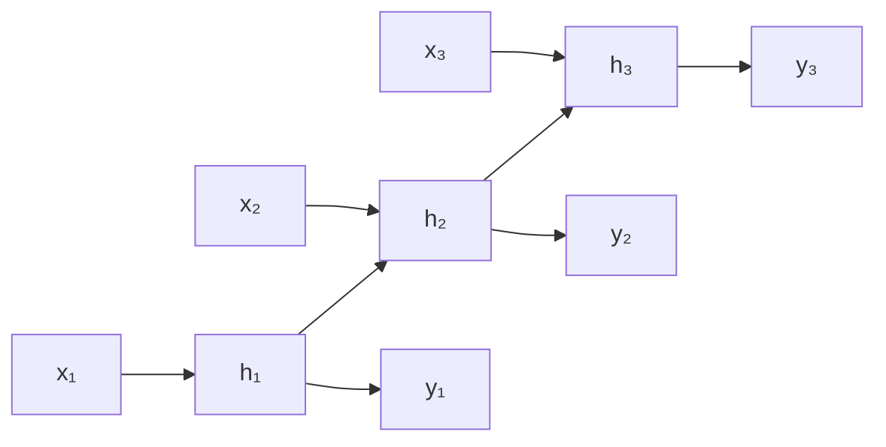

# RNN, LSTM, GRU for sequences

## What changes with sequences

Text, audio, time series, DNA: data where **order matters**. An MLP/CNN has no memory of the past. RNNs do.

## Basic RNN

At each step $t$, take input $x_t$ and previous state $h_{t-1}$, produce new state $h_t$ and (optionally) output $y_t$:

$$h_t = \tanh(W_h h_{t-1} + W_x x_t + b)$$
$$y_t = W_y h_t + b_y$$



Weights $W_h, W_x$ are shared across all timesteps (parameter sharing in time).

## Types of tasks with RNN

- **many-to-one**: sentence classification → category.
- **one-to-many**: image captioning, music generation.
- **many-to-many same length**: POS tagging.
- **many-to-many encoder-decoder**: translation, summarization.

## The vanishing gradient problem

Backprop through T timesteps multiplies T times the gradients via the chain rule:

$$\frac{\partial L}{\partial h_0} = \prod_{t=1}^T \frac{\partial h_t}{\partial h_{t-1}}$$

With tanh the derivatives are $\leq 1$ → the product vanishes exponentially. The basic RNN **cannot learn long-range dependencies** (beyond ~10 steps).

## LSTM (Long Short-Term Memory, 1997)

Hochreiter & Schmidhuber introduce a memory state $c_t$ with **gates** that decide what to remember and what to discard.

The 4 equations at its core:

$$f_t = \sigma(W_f [h_{t-1}, x_t] + b_f) \quad \text{forget gate}$$
$$i_t = \sigma(W_i [h_{t-1}, x_t] + b_i) \quad \text{input gate}$$
$$\tilde{c}_t = \tanh(W_c [h_{t-1}, x_t] + b_c) \quad \text{cell candidate}$$
$$o_t = \sigma(W_o [h_{t-1}, x_t] + b_o) \quad \text{output gate}$$

And the 2 update equations:

$$c_t = f_t \odot c_{t-1} + i_t \odot \tilde{c}_t$$
$$h_t = o_t \odot \tanh(c_t)$$

The key point: $c_t$ is a **sum**, not a product, of the previous cell. No vanishing for the memory cell.

```python
import torch.nn as nn
lstm = nn.LSTM(input_size=64, hidden_size=128, num_layers=2,
               batch_first=True, dropout=0.2, bidirectional=False)
x = torch.randn(32, 50, 64)         # (batch, seq, features)
out, (h, c) = lstm(x)
# out: (32, 50, 128)
# h, c: (num_layers, batch, hidden)
```

## GRU (Gated Recurrent Unit, 2014)

Simpler version of LSTM, two gates instead of three:

$$z_t = \sigma(W_z [h_{t-1}, x_t])\quad \text{update gate}$$
$$r_t = \sigma(W_r [h_{t-1}, x_t])\quad \text{reset gate}$$
$$\tilde{h}_t = \tanh(W [r_t \odot h_{t-1}, x_t])$$
$$h_t = (1 - z_t) \odot h_{t-1} + z_t \odot \tilde{h}_t$$

Fewer parameters than LSTM, often similar performance.

```python
gru = nn.GRU(input_size=64, hidden_size=128, batch_first=True)
```

## Bidirectional

Process the sequence forward **and** backward, concatenating the states:

```python
bilstm = nn.LSTM(64, 128, bidirectional=True, batch_first=True)
out, _ = bilstm(x)
# out: (32, 50, 256)   # 128 forward + 128 backward
```

Better for non-causal tasks (POS tagging, NER). Not for generation (text, time series) — the "future" cannot be seen.

## Padding and packing

Sequences have variable length. They are **padded** to the same length in the batch, but **packed** to avoid wasting computation:

```python
from torch.nn.utils.rnn import pad_sequence, pack_padded_sequence, pad_packed_sequence

seqs = [torch.randn(l, 64) for l in [10, 20, 15]]
padded = pad_sequence(seqs, batch_first=True)   # (3, 20, 64)
lens = torch.tensor([10, 20, 15])

packed = pack_padded_sequence(padded, lens, batch_first=True, enforce_sorted=False)
out_packed, _ = lstm(packed)
out, _ = pad_packed_sequence(out_packed, batch_first=True)
```

## Example: sentiment classification

```python
import torch, torch.nn as nn

class TextClassifier(nn.Module):
    def __init__(self, vocab, emb=128, hidden=256, n_classes=2):
        super().__init__()
        self.emb = nn.Embedding(vocab, emb, padding_idx=0)
        self.rnn = nn.LSTM(emb, hidden, num_layers=2, dropout=0.3,
                           batch_first=True, bidirectional=True)
        self.fc = nn.Linear(hidden*2, n_classes)

    def forward(self, x, lengths):
        # x: (B, T) int
        e = self.emb(x)
        packed = nn.utils.rnn.pack_padded_sequence(
            e, lengths.cpu(), batch_first=True, enforce_sorted=False)
        _, (h, _) = self.rnn(packed)
        # h: (num_layers*2, B, hidden) — take the final bi-directional states of the last layer
        h_final = torch.cat([h[-2], h[-1]], dim=1)  # (B, hidden*2)
        return self.fc(h_final)
```

## Intrinsic limitations

- **Sequential computation**: not parallelizable on GPU like CNN/Transformer.
- **Very long dependencies**: even LSTM struggles beyond ~500 timesteps.
- **Single vector bottleneck**: in encoder-decoder, the entire history is compressed into one $h$.

These limitations led to **attention** and then to the **Transformer**.

## When to still use RNN/LSTM in 2026

- **Real-time streaming inference** (1 step at a time, no batch).
- **Small models** on edge devices (Transformer is memory-hungry).
- **Traditional time series** where the pattern is short.
- **Biological sequences** when the size is modest.

For almost everything else: Transformer.

## Exercises

<details>
<summary>Exercise 1 — RNN from scratch in NumPy</summary>

```python
import numpy as np
rng = np.random.default_rng(0)
def relu(x): return np.maximum(0, x)

T, d_in, d_h = 20, 5, 16
W_x = rng.standard_normal((d_in, d_h)) * 0.1
W_h = rng.standard_normal((d_h, d_h)) * 0.1
b = np.zeros(d_h)
x_seq = rng.standard_normal((T, d_in))
h = np.zeros(d_h)
for t in range(T):
    h = np.tanh(x_seq[t] @ W_x + h @ W_h + b)
print(h)
```

Extension: also implement the output and manual backprop (lengthy, but instructive).
</details>

<details>
<summary>Exercise 2 — Sentiment IMDB with LSTM</summary>

Use torchtext or HuggingFace for IMDB. Model: 100D embedding + biLSTM 128 + linear. Target: F1 ≥ 0.85.

```python
# pseudo:
from datasets import load_dataset
ds = load_dataset('imdb')
# tokenize, build vocab, batch, train
```

Sentiment IMDB is the "Hello World" of NLP.
</details>

<details>
<summary>Exercise 3 — Time series forecasting</summary>

Predict the next value of a time series (e.g.: airline passengers) using an LSTM:

```python
import torch
import torch.nn as nn
import numpy as np

# load Airpassengers or simulated
y = np.cos(np.linspace(0, 30, 300)) + np.random.normal(0, 0.1, 300)

# create (X, y) with window
def windows(y, w=12):
    X, t = [], []
    for i in range(len(y)-w):
        X.append(y[i:i+w]); t.append(y[i+w])
    return np.array(X).reshape(-1, w, 1), np.array(t)

X, t = windows(y)
X = torch.tensor(X, dtype=torch.float32)
t = torch.tensor(t, dtype=torch.float32)

class M(nn.Module):
    def __init__(self):
        super().__init__()
        self.lstm = nn.LSTM(1, 32, batch_first=True)
        self.fc = nn.Linear(32, 1)
    def forward(self, x):
        out, _ = self.lstm(x)
        return self.fc(out[:, -1]).squeeze()

m = M()
opt = torch.optim.AdamW(m.parameters(), lr=1e-2)
for e in range(50):
    pred = m(X)
    loss = ((pred - t)**2).mean()
    opt.zero_grad(); loss.backward(); opt.step()
    if e%10==0: print(e, loss.item())
```
</details>

## Key takeaways

- Basic RNN: vanishing gradient, max ~10 steps.
- LSTM/GRU: gating solves the vanishing, handles ~100-500 steps.
- Bidirectional for non-causal tasks, standard for generation.
- Padding + packing for batches with variable-length sequences.
- 2026: Transformer has almost displaced RNN, but RNN survives for streaming and edge.

Next: Transformer and attention.
