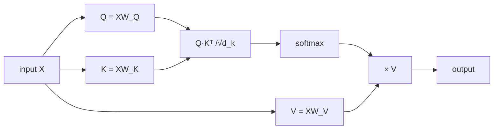
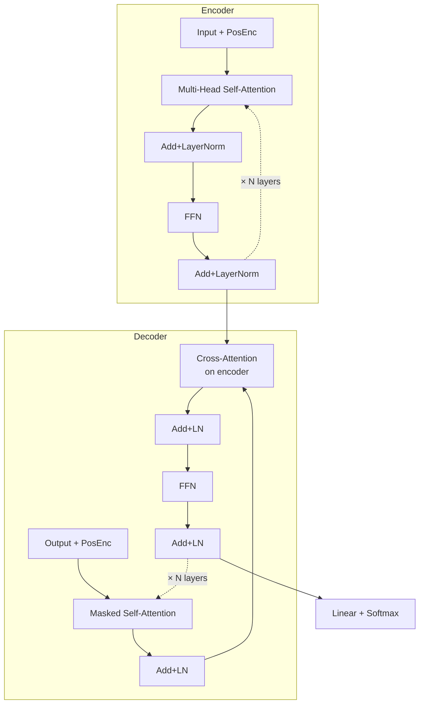

# Transformer and attention

## The "Attention is all you need" moment (Vaswani et al., 2017)

Transformers have revolutionized deep learning. Everything we call "AI" today — ChatGPT, Claude, DALL·E, Stable Diffusion, Whisper — is based on Transformers.

The central idea: **recurrence is not needed**. With the right mechanism (attention), a sequence can be processed entirely in parallel.

## Scaled dot-product attention

For each element in the sequence, the question is: "which other elements should I focus on?".

Three projections of the input:

$$Q = X W_Q \quad K = X W_K \quad V = X W_V$$

where $X \in \mathbb{R}^{n \times d}$ and $W_Q, W_K, W_V \in \mathbb{R}^{d \times d_k}$.

Attention:

$$\text{Attention}(Q, K, V) = \text{softmax}\left(\frac{Q K^T}{\sqrt{d_k}}\right) V$$

**Interpretation**:

- $Q K^T \in \mathbb{R}^{n \times n}$: dot product of each query with each key → "attention" scores.
- $\sqrt{d_k}$: normalization that prevents softmax from saturating.
- softmax → probability distribution over all elements.
- multiply by $V$: weighted sum of the values.



```python
import torch, math
import torch.nn.functional as F

def attention(Q, K, V):
    d_k = Q.size(-1)
    scores = Q @ K.transpose(-2, -1) / math.sqrt(d_k)
    weights = F.softmax(scores, dim=-1)
    return weights @ V
```

### Attention illustrated on a sentence

Sentence: "the cat eats". 3 tokens. Each token looks at the others and asks "how relevant am I to *me*?". The result is a $3 \times 3$ matrix of **attention weights** (rows = "who is looking", columns = "who is being looked at"):

<div class="chart"><svg viewBox="0 0 460 220" xmlns="http://www.w3.org/2000/svg">
<text x="230" y="14" fill="#7aa2ff" font-size="12" text-anchor="middle">Attention matrix (output of softmax(QKᵀ/√d))</text>

<text x="60" y="50" fill="#8b949e" font-size="11">→ the</text>
<text x="60" y="100" fill="#8b949e" font-size="11">→ cat</text>
<text x="60" y="150" fill="#8b949e" font-size="11">→ eats</text>

<text x="130" y="30" fill="#8b949e" font-size="11" text-anchor="middle">the</text>
<text x="220" y="30" fill="#8b949e" font-size="11" text-anchor="middle">cat</text>
<text x="310" y="30" fill="#8b949e" font-size="11" text-anchor="middle">eats</text>

<rect x="100" y="40" width="60" height="20" fill="rgba(122,162,255,0.85)"/>
<rect x="190" y="40" width="60" height="20" fill="rgba(122,162,255,0.10)"/>
<rect x="280" y="40" width="60" height="20" fill="rgba(122,162,255,0.05)"/>
<text x="130" y="55" fill="#fff" font-size="10" text-anchor="middle">0.85</text>
<text x="220" y="55" fill="#7aa2ff" font-size="10" text-anchor="middle">0.10</text>
<text x="310" y="55" fill="#7aa2ff" font-size="10" text-anchor="middle">0.05</text>

<rect x="100" y="90" width="60" height="20" fill="rgba(122,162,255,0.15)"/>
<rect x="190" y="90" width="60" height="20" fill="rgba(122,162,255,0.65)"/>
<rect x="280" y="90" width="60" height="20" fill="rgba(122,162,255,0.20)"/>
<text x="130" y="105" fill="#7aa2ff" font-size="10" text-anchor="middle">0.15</text>
<text x="220" y="105" fill="#fff" font-size="10" text-anchor="middle">0.65</text>
<text x="310" y="105" fill="#7aa2ff" font-size="10" text-anchor="middle">0.20</text>

<rect x="100" y="140" width="60" height="20" fill="rgba(122,162,255,0.05)"/>
<rect x="190" y="140" width="60" height="20" fill="rgba(122,162,255,0.45)"/>
<rect x="280" y="140" width="60" height="20" fill="rgba(122,162,255,0.50)"/>
<text x="130" y="155" fill="#7aa2ff" font-size="10" text-anchor="middle">0.05</text>
<text x="220" y="155" fill="#fff" font-size="10" text-anchor="middle">0.45</text>
<text x="310" y="155" fill="#fff" font-size="10" text-anchor="middle">0.50</text>

<text x="230" y="195" fill="#8b949e" font-size="11" text-anchor="middle">each row sums to 1 (softmax)</text>
<text x="230" y="210" fill="#ffb347" font-size="11" text-anchor="middle">"eats" attends strongly to "cat" (who eats) and itself</text>
</svg><div class="chart-caption">Self-attention: a weight matrix that says "how much each token attends to every other".</div></div>

The output for the token "eats" will be:

$$\text{out}_\text{eats} = 0.05 \cdot V_\text{the} + 0.45 \cdot V_\text{cat} + 0.50 \cdot V_\text{eats}$$

where $V_i$ are the "value vectors" of the tokens. The model learns $W_Q, W_K, W_V$ so that these weighted sums produce representations useful for the final task (classification, generation, etc.).

> **Why it's brilliant**: the matrix is computed in **a single matrix multiplication** $QK^T$, parallelizable on GPU. The RNN had to do this in 3 sequential steps. Hence the 2017 revolution.

## Multi-head attention

A single attention head has limited capacity. The input is **projected into multiple independent "heads"**, each learning different relationships:

$$\text{MultiHead}(Q,K,V) = \text{Concat}(\text{head}_1, \dots, \text{head}_h) W^O$$

with each $\text{head}_i = \text{Attention}(QW_i^Q, KW_i^K, VW_i^V)$.

```python
mha = torch.nn.MultiheadAttention(embed_dim=512, num_heads=8, batch_first=True)
out, attn = mha(query, key, value)
```

## Positions: positional encoding

Attention is **permutation-invariant**: without positional information, "the dog eats" and "eats the dog" are equivalent. Positional encodings are added to the embeddings:

**Sinusoidal** (original Transformer):

$$PE_{pos, 2i} = \sin(pos / 10000^{2i/d}), \quad PE_{pos, 2i+1} = \cos(pos / 10000^{2i/d})$$

**Learned**: a learned positional embedding matrix.

**RoPE** (Rotary Position Embedding, GPT-NeoX, Llama): rotates Q and K in space based on position. Has become the modern standard.

## The full architecture: Transformer Encoder/Decoder



Transformer "encoder" block:

```python
class TransformerBlock(nn.Module):
    def __init__(self, d=512, h=8, ff=2048, drop=0.1):
        super().__init__()
        self.attn = nn.MultiheadAttention(d, h, dropout=drop, batch_first=True)
        self.norm1 = nn.LayerNorm(d)
        self.ffn = nn.Sequential(nn.Linear(d, ff), nn.GELU(), nn.Linear(ff, d))
        self.norm2 = nn.LayerNorm(d)
        self.drop = nn.Dropout(drop)

    def forward(self, x, mask=None):
        a, _ = self.attn(x, x, x, attn_mask=mask)
        x = self.norm1(x + self.drop(a))           # residual + LN
        f = self.ffn(x)
        x = self.norm2(x + self.drop(f))
        return x
```

> Note: **residual connection** + **LayerNorm** everywhere. Same pattern as ResNets.

## Famous variants

| Model | Type | Year | Notes |
|---|---|---|---|
| **BERT** | Encoder only | 2018 | Masked LM, bidirectional, embeddings |
| **GPT-2 / GPT-3** | Decoder only | 2019/2020 | Autoregressive, generation |
| **T5** | Encoder-Decoder | 2019 | Everything as text-to-text |
| **ViT** | Encoder only | 2020 | For images (patch tokens) |
| **GPT-4 / Claude / Gemini** | Decoder only scaled | 2023+ | State-of-the-art LLM |
| **Whisper** | Encoder-Decoder | 2022 | Speech-to-text |

## Encoder-only (BERT-like)

Used for: classification, embeddings, NER, sentence similarity.

Pre-training: **Masked Language Modeling** — mask 15% of tokens, predict them.

## Decoder-only (GPT-like)

Used for: generation, completion, instruction-following.

Pre-training: **Next Token Prediction** — autoregressive.

Attention is "masked" to prevent looking at future tokens during training.

## Encoder-Decoder (T5, BART)

Used for: translation, summarization, question answering.

## Computational complexity

Attention is $O(n^2 d)$ where $n$ is the sequence length. Quadratic → explodes with long sequences.

Modern solutions (2024-2026):
- **Flash Attention**: memory and speed optimization.
- **Sparse / Local Attention**: local windows only.
- **Linear Attention**: approximations with $O(n)$ complexity.
- **State Space Models** (Mamba, S4, S6): alternative to Transformers, linear in $n$.

## HuggingFace transformers

The practical way to use pre-trained Transformers:

```bash
pip install transformers datasets
```

```python
from transformers import AutoTokenizer, AutoModel
tok = AutoTokenizer.from_pretrained("bert-base-multilingual-cased")
model = AutoModel.from_pretrained("bert-base-multilingual-cased")

inputs = tok("The dog eats.", return_tensors='pt')
out = model(**inputs)
emb = out.last_hidden_state    # (1, n_tokens, 768)
```

### Pipeline for common tasks

```python
from transformers import pipeline
sentiment = pipeline('sentiment-analysis')
sentiment("Data science is wonderful.")
# [{'label': 'POSITIVE', 'score': 0.9994}]

translator = pipeline('translation', model='Helsinki-NLP/opus-mt-it-en')
translator("Buongiorno, come stai?")
```

### Fine-tuning on a task

```python
from transformers import AutoTokenizer, AutoModelForSequenceClassification, Trainer, TrainingArguments
from datasets import load_dataset

ds = load_dataset('imdb').shuffle(seed=0)
tok = AutoTokenizer.from_pretrained("distilbert-base-uncased")
def tokenize(b): return tok(b['text'], truncation=True, max_length=256)
ds = ds.map(tokenize, batched=True)
ds.set_format('torch', columns=['input_ids','attention_mask','label'])

model = AutoModelForSequenceClassification.from_pretrained("distilbert-base-uncased", num_labels=2)

args = TrainingArguments(
    output_dir='./out', evaluation_strategy='epoch',
    per_device_train_batch_size=16, num_train_epochs=2,
    learning_rate=2e-5, fp16=True,
)
trainer = Trainer(model=model, args=args,
                  train_dataset=ds['train'].select(range(5000)),
                  eval_dataset=ds['test'].select(range(1000)))
trainer.train()
```

## Exercises

<details>
<summary>Exercise 1 — Manual attention</summary>

```python
import torch
import torch.nn.functional as F

# 3 tokens, dimension 4
X = torch.tensor([[1.,0,1,0],[0,1,0,1],[1,1,0,0]])
W_q = torch.eye(4); W_k = torch.eye(4); W_v = torch.eye(4)

Q = X @ W_q; K = X @ W_k; V = X @ W_v
scores = Q @ K.T / 2.0    # √4 = 2
weights = F.softmax(scores, dim=-1)
print(weights)
output = weights @ V
print(output)
```

Exercise: for which pairs is attention highest? Verify intuitively.
</details>

<details>
<summary>Exercise 2 — Sentence embeddings</summary>

```python
from sentence_transformers import SentenceTransformer
model = SentenceTransformer('paraphrase-multilingual-MiniLM-L12-v2')
sents = ["The cat sleeps.", "A feline rests.", "I eat an apple."]
emb = model.encode(sents)
# cosine similarity
import numpy as np
def cos(a, b): return a @ b / (np.linalg.norm(a)*np.linalg.norm(b))
print(cos(emb[0], emb[1]))   # high
print(cos(emb[0], emb[2]))   # low
```
</details>

<details>
<summary>Exercise 3 — Mini-GPT from scratch</summary>

Implement a small decoder-only Transformer for char-level LM on any text. Karpathy has a video "Let's build GPT" (1h, on YouTube, free) — it's the definitive exercise. ~200 lines.

Reference code: github.com/karpathy/nanoGPT.
</details>

<details>
<summary>Exercise 4 — Q&A with a pre-trained Transformer</summary>

```python
from transformers import pipeline
qa = pipeline('question-answering', model='deepset/xlm-roberta-large-squad2')
context = "Transformers are a deep learning architecture introduced in 2017 by Vaswani et al."
qa(question="When were Transformers introduced?", context=context)
# {'answer': '2017', 'score': 0.9...}
```
</details>

## Key takeaways

- Attention = "each token attends to every other", weighted sum.
- Multi-head = multiple attention "lenses" in parallel.
- Positional encoding is necessary (attention is permutation-invariant).
- Encoder-only (BERT), decoder-only (GPT), encoder-decoder (T5).
- HuggingFace is the go-to.
- Long sequences → Flash Attention, sparse models, state-space alternatives.

Next: applied NLP — LLMs, retrieval, modern fine-tuning.
