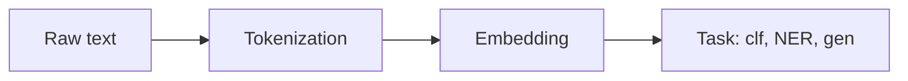
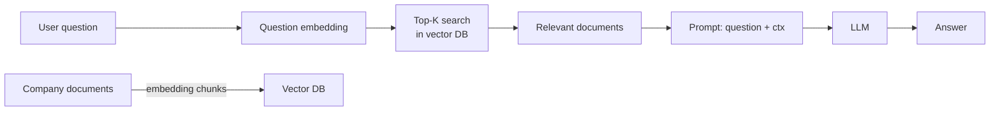

# NLP: from text mining to LLMs

## Classic NLP pipeline → modern pipeline



In 2010 you'd do: TF-IDF + SVM. In 2018: fine-tuned BERT. In 2026: LLMs with prompts or RAG, or semantic embeddings + small classifier.

## Tokenization

Transforming text into **tokens** (words, sub-words, characters):

| Type | Example "tokenization" | Notes |
|---|---|---|
| Word | ["tokenization"] | simple, large vocab, OOV |
| Char | ["t","o","k",...] | tiny vocab, long sequences |
| **BPE** (Byte Pair Encoding) | ["token","ization"] | used in GPT |
| **WordPiece** | ["token","##ization"] | BERT |
| **SentencePiece** | unicode-aware | T5, LLama |

```python
from transformers import AutoTokenizer
tok = AutoTokenizer.from_pretrained("bert-base-multilingual-cased")
print(tok.tokenize("Tokenizzazione"))
# ['Token', '##izza', '##zione']
```

Sub-word tokenizers solve the **OOV** (out-of-vocabulary) problem.

## State of the art 2026: what to use for what

| Task | Recommended approach |
|---|---|
| Sentiment | LLM zero-shot or fine-tune small BERT |
| NER | spaCy + fine-tune transformer (XLM-RoBERTa) |
| Topic modeling | BERTopic (embedding + UMAP + HDBSCAN) |
| Text classification | embedding + logistic, or LLM with few-shot |
| Semantic search | sentence-transformers + vector DB |
| Q&A on documents | RAG with LLM + vector store |
| Generation/Summarization | LLM (Claude, GPT, Llama, Mistral) |
| Translation | NLLB, M2M-100, or LLM |

## Semantic embeddings

Models that map sentences → dense vectors where similar sentences are close together. The reference library:

```python
from sentence_transformers import SentenceTransformer
m = SentenceTransformer('paraphrase-multilingual-MiniLM-L12-v2')
emb = m.encode([
    "Il gatto dorme sul divano",
    "Un felino riposa sul sofà",
    "Il treno arriva alle 7"
])
# (3, 384) — similarity(0, 1) high, (0, 2) low
```

More powerful models (2024-2026): `BAAI/bge-large`, `intfloat/multilingual-e5-large`, `Alibaba-NLP/gte-large`.

## Vector database

To search embeddings across millions of documents, you need a **vector DB**:

- **FAISS** (Meta): in-memory, super fast. Default for small/medium projects.
- **Chroma**: easy, local.
- **Qdrant**: open source, scalable.
- **Pinecone, Weaviate, Milvus**: managed/cloud.
- **pgvector**: Postgres extension if you already have Postgres.

```python
import faiss
import numpy as np
index = faiss.IndexFlatIP(384)         # inner product (= cosine if normalized)
index.add(emb.astype('float32'))
D, I = index.search(query_emb.astype('float32'), k=5)
```

## RAG — Retrieval Augmented Generation

The most important pattern of 2024-2026 for LLM applications on your own data:



Base code (pseudocode):

```python
chunks = chunk_documents(docs, size=500, overlap=50)
chunk_embeddings = embedder.encode(chunks)
index.add(chunk_embeddings)

def rag_query(question):
    q_emb = embedder.encode([question])
    _, idx = index.search(q_emb, k=5)
    context = "\n".join(chunks[i] for i in idx[0])
    prompt = f"Context:\n{context}\n\nQuestion: {question}\nAnswer:"
    return llm(prompt)
```

> Variations: hybrid search (combines vector + BM25 keyword), reranker (cross-encoder to reorder top-K), query rewriting (reformulates the question before retrieval).

## Prompt engineering

With LLMs, "writing well" the request is half the work:

### Essential techniques

1. **Be specific**: "Summarize this text in 3 bullet points" > "Summarize".
2. **Examples (few-shot)**: show 2-3 examples first.
3. **Chain-of-thought (CoT)**: "Think step by step".
4. **Structured output**: ask for JSON, YAML, markdown.
5. **Roles**: "You are an expert in X. Answer accordingly."

### Few-shot example

```
Classify the sentiment:

Text: "I love this product!"
Sentiment: positive

Text: "It doesn't work at all."
Sentiment: negative

Text: "{new text}"
Sentiment:
```

## LLMs in production: two families

### Commercial APIs

- **OpenAI** (GPT-4o, o1)
- **Anthropic** (Claude 4.X)
- **Google** (Gemini)
- **Mistral** (La Plateforme)

Pros: zero infrastructure, top performance.
Cons: cost, latency, vendor dependency, data leaving your perimeter.

```python
import anthropic
client = anthropic.Anthropic(api_key=...)
m = client.messages.create(
    model="claude-opus-4-7",
    max_tokens=500,
    messages=[{"role":"user","content":"Spiega cos'è il transfer learning."}]
)
print(m.content[0].text)
```

### Open / local models

- **Llama 3.x / Llama 4** (Meta)
- **Mistral / Mixtral**
- **Qwen** (Alibaba)
- **Phi** (Microsoft, small but powerful)
- **Gemma** (Google)

Serve them with: **vLLM**, **Ollama**, **llama.cpp**, **Text Generation Inference**.

```bash
ollama pull llama3.1:8b
ollama run llama3.1:8b
```

## Fine-tuning LLMs

When a generic LLM is not enough:

- **Full fine-tuning**: updates all weights. Expensive, rare for large models.
- **LoRA (Low-Rank Adaptation)**: only updates low-rank matrices added on top. Reduces trainable parameters by 100-1000×.
- **QLoRA**: LoRA + 4-bit quantization. Allows fine-tuning 7B models on a consumer GPU.

```python
from peft import LoraConfig, get_peft_model
config = LoraConfig(
    r=8, lora_alpha=16, target_modules=["q_proj","v_proj"],
    lora_dropout=0.1, bias="none", task_type="CAUSAL_LM"
)
model = get_peft_model(base_model, config)
# now train: model.print_trainable_parameters() → only ~0.5% of total
```

## NER (Named Entity Recognition)

Extracting people, places, organizations from text:

```python
import spacy
nlp = spacy.load("it_core_news_lg")
doc = nlp("Mario Rossi vive a Roma e lavora per Pirelli.")
for ent in doc.ents:
    print(ent.text, ent.label_)
# Mario Rossi PER
# Roma LOC
# Pirelli ORG
```

For better accuracy: fine-tune **XLM-RoBERTa** on annotated data with `transformers`.

## Modern topic modeling

Old approach: LDA. New: **BERTopic** (embedding + UMAP + HDBSCAN + c-TF-IDF):

```python
from bertopic import BERTopic
docs = [...]
topic_model = BERTopic(language='italian')
topics, probs = topic_model.fit_transform(docs)
topic_model.get_topic_info()
topic_model.visualize_topics()
```

## Exercises

<details>
<summary>Exercise 1 — Basic semantic search</summary>

```python
from sentence_transformers import SentenceTransformer
import numpy as np
m = SentenceTransformer('paraphrase-multilingual-MiniLM-L12-v2')

docs = ["Python è un linguaggio di programmazione",
        "Il caffè italiano è famoso nel mondo",
        "JavaScript gira nei browser",
        "L'espresso si beve in piedi al bar"]
emb = m.encode(docs)
emb = emb / np.linalg.norm(emb, axis=1, keepdims=True)

q = m.encode(["bevande tipiche"])
q = q / np.linalg.norm(q)
print(emb @ q.T)   # similarity
```
</details>

<details>
<summary>Exercise 2 — RAG on a PDF</summary>

Build a RAG on a PDF (e.g., a manual). Steps:
1. Extract text (PyPDF, pdfplumber).
2. Chunk into pieces of 500 tokens with overlap.
3. Embed with sentence-transformers.
4. Index in FAISS.
5. For each query: retrieve top-5 + call LLM.
</details>

<details>
<summary>Exercise 3 — Zero-shot classification</summary>

```python
from transformers import pipeline
clf = pipeline('zero-shot-classification', model='facebook/bart-large-mnli')
result = clf("La banca centrale ha alzato i tassi.",
             candidate_labels=['finanza', 'sport', 'cucina'])
print(result['labels'][0], result['scores'][0])
# finanza, 0.96
```

Zero-shot = no fine-tuning, ready to use out of the box.
</details>

<details>
<summary>Exercise 4 — LoRA fine-tune on a small dataset</summary>

```python
# pseudo-codice, complex setup
from peft import LoraConfig, get_peft_model, TaskType
from transformers import AutoModelForCausalLM, AutoTokenizer

model_id = "microsoft/phi-3-mini-4k-instruct"
tok = AutoTokenizer.from_pretrained(model_id)
model = AutoModelForCausalLM.from_pretrained(model_id, device_map='auto')

lora = LoraConfig(r=8, lora_alpha=16, target_modules=["q_proj","v_proj"], task_type=TaskType.CAUSAL_LM)
model = get_peft_model(model, lora)
# then: prepare dataset (instruction → output), transformers Trainer, training loop
```
</details>

## Key takeaways

- 2026: LLMs + retrieval cover 70% of NLP tasks you did manually in 2018.
- Semantic embeddings → search, classification, clustering.
- RAG is the standard pattern for LLMs on your own data.
- LoRA / QLoRA for cost-effective fine-tuning.
- For specific tasks (NER, precise classification), fine-tuning a BERT/XLM-RoBERTa is still competitive.

Next up: time series and forecasting.
