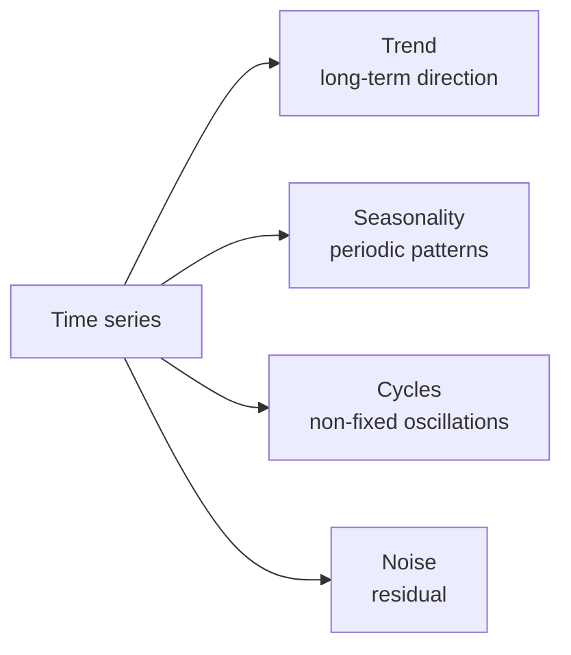
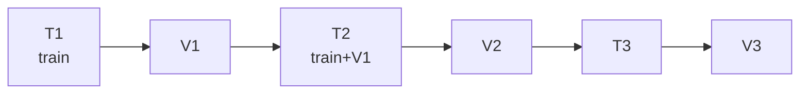

# Time series and forecasting

## What is a time series

A sequence of observations over time: $y_1, y_2, \dots, y_T$. The temporal structure breaks the iid assumption → requires dedicated tools.



## Decomposition

$$y_t = T_t + S_t + C_t + \epsilon_t$$

Additive (above) or multiplicative ($y_t = T_t \cdot S_t \cdot C_t \cdot \epsilon_t$, for increasing variance).

```python
from statsmodels.tsa.seasonal import seasonal_decompose, STL
dec = STL(y, period=12).fit()
dec.plot()
```

STL is the preferred modern decomposition (robust, handles non-linear trends).

## Stationarity

A series is **stationary** if mean, variance, and autocovariance do not depend on time. Almost all classical models (ARIMA) assume stationarity.

**Stationarity tests**:

- **Augmented Dickey-Fuller (ADF)**: H0 = "non-stationary". p<0.05 → stationary.
- **KPSS**: H0 = "stationary". Inverse.

Use both:

```python
from statsmodels.tsa.stattools import adfuller, kpss
print(adfuller(y)[1])      # ADF p-value
print(kpss(y)[1])           # KPSS p-value
```

**How to make a series stationary**:

1. **Differencing**: $y_t - y_{t-1}$.
2. **Seasonal differencing**: $y_t - y_{t-12}$ (for annual monthly data).
3. **Logarithm**: stabilizes multiplicative variance.

## Autocorrelation: ACF and PACF

**Autocorrelation** measures how much the series is correlated with itself $k$ lags back:

$$r_k = \text{Corr}(y_t, y_{t-k})$$

ACF = total correlation. PACF = "pure" correlation eliminating the effect of intermediate lags.

```python
from statsmodels.graphics.tsaplots import plot_acf, plot_pacf
plot_acf(y, lags=40); plot_pacf(y, lags=40)
```

Interpretation (for choosing ARIMA):

- ACF tail-off, PACF cuts off at lag $p$ → AR($p$).
- ACF cuts off at lag $q$, PACF tail-off → MA($q$).
- Both tail-off → ARMA.

## ARIMA

**ARIMA(p, d, q)** = AR(p) + differencing of order d + MA(q).

$$\phi(B)(1-B)^d y_t = \theta(B) \epsilon_t$$

where $B$ is the shift operator, $\phi, \theta$ polynomials.

```python
from statsmodels.tsa.arima.model import ARIMA
m = ARIMA(y, order=(2, 1, 2)).fit()
print(m.summary())
fc = m.forecast(steps=12)
```

## SARIMAX

ARIMA + seasonality + exogenous variables:

$$\text{SARIMAX}(p,d,q)(P,D,Q)_s$$

```python
from statsmodels.tsa.statespace.sarimax import SARIMAX
m = SARIMAX(y, order=(1,1,1), seasonal_order=(1,1,1,12), exog=X).fit()
```

> Use `pmdarima.auto_arima(y)` to automatically identify orders.

## Prophet (Facebook, 2017)

"Additive-type" model with trend + multiple seasonalities + holidays. Designed for business analysts:

$$y(t) = g(t) + s(t) + h(t) + \epsilon$$

```python
from prophet import Prophet
df = pd.DataFrame({'ds': dates, 'y': values})
m = Prophet(yearly_seasonality=True, weekly_seasonality=True)
m.fit(df)
future = m.make_future_dataframe(periods=365)
forecast = m.predict(future)
m.plot(forecast); m.plot_components(forecast)
```

Pros: robust, predictive intervals, handles missing data and holidays.
Cons: less accurate than modern models for complex patterns.

## Modern approach: gradient boosting

Often the **most effective** for business forecasting: transforms the problem into tabular by adding temporal features.

```python
import pandas as pd
df['lag1'] = df['y'].shift(1)
df['lag7'] = df['y'].shift(7)
df['ma7'] = df['y'].rolling(7).mean().shift(1)
df['dow'] = df['ds'].dt.dayofweek
df['month'] = df['ds'].dt.month
df['is_holiday'] = ...

# train LightGBM
import lightgbm as lgb
X = df.drop(['y','ds'], axis=1); y = df['y']
m = lgb.LGBMRegressor(n_estimators=1000, learning_rate=0.05).fit(X, y)
```

**M5 Competition** (Kaggle 2020): winning solutions used LightGBM with temporal feature engineering, not "fancy neural" models.

## Deep models for time series

| Model | Notes |
|---|---|
| **DeepAR** (Amazon) | Autoregressive RNN, probabilistic |
| **N-BEATS** (Element AI) | Backward-forward residual blocks |
| **N-HiTS** | N-BEATS with multi-scale |
| **Temporal Fusion Transformer (TFT)** | Transformer + interpretability |
| **PatchTST** | Patch-based Transformer (like ViT) |
| **TimesFM, Chronos, Moirai** | Foundation models pre-trained on billions of series |

```python
from neuralforecast import NeuralForecast
from neuralforecast.models import NBEATS, NHITS, TFT
nf = NeuralForecast(models=[NBEATS(input_size=24, h=12)], freq='M')
nf.fit(df)
preds = nf.predict()
```

## Temporal cross-validation

Never random K-fold. Use:

- **Forward chaining** (expanding window).
- **Sliding window** (rolling).

```python
from sklearn.model_selection import TimeSeriesSplit
tscv = TimeSeriesSplit(n_splits=5, gap=7)
```



## Forecasting metrics

- **MAE** / **RMSE**: scale-dependent, fine for a single series.
- **MAPE**: percentage, but explodes when $y$ is close to 0.
- **sMAPE**: symmetric variant.
- **MASE** (Mean Absolute Scaled Error): scale-independent, comparable across series.

```python
def mase(y_true, y_pred, y_train, period=1):
    naive = np.mean(np.abs(np.diff(y_train, period)))
    return np.mean(np.abs(y_true - y_pred)) / naive
```

## Baselines not to underestimate

- **Naive**: $\hat{y}_{t+1} = y_t$.
- **Seasonal naive**: $\hat{y}_{t+1} = y_{t+1-s}$.
- **Moving average**: mean of the last $k$ values.
- **Exponential smoothing (Holt-Winters)**: trend + seasonality with decay.

Baselines often beat complex models.

```python
from statsmodels.tsa.holtwinters import ExponentialSmoothing
m = ExponentialSmoothing(y, trend='add', seasonal='add', seasonal_periods=12).fit()
```

## Predictive intervals

A point forecast is almost always **insufficient**. You want an interval:

- ARIMA / Prophet: provide them naturally.
- Gradient boosting: use **quantile regression** (LightGBM `objective='quantile'`).
- Deep models: Monte Carlo dropout, ensemble, probabilistic output.

## Exercises

<details>
<summary>Exercise 1 — Decomposition</summary>

```python
import pandas as pd
import seaborn as sns
from statsmodels.tsa.seasonal import STL
df = sns.load_dataset('flights')
y = df.set_index('year')['passengers']     # unfortunately annual, try with real monthly freq
# better: download AirPassengers
```
</details>

<details>
<summary>Exercise 2 — ARIMA vs Prophet vs LightGBM</summary>

On a daily web traffic series for one year:

1. Split into train/test (last month = test).
2. Fit ARIMA(auto), Prophet, LightGBM with lag features.
3. Compare MAE, MAPE.

Typically: LightGBM > Prophet > ARIMA for complex patterns. ARIMA can win on very regular series.
</details>

<details>
<summary>Exercise 3 — Quantile forecasting</summary>

```python
import lightgbm as lgb
# train 3 models for quantiles 0.1, 0.5, 0.9
preds = {}
for q in [0.1, 0.5, 0.9]:
    m = lgb.LGBMRegressor(objective='quantile', alpha=q, n_estimators=500)
    m.fit(X_tr, y_tr)
    preds[q] = m.predict(X_te)

# plot intervals
import matplotlib.pyplot as plt
plt.plot(y_te.index, y_te, label='actual')
plt.plot(y_te.index, preds[0.5], label='median')
plt.fill_between(y_te.index, preds[0.1], preds[0.9], alpha=0.3, label='80% band')
plt.legend()
```
</details>

## Key takeaways

- Stationarity is the first check (ADF + KPSS).
- ACF/PACF guide the choice of ARIMA.
- Gradient boosting + temporal features often beats ARIMA in business problems.
- Prophet is a good simplicity/quality tradeoff for analysts.
- TimeSeriesSplit for CV, never random K-fold.
- Predictive intervals > point forecast.
- Foundation models 2024+ (Chronos, TimesFM) — worth watching but not yet a silver bullet.

Next up: MLOps — deployment, monitoring, drift.
