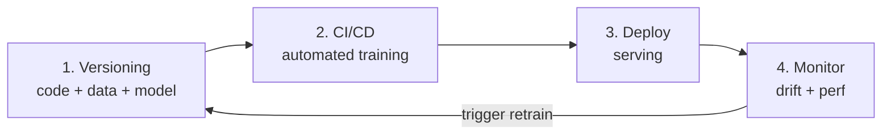
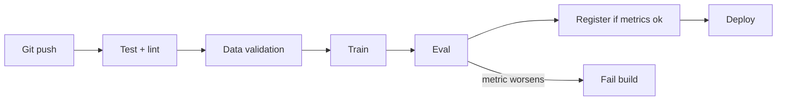
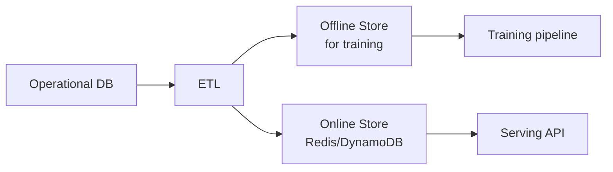

# MLOps: deployment, monitoring, drift

## What changes in production

A model in Jupyter is an experiment. In production:

- It must be **called** by other systems (API).
- It must be **reproducible** (who knows which version is running?).
- It must be **monitored** (are predictions still performing well?).
- It must be **updatable** (retraining, rollback).
- It must **scale** (1 request or 10000/sec).

90% of "data science" models never reach production. Those that do often arrive without a solid framework.

## The 4 MLOps phases



## 1. Versioning

### Code

Git. Nothing new. Every model = a commit hash.

### Data

Data is too large for git. Solutions:

- **DVC** (Data Version Control): metadata in git, data in storage (S3/GCS).
- **LakeFS**: git-like for object storage.
- **MLflow** has dataset versioning.

```bash
dvc init
dvc add data/raw/transactions.csv
git add data/raw/transactions.csv.dvc .gitignore
git commit -m "track raw data v1"
dvc push    # upload to storage
```

### Models

- **MLflow Model Registry**: versions, stages (Staging, Production, Archived).
- **Weights & Biases (W&B)**: experiment tracking + registry.
- **Neptune.ai, ClearML**: alternatives.

```python
import mlflow
mlflow.set_experiment("churn_model")
with mlflow.start_run():
    mlflow.log_params({'C': 0.5, 'penalty': 'l2'})
    mlflow.log_metric('auc', 0.83)
    mlflow.sklearn.log_model(model, "model")
```

## 2. CI/CD for ML

An ML pipeline is:



Tools:
- **GitHub Actions / GitLab CI** for orchestration.
- **Kubeflow / Argo / Airflow** for complex pipelines.
- **DAG-orchestrated training** in production (e.g., dbt + Airflow).

## 3. Deploy: serving a model

### Case 1 — Batch prediction

Run the model every night/hour on a batch of rows, save results to DB. Used for: customer base scoring, recommender refresh.

```python
# Python script scheduled (Airflow / cron)
model = joblib.load("model.pkl")
preds = model.predict(load_customers())
save_to_db(preds)
```

Simple and robust. **When you can, use batch**.

### Case 2 — Online / API

Real-time: receive a request, predict on the fly, respond.

```python
# FastAPI server
from fastapi import FastAPI
from pydantic import BaseModel
import joblib

app = FastAPI()
model = joblib.load("model.pkl")

class Request(BaseModel):
    age: int
    income: float
    n_orders: int

@app.post("/predict")
def predict(req: Request):
    X = [[req.age, req.income, req.n_orders]]
    proba = model.predict_proba(X)[0, 1]
    return {"probability": float(proba)}
```

Run: `uvicorn main:app --host 0.0.0.0 --port 8000`.

### Containerization

Docker for reproducibility:

```dockerfile
FROM python:3.11-slim
WORKDIR /app
COPY requirements.txt .
RUN pip install --no-cache-dir -r requirements.txt
COPY . .
CMD ["uvicorn", "main:app", "--host", "0.0.0.0", "--port", "8000"]
```

### Orchestration

For serious production: **Kubernetes** + Helm chart, or managed services:

- **AWS SageMaker / GCP Vertex AI / Azure ML**: training + serving + monitoring.
- **Modal, Replicate, BentoML**: serverless for ML.
- **TorchServe, Triton**: optimized serving for NNs.

## 4. Monitoring

The most neglected piece. Three things to monitor:

### Model performance

Is AUC dropping? Are requests failing? Is latency exploding? Logging + Prometheus + Grafana.

### Data drift

Have the distributions of input features changed compared to training distributions?

- **Univariate drift**: PSI (Population Stability Index), KS test.
- **Multivariate drift**: classifier-based (train a model that distinguishes train from prod).

```python
from evidently.report import Report
from evidently.metric_preset import DataDriftPreset
report = Report(metrics=[DataDriftPreset()])
report.run(reference_data=train_df, current_data=prod_df)
report.show()
```

### Concept drift

Even if features do not change, the **relationship** features→target can change. E.g.: before COVID, "time spent online" predicted a certain behavior; afterward, it no longer does.

Detection: monitor **online** metrics (requires labels, even deferred ones).

## Feature store

For complex models, features are centralized in a **feature store**: unified definition, online (low-latency) + offline (batch), guarantees **train-serve consistency**.

Tools: **Feast** (open), **Tecton, Hopsworks** (managed).

Pattern:


## A/B testing and shadow deployment

When updating a model, do **not** roll it out to 100% of traffic at once:

- **Shadow mode**: the new model receives traffic but predictions are NOT used, only logged. Offline comparison.
- **A/B test**: 10% traffic to the new model, 90% to the old. Compare business metrics.
- **Canary**: 1% initially, scale up if OK.
- **Bandit**: dynamically allocates based on performance.

## Reproducibility

To reconstruct an exact model:

- **Code**: git commit.
- **Dependencies**: frozen requirements / poetry.lock.
- **Data**: DVC commit hash.
- **Random seed**: fixed (NumPy, torch).
- **Hardware**: even GPUs can produce differences between A100 and V100.

```python
import random, numpy as np, torch
def seed_all(s=42):
    random.seed(s); np.random.seed(s); torch.manual_seed(s)
    torch.cuda.manual_seed_all(s)
    torch.backends.cudnn.deterministic = True
```

## Guidelines

1. **Start with batch**, move to online only if needed.
2. **Log predictions and inputs** always (privacy-compatible).
3. **Version models and data** from day 1.
4. **Monitor drift** before SLAs degrade.
5. **Reproducibility > perfection**: a mediocre reproducible model is better than a super-accurate one you've lost.

## Exercises

<details>
<summary>Exercise 1 — FastAPI + Docker</summary>

1. Train a simple sklearn model (e.g., iris classifier).
2. Save with joblib.
3. Create a FastAPI app with a `/predict` endpoint.
4. Containerize with Docker.
5. Run: `docker run -p 8000:8000 my-model`.
6. Call: `curl -X POST http://localhost:8000/predict -d '{"sepal_length":5.1,...}'`.
</details>

<details>
<summary>Exercise 2 — MLflow tracking</summary>

```python
import mlflow
from sklearn.ensemble import RandomForestClassifier
from sklearn.metrics import roc_auc_score

mlflow.set_experiment("rf_tuning")
for n in [50, 100, 300, 500]:
    with mlflow.start_run():
        m = RandomForestClassifier(n_estimators=n).fit(X_tr, y_tr)
        auc = roc_auc_score(y_val, m.predict_proba(X_val)[:, 1])
        mlflow.log_param("n_estimators", n)
        mlflow.log_metric("auc", auc)
        mlflow.sklearn.log_model(m, "model")
```

Open `mlflow ui` → see all experiments.
</details>

<details>
<summary>Exercise 3 — Drift detection with Evidently</summary>

```python
import pandas as pd
from evidently.report import Report
from evidently.metric_preset import DataDriftPreset, RegressionPreset
reference = train_df
current = prod_df
report = Report(metrics=[DataDriftPreset()])
report.run(reference_data=reference, current_data=current)
report.save_html("drift.html")
```

Open the HTML: for each feature, see the drift test p-value.
</details>

## Key takeaways

- Batch > online when possible.
- Version code + data + models.
- Monitor data drift + model drift continuously.
- Shadow + A/B test for updates.
- MLflow / W&B for tracking, FastAPI + Docker for serving, Evidently for drift.

Next up: Bayesian methods and causal inference.
