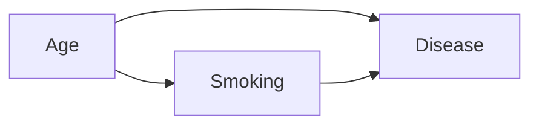

# Bayesian and Causal Inference

## Bayesianism in 1 minute

For a Bayesian, parameters **are random variables**. Everything revolves around:

$$P(\theta | D) = \frac{P(D | \theta) P(\theta)}{P(D)}$$

- **Prior** $P(\theta)$: knowledge before the data.
- **Likelihood** $P(D|\theta)$: probability of the data given $\theta$.
- **Posterior** $P(\theta|D)$: what you want.

Unlike the frequentist approach, you get a **distribution** over the parameter, not a point estimate + CI. You can say things like "there is a 95% probability that $\mu \in [a, b]$" — something a frequentist cannot.

## PyMC: probabilistic programming

```bash
pip install pymc arviz
```

Example: estimating the mean and variance of Gaussian data:

```python
import pymc as pm
import numpy as np
import arviz as az

data = np.random.normal(5, 2, 100)

with pm.Model() as model:
    mu = pm.Normal('mu', mu=0, sigma=10)
    sigma = pm.HalfNormal('sigma', sigma=10)
    y = pm.Normal('y', mu=mu, sigma=sigma, observed=data)
    trace = pm.sample(2000, tune=1000, chains=4)

az.summary(trace)
az.plot_posterior(trace)
```

`pm.sample()` uses MCMC (NUTS, No-U-Turn Sampler) to sample from the posterior. Output: posterior for `mu` and `sigma`.

## Hierarchical models

The Bayesian's secret weapon. When you have groups (e.g. cities, schools, products) with few data points each:

```python
import pymc as pm
with pm.Model() as model:
    # hyperparameters (global)
    mu_global = pm.Normal('mu_global', 0, 10)
    sigma_global = pm.HalfNormal('sigma_global', 5)
    # per-group parameters
    mu_group = pm.Normal('mu_group', mu_global, sigma_global, shape=n_groups)
    sigma_obs = pm.HalfNormal('sigma_obs', 5)
    y = pm.Normal('y', mu_group[group_idx], sigma_obs, observed=y_data)
    trace = pm.sample()
```

**Partial pooling** transfers information between groups: small groups "borrow" from the global mean. Better than "no pooling" (one model per group) and "complete pooling" (a single model for all).

## Bayesian A/B test

For two variations with conversion rates $p_A$ and $p_B$, prior Beta(1,1):

```python
import pymc as pm
with pm.Model():
    pA = pm.Beta('pA', 1, 1)
    pB = pm.Beta('pB', 1, 1)
    pm.Binomial('yA', n=nA, p=pA, observed=conv_A)
    pm.Binomial('yB', n=nB, p=pB, observed=conv_B)
    diff = pm.Deterministic('diff', pB - pA)
    trace = pm.sample(2000)
print(f"P(B > A): {(trace.posterior['diff'] > 0).mean().item():.3f}")
```

Direct output: "B is better than A with probability 0.92". More interpretable than a p-value.

## When to choose Bayesian

- Few data points per group, many groups → hierarchical models.
- You want to incorporate prior knowledge.
- You need to quantify uncertainty in a "natural" way.
- Complex non-linear / non-standard models.

Downsides: slow (MCMC), steep learning curve.

## Causal inference

One of the most important frontiers for senior data scientists.

### Correlation ≠ causation (again)

The classic example: people who take aspirin are more likely to recover from a headache **compared to those who don't**. But those who take it probably had a more severe headache to begin with. **Confounding**.

To estimate the causal effect, you need a mechanism that simulates "if we had given aspirin to everyone / no one", not just observed correlation.

### The gold standard: RCT

Randomized Controlled Trial. You assign the treatment randomly → groups are comparable on average. Difference between groups = causal effect.

In tech, RCT = A/B test. In medicine = clinical trial.

> **Always prefer RCT** when feasible. Every observational causal method is a workaround when you cannot randomize.

### DAGs and do-calculus

Pearl formalized causal reasoning via **DAGs** (Directed Acyclic Graphs). An arrow $X \to Y$ means "X causes Y".

The **back-door criterion**: to measure the causal effect of $X$ on $Y$, control for a set $Z$ that "blocks" all indirect paths $X \leftarrow ... \rightarrow Y$.

Example:



If you want the effect of Smoking on Disease, you must **control for Age** (it is a confounder). Otherwise the smoking-disease correlation includes part of the age effect.

### Quasi-experimental designs

When you cannot randomize:

- **Difference-in-differences (DiD)**: compares changes over time between treated and control groups.
- **Regression discontinuity (RD)**: exploits a cutoff that separates treated and control units.
- **Instrumental variables (IV)**: a variable that influences the treatment but not the outcome directly.
- **Synthetic control**: construct a "synthetic control" as a combination of untreated units.
- **Propensity score matching**: match treated and untreated units with similar probabilities of receiving the treatment.

### DoWhy + EconML

```python
from dowhy import CausalModel
model = CausalModel(
    data=df, treatment='T', outcome='Y',
    common_causes=['age','income','education']
)
identified_estimand = model.identify_effect()
estimate = model.estimate_effect(identified_estimand, method_name="backdoor.propensity_score_matching")
refute = model.refute_estimate(identified_estimand, estimate, method_name="random_common_cause")
```

EconML adds ML-based methods (Double ML, Causal Forests).

## Ethics and fairness

A reliable model is not enough. Consider:

### Fairness metrics

- **Demographic parity**: same positive rate across groups.
- **Equal opportunity**: same TPR across groups.
- **Equalized odds**: same TPR and FPR across groups.

These metrics are often **mutually incompatible** (impossibility theorem, Kleinberg 2016). You must choose.

### Bias in data

- Historical (data reflecting past discrimination).
- Selection (who is in the dataset?).
- Measurement (is the label a proxy for the true target?).

Tools: `fairlearn`, `aif360`.

### Guidelines

1. **Data audit** before the model.
2. **Define relevant protected groups** (ethnicity, gender, age).
3. **Measure** performance per group.
4. **Discuss tradeoffs** with non-technical stakeholders.
5. **Document**: who was excluded and why.

## Exercises

<details>
<summary>Exercise 1 — Bayesian inference on a proportion</summary>

```python
import pymc as pm
with pm.Model():
    p = pm.Beta('p', 1, 1)
    pm.Binomial('y', n=100, p=p, observed=18)
    trace = pm.sample(2000)
import arviz as az
print(az.summary(trace))
# estimate ~ 0.18 with 95% HDI [0.11, 0.26]
```
</details>

<details>
<summary>Exercise 2 — Hierarchical model</summary>

You have conversions for 10 cities with very different sample sizes (some with 5000 visitors, others with 50). Estimate the conversion rate per city with partial pooling.

Expected result: cities with little data are "pulled toward the global mean", while those with many data points remain close to their empirical rate.
</details>

<details>
<summary>Exercise 3 — Identify the confounder</summary>

The data show that drinking coffee correlates with lung cancer. Question: causal?

**Answer**: the likely confounder is **smoking**. Smokers drink more coffee and also smoke. Control for smoking in the model and the coffee effect disappears.

Lesson: before modeling, draw the DAG.
</details>

<details>
<summary>Exercise 4 — Fairness audit</summary>

On a credit scoring model, compute TPR and FPR per group (e.g. male vs female).

```python
from fairlearn.metrics import MetricFrame, true_positive_rate, false_positive_rate
mf = MetricFrame(
    metrics={'TPR': true_positive_rate, 'FPR': false_positive_rate},
    y_true=y_test, y_pred=y_pred,
    sensitive_features=df_test['gender']
)
print(mf.by_group)
```

If large differences → problem. Mitigation techniques: reweighing, adversarial debiasing, per-group thresholds.
</details>

## Key takeaways

- Bayesian = distribution over parameters, direct interpretation.
- Hierarchical models for data with a "groups" structure.
- RCT > observational methods, always when possible.
- DAGs and the back-door criterion for causal analysis.
- Fairness is not optional: measure, document, discuss.

Next: capstone and career.
