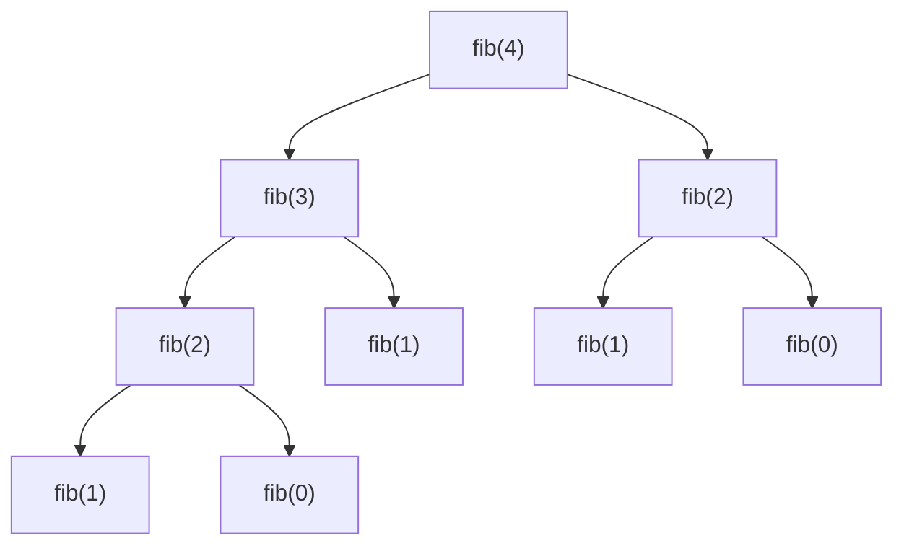

# Complessità computazionale

Prima di entrare nel vivo: **questo capitolo è fondamentale**. Se lo digerisci bene, tutti i capitoli seguenti ti sembreranno facili. Se lo salti, navigherai a vista.

Procediamo dal nulla.

## Parte 1 — Cos'è un algoritmo, e perché ci importa quanto è "veloce"

### Un algoritmo è una ricetta

Pensa a una ricetta per fare una torta: una sequenza di istruzioni che, seguita pedissequamente, porta a un risultato. Un algoritmo è esattamente la stessa cosa, applicata al computer. È una serie di passi che, dato un certo input, produce un output.

Esempio (informale): *"data una lista di numeri, trova il più grande"*.

Algoritmo:
1. Tieni in mente "il candidato campione". All'inizio è il primo numero della lista.
2. Vai uno per uno sui restanti numeri.
3. Per ogni numero, se è più grande del campione, sostituisci il campione con esso.
4. Alla fine, il campione è il massimo.

In Python:

```python
def trova_max(arr):
    campione = arr[0]
    for x in arr[1:]:
        if x > campione:
            campione = x
    return campione
```

### Perché misurare la "velocità"?

Una ricetta semplice può richiedere 10 minuti o 4 ore. Per il pomeriggio in cucina cambia tutto. Per un computer, la differenza tra un algoritmo "veloce" e uno "lento" è la differenza tra:

- Google che ti dà i risultati in 200 ms vs in 3 ore.
- Una banca che fa un bonifico in 1 secondo vs il giorno dopo.
- Netflix che fa il consiglio in real time vs domani mattina.

In colloquio FAANG ti chiederanno **sempre** di dichiarare quanto è veloce la tua soluzione. Se non lo sai dire, è come dire "ho cucinato una torta" senza saper rispondere a "quanto tempo ci hai messo?". Brutta figura immediata.

### Perché non si misura in secondi

Domanda naturale: "perché non eseguo il codice e vedo quanti secondi ci mette?". Tre problemi:

1. **Dipende dalla macchina**. Il mio computer è 10× più veloce del tuo? L'algoritmo è meglio o no?
2. **Dipende dall'input**. Funziona benissimo con 100 elementi, ma con 1 milione? Devo provare ogni dimensione possibile?
3. **Dipende dal momento**. Stai eseguendo altri programmi? La CPU è in throttling?

Quindi non si misura in **tempo assoluto** (secondi). Si misura in **numero di operazioni** in funzione dell'input. È una misura **astratta** ma **universale**: vale per qualsiasi macchina, qualsiasi linguaggio, qualsiasi momento.

## Parte 2 — Contare le operazioni: la prima intuizione

Riprendiamo `trova_max`. Quante operazioni fa?

- 1 operazione per inizializzare `campione = arr[0]`.
- Per ogni elemento della lista (chiamiamo `n` la lunghezza), fa **1 confronto** (`if x > campione`) e **forse 1 assegnamento** (`campione = x`).

Quindi: circa `1 + n × 2 = 2n + 1` operazioni.

Se la lista ha `n = 10` elementi → 21 operazioni.
Se ha `n = 1000` → 2001 operazioni.
Se ha `n = 1 000 000` → 2 000 001 operazioni.

### Domanda: 2n+1 è "veloce" o "lento"?

Ne parliamo subito. Ma prima, un fatto chiave: notiamo che **quel "+1" e quel "× 2" non sono molto importanti**. Cioè, se `n` è enorme, l'unica cosa che conta è che è **proporzionale a n**. Lo `2` davanti e lo `+1` cambiano di poco.

Vedi tu stesso: per `n = 1 000 000`:

- `n` = 1 000 000
- `2n + 1` = 2 000 001
- `5n + 100` = 5 000 100
- `100n` = 100 000 000

Tutte queste cose sono **dello stesso ordine di grandezza**: sono tutte "circa lineari". Il numero davanti è una "costante" che non cambia la forma generale della crescita.

### Confronto: cos'è "diverso ordine di grandezza"?

Ora confronta con questo algoritmo:

```python
def coppie_uguali(arr):
    """Restituisce le coppie (i, j) con arr[i] == arr[j], i < j."""
    coppie = []
    for i in range(len(arr)):
        for j in range(i+1, len(arr)):
            if arr[i] == arr[j]:
                coppie.append((i, j))
    return coppie
```

Quante operazioni fa? Due loop annidati. Per ogni `i`, il loop interno fa `n - i - 1` iterazioni. Totale: `(n-1) + (n-2) + ... + 1 + 0 = n(n-1)/2` confronti.

Per `n = 1 000 000`: `n(n-1)/2 ≈ 500 miliardi`. Su una macchina che fa ~10⁸ operazioni/secondo: **~5000 secondi = ~1 ora e mezza**.

Confronta con `trova_max` su `n = 1 000 000`: 2 milioni di operazioni → **~20 millisecondi**.

**Sono dello stesso ordine?** No. Uno scala **linearmente** con `n`, l'altro **quadraticamente**. Per `n = 10` la differenza è trascurabile. Per `n = 10⁶` la differenza è 5 ordini di grandezza.

Big-O è esattamente questo: classificare gli algoritmi per **come crescono al crescere dell'input**.

## Parte 3 — La notazione Big-O

Big-O scrive `O(f(n))` per dire "questo algoritmo, ignorando le costanti e i termini piccoli, cresce come f(n)".

- `trova_max`: `O(n)` — lineare.
- `coppie_uguali`: `O(n²)` — quadratica.

Le regole formali sono due e semplicissime:

### Regola 1 — Ignora le costanti moltiplicative

`5n` è O(n). `1000n` è O(n). `0.001n` è O(n). Tutto **lineare**.

**Perché?** Perché la costante dipende da dettagli irrilevanti: lingua, compilatore, hardware. Quello che ci interessa è la **forma della crescita**, non la pendenza precisa.

### Regola 2 — Ignora i termini non dominanti

`n² + 100n + 5000` è `O(n²)`. Quando `n` è grande, `n²` domina su tutto il resto.

Verifica: `n = 1000`. `n² = 1 000 000`. `100n = 100 000`. `5000 = 5000`. Il primo termine è 10× il secondo e 200× il terzo. Per `n = 10⁶`, il primo è 10000× il secondo. Sì, lo possiamo ignorare.

### Quindi, per analizzare un algoritmo:

1. Conta le operazioni in funzione di `n` (anche grossolanamente).
2. Tieni solo il termine che cresce più velocemente.
3. Butta via le costanti.

## Parte 4 — Le classi di complessità che devi riconoscere

Ecco la "scala" delle complessità più comuni, dal più veloce al più lento:

| Notazione | Nome | Esempio | n=10⁶ | tempo (10⁸ op/s) |
|---|---|---|---|---|
| `O(1)` | costante | accesso ad `arr[i]` | 1 | istantaneo |
| `O(log n)` | logaritmica | binary search | ~20 | istantaneo |
| `O(n)` | lineare | scan singolo | 10⁶ | 10 ms |
| `O(n log n)` | linearitmica | merge sort | ~2·10⁷ | 0.2 s |
| `O(n²)` | quadratica | doppio loop | 10¹² | **3 ore** |
| `O(n³)` | cubica | triplo loop | 10¹⁸ | impossibile |
| `O(2ⁿ)` | esponenziale | enumerazione sottoinsiemi | esplode | impossibile a n=40 |
| `O(n!)` | fattoriale | tutte le permutazioni | esplode | impossibile a n=12 |

### Visualizzazione (importante per costruire intuizione)

Ecco le curve di crescita delle complessità più comuni, dal più veloce al più lento:

<div style="background:#161922;border:1px solid #262b3a;border-radius:8px;padding:16px;margin:16px 0;overflow-x:auto;">
<svg viewBox="0 0 700 420" xmlns="http://www.w3.org/2000/svg" style="max-width:100%;height:auto;display:block;margin:auto;font-family:'Cascadia Code',monospace;font-size:12px;">
  <defs>
    <style>
      .axis { stroke:#7a8194; stroke-width:1.5; fill:none; }
      .axis-label { fill:#b6bdcc; font-size:13px; }
      .grid { stroke:#262b3a; stroke-width:1; stroke-dasharray:3,3; }
      .curve { fill:none; stroke-width:2.5; }
      .legend { font-size:12px; font-weight:600; }
    </style>
  </defs>
  <!-- griglia orizzontale -->
  <line class="grid" x1="60" y1="80"  x2="660" y2="80"/>
  <line class="grid" x1="60" y1="160" x2="660" y2="160"/>
  <line class="grid" x1="60" y1="240" x2="660" y2="240"/>
  <line class="grid" x1="60" y1="320" x2="660" y2="320"/>
  <!-- assi -->
  <line class="axis" x1="60" y1="20" x2="60" y2="380"/>
  <line class="axis" x1="60" y1="380" x2="680" y2="380"/>
  <!-- label assi -->
  <text class="axis-label" x="20" y="30">operazioni</text>
  <text class="axis-label" x="640" y="400">n (input)</text>
  <!-- curve. Dominio x: 60..660 (= 0..1). y: 380..20 (=0..max). -->
  <!-- O(1) costante a y=370 -->
  <path class="curve" stroke="#7a8194" d="M 60 370 L 660 370"/>
  <text class="legend" fill="#7a8194" x="600" y="360">O(1)</text>
  <!-- O(log n) cresce molto poco -->
  <path class="curve" stroke="#50fa7b" d="M 60 370 Q 200 345 350 330 T 660 310"/>
  <text class="legend" fill="#50fa7b" x="600" y="305">O(log n)</text>
  <!-- O(n) lineare -->
  <path class="curve" stroke="#6cf" d="M 60 370 L 660 220"/>
  <text class="legend" fill="#6cf" x="600" y="215">O(n)</text>
  <!-- O(n log n) -->
  <path class="curve" stroke="#bd93f9" d="M 60 370 Q 250 320 460 220 T 660 130"/>
  <text class="legend" fill="#bd93f9" x="595" y="125">O(n log n)</text>
  <!-- O(n^2) quadratica -->
  <path class="curve" stroke="#ffb86c" d="M 60 370 Q 330 320 520 200 T 660 60"/>
  <text class="legend" fill="#ffb86c" x="615" y="55">O(n²)</text>
  <!-- O(2^n) esponenziale (esplode subito) -->
  <path class="curve" stroke="#ff6b6b" d="M 60 370 Q 200 320 280 200 Q 320 80 350 25"/>
  <text class="legend" fill="#ff6b6b" x="360" y="30">O(2ⁿ)</text>
  <!-- O(n!) ancora più ripida -->
  <path class="curve" stroke="#ff79c6" d="M 60 370 Q 130 300 180 180 Q 210 60 230 25"/>
  <text class="legend" fill="#ff79c6" x="180" y="20">O(n!)</text>
</svg>
</div>

Le curve esponenziali e fattoriali **esplodono** subito (rosso/rosa). Quadratica e linearitmica (arancio/viola) crescono velocemente. La lineare (azzurro) è "ragionevole". La logaritmica (verde) è **quasi piatta**. La costante (grigio) non cambia mai.

### Una nota su O(1)

`O(1)` significa **costante**, cioè "non dipende da n". Non significa "veloce", significa "il tempo non cambia se l'input cresce". Un algoritmo che impiega sempre esattamente 3 secondi è `O(1)`. Lento ma costante.

### Una nota su O(log n)

Il logaritmo è la funzione "inversa dell'esponenziale". `log₂(8) = 3` perché `2³ = 8`. `log₂(1024) = 10` perché `2¹⁰ = 1024`.

Il logaritmo cresce **molto lentamente**:

- `log₂(1) = 0`
- `log₂(1 000) ≈ 10`
- `log₂(1 000 000) ≈ 20`
- `log₂(1 000 000 000) ≈ 30`

Quando dividi il problema **a metà ad ogni passo**, ti servono `log n` passi per arrivare alla risposta. È la magia del binary search.

## Parte 5 — Come riconoscere la complessità leggendo il codice

Tre regole pratiche, da applicare sempre.

### Regola A — Loop singoli sono O(n)

```python
for x in arr:    # O(n) iterazioni
    fai_cosa()   # ognuna O(1)
# Totale: O(n)
```

### Regola B — Loop annidati sono O(n × m)

Se i due loop scorrono indipendentemente sullo stesso array:

```python
for i in range(n):
    for j in range(n):
        ...
# O(n × n) = O(n²)
```

Se sono due array diversi:

```python
for x in arr1:    # lunghezza n
    for y in arr2:  # lunghezza m
        ...
# O(n × m)
```

**Trappola sottile**: non sempre due loop annidati sono `O(n²)`. Esempio:

```python
i, j = 0, n-1
while i < j:
    if condizione: i += 1
    else: j -= 1
```

Sembrano "due puntatori che si muovono". Ma ogni iterazione consuma **un elemento** (o avanza `i`, o arretra `j`). Quindi il numero totale di iterazioni è al più `n`. **Questo è O(n), non O(n²)**.

### Regola C — Divisione a metà = O(log n)

```python
while n > 1:
    n = n // 2  # dimezza ogni volta
```

Questo loop fa `log₂(n)` iterazioni. Se vedi "dimezzo a ogni passo" → `log n`.

### Regola D — Per la ricorsione, devi disegnare l'albero

Vedi sezione apposita più sotto.

## Parte 6 — Esempi guidati passo passo

Mettiamo in pratica. Ecco vari pezzi di codice: prova ad analizzarli **prima di leggere la risposta**.

### Esempio 6.1

```python
def f1(arr):
    s = 0
    for x in arr:
        s += x
    return s
```

Pensaci... Risposta: **O(n)**. Un solo loop, una sola operazione dentro.

### Esempio 6.2

```python
def f2(arr):
    s = 0
    for x in arr:
        for y in arr:
            s += x * y
    return s
```

Risposta: **O(n²)**. Due loop annidati, ognuno O(n).

### Esempio 6.3

```python
def f3(n):
    i = 1
    while i < n:
        print(i)
        i *= 2
```

Risposta: **O(log n)**. La variabile `i` raddoppia ad ogni passo. Serve `log₂(n)` passi per arrivare a `n`.

### Esempio 6.4

```python
def f4(arr):
    for i in range(len(arr)):
        for j in range(i, len(arr)):
            print(arr[i], arr[j])
```

Numero di iterazioni: `n + (n-1) + (n-2) + ... + 1 = n(n+1)/2`.

Risposta: **O(n²)**. Anche se il loop interno non è "fino a n" ogni volta, la somma è quadratica. Le costanti spariscono.

### Esempio 6.5

```python
def f5(arr):
    arr_ordinato = sorted(arr)
    for x in arr_ordinato:
        print(x)
```

Risposta: **O(n log n)**. `sorted` è `O(n log n)`, il loop è `O(n)`. La somma è `O(n log n) + O(n)`, che si riduce a `O(n log n)` (regola del termine dominante).

### Esempio 6.6

```python
def f6(arr):
    for x in arr:
        if x in arr:  # ATTENZIONE
            print(x)
```

Risposta: **O(n²)**. L'operatore `in` su una **lista** è O(n). Se `arr` fosse un `set`, sarebbe O(1) e il totale O(n). Questa è una delle trappole più comuni in colloquio.

### Esempio 6.7

```python
def f7(s):
    risultato = ""
    for c in s:
        risultato += c
```

Risposta: **O(n²)**. **Domanda di trabocchetto classica**. La concatenazione di stringhe in Python crea ogni volta una nuova stringa, copiando i caratteri precedenti. Iterazione `i`: copia `i` caratteri. Somma: `1+2+...+n = O(n²)`.

Soluzione: `''.join(lista_di_char)` → O(n).

## Parte 7 — Complessità della ricorsione

Per algoritmi ricorsivi non puoi "contare i loop". Devi pensare all'**albero di chiamate**.

Esempio:

```python
def fib(n):
    if n < 2: return n
    return fib(n-1) + fib(n-2)
```

Disegna l'albero di chiamate per `fib(4)`:



L'albero ha profondità `n` e ogni nodo ha 2 figli → numero totale di nodi ≈ `2ⁿ`. **`O(2ⁿ)`**. Lento orribile.

### Come si formalizza: ricorrenze

Una **relazione di ricorrenza** descrive `T(n)` in termini di `T` di input più piccoli.

Per `fib`: `T(n) = T(n-1) + T(n-2) + O(1)` → cresce come `φⁿ ≈ 2ⁿ`.

Per `binary_search` (vedi cap. 11): `T(n) = T(n/2) + O(1)` → `O(log n)`. A ogni passo dimezzi.

Per `merge_sort`: `T(n) = 2 T(n/2) + O(n)`. Il "+O(n)" è il merge. Soluzione: `O(n log n)`.

### Il "Master theorem" semplificato

Per ricorrenze del tipo `T(n) = a · T(n/b) + O(nᵈ)`:

1. Confronta `log_b(a)` con `d`.
2. Se `log_b(a) < d` → `O(nᵈ)`.
3. Se `log_b(a) = d` → `O(nᵈ · log n)`.
4. Se `log_b(a) > d` → `O(n^log_b(a))`.

Esempi:

- **Merge sort**: `T(n) = 2T(n/2) + O(n)`. `a=2, b=2, d=1`. `log_2(2) = 1 = d` → caso 3 → `O(n log n)`. ✓
- **Binary search**: `T(n) = T(n/2) + O(1)`. `a=1, b=2, d=0`. `log_2(1) = 0 = d` → caso 3 → `O(log n)`. ✓
- **Karatsuba (moltiplicazione veloce)**: `T(n) = 3T(n/2) + O(n)`. `log_2(3) ≈ 1.58 > 1 = d` → caso 4 → `O(n^1.58)`.

Non serve memorizzarlo a memoria. Serve riconoscere che esiste e applicarlo.

## Parte 8 — Complessità di spazio

Non solo tempo. **Spazio** = quanta memoria extra usa l'algoritmo, oltre all'input.

Esempi:

```python
def somma(arr):
    s = 0
    for x in arr: s += x
    return s
```

Spazio: **O(1)**. Una sola variabile `s`, indipendentemente da `n`.

```python
def doppia(arr):
    risultato = []
    for x in arr: risultato.append(x * 2)
    return risultato
```

Spazio: **O(n)**. La lista `risultato` cresce con `n`.

### Stack ricorsivo

Anche la ricorsione consuma memoria, perché il computer deve **ricordare dove tornare** dopo ogni chiamata. Questa memoria si chiama **stack di chiamate**.

```python
def somma_rec(arr, i=0):
    if i == len(arr): return 0
    return arr[i] + somma_rec(arr, i+1)
```

Tempo: O(n). **Spazio: O(n)** — perché ci sono `n` chiamate in pila contemporaneamente.

In Python il limite di default è ~1000 chiamate ricorsive. Quindi se `n > 1000`, la ricorsione si schianta con `RecursionError`. La versione iterativa, invece, è O(1) di spazio (oltre all'input).

## Parte 9 — La "regola pratica del 10⁸"

Un computer moderno fa ~10⁸ (cento milioni) operazioni semplici al secondo. Quindi:

- Vuoi che il programma finisca entro **1 secondo**? Le operazioni totali devono essere **≤ ~10⁸**.

Combinando con la dimensione dell'input, puoi capire **quale complessità ti serve**:

| n max | Complessità attesa |
|---|---|
| 10⁸ | O(n) — niente di più |
| 10⁶ | O(n log n) ok |
| 10⁴ | O(n²) ok |
| 500 | O(n³) ok |
| 20 | O(2ⁿ) ok |
| 10 | O(n!) ok |

**Usalo al contrario**: quando l'intervistatore dice *"n può arrivare a 10⁵"*, ti sta dicendo **implicitamente** che si aspetta una soluzione `O(n log n)` o `O(n)`. Se proponi `O(n²)`, ti aspetta una versione migliore.

Questa è una skill cruciale: **leggere il problema, dedurre la complessità target, e mirare a quella**.

## Parte 10 — Best case, worst case, average case

Big-O di default si riferisce al **caso peggiore** (worst case). Esempio:

- Cerca un elemento in un array non ordinato. **Peggior caso**: l'elemento è in ultima posizione → O(n). **Miglior caso**: è in prima posizione → O(1).

In colloquio, salvo richieste esplicite, **dichiara sempre il worst case**.

### Complessità ammortizzata

Alcune strutture dati hanno operazioni che sono **occasionalmente lente** ma in media veloci.

Esempio: `list.append(x)` in Python. Internamente Python tiene un array che **raddoppia di capacità** quando si riempie. Quando questo succede, paghi O(n) per copiare tutto il contenuto nel nuovo array. Ma raddoppia → succede solo `log n` volte.

In media: O(1) per append. Si dice **O(1) ammortizzato**. In colloquio: *"L'append è O(1) ammortizzato — nel peggior caso O(n), ma il totale di n append è O(n)"*.

## Parte 11 — Cheat-sheet operazioni Python

Da tenere in testa SEMPRE:

| Operazione | Complessità |
|---|---|
| `list[i]`, `list[i] = x`, `len(list)` | O(1) |
| `list.append(x)`, `list.pop()` | O(1) ammortizzato |
| `list.insert(0, x)`, `list.pop(0)` | **O(n)** — usa `collections.deque`! |
| `list.index(x)`, `x in list` | **O(n)** |
| `sorted(list)`, `list.sort()` | O(n log n) |
| `dict[k]`, `dict[k] = v`, `k in dict` | O(1) medio |
| `set` add/in/remove | O(1) medio |
| `collections.deque` append/popleft | O(1) |
| `heapq.heappush/heappop` | O(log n) |
| `''.join(list_of_str)` | O(totale char) |
| `string + string` in loop | **O(n²) — evita!** |

### Trappole tipiche

```python
# MALE: O(n²)
s = ""
for c in chars: s += c

# BENE: O(n)
s = "".join(chars)
```

```python
# MALE: O(n²) — pop(0) è O(n)
while arr:
    primo = arr.pop(0)
    elabora(primo)

# BENE: O(n)
from collections import deque
arr = deque(arr)
while arr:
    primo = arr.popleft()
    elabora(primo)
```

```python
# MALE: O(n²)
seen = []
for x in arr:
    if x in seen: ...   # 'in' su lista è O(n)
    seen.append(x)

# BENE: O(n)
seen = set()
for x in arr:
    if x in seen: ...   # 'in' su set è O(1)
    seen.add(x)
```

## Parte 12 — Come dichiarare la complessità in colloquio

Alla fine di ogni soluzione, **prima che l'intervistatore te lo chieda**, dichiara:

> *"Il tempo è O(n log n) perché ordino l'array, poi faccio un passaggio lineare. Lo spazio è O(n) perché conservo un dict di n elementi. Considerando lo stack di ricorsione, lo spazio totale è O(n)."*

Se sai che la tua soluzione è subottima, **anticipalo**:

> *"Questa è la versione brute force O(n²). Posso fare meglio sfruttando la hashmap, arrivando a O(n) di tempo a costo di O(n) di spazio. Procedo a quella?"*

Questo dimostra che hai consapevolezza e padronanza — uno dei criteri principali di hire.

## Esercizi guidati

### Esercizio 1.1 <span class="problem-tag easy">EASY</span>

Qual è la complessità di:

```python
for i in range(n):
    for j in range(i, n):
        print(i, j)
```

<details><summary>Ragionamento guidato</summary>

Pensa al numero totale di iterazioni del loop interno:

- Per `i=0`: il loop interno fa `n` iterazioni.
- Per `i=1`: ne fa `n-1`.
- Per `i=2`: ne fa `n-2`.
- ...
- Per `i=n-1`: ne fa `1`.

Somma: `n + (n-1) + ... + 1 = n(n+1)/2`.

Il termine dominante è `n²/2`. Le costanti si buttano via.

**Risposta: O(n²)**.

L'intuizione: "doppio loop dove il secondo dipende dal primo, ma in modo lineare" è quasi sempre `O(n²)`. Anche se la matrice di iterazioni è "triangolare" invece di "quadrata", la classe rimane la stessa.
</details>

### Esercizio 1.2 <span class="problem-tag easy">EASY</span>

```python
i = 1
while i < n:
    i *= 2
```

<details><summary>Ragionamento</summary>

`i` raddoppia ad ogni iterazione. Dopo `k` iterazioni, `i = 2^k`. Vogliamo sapere per quale `k` arriviamo o superiamo `n`:

`2^k ≥ n` → `k ≥ log₂(n)`.

Quindi servono `log₂(n)` iterazioni. **O(log n)**.

L'intuizione: ogni volta che vedi "moltiplico/divido per una costante", pensa logaritmo.
</details>

### Esercizio 1.3 <span class="problem-tag medium">MEDIUM</span>

```python
for i in range(n):
    j = 1
    while j < n:
        j *= 2
```

<details><summary>Ragionamento</summary>

Loop esterno: O(n). Loop interno: O(log n) (per quanto visto sopra).

I loop sono annidati → si moltiplicano.

**Risposta: O(n log n)**.

Questa è la complessità di tantissimi algoritmi di sorting (merge sort, heap sort, TimSort di Python).
</details>

### Esercizio 1.4 <span class="problem-tag medium">MEDIUM</span>

```python
def f(n):
    if n <= 1: return
    f(n-1)
    f(n-1)
```

<details><summary>Ragionamento</summary>

Disegna l'albero di chiamate. Ogni nodo ha 2 figli, profondità `n`. Numero totale di nodi: `2^0 + 2^1 + ... + 2^(n-1) = 2^n - 1 ≈ 2^n`.

**Tempo: O(2ⁿ)**.

**Spazio: O(n)**. In ogni momento, la "catena" di chiamate attive ha al massimo profondità `n` (un percorso dall'alto al basso dell'albero), non l'intero albero.

Lezione: tempo e spazio della ricorsione **non sono uguali**. Il tempo è il numero totale di chiamate, lo spazio è la profondità massima.
</details>

### Esercizio 1.5 <span class="problem-tag medium">MEDIUM</span>

Hai un array di stringhe `arr` di `n` elementi, ogni stringa lunga al massimo `k` caratteri. Qual è la complessità di `sorted(arr)`?

<details><summary>Ragionamento</summary>

`sorted` fa `O(n log n)` confronti. Ma ogni confronto fra stringhe non è `O(1)`: per confrontare due stringhe lunghe `k`, nel peggior caso devi guardare tutti i caratteri → `O(k)`.

**Risposta: O(n · k · log n)**.

Molti candidati dicono solo `O(n log n)` e perdono punti. **Quando confronti oggetti complessi, conta il costo del confronto.**
</details>

### Esercizio 1.6 <span class="problem-tag hard">HARD</span>

```python
def f(n):
    if n <= 1: return 1
    return f(n//2) + f(n//2) + f(n//2)
```

<details><summary>Ragionamento</summary>

Ricorrenza: `T(n) = 3 T(n/2) + O(1)`.

Master theorem: `a=3, b=2, d=0`. `log_2(3) ≈ 1.58`. Confronta con `d=0` → caso 3.

**Risposta: O(n^log₂(3)) ≈ O(n^1.58)**.

Strano, vero? Non è né lineare né quadratico, ma una potenza frazionaria. Questo è esattamente il tipo di complessità di Karatsuba per la moltiplicazione veloce.
</details>

### Esercizio 1.7 <span class="problem-tag medium">MEDIUM</span>

L'intervistatore dice *"n può arrivare a 200 000"*. Quali complessità sono accettabili (entro 1 secondo)?

<details><summary>Ragionamento</summary>

Soglia: ~10⁸ operazioni totali.

- `O(n)` → 2·10⁵ operazioni. ✓
- `O(n log n)` → ~3.5·10⁶ operazioni. ✓
- `O(n √n)` → ~10⁸. ✓ (al limite)
- `O(n²)` → 4·10¹⁰. ✗ (400 secondi)

**L'intervistatore ti sta dicendo che la soluzione attesa è O(n log n) o O(n)**. Se proponi un O(n²), ti spingerà a migliorare.

Saper leggere le constraints è una skill fondamentale.
</details>

### Esercizio 1.8 <span class="problem-tag medium">MEDIUM</span>

```python
def f(arr):
    n = len(arr)
    for i in range(n):
        for j in range(i+1, n):
            for k in range(j+1, n):
                ...
```

<details><summary>Ragionamento</summary>

Tre loop annidati, ognuno dipendente dal precedente. Il numero di iterazioni è il numero di "triplette" `(i, j, k)` con `i < j < k`, che è `C(n, 3) = n(n-1)(n-2)/6`.

Termine dominante: `n³/6`. **Risposta: O(n³)**.

Quando vedi triplo loop, pensa `O(n³)`. Es. problema 3Sum brute force.
</details>

## Riassunto in 5 punti

1. **Big-O misura come cresce un algoritmo al crescere dell'input**, ignorando costanti e termini piccoli.
2. **Tempo e spazio** sono due metriche diverse, dichiarale entrambe.
3. **Scala mnemonica**: `O(1) < O(log n) < O(n) < O(n log n) < O(n²) < O(2ⁿ) < O(n!)`.
4. **Regola del 10⁸**: ~10⁸ operazioni/secondo. Usa le constraints per dedurre la complessità target.
5. **Ricorsione**: tempo = numero totale di chiamate (spesso albero), spazio = profondità massima dello stack.

Quando avrai assimilato questo capitolo, ogni problema dei capitoli successivi diventerà *"quale algoritmo mi porta dalla complessità ingenua a quella attesa?"*. È letteralmente il framework mentale di tutto il colloquio.
