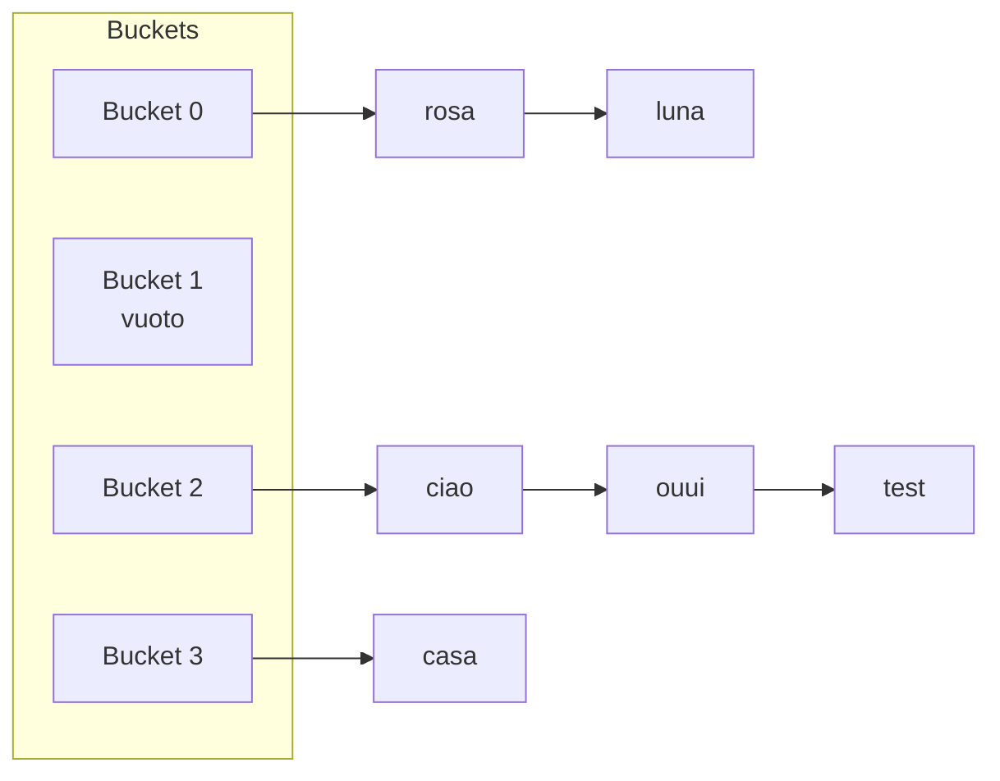

# Hashmap e set

Se devi memorizzare una sola lezione di questo intero percorso, sceglieresti probabilmente questa: **quando vedi un problema che sembra O(n²), pensa hashmap e probabilmente diventa O(n)**.

Iniziamo dalle fondamenta.

## Parte 1 — Il problema che la hashmap risolve

Supponi di avere una lista di 1 milione di elementi e ti chiedo: "c'è il valore 42456 dentro?"

**Approccio array**: scorri uno per uno. O(n). Per 1 milione: ~10 ms. Per fare 1 milione di queste query: 10000 secondi (3 ore).

**Approccio array ordinato + binary search**: O(log n). Per 1 milione di query: 20·10⁶ = 20 ms totali. Buono. Ma inserire/togliere è O(n).

**Approccio hashmap**: O(1) per query, O(1) per insert/delete. Per 1 milione di query: ~10 ms totali.

La hashmap è la struttura dati più potente del CS quotidiano. Sempre quando puoi rispondere a "qual è la chiave?", una hashmap risolve in O(1).

## Parte 2 — Come funziona dentro: la funzione hash

### L'idea base

Immagina di avere 10 cassetti numerati da 0 a 9, e vuoi memorizzare 100 oggetti. Come decidi in quale cassetto va ogni oggetto?

Soluzione semplice: una **regola deterministica** che converte l'oggetto in un numero tra 0 e 9. Questo è l'hash.

Esempio: oggetto = stringa, regola = "somma codici ASCII dei caratteri, modulo 10".

```python
def my_hash(s):
    total = sum(ord(c) for c in s)
    return total % 10
```

`my_hash("ciao")` = (99+105+97+111) % 10 = 412 % 10 = **2**. Va nel cassetto 2.

Per cercare "ciao", basta calcolare l'hash → cassetto 2 → cerca lì. Lookup in **una sola operazione di hash + una visita del cassetto**.

### Le proprietà di una buona funzione hash

1. **Deterministica**: stesso input → stesso output.
2. **Veloce da calcolare**: O(1) idealmente.
3. **Uniformemente distribuita**: ogni cassetto riceve circa lo stesso numero di oggetti.
4. **Sensibile alle modifiche**: cambiare un singolo carattere dovrebbe dare un hash completamente diverso (effetto "valanga").

Python usa funzioni hash specifiche per i vari tipi (int, str, tuple) molto migliori del mio esempio giocattolo.

### Collisioni — il problema vero

Cosa succede se due oggetti finiscono nello stesso cassetto? Si chiama **collisione**.

Esempio: `my_hash("ciao") = 2`, ma anche `my_hash("ouui")` può finire in 2 se i codici sommano a un multiplo di 10 più 2.

**Hai due strategie classiche** per gestire collisioni:

#### Strategia 1 — Chaining (catene)

Ogni cassetto contiene una **lista** di tutti gli oggetti caduti lì. Per cercare: vai al cassetto, scorri la lista.



#### Strategia 2 — Open addressing

Se il cassetto è occupato, prova il **prossimo libero** (linear probing) o un altro secondo qualche schema (quadratic, double hashing).

Pro: usa solo l'array, no liste extra. Contro: gestione di delete complessa, prestazioni degradano quando si riempie.

Python `dict` usa open addressing con random probing.

### Resize: come si mantengono performance O(1)

Più oggetti metti, più collisioni avrai. Il rapporto `n_oggetti / n_cassetti` si chiama **load factor**. Quando supera ~0.7, la hashmap **raddoppia di capacità** e **re-hash** tutti gli oggetti.

Costo: O(n) per il resize. Ma ammortizzato su `n` inserimenti: O(1) per insert.

### Complessità riassunta

Tutte le operazioni base:

- **Get/put/delete**: **O(1) medio**.
- **Worst case**: O(n) (quando tutto collide nello stesso bucket).

In pratica O(1) sempre. Se l'intervistatore te lo chiede, cita "average O(1), worst case O(n) for adversarial inputs".

## Parte 3 — Hashmap in Python: API completa

### Dict (la hashmap di Python)

```python
d = {}                  # vuoto
d = {"a": 1, "b": 2}    # con valori iniziali

d[k] = v                # set / update
v = d[k]                # get; KeyError se mancante
v = d.get(k)            # None se mancante
v = d.get(k, default)   # default invece di None
k in d                  # exists, O(1)
del d[k]                # delete, KeyError se mancante
d.pop(k)                # delete e ritorna valore, KeyError se mancante
d.pop(k, default)       # safe pop

list(d.keys())          # lista chiavi
list(d.values())        # lista valori
list(d.items())         # lista (chiave, valore)

len(d)                  # numero di entries
d.clear()               # svuota

# Iterazione
for k in d: ...         # itera sulle chiavi
for k, v in d.items(): ...   # itera su coppie
```

### Set (hashmap senza valori)

Un set è una hashmap che memorizza solo le chiavi. Stesse proprietà di lookup O(1).

```python
s = set()
s = {1, 2, 3}          # NB: {} è un dict vuoto, non set vuoto!

s.add(x)               # O(1)
s.remove(x)            # KeyError se mancante
s.discard(x)           # safe, ignora se mancante
x in s                 # O(1)

# Operazioni insiemistiche (potenti!)
a | b                  # unione
a & b                  # intersezione
a - b                  # differenza (in a ma non in b)
a ^ b                  # differenza simmetrica
a <= b, a < b          # subset
a >= b                 # superset
```

### Le 3 superstar di `collections`

```python
from collections import defaultdict, Counter, OrderedDict
```

#### defaultdict

Un dict che **crea il valore di default automaticamente** quando accedi a una chiave mancante. Elimina i bug "KeyError".

```python
g = defaultdict(list)
g['a'].append(1)   # g['a'] viene creato come [] automaticamente, poi append
g['a'].append(2)   # ora g = {'a': [1, 2]}
```

Tipo del default: `int` (default 0), `list` (default []), `set` (default set()), `dict` (default {}).

#### Counter

Conta automaticamente. Una delle classi più utili del CS quotidiano.

```python
c = Counter("abracadabra")
# Counter({'a': 5, 'b': 2, 'r': 2, 'c': 1, 'd': 1})

c.most_common(3)         # [('a', 5), ('b', 2), ('r', 2)]
c['z']                   # 0, NOT KeyError. Counter ritorna 0 per mancanti.
c.update("aaa")          # aggiunge frequenze
c1 + c2                  # somma element-wise
c1 - c2                  # sottrazione (clamp a 0)
c1 & c2                  # min element-wise (intersezione multiset)
c1 | c2                  # max (unione multiset)
```

#### OrderedDict

Un dict che **ricorda l'ordine di inserimento** e ha `move_to_end()`. Storica importanza, ma da Python 3.7+ anche i dict normali mantengono l'ordine. `OrderedDict` resta utile per `move_to_end` (cruciale per LRU cache).

```python
od = OrderedDict()
od['a'] = 1; od['b'] = 2; od['c'] = 3
od.move_to_end('a')           # ora ordine: b, c, a
od.move_to_end('a', last=False)  # ora ordine: a, b, c
od.popitem(last=False)        # rimuove e ritorna prima entry (FIFO)
od.popitem()                  # rimuove e ritorna ultima (LIFO)
```

## Parte 4 — I 6 pattern fondamentali con hashmap

### Pattern 1 — Complemento per somma

Già visto nel cap. 02 (Two Sum). **L'idea generale**: cerchi due elementi che combinano (somma, prodotto, XOR, ecc.); invece di doppio loop, memorizzi quello che hai visto e cerchi il complemento.

```python
def two_sum(arr, t):
    seen = {}
    for i, x in enumerate(arr):
        comp = t - x
        if comp in seen:
            return [seen[comp], i]
        seen[x] = i
```

Generalizzazione: **da "trova X e Y tali che ..."** a **"trova X tale che (qualcosa di Y derivato da X) sia già in memoria"**.

### Pattern 2 — Frequenza

Conta occorrenze. Tre usi tipici:

```python
# Esiste un elemento che appare > n/2 volte?
def majority(arr):
    c = Counter(arr)
    return c.most_common(1)[0][0]

# Due stringhe sono anagrammi?
def anagrammi(a, b):
    return Counter(a) == Counter(b)

# Sottostringa con esattamente k caratteri distinti?
# (Sliding window + Counter, vedi cap. 12)
```

### Pattern 3 — Group by chiave derivata

Raggruppa elementi che condividono una "fingerprint".

```python
# Group anagrams: la "fingerprint" è sorted(s)
g = defaultdict(list)
for s in strs:
    g[''.join(sorted(s))].append(s)
return list(g.values())
```

Altri esempi di chiave: `tuple(sorted(...))` per liste, `(x % 10, x // 10)` per cifre, ecc.

### Pattern 4 — Prefix sum + hashmap (somme di sottoarray esatte)

Combina prefix sum e hashmap per contare/trovare sottoarray con somma specifica.

**Idea chiave**: la somma del sottoarray `arr[i..j]` è `prefix[j+1] - prefix[i]`. Voglio che sia uguale a `k`. Quindi: `prefix[j+1] - prefix[i] = k` → `prefix[i] = prefix[j+1] - k`.

Cioè: scorro l'array calcolando il prefix corrente. Per ogni posizione, cerco quanti prefix precedenti hanno valore `prefix_attuale - k`. Quelli mi danno **tutti i sottoarray finiti qui con somma k**.

```python
def subarray_sum_equals_k(arr, k):
    seen = {0: 1}   # somma 0 vista 1 volta (prefix vuoto)
    pre = 0
    count = 0
    for x in arr:
        pre += x
        count += seen.get(pre - k, 0)   # quanti prefix precedenti hanno pre - k
        seen[pre] = seen.get(pre, 0) + 1
    return count
```

**Perché `seen = {0: 1}` all'inizio?** Perché un sottoarray che parte dall'inizio (`arr[0..j]`) ha somma `prefix[j+1] - prefix[0] = prefix[j+1] - 0`. Devo poter "vedere" il prefix=0 (somma vuota).

Trace su `arr = [1, 1, 1]`, `k = 2`:

```
i=0 x=1: pre=1, cerco pre-k=-1 in seen{0:1} → 0. count=0. seen={0:1, 1:1}
i=1 x=1: pre=2, cerco pre-k=0 in seen → trovato 1 volta. count=1. seen={0:1, 1:1, 2:1}
i=2 x=1: pre=3, cerco pre-k=1 in seen → trovato 1 volta. count=2. seen={0:1, 1:1, 2:1, 3:1}
```

Risultato: 2 sottoarray con somma 2 (`[1,1]` agli indici [0,1] e [1,2]). ✓

**Lezione**: questo pattern compare in TANTI problemi sotto le mentite spoglie. "Sottoarray con somma X", "sottoarray con somma divisibile per k", "binary array con tanti 0 quanti 1" (mappi 0 → -1, k = 0).

### Pattern 5 — Set per "ho già visto"

Cycle detection, duplicati, intersezione tra liste.

```python
def has_duplicate(arr):
    seen = set()
    for x in arr:
        if x in seen: return True
        seen.add(x)
    return False
```

### Pattern 6 — Hashmap di oggetti

In problemi su grafi/alberi, mappa nodo → metadata (visited, distance, parent).

```python
# BFS su grafo
visited = {start}
parent = {start: None}
queue = deque([start])
while queue:
    u = queue.popleft()
    for v in graph[u]:
        if v not in visited:
            visited.add(v)
            parent[v] = u
            queue.append(v)
```

## Parte 5 — Le 5 trappole comuni

### Trappola 1 — Chiavi non hashabili

Per essere chiave di un dict (o elemento di un set), l'oggetto deve essere **hashabile**. In Python:

- Hashabili: `int, float, str, tuple` (se tutti i suoi elementi sono hashabili), `frozenset`, custom class con `__hash__`.
- **NON** hashabili: `list, dict, set` (mutabili).

```python
d = {}
d[[1, 2]] = "x"   # TypeError: unhashable type: 'list'
d[(1, 2)] = "x"   # OK, tuple
```

Per dict di array, **converti in tuple**. Per dict di set, **converti in frozenset**.

### Trappola 2 — Iterazione + modifica

Già vista in cap. 02 ma vale anche per dict:

```python
for k in d:
    if cond(k): del d[k]   # RuntimeError

# Soluzione: copia le chiavi prima
for k in list(d.keys()):
    if cond(k): del d[k]
```

### Trappola 3 — `d[k] += 1` su chiave mancante

```python
d = {}
d['a'] += 1   # KeyError!

# Alternative:
d['a'] = d.get('a', 0) + 1     # Verboso ma esplicito
# Oppure:
from collections import defaultdict
d = defaultdict(int)
d['a'] += 1   # OK
# Oppure:
c = Counter()
c['a'] += 1   # OK
```

### Trappola 4 — Confronto di `Counter` vuoti

```python
Counter("aab") == Counter("aba")   # True (anagrammi)
Counter() == {}                     # True (entrambi vuoti)
```

`Counter` si comporta come `dict` per il `==`. Utile per il pattern anagrammi.

### Trappola 5 — Mutare le chiavi dopo l'inserimento

Se inserisci `(lista, ...)` e poi modifichi la lista — disastro. Ma le liste non sono hashabili, quindi questo errore lo blocca Python. Con **classi custom**, però, attenzione: se modifichi un attributo che entra in `__hash__`, l'oggetto "si perde" nella hashmap.

## Parte 6 — Snippet d'oro

### LRU Cache (versione "semplice" con OrderedDict)

```python
from collections import OrderedDict

class LRUCache:
    def __init__(self, capacity):
        self.cache = OrderedDict()
        self.cap = capacity

    def get(self, k):
        if k not in self.cache:
            return -1
        self.cache.move_to_end(k)   # ora è il "most recently used"
        return self.cache[k]

    def put(self, k, v):
        if k in self.cache:
            self.cache.move_to_end(k)
        self.cache[k] = v
        if len(self.cache) > self.cap:
            self.cache.popitem(last=False)   # rimuove LRU (primo inserito)
```

Tutte O(1). Questo è uno dei problemi più chiesti in assoluto (Amazon, Google, Microsoft, Stripe).

Versione "vera" senza OrderedDict (con dict + doubly linked list manuale) è nel cap. 04.

## Esercizi guidati

### Esercizio 3.1 — Contains Duplicate <span class="problem-tag easy">EASY</span>

L'array contiene almeno un duplicato?

<details><summary>Soluzione</summary>

```python
def has_dup(arr):
    return len(set(arr)) < len(arr)
```

O(n) tempo, O(n) spazio.

Alternativa "early exit":

```python
def has_dup(arr):
    seen = set()
    for x in arr:
        if x in seen: return True
        seen.add(x)
    return False
```

Vantaggio: in media più veloce su input con duplicati precoci.
</details>

### Esercizio 3.2 — Valid Anagram <span class="problem-tag easy">EASY</span>

<details><summary>Soluzione</summary>

```python
from collections import Counter
def is_anagram(s, t):
    return Counter(s) == Counter(t)
```

O(n).
</details>

### Esercizio 3.3 — Top K Frequent Elements <span class="problem-tag medium">MEDIUM</span>

<details><summary>Ragionamento</summary>

Counter + `most_common(k)`.

```python
from collections import Counter
def top_k(arr, k):
    return [x for x, _ in Counter(arr).most_common(k)]
```

`most_common` usa internamente un heap → O(n log k). Per k piccolo, ottimo.

**Versione bucket sort O(n)**: crea bucket[freq] = lista di valori con quella frequenza. Scorri da freq alta a bassa.

```python
def top_k_bucket(arr, k):
    c = Counter(arr)
    buckets = [[] for _ in range(len(arr) + 1)]
    for val, freq in c.items():
        buckets[freq].append(val)
    res = []
    for freq in range(len(buckets) - 1, 0, -1):
        for val in buckets[freq]:
            res.append(val)
            if len(res) == k: return res
```

Lo discutiamo in colloquio con: "Heap is O(n log k). If we want strictly O(n), we can use bucket sort by frequency".
</details>

### Esercizio 3.4 — Subarray Sum Equals K <span class="problem-tag medium">MEDIUM</span>

<details><summary>Soluzione</summary>

Vedi pattern 4 sopra. Codice e trace inclusi.
</details>

### Esercizio 3.5 — Longest Consecutive Sequence <span class="problem-tag medium">MEDIUM</span>

Dato un array di interi non ordinato, trova la lunghezza della sequenza consecutiva più lunga. O(n).

<details><summary>Ragionamento</summary>

**Idea ingenua**: sort + scan → O(n log n).

**Per arrivare a O(n)**:

1. Metti tutti i valori in un set.
2. Per ogni valore `x` nel set, **inizia la sequenza solo se `x-1` NON è nel set** (altrimenti `x` è in mezzo a una sequenza, non capo).
3. Da `x`, conta finché `x+1, x+2, ...` sono nel set.

**Perché è O(n)**? Ogni elemento viene visitato al massimo 2 volte: una nell'iterazione esterna, una nella "expansion" della propria sequenza.

```python
def longest_consec(arr):
    s = set(arr)
    best = 0
    for x in s:
        if x - 1 in s:
            continue   # non sono il capo della sequenza
        y = x
        while y + 1 in s:
            y += 1
        best = max(best, y - x + 1)
    return best
```

Trace su `[100, 4, 200, 1, 3, 2]`:

```
set = {100, 4, 200, 1, 3, 2}
x=100: 99 not in set → start. 100→101 no. length=1. best=1.
x=4: 3 in set → skip (4 non è capo).
x=200: 199 not in set → start. 200→201 no. length=1. best=1.
x=1: 0 not in set → start. 1→2 sì, 2→3 sì, 3→4 sì, 4→5 no. length=4. best=4.
x=3: 2 in set → skip.
x=2: 1 in set → skip.
```

Risultato: 4 (sequenza 1,2,3,4). ✓
</details>

### Esercizio 3.6 — First Non-Repeating Character <span class="problem-tag easy">EASY</span>

<details><summary>Soluzione</summary>

```python
from collections import Counter
def first_unique(s):
    c = Counter(s)
    for i, ch in enumerate(s):
        if c[ch] == 1:
            return i
    return -1
```

Due passate. O(n).
</details>

### Esercizio 3.7 — Happy Number <span class="problem-tag easy">EASY</span>

Un numero è "happy" se, ripetendo l'operazione "somma dei quadrati delle cifre", arrivi a 1. Altrimenti finisci in un ciclo.

<details><summary>Soluzione</summary>

```python
def is_happy(n):
    seen = set()
    while n != 1 and n not in seen:
        seen.add(n)
        n = sum(int(c)**2 for c in str(n))
    return n == 1
```

Set per detection del ciclo. O(log n) tempo (i numeri si rimpiccioliscono velocemente).

Variante O(1) spazio: Floyd's cycle detection (slow/fast). Vedi cap. 04.
</details>

### Esercizio 3.8 — Group Anagrams <span class="problem-tag medium">MEDIUM</span>

<details><summary>Soluzione</summary>

Vedi pattern 3.
</details>

### Esercizio 3.9 — Longest Substring with At Most K Distinct <span class="problem-tag medium">MEDIUM</span>

<details><summary>Ragionamento</summary>

Sliding window + Counter. Espandi a destra; quando i distinct superano k, contrai a sinistra.

```python
from collections import defaultdict
def longest_k_distinct(s, k):
    cnt = defaultdict(int)
    l = 0
    best = 0
    for r, c in enumerate(s):
        cnt[c] += 1
        while len(cnt) > k:
            cnt[s[l]] -= 1
            if cnt[s[l]] == 0:
                del cnt[s[l]]
            l += 1
        best = max(best, r - l + 1)
    return best
```

Importante il `del`: senza, `len(cnt)` non scende quando una chiave arriva a 0.

O(n).
</details>

### Esercizio 3.10 — Minimum Window Substring <span class="problem-tag hard">HARD</span>

Sottostringa più corta di `s` che contiene tutti i caratteri di `t` (con molteplicità).

<details><summary>Ragionamento (uno dei problemi più chiesti)</summary>

**Approccio sliding window**:

1. Espandi a destra finché la finestra **contiene** tutti i caratteri di `t`.
2. Quando contiene tutto, contrai a sinistra finché può senza perdere la copertura.
3. Aggiorna best.

Difficoltà: come tracciare "contiene tutto"? Usa un counter `need` (caratteri richiesti) e un contatore `missing` di quanti ancora mancano.

```python
from collections import Counter
def min_window(s, t):
    need = Counter(t)
    have = {}
    missing = len(t)
    l = 0
    best = (float('inf'), 0, 0)   # (lunghezza, l, r)
    for r, c in enumerate(s):
        if need[c] > 0:
            if have.get(c, 0) < need[c]:
                missing -= 1
        have[c] = have.get(c, 0) + 1
        while missing == 0:
            if r - l + 1 < best[0]:
                best = (r - l + 1, l, r)
            have[s[l]] -= 1
            if need.get(s[l], 0) > 0 and have[s[l]] < need[s[l]]:
                missing += 1
            l += 1
    return "" if best[0] == float('inf') else s[best[1]:best[2]+1]
```

O(n + m).

**Lezione**: il pattern "espandi-contrai" è universale. La domanda è sempre: cos'è "valido" (predicato che attiva la contrazione) e come lo aggiorno incrementalmente.
</details>

### Esercizio 3.11 — Design HashMap <span class="problem-tag medium">MEDIUM</span>

Implementa una hashmap senza usare strutture predefinite.

<details><summary>Soluzione</summary>

```python
class MyHashMap:
    def __init__(self):
        self.size = 1009   # numero primo
        self.table = [[] for _ in range(self.size)]

    def _bucket(self, k):
        return self.table[k % self.size]

    def put(self, k, v):
        b = self._bucket(k)
        for i, (kk, vv) in enumerate(b):
            if kk == k:
                b[i] = (k, v)
                return
        b.append((k, v))

    def get(self, k):
        for kk, vv in self._bucket(k):
            if kk == k:
                return vv
        return -1

    def remove(self, k):
        b = self._bucket(k)
        for i, (kk, vv) in enumerate(b):
            if kk == k:
                b.pop(i)
                return
```

Chaining con liste. In una hashmap reale aggiungeresti resize dinamico.
</details>

## Riassunto del capitolo

1. **Hashmap = lookup O(1)** grazie a hash + bucket + gestione collisioni.
2. **Worst case O(n)** ma in pratica O(1). Citalo solo se richiesto.
3. **Pattern killer**: trasformare problemi O(n²) in O(n) memorizzando "cosa ho già visto" → cerco il complemento.
4. **Strumenti Python da memorizzare**: `dict`, `set`, `defaultdict`, `Counter`, `OrderedDict`.
5. **Trappole**: chiavi non hashabili, modifica in iterazione, `+= 1` su chiave mancante.

I 6 pattern di questo capitolo coprono il **30% dei problemi medium** che vedrai. Memorizzali profondamente.
