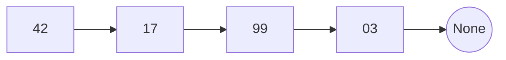
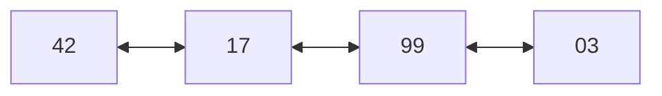
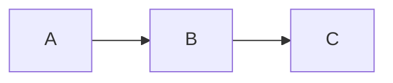
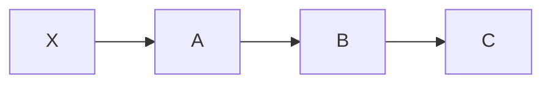
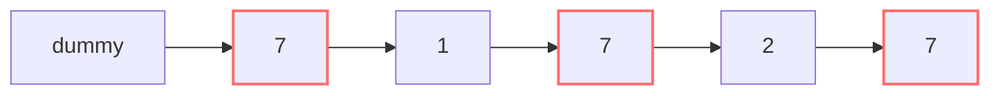
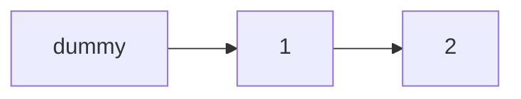

# Linked list

Le linked list sono il pane quotidiano del colloquio. Anche se nella vita reale Python non le usa quasi mai (le `list` sono dynamic array), in colloquio appaiono nel 30% dei problemi.

E hanno un superpotere didattico: ti **costringono a ragionare per puntatori**, una skill fondamentale che paga in tantissimi altri contesti.

## Parte 1 — Cosa è un puntatore, davvero

### Memoria + indirizzi: ripasso

Come visto nel cap. 02, la memoria è un nastro di celle, ognuna con un indirizzo numerico (0, 1, 2, ...).

Un **puntatore** è semplicemente un numero che rappresenta un indirizzo di memoria. *"Il puntatore p vale 1000"* significa *"p punta alla cella all'indirizzo 1000"*.

In Python non vedi i puntatori come numeri, ma esistono: ogni variabile **non contiene** l'oggetto, ne contiene un riferimento (puntatore implicito).

```python
a = [1, 2, 3]
b = a   # b punta allo stesso oggetto di a
b.append(4)
print(a)   # [1, 2, 3, 4] !! Modifichi tramite b, ma a vede il cambio
```

`a` e `b` sono due puntatori alla stessa lista. Modificare la lista da uno la fa "vedere" all'altro.

### Una linked list è una catena di nodi collegati

Immagina di voler memorizzare una sequenza di numeri, ma **non in celle contigue di memoria**. Invece, sparpagliate ovunque, e ogni "nodo" sa **dove sta il successivo**.



Ogni nodo ha:

- `val`: il valore.
- `next`: un puntatore al nodo successivo (o `None` se è l'ultimo).

In Python:

```python
class ListNode:
    def __init__(self, val=0, next=None):
        self.val = val
        self.next = next
```

### Doubly linked list

Variante: ogni nodo ha anche `prev` (puntatore al precedente).

```python
class DListNode:
    def __init__(self, val=0):
        self.val = val
        self.prev = None
        self.next = None
```

Visualizzazione:



## Parte 2 — Perché esiste? Array vs Linked List

| | Array | Singly LL |
|---|---|---|
| Memoria | contigua | sparsa, ogni nodo ovunque |
| Accesso a `i`-esimo | **O(1)** | O(n) (devi scorrere) |
| Insert/Delete in testa | O(n) (sposta tutto) | **O(1)** |
| Insert/Delete in coda | O(1) ammortizzato | O(n) o O(1) (con tail ptr) |
| Insert/Delete in mezzo (con ptr al precedente) | O(n) (sposta tutto) | **O(1)** |
| Cache-friendly | sì (vicini in indice = vicini in mem) | no (sparsi ovunque) |
| Overhead memoria | basso | alto (next ptr per nodo) |

### Quando ha senso usarle nella vita reale?

In Python: praticamente mai (`list` è sufficiente per tutto). In linguaggi sistemi come C++, sì:

- Quando hai **molti insert/delete a metà** e accesso casuale non importa.
- Per implementare strutture come queue, deque, hashmap (chaining), grafi (adjacency list).

**In colloquio, le linked list servono soprattutto come palestra mentale per ragionare per puntatori**.

## Parte 3 — Le operazioni fondamentali

### 3.1 Traverse

Stampa o processa tutti i nodi:

```python
cur = head
while cur:
    print(cur.val)
    cur = cur.next
```

Importante l'idiom `while cur:` — esce quando `cur is None` (fine lista).

### 3.2 Lunghezza

```python
def length(head):
    n = 0
    cur = head
    while cur:
        n += 1
        cur = cur.next
    return n
```

O(n).

### 3.3 Insert in testa

```python
def insert_head(head, val):
    new_node = ListNode(val)
    new_node.next = head
    return new_node   # nuova head
```

O(1).

**Prima**:



**Dopo**:



### 3.4 Insert dopo un nodo

```python
def insert_after(node, val):
    new_node = ListNode(val)
    new_node.next = node.next
    node.next = new_node
```

O(1). L'ordine è importante! Se inverti le due righe, perdi il riferimento al successivo:

```python
# SBAGLIATO:
node.next = new_node       # Ora node punta a new_node
new_node.next = node.next  # Ma node.next ora è new_node stesso → ciclo!
```

### 3.5 Delete dopo un nodo

```python
def delete_after(node):
    if node.next:
        node.next = node.next.next
```

O(1). Il nodo "saltato" verrà raccolto dal garbage collector (in Python).

## Parte 4 — Il trucco numero 1: il dummy node

Molti problemi su linked list hanno un caso speciale: **la modifica può coinvolgere la testa**.

Esempio: "rimuovi tutti i nodi con valore 7". Se la testa stessa è 7, devi cambiare la head. Se anche il secondo è 7, ancora. Bug-prone.

**Soluzione: aggiungi un dummy node "virtuale" prima della testa**.

```python
def delete_value(head, target):
    dummy = ListNode(0, head)
    cur = dummy
    while cur.next:
        if cur.next.val == target:
            cur.next = cur.next.next   # skip
        else:
            cur = cur.next
    return dummy.next   # nuova head
```

Visualizzazione:

**Prima** (rimuovendo i nodi con valore 7):



**Dopo**:



Nessun caso speciale per la testa: il dummy assorbe la complessità.

**Usa il dummy ogni volta che la testa potrebbe cambiare**.

## Parte 5 — Reverse di una linked list (spiegato 3 volte)

Il problema più chiesto in assoluto su linked list. Devi sapere scriverlo a memoria in 30 secondi.

### Versione 1: spiegata a parole

Vogliamo invertire `A → B → C → D` in `D → C → B → A`.

Idea: scorriamo nodo per nodo. Per ognuno, **flippiamo la freccia**.

Ma c'è un problema: appena flippi `A.next`, perdi il riferimento a `B`. Quindi devi **salvare il prossimo prima di flippare**.

```python
def reverse(head):
    prev = None       # all'inizio, "prima della testa" è None
    cur = head
    while cur:
        nxt = cur.next    # 1. SALVA il prossimo
        cur.next = prev   # 2. FLIPPA la freccia di cur
        prev = cur        # 3. AVANZA prev
        cur = nxt         # 4. AVANZA cur
    return prev   # nuova testa (l'ultimo cur valido)
```

### Versione 2: spiegata visualmente

Trace su `A → B → C → D`:

```
Step 0 (init):
  prev=None
  cur=A → B → C → D

Step 1 (iterazione 1):
  nxt = B   (salva)
  A.next = None  (flip: ora A non punta più a B, punta a None)
  prev = A
  cur = B
  Stato lista: None ← A   ;   B → C → D

Step 2:
  nxt = C
  B.next = A   (flip)
  prev = B
  cur = C
  Stato: None ← A ← B   ;   C → D

Step 3:
  nxt = D
  C.next = B
  prev = C
  cur = D
  Stato: None ← A ← B ← C   ;   D

Step 4:
  nxt = None
  D.next = C
  prev = D
  cur = None
  Stato: None ← A ← B ← C ← D

Loop esce (cur is None).
Return prev = D.
```

Risultato: `D → C → B → A → None`. ✓

### Versione 3: spiegata ricorsivamente

```python
def reverse_rec(head):
    if not head or not head.next:
        return head   # base: lista vuota o singolo nodo

    new_head = reverse_rec(head.next)   # inverti il resto
    head.next.next = head               # collega "io" alla fine del resto invertito
    head.next = None                    # io diventerò l'ultimo
    return new_head
```

Trace su `A → B → C → D`:

- `reverse_rec(A)` chiama `reverse_rec(B)`.
- `reverse_rec(B)` chiama `reverse_rec(C)`.
- `reverse_rec(C)` chiama `reverse_rec(D)`.
- `reverse_rec(D)`: base case, ritorna `D`. Adesso `D.next` è ancora `None` (era già l'ultimo).
- Tornati a `reverse_rec(C)`: `head=C`, `new_head=D`. `head.next.next` = `D.next` → lo facciamo puntare a `C`. Ora `D → C`. Setta `C.next = None`. Ritorna `D`.
- Tornati a `reverse_rec(B)`: `head=B`, `new_head=D`. `head.next.next` = `C.next` → lo facciamo puntare a `B`. Ora `D → C → B`. Setta `B.next = None`. Ritorna `D`.
- Tornati a `reverse_rec(A)`: similmente, `D → C → B → A`. Setta `A.next = None`. Ritorna `D`.

O(n) tempo, **O(n) spazio** per lo stack di ricorsione. Per liste lunghe (n > 1000), preferisci la versione iterativa.

### Quale ricordare?

Tutte e tre. In colloquio scrivi quella iterativa (più semplice, no stack). Se ti chiedono ricorsiva, sai farla.

## Parte 6 — Fast & slow pointers (Floyd's algorithm)

Un pattern straordinariamente elegante. Si chiama anche **Tortoise and Hare** (tartaruga e lepre).

### L'idea

Due puntatori partono insieme dalla testa. Uno (slow) avanza di 1 nodo per volta. L'altro (fast) avanza di 2.

```
Step 0: slow=A, fast=A
Step 1: slow=B, fast=C
Step 2: slow=C, fast=E
...
```

### Uso 1: trovare il middle

Quando `fast` arriva alla fine (o non può più avanzare di 2), `slow` è esattamente a metà. Una sola passata, O(n).

```python
def find_middle(head):
    slow = fast = head
    while fast and fast.next:
        slow = slow.next
        fast = fast.next.next
    return slow
```

Per lista pari (es. 4 nodi), `slow` finisce sul **secondo** dei due mediani. Se ti serve il primo, usa `while fast.next and fast.next.next`.

### Uso 2: detection di ciclo

Se la lista ha un ciclo (qualche `next` torna indietro), fast e slow **si incontreranno**.

```python
def has_cycle(head):
    slow = fast = head
    while fast and fast.next:
        slow = slow.next
        fast = fast.next.next
        if slow is fast:
            return True
    return False
```

**Perché funziona**? Se c'è un ciclo, una volta entrati nel ciclo entrambi i puntatori vi restano. Fast è "1 in più avanti" ad ogni iterazione (perché fa 2 passi vs 1). Quindi prima o poi raggiunge slow (dietro di un passo intero del ciclo). È come se fast inseguisse slow su una pista circolare.

### Uso 3: trovare l'inizio del ciclo

Dopo che si sono incontrati:

1. Resetta uno dei puntatori alla testa.
2. Avanzali entrambi di 1.
3. Si incontreranno **all'inizio del ciclo**.

```python
def detect_cycle(head):
    slow = fast = head
    while fast and fast.next:
        slow = slow.next
        fast = fast.next.next
        if slow is fast:
            p = head
            while p is not slow:
                p = p.next
                slow = slow.next
            return p
    return None
```

**Perché?** Dimostrazione (algebra):

Sia `a` = distanza head → inizio ciclo. `b` = distanza inizio ciclo → meeting point (in senso del ciclo). `c` = lunghezza ciclo.

Quando si incontrano:

- slow ha percorso `a + b`.
- fast ha percorso `a + b + k·c` per qualche `k` ≥ 1 (ha fatto k giri extra del ciclo).
- fast ha velocità 2× slow: `a + b + k·c = 2(a + b)` → `k·c = a + b` → `a = k·c - b`.

Quindi se partiamo da head e dal meeting point con velocità 1, percorriamo entrambi `a` passi. Slow arriva a `a + b + a = a + (kc - b) + b = a + kc` = "inizio ciclo + k giri" = inizio ciclo. Head arriva esattamente all'inizio del ciclo. **Si incontrano lì**. □

## Parte 7 — Pattern: Merge di due liste ordinate

```python
def merge(a, b):
    dummy = ListNode()
    tail = dummy
    while a and b:
        if a.val <= b.val:
            tail.next = a
            a = a.next
        else:
            tail.next = b
            b = b.next
        tail = tail.next
    tail.next = a or b   # attacca i resti
    return dummy.next
```

Idea: due puntatori, sempre prendi il minore dei due. Dummy node per gestire la testa elegantemente.

## Parte 8 — Pattern: intersezione di due liste

Date due liste che si fondono in qualche punto, trova il nodo di fusione.

**Trucco elegante**: scorri entrambe le liste. Quando un puntatore arriva a `None`, fallo ripartire dall'altra testa. Si incontreranno nel punto di intersezione (o entrambi a `None`).

```python
def intersection(a, b):
    pa, pb = a, b
    while pa is not pb:
        pa = pa.next if pa else b
        pb = pb.next if pb else a
    return pa
```

Perché funziona: dopo aver attraversato entrambe le liste, hanno percorso la stessa lunghezza totale (`|a| + |b|`). Quindi arrivano "in fase" al punto di intersezione.

## Parte 9 — Trappole comuni

### Trappola 1 — Dereference di None

```python
while cur:
    if cur.next.val == target:   # CRASH se cur.next is None
        ...

# Corretto:
while cur and cur.next:
    if cur.next.val == target: ...
```

### Trappola 2 — Salvare il next prima di sovrascrivere

```python
# SBAGLIATO:
cur.next = prev   # ora hai perso il riferimento al prossimo!

# Corretto:
nxt = cur.next    # SALVA prima
cur.next = prev
cur = nxt
```

### Trappola 3 — Ciclo accidentale

Se assegni `a.next = b` quando `b` punta indirettamente ad `a`, crei un ciclo. Per debug: stampa la lista limitando a N nodi.

```python
def safe_print(head, max_nodes=50):
    out = []
    cur = head
    while cur and len(out) < max_nodes:
        out.append(str(cur.val))
        cur = cur.next
    return " → ".join(out)
```

### Trappola 4 — Doubly linked: dimenticare `prev`

In doubly linked, ogni operazione richiede di aggiornare sia `next` che `prev`. Disattenzione comune:

```python
# Insert new dopo node (doubly linked)
new.prev = node
new.next = node.next
if node.next:
    node.next.prev = new   # DIMENTICATO SPESSO
node.next = new
```

### Trappola 5 — Testa che cambia

Già detto: usa il **dummy node** per evitare casi speciali.

## Esercizi guidati

### Esercizio 4.1 — Reverse Linked List <span class="problem-tag easy">EASY</span>

<details><summary>Soluzione</summary>

Vedi parte 5. Memorizza la versione iterativa.
</details>

### Esercizio 4.2 — Merge Two Sorted Lists <span class="problem-tag easy">EASY</span>

<details><summary>Soluzione</summary>

Vedi parte 7.
</details>

### Esercizio 4.3 — Linked List Cycle <span class="problem-tag easy">EASY</span>

<details><summary>Soluzione</summary>

Vedi parte 6 uso 2.
</details>

### Esercizio 4.4 — Cycle II (trova inizio ciclo) <span class="problem-tag medium">MEDIUM</span>

<details><summary>Soluzione</summary>

Vedi parte 6 uso 3 con dimostrazione.
</details>

### Esercizio 4.5 — Remove Nth Node From End <span class="problem-tag medium">MEDIUM</span>

Rimuovi l'n-esimo nodo dalla fine, in **una sola passata**.

<details><summary>Ragionamento</summary>

**Trucco classico**: due puntatori con gap di `n`.

1. `fast` parte dalla head e avanza di `n` nodi.
2. Poi `slow` parte dalla head, e entrambi avanzano insieme finché `fast` arriva all'ultimo.
3. A quel punto, `slow` è **proprio prima** dell'n-esimo dalla fine.

```python
def remove_nth(head, n):
    dummy = ListNode(0, head)
    fast = slow = dummy
    for _ in range(n):
        fast = fast.next
    while fast.next:
        fast = fast.next
        slow = slow.next
    slow.next = slow.next.next
    return dummy.next
```

Uso del dummy per gestire "n = lunghezza lista" (cioè rimuovere la testa).

O(n) tempo, O(1) spazio, una sola passata.
</details>

### Esercizio 4.6 — Palindrome Linked List <span class="problem-tag easy">EASY</span>

Verifica se la lista è palindroma. O(n) tempo, **O(1) spazio**.

<details><summary>Ragionamento</summary>

**Brute force O(n) spazio**: copia in lista Python, controlla palindromo. Ma vogliamo O(1).

**Tecnica**:

1. Trova il middle (fast/slow).
2. Reverse la seconda metà.
3. Confronta prima metà e seconda metà (invertita).
4. (Opzionalmente: ri-reverse per restaurare).

```python
def is_pal(head):
    # 1. Trova middle
    slow = fast = head
    while fast and fast.next:
        slow = slow.next
        fast = fast.next.next
    # 2. Reverse seconda metà partendo da slow
    prev = None
    while slow:
        nxt = slow.next
        slow.next = prev
        prev = slow
        slow = nxt
    # 3. Confronta
    left = head
    right = prev   # nuova testa della seconda metà invertita
    while right:
        if left.val != right.val:
            return False
        left = left.next
        right = right.next
    return True
```

O(n) tempo, O(1) spazio.

**Lezione**: combinare due tecniche base (fast/slow + reverse) risolve problemi che sembrano richiedere strutture extra.
</details>

### Esercizio 4.7 — Add Two Numbers <span class="problem-tag medium">MEDIUM</span>

Due numeri rappresentati come linked list (cifra meno significativa in testa). Restituisci somma come linked list.

<details><summary>Soluzione</summary>

```python
def add_two(a, b):
    dummy = ListNode()
    tail = dummy
    carry = 0
    while a or b or carry:
        v = carry + (a.val if a else 0) + (b.val if b else 0)
        carry, v = divmod(v, 10)
        tail.next = ListNode(v)
        tail = tail.next
        if a: a = a.next
        if b: b = b.next
    return dummy.next
```

Trace su `342 + 465 = 807` rappresentati come `2→4→3` + `5→6→4`:

```
iter 1: v=2+5+0=7, carry=0. Output: 7
iter 2: v=4+6+0=10, carry=1, v=0. Output: 7→0
iter 3: v=3+4+1=8, carry=0. Output: 7→0→8
fine: 7→0→8  che è 807. ✓
```

O(max(n, m)).
</details>

### Esercizio 4.8 — Copy List with Random Pointer <span class="problem-tag medium">MEDIUM</span>

Lista dove ogni nodo ha `next` e `random`. Fai deep copy.

<details><summary>Ragionamento</summary>

**Idea**: per ogni nodo originale, creiamo la sua copia. Ma il `random` punta a un altro nodo originale, e dobbiamo farlo puntare alla copia di quel nodo.

**Soluzione hashmap**: mapping `originale → copia`. Due passate.

```python
def copy_random(head):
    if not head: return None
    m = {}
    # Passata 1: crea le copie (senza link)
    cur = head
    while cur:
        m[cur] = Node(cur.val)
        cur = cur.next
    # Passata 2: collega next e random
    cur = head
    while cur:
        m[cur].next = m.get(cur.next)
        m[cur].random = m.get(cur.random)
        cur = cur.next
    return m[head]
```

O(n) tempo, O(n) spazio.

**Versione O(1) spazio**: interleaving (inserisci la copia DOPO ogni originale, poi splitta). Più complessa, ma elegante.
</details>

### Esercizio 4.9 — Reverse Nodes in K-Group <span class="problem-tag hard">HARD</span>

Reverse ogni gruppo di k nodi. Ultimo gruppo incompleto: lascialo com'è.

<details><summary>Soluzione</summary>

```python
def reverse_k_group(head, k):
    dummy = ListNode(0, head)
    group_prev = dummy
    while True:
        # Cerca il k-esimo nodo dopo group_prev
        kth = group_prev
        for _ in range(k):
            kth = kth.next
            if not kth:
                return dummy.next   # gruppo incompleto, fine
        group_next = kth.next
        # Reverse [group_prev.next .. kth]
        prev, cur = group_next, group_prev.next
        while cur is not group_next:
            nxt = cur.next
            cur.next = prev
            prev = cur
            cur = nxt
        # "Ricuci" group_prev → kth, e avanza group_prev
        tmp = group_prev.next   # diventerà il nuovo "ultimo" del gruppo
        group_prev.next = kth   # il gruppo è invertito, kth è il primo
        group_prev = tmp        # avanza per il prossimo gruppo
```

Difficile. Devi disegnarlo per capirlo. Esercizio "boss" di linked list.
</details>

### Esercizio 4.10 — LRU Cache (versione doubly linked list) <span class="problem-tag medium">MEDIUM</span>

Senza OrderedDict. Hashmap + doubly linked list.

<details><summary>Soluzione</summary>

```python
class Node:
    def __init__(self, k=0, v=0):
        self.k = k
        self.v = v
        self.prev = self.next = None

class LRUCache:
    def __init__(self, cap):
        self.cap = cap
        self.map = {}
        self.head = Node()   # dummy
        self.tail = Node()   # dummy
        self.head.next = self.tail
        self.tail.prev = self.head

    def _remove(self, n):
        n.prev.next = n.next
        n.next.prev = n.prev

    def _add_front(self, n):
        n.next = self.head.next
        n.prev = self.head
        self.head.next.prev = n
        self.head.next = n

    def get(self, k):
        if k not in self.map:
            return -1
        n = self.map[k]
        self._remove(n)
        self._add_front(n)
        return n.v

    def put(self, k, v):
        if k in self.map:
            self._remove(self.map[k])
        n = Node(k, v)
        self.map[k] = n
        self._add_front(n)
        if len(self.map) > self.cap:
            lru = self.tail.prev
            self._remove(lru)
            del self.map[lru.k]
```

Struttura:

```
head ↔ MRU ↔ ... ↔ LRU ↔ tail
```

I dummy head/tail eliminano casi speciali "lista vuota" o "rimuovere primo/ultimo".

Tutte le operazioni O(1). Questo è LA domanda più chiesta in colloquio.
</details>

### Esercizio 4.11 — Sort List <span class="problem-tag medium">MEDIUM</span>

Ordina una linked list in O(n log n).

<details><summary>Soluzione</summary>

Merge sort.

```python
def sort_list(head):
    if not head or not head.next:
        return head
    # Split in middle
    slow, fast = head, head.next
    while fast and fast.next:
        slow = slow.next
        fast = fast.next.next
    mid = slow.next
    slow.next = None
    return merge(sort_list(head), sort_list(mid))
```

Merge come visto in parte 7.

O(n log n) tempo. Stack O(log n).
</details>

## Riassunto del capitolo

1. **Puntatore = numero che rappresenta un indirizzo**. In Python, le variabili "sono" puntatori a oggetti.
2. **Linked list = catena di nodi**. Insert/delete in mezzo O(1), accesso a i-esimo O(n).
3. **Dummy node**: aggiungilo davanti alla head per evitare casi speciali. Sempre.
4. **Reverse iterativo**: `prev/cur/nxt`. Memorizzalo.
5. **Fast & slow pointers**: middle, cycle detection, inizio del ciclo. Pattern killer.
6. **Pattern hashmap+LL**: LRU cache.

Sai scrivere reverse in 30 secondi? Sai disegnare fast/slow? Hai padroneggiato il dummy? Allora questo capitolo è fatto. Vai al [cap. 05 — Stack e coda](05-stack-coda.html).
