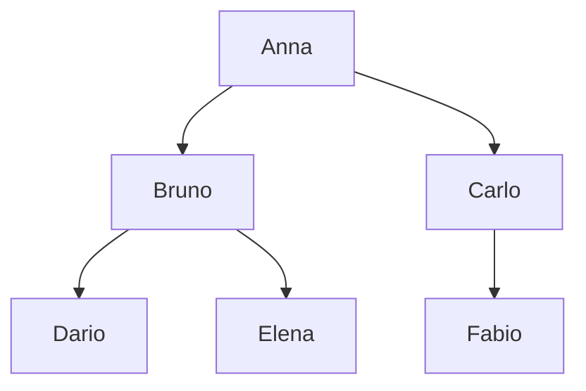
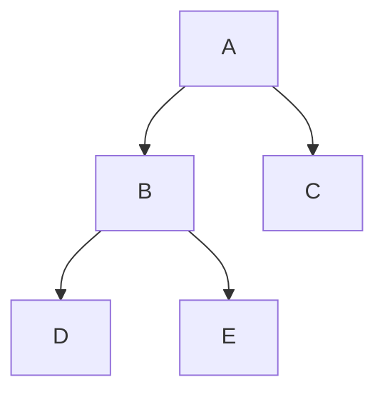
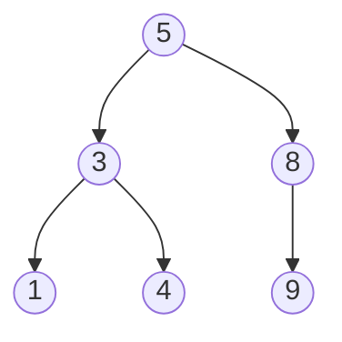
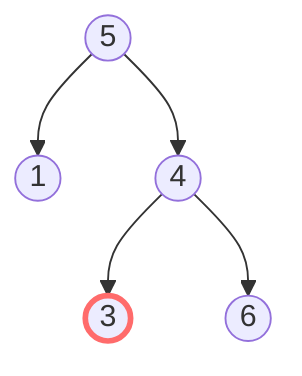
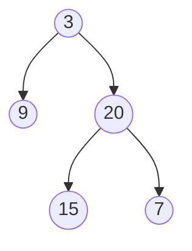

# Alberi

Almeno il **20%** dei problemi medium nei colloqui FAANG riguarda alberi. La buona notizia: padroneggiando i fondamenti, **tutti i problemi seguono lo stesso schema mentale**.

In questo capitolo costruiamo l'intuizione da zero. La chiave non è memorizzare codice: è imparare a pensare ricorsivamente.

## Parte 1 — Cos'è un albero

### L'analogia della famiglia (la migliore)

Pensa a un albero genealogico:



Anna ha due figli, Bruno e Carlo. Bruno ha a sua volta due figli (Dario e Elena). Carlo ha un solo figlio (Fabio). Dario, Elena e Fabio non hanno figli (sono "foglie").

In CS, un albero è la stessa cosa:

- Un nodo speciale chiamato **root** (la "matriarca").
- Ogni nodo può avere **figli** (children).
- Un nodo senza figli è una **foglia** (leaf).
- Ogni nodo (eccetto root) ha esattamente **un genitore** (parent).

### Definizione formale

Un albero è un grafo connesso, **aciclico** (senza cicli), **diretto** (le frecce vanno da padre a figli) e **gerarchico** (un solo "punto di partenza", la root).

### Albero binario

L'albero più studiato: ogni nodo ha **al massimo 2 figli**, chiamati `left` e `right`.

```python
class TreeNode:
    def __init__(self, val=0, left=None, right=None):
        self.val = val
        self.left = left
        self.right = right
```

In memoria, un albero binario "vive" come una rete di oggetti collegati da puntatori, simile alla linked list.

### Terminologia

Imparala una volta per tutte:

- **Root**: il nodo "in cima". L'unico senza genitore.
- **Parent / Child**: relazione padre-figlio.
- **Sibling**: nodi con stesso padre.
- **Leaf**: nodo senza figli.
- **Internal node**: nodo non-foglia.
- **Depth** di un nodo: numero di archi dal root al nodo. Root ha depth 0.
- **Height** di un nodo: numero massimo di archi dal nodo a una foglia. Foglie hanno height 0.
- **Height dell'albero** = height del root.
- **Subtree**: un nodo + tutti i suoi discendenti.

### Tipi speciali di alberi

- **Albero pieno (full)**: ogni nodo ha 0 o 2 figli.
- **Albero completo (complete)**: tutti i livelli pieni tranne forse l'ultimo, riempito da sinistra.
- **Albero perfetto (perfect)**: full + tutte le foglie alla stessa profondità.
- **Albero bilanciato**: per ogni nodo, |height(left) − height(right)| ≤ 1.

Perché ci importa? Perché in un albero **bilanciato** con `n` nodi, l'altezza è **O(log n)**. Tutte le operazioni che scendono "verticalmente" diventano O(log n).

In uno **sbilanciato** (es. "lista" — ogni nodo ha solo figlio sinistro), l'altezza è O(n). Tutto degenera.

## Parte 2 — Pensare ricorsivamente: la chiave di tutto

### L'analogia dell'amministratore delegato

Sei l'AD di un'azienda. Il direttivo ti chiede: "qual è il fatturato totale dell'azienda?".

Tu non vai personalmente in ogni filiale a contare. Chiedi al CEO di ogni divisione: *"qual è il fatturato della TUA divisione?"*. Ognuno fa lo stesso con i suoi subordinati, fino agli impiegati base.

Tu **sommi** le risposte e dai il totale.

Questo è esattamente come si pensa ricorsivamente su alberi: **delega ai figli e combina**.

### Il pattern universale

Per quasi ogni problema su alberi, la funzione ricorsiva segue questo schema:

```python
def solve(node):
    # 1. Base case: cosa succede su un nodo None?
    if not node:
        return base_value

    # 2. Risolvi sui figli
    left_result = solve(node.left)
    right_result = solve(node.right)

    # 3. Combina i risultati con questo nodo
    return combine(node.val, left_result, right_result)
```

Devi solo decidere:

- **Cosa ritorna la chiamata ricorsiva?** (la "domanda" che fai al figlio)
- **Cos'è il base case?**
- **Come combini i risultati?**

### Esempi del pattern

**1. Altezza dell'albero**

Domanda al figlio: "qual è la tua altezza?"

```python
def height(node):
    if not node: return 0
    return 1 + max(height(node.left), height(node.right))
```

**2. Conta nodi**

Domanda al figlio: "quanti nodi hai?"

```python
def count(node):
    if not node: return 0
    return 1 + count(node.left) + count(node.right)
```

**3. Somma valori**

Domanda al figlio: "qual è la somma dei tuoi valori?"

```python
def sum_tree(node):
    if not node: return 0
    return node.val + sum_tree(node.left) + sum_tree(node.right)
```

**4. Trova max**

```python
def find_max(node):
    if not node: return float('-inf')
    return max(node.val, find_max(node.left), find_max(node.right))
```

Notalo: una volta capito il pattern, sono tutti uguali. Cambia solo il `combine`.

## Parte 3 — Traversals: i 4 modi di visitare un albero

Visitare un albero significa "passare per tutti i nodi una volta". I 4 ordini fondamentali:

### Preorder: ROOT → LEFT → RIGHT

```python
def preorder(node):
    if not node: return
    print(node.val)            # ROOT: prima visita
    preorder(node.left)
    preorder(node.right)
```

Visualizzazione su:



Preorder visita: **A, B, D, E, C**.

**Quando usarlo**: quando devi processare il nodo prima dei suoi figli. Es. copiare un albero, serialize.

### Inorder: LEFT → ROOT → RIGHT

```python
def inorder(node):
    if not node: return
    inorder(node.left)
    print(node.val)
    inorder(node.right)
```

Stesso albero: **D, B, E, A, C**.

**Magia con BST**: inorder su un Binary Search Tree dà i valori **in ordine crescente**.

### Postorder: LEFT → RIGHT → ROOT

```python
def postorder(node):
    if not node: return
    postorder(node.left)
    postorder(node.right)
    print(node.val)
```

Stesso albero: **D, E, B, C, A**.

**Quando usarlo**: quando devi processare i figli prima del nodo. Es. eliminare un albero (devi cancellare i figli prima), calcoli che dipendono dai risultati dei figli (altezza, somma).

### Level order (BFS)

Visita livello per livello, sinistra a destra:

```python
from collections import deque
def level_order(root):
    if not root: return
    q = deque([root])
    while q:
        node = q.popleft()
        print(node.val)
        if node.left: q.append(node.left)
        if node.right: q.append(node.right)
```

Stesso albero: **A, B, C, D, E**.

**Quando usarlo**: shortest path in archi non pesati, processi per livello (es. zigzag, right side view, min depth).

### Riassunto pratico

| Cosa devi fare | Traversal |
|---|---|
| Visita BST in ordine crescente | Inorder |
| Validare BST | Inorder (deve essere strettamente crescente) |
| Copia / clone | Preorder |
| Serialize | Preorder (con marker per null) |
| Calcoli che richiedono i figli | Postorder |
| Eliminazione sicura | Postorder |
| Stampa livello per livello | BFS |
| Profondità minima | BFS (early exit alla prima foglia) |
| Profondità massima | DFS (postorder o preorder) |
| Trovare nodo per valore | Preorder con early exit |

### DFS iterativo (con stack esplicito)

Per alberi profondi `n > 10⁴`, lo stack di ricorsione può esplodere. Allora si usa stack esplicito.

```python
def preorder_iter(root):
    if not root: return []
    st = [root]
    out = []
    while st:
        n = st.pop()
        out.append(n.val)
        if n.right: st.append(n.right)   # right prima!
        if n.left: st.append(n.left)
    return out
```

Trucco: `right` prima sullo stack, così `left` viene poppato per primo (LIFO).

Inorder iterativo è più sottile:

```python
def inorder_iter(root):
    st = []
    cur = root
    out = []
    while cur or st:
        while cur:
            st.append(cur)
            cur = cur.left
        cur = st.pop()
        out.append(cur.val)
        cur = cur.right
    return out
```

Idea: scendi tutto a sinistra (push tutto sullo stack), poi pop, vai a destra, ripeti.

## Parte 4 — Binary Search Tree (BST)

### Definizione

Un BST è un albero binario dove, per **ogni nodo**:

- Tutti i valori nel sottoalbero **sinistro** sono **minori** del nodo.
- Tutti i valori nel sottoalbero **destro** sono **maggiori** del nodo.



Notare: 1 < 3 < 4 < 5 < 8 < 9. **Inorder = sequenza ordinata**.

### Operazioni

**Search**: scendi a sinistra se il target è minore, a destra se maggiore.

```python
def search_bst(root, target):
    cur = root
    while cur and cur.val != target:
        cur = cur.left if target < cur.val else cur.right
    return cur
```

O(h) tempo, dove `h` è l'altezza. Per BST **bilanciato**: O(log n). Per sbilanciato: O(n).

**Insert**: come search, ma a fine cammino crei un nodo.

```python
def insert_bst(root, val):
    if not root: return TreeNode(val)
    if val < root.val:
        root.left = insert_bst(root.left, val)
    else:
        root.right = insert_bst(root.right, val)
    return root
```

**Delete**: tre casi:

1. Foglia: rimuovi.
2. Un figlio: scollega, attacca il figlio al genitore.
3. Due figli: trova il successore inorder (più piccolo del sottoalbero destro), copia il suo valore nel nodo da eliminare, elimina il successore (caso 1 o 2).

### Bilanciamento

Inserendo valori già ordinati in un BST, ottieni una lista degenere → O(n).

Inserendo 1, 2, 3, 4, 5 in ordine:


Per garantire O(log n), servono **BST auto-bilancianti**: AVL, Red-Black, Treap, B-tree. Non implementarli in colloquio (1 giornata di codice). Sappi solo che esistono e che `set`/`dict` di Python NON sono BST (sono hashmap).

## Parte 5 — Lowest Common Ancestor (LCA)

Il primo antenato comune di due nodi. Problema classico, due varianti:

### LCA su BST

Sfrutta la proprietà BST: scendi finché i due target sono "splittati" (uno a sinistra, uno a destra). Quel nodo è LCA.

```python
def lca_bst(root, p, q):
    while root:
        if p.val < root.val and q.val < root.val:
            root = root.left
        elif p.val > root.val and q.val > root.val:
            root = root.right
        else:
            return root   # splittano qui
```

### LCA su albero binario generico

Senza BST property. Ricorsione "trova p o q che bubble-up".

```python
def lca(root, p, q):
    if not root or root is p or root is q:
        return root
    L = lca(root.left, p, q)
    R = lca(root.right, p, q)
    if L and R: return root   # p e q in sottoalberi diversi → root è LCA
    return L or R              # entrambi nello stesso sottoalbero
```

**Perché funziona?** La ricorsione restituisce:

- `None` se né p né q sono nel sottoalbero.
- `p` o `q` se solo uno è.
- L'LCA se entrambi sono.

Quando il root vede uno in left e uno in right → è lui l'LCA. Altrimenti propaga.

## Parte 6 — Trappole comuni

### Trappola 1 — Validare BST con solo confronti locali

```python
# SBAGLIATO:
def is_bst(node):
    if not node: return True
    if node.left and node.left.val >= node.val: return False
    if node.right and node.right.val <= node.val: return False
    return is_bst(node.left) and is_bst(node.right)
```

Questo passa su `[5, 1, 4, null, null, 3, 6]`:



Confronto locale: 4 ha 3 < 4 ✓ e 6 > 4 ✓. Sembra OK. **Ma è sbagliato**: 3 deve essere > 5 perché è nel sottoalbero destro di 5.

**Corretto**: passa giù i bound (min, max).

```python
def is_bst(node, lo=float('-inf'), hi=float('inf')):
    if not node: return True
    if not (lo < node.val < hi): return False
    return is_bst(node.left, lo, node.val) and is_bst(node.right, node.val, hi)
```

### Trappola 2 — Stack overflow su alberi sbilanciati

Per un albero "lista" con n = 10⁵, lo stack di ricorsione supera il limite Python (default ~1000).

Soluzione: aumenta limite (`sys.setrecursionlimit(10**6)`) o usa stack esplicito.

### Trappola 3 — None checks dimenticati

Quasi ogni bug su alberi nasce da `node.left.val` dove `node.left is None`.

Idiom sicuro: `if node.left:` o `node.left.val if node.left else default`.

### Trappola 4 — Confondere "altezza" e "profondità"

- **Depth**: dall'alto al nodo (root = 0).
- **Height**: dal nodo al basso (foglie = 0).

Sono dual. Confonderli porta a bug off-by-one.

### Trappola 5 — Iterare un dict mentre lo modifichi

Vale anche con `Counter` di valori d'albero. Usa `list(d.items())`.

## Esercizi guidati

### Esercizio 6.1 — Maximum Depth <span class="problem-tag easy">EASY</span>

<details><summary>Soluzione</summary>

```python
def max_depth(root):
    if not root: return 0
    return 1 + max(max_depth(root.left), max_depth(root.right))
```

Pattern ricorsivo classico. Chiedi ai figli "qual è la tua profondità?", aggiungi 1.
</details>

### Esercizio 6.2 — Invert Binary Tree <span class="problem-tag easy">EASY</span>

Specchia (swap left/right ricorsivamente).

<details><summary>Soluzione</summary>

```python
def invert(root):
    if not root: return None
    root.left, root.right = invert(root.right), invert(root.left)
    return root
```

Problema reso famoso dal tweet di Max Howell: *"Google: 90% of our engineers use the software you wrote (Homebrew), but you can't invert a binary tree on a whiteboard so f*** off"*.
</details>

### Esercizio 6.3 — Same Tree <span class="problem-tag easy">EASY</span>

<details><summary>Soluzione</summary>

```python
def same(a, b):
    if not a and not b: return True
    if not a or not b: return False
    return a.val == b.val and same(a.left, b.left) and same(a.right, b.right)
```
</details>

### Esercizio 6.4 — Symmetric Tree <span class="problem-tag easy">EASY</span>

L'albero è specchiato attorno alla root?

<details><summary>Soluzione</summary>

```python
def is_sym(root):
    def mirror(a, b):
        if not a and not b: return True
        if not a or not b: return False
        return a.val == b.val and mirror(a.left, b.right) and mirror(a.right, b.left)
    return mirror(root, root) if root else True
```

Funzione di supporto `mirror(a, b)` che controlla se due sottoalberi sono mirror image l'uno dell'altro.
</details>

### Esercizio 6.5 — Balanced Binary Tree <span class="problem-tag easy">EASY</span>

<details><summary>Ragionamento</summary>

**Naive**: per ogni nodo, calcola altezza dei due figli e confronta. O(n²).

**Ottimo**: in una sola passata. La ricorsione ritorna l'altezza, oppure `-1` se sbilanciato (sentinella). Se un sottoalbero è già sbilanciato, propaga `-1` su.

```python
def is_balanced(root):
    def h(node):
        if not node: return 0
        l = h(node.left)
        if l == -1: return -1
        r = h(node.right)
        if r == -1 or abs(l - r) > 1: return -1
        return 1 + max(l, r)
    return h(root) != -1
```

O(n).

**Lezione**: a volte "early exit" si fa con valore sentinella nella ricorsione.
</details>

### Esercizio 6.6 — Diameter <span class="problem-tag easy">EASY</span>

Numero massimo di archi tra due nodi qualsiasi.

<details><summary>Ragionamento</summary>

Il diametro **passando per un nodo specifico** = (altezza sinistra) + (altezza destra).

Quindi: ricorsione che calcola altezza, e in parallelo aggiorna un `best` globale con `left_h + right_h`.

```python
def diameter(root):
    best = 0
    def h(node):
        nonlocal best
        if not node: return 0
        l = h(node.left)
        r = h(node.right)
        best = max(best, l + r)
        return 1 + max(l, r)
    h(root)
    return best
```

**Lezione (importante)**: il "trucco delle due variabili":

- La **funzione ricorsiva** ritorna qualcosa che serve al padre per essere combinabile (qui: altezza).
- La **variabile globale/nonlocal** traccia il "miglior risultato globale" attraversando i nodi.

Questo trucco è usato in MOLTI problemi hard sugli alberi.
</details>

### Esercizio 6.7 — Validate BST <span class="problem-tag medium">MEDIUM</span>

<details><summary>Soluzione</summary>

Vedi parte 6 trappola 1.
</details>

### Esercizio 6.8 — LCA (Binary Tree) <span class="problem-tag medium">MEDIUM</span>

<details><summary>Soluzione</summary>

Vedi parte 5.
</details>

### Esercizio 6.9 — Path Sum II <span class="problem-tag medium">MEDIUM</span>

Tutti i cammini root→foglia con somma = target.

<details><summary>Soluzione (con backtracking)</summary>

```python
def path_sum(root, target):
    res = []
    def dfs(node, path, rem):
        if not node: return
        path.append(node.val)
        if not node.left and not node.right and rem == node.val:
            res.append(path[:])   # IMPORTANTE: copia!
        else:
            dfs(node.left, path, rem - node.val)
            dfs(node.right, path, rem - node.val)
        path.pop()   # backtrack
    dfs(root, [], target)
    return res
```

Pattern backtracking: appendi prima di ricorrere, pop al ritorno. Risultati salvati per copia (`path[:]`), altrimenti tutti puntano alla stessa lista.
</details>

### Esercizio 6.10 — Level Order Traversal <span class="problem-tag medium">MEDIUM</span>

<details><summary>Soluzione</summary>

BFS che raccoglie nodi per livello:

```python
def level_order(root):
    if not root: return []
    q = deque([root])
    out = []
    while q:
        level = []
        for _ in range(len(q)):  # numero di nodi del livello corrente
            n = q.popleft()
            level.append(n.val)
            if n.left: q.append(n.left)
            if n.right: q.append(n.right)
        out.append(level)
    return out
```

Trucco: `for _ in range(len(q))` ti dà la dimensione del livello prima di iniziare ad aggiungere il livello successivo.
</details>

### Esercizio 6.11 — Right Side View <span class="problem-tag medium">MEDIUM</span>

<details><summary>Soluzione</summary>

BFS, prendi l'ultimo nodo di ogni livello:

```python
def right_view(root):
    if not root: return []
    q = deque([root])
    res = []
    while q:
        size = len(q)
        for i in range(size):
            n = q.popleft()
            if i == size - 1:
                res.append(n.val)   # ultimo del livello
            if n.left: q.append(n.left)
            if n.right: q.append(n.right)
    return res
```
</details>

### Esercizio 6.12 — Kth Smallest in BST <span class="problem-tag medium">MEDIUM</span>

<details><summary>Soluzione</summary>

Inorder iterativo, ferma al k-esimo.

```python
def kth_smallest(root, k):
    st = []
    cur = root
    while True:
        while cur:
            st.append(cur)
            cur = cur.left
        cur = st.pop()
        k -= 1
        if k == 0: return cur.val
        cur = cur.right
```

O(h + k). Bonus: implementazione lazy.
</details>

### Esercizio 6.13 — Serialize/Deserialize Binary Tree <span class="problem-tag hard">HARD</span>

<details><summary>Soluzione</summary>

Preorder con marker `'#'` per null.

```python
class Codec:
    def serialize(self, root):
        out = []
        def go(n):
            if not n:
                out.append('#'); return
            out.append(str(n.val))
            go(n.left); go(n.right)
        go(root)
        return ' '.join(out)

    def deserialize(self, data):
        it = iter(data.split())
        def build():
            v = next(it)
            if v == '#': return None
            n = TreeNode(int(v))
            n.left = build()
            n.right = build()
            return n
        return build()
```

Preorder è scelta naturale: l'ordine di visita è anche l'ordine in cui ricostruisci.
</details>

### Esercizio 6.14 — Binary Tree Maximum Path Sum <span class="problem-tag hard">HARD</span>

Somma massima di un cammino tra due nodi qualsiasi (può anche essere un solo nodo).

<details><summary>Ragionamento (importante)</summary>

Stesso trucco di Diameter, generalizzato.

La funzione ricorsiva ritorna: **miglior somma scendendo dal nodo verso UN solo dei figli** (compositiva).

La variabile globale traccia: **miglior somma attraversando questo nodo come "piega"** (passando da sinistra a destra attraverso il nodo).

```python
def max_path_sum(root):
    best = float('-inf')
    def gain(node):
        nonlocal best
        if not node: return 0
        l = max(gain(node.left), 0)   # se negativo, scarta
        r = max(gain(node.right), 0)
        best = max(best, node.val + l + r)   # "piega" qui
        return node.val + max(l, r)          # propaga su solo un lato
    gain(root)
    return best
```

**Trucco**: `max(..., 0)` per scartare contributi negativi. Se aggiungere un sottoalbero peggiora, meglio non aggiungerlo.

Pattern d'oro: la funzione **non ritorna** ciò che vuoi (best), ritorna ciò che **serve al padre** per essere composto. Il "tuo" risultato viaggia in una variabile esterna.
</details>

### Esercizio 6.15 — Construct from Preorder + Inorder <span class="problem-tag medium">MEDIUM</span>

<details><summary>Ragionamento</summary>

**Insight**: il primo elemento di preorder è la **root**. Trovala in inorder → tutto a sinistra è il sottoalbero sinistro, tutto a destra il destro.

```python
def build_tree(preorder, inorder):
    idx = {v: i for i, v in enumerate(inorder)}
    pre_it = iter(preorder)
    def go(lo, hi):
        if lo > hi: return None
        val = next(pre_it)
        n = TreeNode(val)
        m = idx[val]
        n.left = go(lo, m - 1)
        n.right = go(m + 1, hi)
        return n
    return go(0, len(inorder) - 1)
```

O(n) con hashmap per lookup inorder.

Trace su `preorder = [3,9,20,15,7]`, `inorder = [9,3,15,20,7]`:

- root = 3. In inorder, 3 è all'indice 1. Left subtree: inorder[0:1] = [9]. Right: inorder[2:5] = [15,20,7].
- Procedo ricorsivamente. Per left: preorder.next = 9 → TreeNode(9), niente figli.
- Per right: preorder.next = 20 → TreeNode(20). In inorder right è all'indice 3. Left subtree: [15]. Right: [7].
- ... e così via.

Albero finale:


</details>

## Riassunto del capitolo

1. **Albero = root + figli ricorsivamente**. Pensa "famiglia".
2. **Pensiero ricorsivo**: chiedi ai figli, combina. Non fare "tutto in una funzione iterativa".
3. **4 traversals**: preorder, inorder, postorder, BFS. Sai a memoria a cosa servono.
4. **BST**: inorder = sequenza ordinata. Search O(h).
5. **Pattern "due variabili"**: ricorsione ritorna ciò che serve al padre; variabile globale traccia il best globale.
6. **Trappola n.1**: validate BST richiede bound, non solo confronti locali.

Quando padroneggi alberi, sei pronto per **grafi** (cap. 08). Un albero è un caso speciale di grafo. Tutti gli algoritmi che impariamo sugli alberi (DFS, BFS, ricorsione) si generalizzano.
