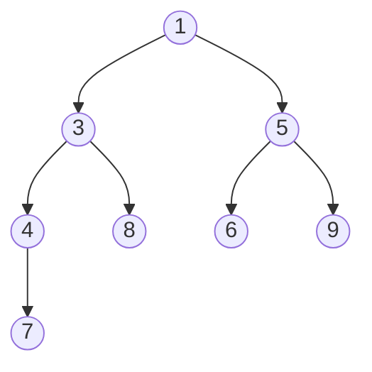

# Heap e priority queue

L'heap è la struttura giusta quando devi **estrarre ripetutamente il minimo (o massimo)**. È il cuore di Dijkstra, top-K, mediana streaming.

In Python si chiama `heapq` ed è **solo min-heap**. Per max-heap si trucca.

## Parte 1 — Cos'è un heap, davvero

### Albero binario completo

Un heap è un **albero binario completo** (tutti i livelli pieni tranne forse l'ultimo, riempito da sinistra) con una proprietà speciale: per ogni nodo, **il valore è ≤ dei figli** (min-heap) oppure **≥ dei figli** (max-heap).

Esempio min-heap:



Notare:

- 1 è il minimo. Sempre in cima.
- 1 ≤ 3, 1 ≤ 5. 3 ≤ 4, 3 ≤ 8. 5 ≤ 6, 5 ≤ 9. 4 ≤ 7.
- L'albero è "compatto", riempito a sinistra.

### NON è un BST

In un BST, sinistra < nodo < destra. Qui no: 4 e 8 sono entrambi figli di 3, ma non c'è ordinamento "totale" sui figli. Solo "ogni padre ≤ figli".

Quindi un heap **non** supporta "cerca valore X in O(log n)". Per quello servono BST. Heap supporta solo "qual è il min/max" (O(1)) e "estrai il min/max" (O(log n)).

### Implementazione: array, non puntatori

Trucco genio: rappresenta l'albero binario completo come array, sfruttando posizioni numeriche.

Per nodo all'indice `i`:

- Padre: `(i-1) // 2`
- Figlio sinistro: `2i + 1`
- Figlio destro: `2i + 2`

Heap di sopra come array: `[1, 3, 5, 4, 8, 6, 9, 7]`.

Verifica: nodo `4` è all'indice 3. Padre = (3-1)//2 = 1 = `3`. ✓

**Nessun puntatore**, **memoria contigua**, **cache-friendly**. Elegante.

## Parte 2 — Operazioni: come funzionano

### Push (heappush): O(log n)

1. Aggiungi il valore in fondo all'array.
2. **Bubble up**: confronta con il padre. Se più piccolo (in min-heap), scambia. Ripeti.

```
Heap iniziale: [1, 3, 5, 4, 8, 6, 9, 7]
Push(2):
  Aggiungi in fondo: [1, 3, 5, 4, 8, 6, 9, 7, 2]
  Padre di indice 8 = (8-1)//2 = 3 (valore 4). 2 < 4 → scambia.
  [1, 3, 5, 2, 8, 6, 9, 7, 4]
  Padre di indice 3 = 1 (valore 3). 2 < 3 → scambia.
  [1, 2, 5, 3, 8, 6, 9, 7, 4]
  Padre di indice 1 = 0 (valore 1). 2 < 1 falso → stop.
```

`log n` confronti al massimo (altezza dell'albero).

### Pop (heappop): O(log n)

1. Il risultato è la root (`arr[0]`).
2. Sposta l'ultimo elemento alla root.
3. **Bubble down**: confronta con il figlio più piccolo. Se maggiore, scambia. Ripeti.

```
Heap: [1, 2, 5, 3, 8, 6, 9, 7, 4]
Pop:
  result = 1
  Ultimo (4) va in root: [4, 2, 5, 3, 8, 6, 9, 7]
  Figli di 0: indici 1 (=2), 2 (=5). Min è 2. 4 > 2 → scambia.
  [2, 4, 5, 3, 8, 6, 9, 7]
  Figli di 1: indici 3 (=3), 4 (=8). Min è 3. 4 > 3 → scambia.
  [2, 3, 5, 4, 8, 6, 9, 7]
  Figli di 3: indice 7 (=7). 4 < 7 → stop.
```

Return 1, heap aggiornato. `log n`.

### Heapify (lista → heap in O(n))

Sorprendentemente, costruire un heap da un array è **O(n)**, non O(n log n). Si fa bubble-down dal centro fino alla root.

```python
def heapify(arr):
    n = len(arr)
    for i in range(n // 2 - 1, -1, -1):
        _sift_down(arr, i, n)
```

Analisi: la maggior parte dei nodi sono vicino alle foglie (poche operazioni). I pochi nodi alti pagano O(log n). Somma: O(n).

## Parte 3 — API Python `heapq`

```python
import heapq
h = []
heapq.heappush(h, x)         # O(log n)
x = heapq.heappop(h)         # O(log n), ritorna il min
top = h[0]                   # peek senza pop, O(1)
heapq.heapify(arr)           # in-place, O(n)

# Top K più piccoli o più grandi
heapq.nsmallest(k, arr)
heapq.nlargest(k, arr)

# Push + pop in un colpo (più veloce)
heapq.heappushpop(h, x)      # push poi pop
heapq.heapreplace(h, x)      # pop poi push (assume non vuoto)
```

### Max-heap in Python: nega i valori

`heapq` è solo min-heap. Trucco standard: negare.

```python
# Max-heap simulato
h = []
heapq.heappush(h, -x)
top_max = -heapq.heappop(h)
```

### Heap di tuple

Quando confronti per priorità composta, usa tuple. Python compara lessicograficamente.

```python
heapq.heappush(h, (priority, value))
```

**Problema sottile**: se due tuple hanno stessa priorità e `value` non è comparabile (es. dict, oggetto custom), Python solleva TypeError.

**Soluzione**: aggiungi un counter come "tiebreaker":

```python
counter = 0
heapq.heappush(h, (priority, counter, value))
counter += 1
```

## Parte 4 — Pattern fondamentali

### Pattern 1 — Top K elements

Domanda tipica: "i K elementi più grandi/piccoli/frequenti".

**Brute force**: ordina tutto → O(n log n).

**Ottimo con heap**: mantieni un **min-heap di dimensione k**. Per ogni nuovo elemento, se è maggiore del top (cioè del minimo dei k che hai), sostituisci.

```python
def top_k_largest(arr, k):
    h = []
    for x in arr:
        if len(h) < k:
            heapq.heappush(h, x)
        elif x > h[0]:
            heapq.heapreplace(h, x)
    return h   # i k più grandi, non ordinati
```

**Perché min-heap per i k più grandi?** Perché il top (min) è il **candidato da scartare** se arriva un nuovo elemento migliore.

Complessità: **O(n log k)**, spazio O(k). Per `n=1M`, `k=10`: ~33 milioni di op invece di 20 milioni → simili in pratica ma con O(k) memoria.

### Pattern 2 — Merge K sorted lists

Dato K liste ordinate, mergiale.

**Idea**: heap iniziale con il primo elemento di ogni lista. Pop il min, push il prossimo della stessa lista.

```python
def merge_k(lists):
    h = []
    for i, lst in enumerate(lists):
        if lst:
            heapq.heappush(h, (lst[0].val, i, lst[0]))
    dummy = tail = ListNode()
    while h:
        v, i, node = heapq.heappop(h)
        tail.next = node
        tail = tail.next
        if node.next:
            heapq.heappush(h, (node.next.val, i, node.next))
    return dummy.next
```

Complessità: O(N log k) dove N è il totale, k il numero di liste.

### Pattern 3 — Two heaps per la mediana streaming

Problema: ricevi numeri uno alla volta, devi rispondere in O(1) "qual è la mediana di tutto ciò che ho visto finora?".

**Idea geniale**: mantieni due heap.

- `lo`: max-heap (negato) della metà inferiore.
- `hi`: min-heap della metà superiore.

Mantieni l'invariante: `lo` ha lo stesso numero di elementi di `hi`, o uno in più.

Mediana:

- Se `|lo| > |hi|`: mediana = top di `lo`.
- Se uguali: mediana = (top lo + top hi) / 2.

Quando aggiungi un nuovo numero:

1. Push in lo (con negazione).
2. Sposta il max di lo in hi (mantiene ordine).
3. Se hi ha più elementi di lo, sposta indietro.

```python
import heapq
class MedianFinder:
    def __init__(self):
        self.lo = []   # max-heap (negato)
        self.hi = []   # min-heap

    def add(self, x):
        # Aggiungi a lo (negato), poi sposta il max in hi
        heapq.heappush(self.lo, -heapq.heappushpop(self.hi, x))
        # Bilancia: lo dovrebbe essere ≥ hi
        if len(self.lo) > len(self.hi):
            heapq.heappush(self.hi, -heapq.heappop(self.lo))

    def find_median(self):
        if len(self.hi) > len(self.lo):
            return self.hi[0]
        return (self.hi[0] - self.lo[0]) / 2
```

O(log n) per add, O(1) per find.

Trace: stream `[1, 2, 3]`:

```
add(1):
  push 1 in hi via lo: heappushpop(hi=[], 1) → ritorna 1, hi=[]. heappush(lo, -1). lo=[-1].
  |lo|=1 > |hi|=0 → sposta: heappush(hi, -heappop(lo)) = heappush(hi, 1). lo=[], hi=[1].
median: |hi|=1 > |lo|=0 → 1.

add(2):
  heappushpop(hi=[1], 2) → ritorna 1. heappush(lo, -1). lo=[-1], hi=[2].
  |lo|=1 = |hi|=1 → no balance.
median: stesso size → (2 - (-1))/2 = (2+1)/2 = 1.5. ✓

add(3):
  heappushpop(hi=[2], 3) → ritorna 2. heappush(lo, -2). lo=[-2,-1], hi=[3].
  |lo|=2 > |hi|=1 → sposta: heappush(hi, -heappop(lo)) = heappush(hi, 2). lo=[-1], hi=[2,3].
median: |hi|=2 > |lo|=1 → 2. ✓
```

### Pattern 4 — Scheduling / Simulation

Heap su `(next_event_time, evento)`. Estrai sempre l'evento più prossimo.

Esempi: Meeting Rooms II, Task Scheduler.

### Pattern 5 — Dijkstra

Heap di `(distanza, nodo)`. Estrai sempre il nodo non visitato con distanza minore. Già visto nel cap. 08.

## Parte 5 — Trappole comuni

### 1. `heapq` è solo min-heap

Per max, nega. Dimenticarlo è bug comune.

### 2. Heap NON mantiene ordine globale

Solo "il top è il minimo". Iterare un heap **non** dà gli elementi in ordine. Per averli ordinati, fai pop ripetuti.

### 3. Comparazione di oggetti non comparabili

Tuple `(priority, oggetto)` rompe se oggetto non implementa `__lt__`. Aggiungi un contatore intermedio.

### 4. `heapify(arr)` modifica `arr` in-place

Se vuoi mantenere l'originale, copialo prima.

### 5. `heapq.nlargest(k, arr)` su array enorme

`nlargest` è O(n log k). Per `k > n/2`, conviene `sorted(arr)[-k:]` (O(n log n)).

## Esercizi

### Esercizio 7.1 — Kth Largest Element <span class="problem-tag medium">MEDIUM</span>

<details><summary>Soluzione</summary>

```python
import heapq
def kth_largest(arr, k):
    return heapq.nlargest(k, arr)[-1]
```

O(n log k). Per O(n) servirebbe Quickselect.
</details>

### Esercizio 7.2 — Top K Frequent Elements <span class="problem-tag medium">MEDIUM</span>

<details><summary>Soluzione</summary>

```python
from collections import Counter
def top_k(arr, k):
    c = Counter(arr)
    return heapq.nlargest(k, c.keys(), key=c.get)
```

`heapq.nlargest` con `key` ti permette di ordinare per chiave custom.
</details>

### Esercizio 7.3 — K Closest Points to Origin <span class="problem-tag medium">MEDIUM</span>

<details><summary>Soluzione</summary>

Max-heap di dimensione k. Per ogni punto, se più vicino del top, sostituisci.

```python
def k_closest(points, k):
    h = []
    for x, y in points:
        d = x*x + y*y
        if len(h) < k:
            heapq.heappush(h, (-d, x, y))   # max-heap via negazione
        elif -h[0][0] > d:
            heapq.heapreplace(h, (-d, x, y))
    return [[x, y] for _, x, y in h]
```

O(n log k).

**Nota**: usiamo distanza al quadrato (non sqrt) — più veloce e preserva l'ordine.
</details>

### Esercizio 7.4 — Merge K Sorted Lists <span class="problem-tag hard">HARD</span>

Vedi parte 4 pattern 2.

### Esercizio 7.5 — Find Median from Data Stream <span class="problem-tag hard">HARD</span>

Vedi parte 4 pattern 3.

### Esercizio 7.6 — Meeting Rooms II <span class="problem-tag medium">MEDIUM</span>

Dato `intervals = [(start, end), ...]`, minimo numero di stanze necessarie per ospitare tutti gli incontri.

<details><summary>Ragionamento</summary>

**Idea**: ordina per start. Heap dei tempi di fine delle stanze attualmente occupate.

Per ogni nuovo meeting:

- Se la stanza che si libera prima (top del heap) si libera entro l'inizio del nuovo → riutilizzala (pop).
- Push del nuovo end time.

Risultato = dimensione finale dell'heap.

```python
def min_meeting_rooms(intervals):
    intervals.sort(key=lambda x: x[0])
    h = []
    for s, e in intervals:
        if h and h[0] <= s:
            heapq.heappop(h)
        heapq.heappush(h, e)
    return len(h)
```

O(n log n).

Trace su `[(0,30), (5,10), (15,20)]`:

```
sort: già ordinato.
(0,30): h=[30], 1 stanza.
(5,10): h[0]=30 > 5 → no reuse. push 10. h=[10, 30], 2 stanze.
(15,20): h[0]=10 ≤ 15 → pop. push 20. h=[20, 30], 2 stanze.
```

Risultato: 2.
</details>

### Esercizio 7.7 — Task Scheduler <span class="problem-tag medium">MEDIUM</span>

Hai task con cooldown n tra task uguali. Tempo minimo per completarli.

<details><summary>Soluzione</summary>

Max-heap delle frequenze + queue di task in cooldown.

```python
from collections import Counter, deque
def least_interval(tasks, n):
    c = Counter(tasks)
    h = [-v for v in c.values()]
    heapq.heapify(h)
    time = 0
    q = deque()   # (count_negato, ready_time)
    while h or q:
        time += 1
        if h:
            cnt = heapq.heappop(h) + 1   # ne facciamo 1 (negato → +1 si avvicina a 0)
            if cnt < 0:
                q.append((cnt, time + n))
        if q and q[0][1] == time:
            heapq.heappush(h, q.popleft()[0])
    return time
```
</details>

### Esercizio 7.8 — Kth Smallest in Sorted Matrix <span class="problem-tag medium">MEDIUM</span>

Matrice n×n con righe e colonne ordinate. K-esimo più piccolo.

<details><summary>Soluzione</summary>

Min-heap inizializzato con (mat[0][0], 0, 0). Pop, push dei vicini.

```python
def kth_smallest(M, k):
    n = len(M)
    h = [(M[0][0], 0, 0)]
    seen = {(0, 0)}
    for _ in range(k - 1):
        v, i, j = heapq.heappop(h)
        for di, dj in [(1, 0), (0, 1)]:
            ni, nj = i + di, j + dj
            if ni < n and nj < n and (ni, nj) not in seen:
                heapq.heappush(h, (M[ni][nj], ni, nj))
                seen.add((ni, nj))
    return h[0][0]
```

O(k log k).

Esiste anche binary search sul valore in O(n log(max-min)), ma è meno intuitivo.
</details>

### Esercizio 7.9 — Last Stone Weight <span class="problem-tag easy">EASY</span>

<details><summary>Soluzione</summary>

Max-heap. Estrai i due più grandi; se diversi, reinserisci la differenza.

```python
def last_stone_weight(stones):
    h = [-s for s in stones]
    heapq.heapify(h)
    while len(h) > 1:
        a = -heapq.heappop(h)
        b = -heapq.heappop(h)
        if a > b:
            heapq.heappush(h, -(a - b))
    return -h[0] if h else 0
```
</details>

### Esercizio 7.10 — Reorganize String <span class="problem-tag medium">MEDIUM</span>

Riordina stringa così che nessun carattere adiacente sia uguale. "" se impossibile.

<details><summary>Soluzione</summary>

Max-heap delle frequenze. Ad ogni step prendi i **due più frequenti** disponibili, aggiungili all'output, decrementa.

```python
def reorganize(s):
    c = Counter(s)
    if max(c.values()) > (len(s) + 1) // 2:
        return ""
    h = [(-v, k) for k, v in c.items()]
    heapq.heapify(h)
    out = []
    while len(h) >= 2:
        v1, c1 = heapq.heappop(h)
        v2, c2 = heapq.heappop(h)
        out += [c1, c2]
        if v1 + 1: heapq.heappush(h, (v1 + 1, c1))
        if v2 + 1: heapq.heappush(h, (v2 + 1, c2))
    if h:
        out.append(h[0][1])
    return "".join(out)
```

**Check iniziale**: se un carattere ha frequenza > ceil(n/2), impossibile. Es. "aab" ha a=2 e (3+1)/2 = 2. OK. "aaab" ha a=3 > (4+1)/2 = 2. Impossibile.
</details>

## Riassunto

1. **Heap = albero binario completo + invariante padre vs figli**. Implementato come array.
2. **O(log n) push/pop**, **O(1) peek**, **O(n) heapify**.
3. **`heapq` è min-heap**. Per max, negare.
4. **Top-K**: min-heap di dimensione k, sostituisci se più grande del top.
5. **Two heaps per mediana streaming**: max-heap inferiore + min-heap superiore.
6. **Pattern di scheduling**: heap su tempi di prossimo evento.
