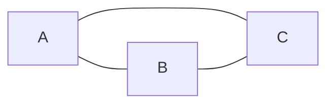
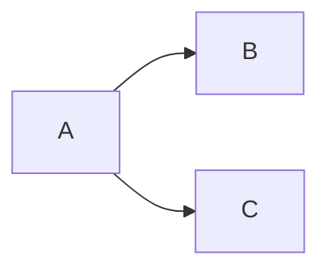
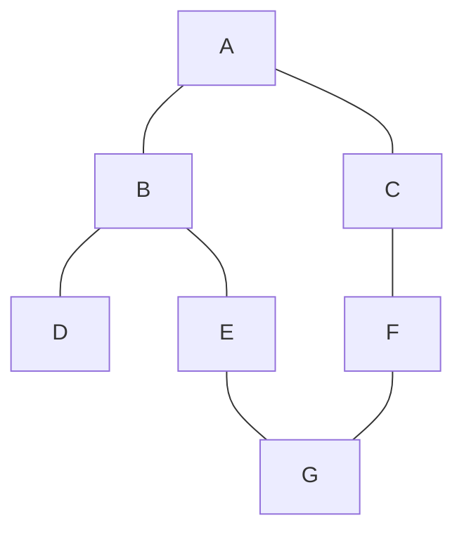
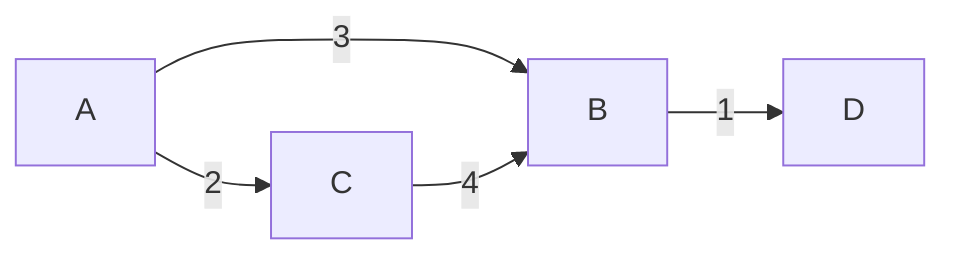

# Grafi

I grafi sono **ovunque** nella vita reale e nei colloqui: social network, mappe, dipendenze tra task, internet, web crawlers. Sono il capitolo più ricco e profondo del materiale FAANG.

Iniziamo da zero.

## Parte 1 — Cosa è un grafo

### Analogia: la mappa delle città

Pensa a un foglio con disegnate città collegate da strade.

- Le **città** sono i **nodi** (vertici).
- Le **strade** sono gli **archi** (edges).

Un grafo è esattamente questo: un insieme di nodi e un insieme di archi che li collegano.

### Tipi di grafo

**Diretto vs non diretto**

- **Non diretto**: gli archi sono bidirezionali. Se c'è una strada da A a B, c'è anche da B ad A. Es: mappa stradale, amicizie su Facebook.
- **Diretto** (digrafo): gli archi hanno una direzione. Es: follower su Twitter (puoi seguire X senza che X ti segua), dipendenze tra corsi universitari.

**Non diretto**:



**Diretto**:



**Pesato vs non pesato**

- **Non pesato**: tutti gli archi sono uguali. Conta solo "esiste o no".
- **Pesato**: ogni arco ha un valore (costo, distanza, tempo). Es: rete autostradale con km.

**Aciclico vs ciclico**

- **Aciclico (DAG)**: non ci sono cicli. Importante per topological sort.
- **Ciclico**: ci sono cicli.

**Connesso vs sconnesso**

- **Connesso**: esiste un cammino tra ogni coppia di nodi (nel caso diretto, "fortemente connesso").
- **Sconnesso**: ci sono gruppi isolati.

### Un albero è un grafo speciale

Un albero è un grafo **connesso**, **aciclico**, **non diretto** (o diretto a partire dalla root). Ogni nodo ha esattamente un genitore tranne la root.

Quindi tutti gli algoritmi che hai imparato sugli alberi sono casi speciali di algoritmi su grafi.

## Parte 2 — Come rappresentare un grafo in codice

Tre modi principali. Scegli in base al problema.

### Rappresentazione 1 — Adjacency list (la più usata)

Per ogni nodo, una lista dei suoi vicini.

```python
from collections import defaultdict
graph = defaultdict(list)
graph[u].append(v)
# Se non diretto, aggiungi anche:
graph[v].append(u)
```

Esempio: grafo non diretto con archi `(0,1), (0,2), (1,2), (2,3)`:

```python
graph = {
    0: [1, 2],
    1: [0, 2],
    2: [0, 1, 3],
    3: [2]
}
```

**Spazio**: O(V + E).
**Iterare vicini di u**: O(deg(u)).
**Check "esiste arco (u, v)?"**: O(deg(u)).

### Rappresentazione 2 — Adjacency matrix

Matrice `n × n` dove `M[u][v] = 1` se esiste arco da u a v, `0` altrimenti. Per grafo pesato, `M[u][v] = peso`.

```python
n = 4
M = [[0]*n for _ in range(n)]
M[u][v] = 1
# Non diretto: M[v][u] = 1 anche
```

**Spazio**: O(V²).
**Check "esiste arco (u, v)?"**: O(1).
**Iterare vicini di u**: O(V) (devi scorrere tutta la riga).

Buona se il grafo è **denso** (E ≈ V²) o serve check O(1) sull'esistenza di archi.

### Rappresentazione 3 — Edge list

Lista di tutte le triple (u, v, peso).

```python
edges = [(0, 1, 5), (0, 2, 3), (1, 2, 1), (2, 3, 4)]
```

**Spazio**: O(E).
Utile per algoritmi che processano archi in ordine (Kruskal MST, Bellman-Ford).

### Grafo implicito

Spesso il grafo non è dato esplicitamente. **Lo costruisce il problema**:

- **Griglia 2D**: ogni cella è un nodo, vicini = 4 (o 8) celle adiacenti.
- **Stati di un puzzle**: ogni stato è un nodo, ogni mossa è un arco.
- **Parole**: ogni parola è un nodo, due parole sono vicini se differiscono di una lettera.

In questi casi NON costruisci esplicitamente il grafo: lo "navighi" generando vicini al volo.

## Parte 3 — BFS (Breadth-First Search)

### L'idea: esplora a cerchi concentrici

Stai in piazza centrale. Esplori così:

- Step 1: visiti tutte le strade a 1 isolato di distanza.
- Step 2: tutte a 2 isolati.
- Step 3: tutte a 3 isolati.
- ...

BFS è la chiave per **shortest path in grafi non pesati**: visiti i nodi in ordine di distanza crescente.

### Visualizzazione

Grafo:



BFS partendo da A:

```
Step 0: visita A.            Queue: [B, C]
Step 1: visita B, poi C.     Queue: [D, E, F]
Step 2: visita D, E, F.      Queue: [G]
Step 3: visita G.            Queue: []
```

Ordine: A, B, C, D, E, F, G. **Per livello**.

### Codice

```python
from collections import deque

def bfs(start, graph):
    visited = {start}
    q = deque([(start, 0)])   # (nodo, distanza)
    while q:
        node, dist = q.popleft()
        print(f"Visito {node} a distanza {dist}")
        for nb in graph[node]:
            if nb not in visited:
                visited.add(nb)
                q.append((nb, dist + 1))
```

### Chiave: marcare visited al PUSH, non al POP

Trappola classica. Se marchi al pop, lo stesso nodo può finire nella queue 10 volte prima di essere visitato.

```python
# CORRETTO (marca al push)
if nb not in visited:
    visited.add(nb)
    q.append(nb)

# SBAGLIATO (marca al pop)
# può aggiungere lo stesso nodo molte volte alla coda
```

### BFS multi-sorgente

Cosa succede se partiamo da **più nodi contemporaneamente**? Inizializza la coda con tutti.

Esempio: "data una griglia, distanza da ogni cella alla porta più vicina".

```python
def bfs_multi(sources, graph):
    q = deque([(s, 0) for s in sources])
    visited = set(sources)
    while q:
        node, dist = q.popleft()
        ...
```

Pattern killer per problemi tipo "Rotten Oranges", "Walls and Gates".

### Complessità BFS

O(V + E). Ogni nodo aggiunto/rimosso alla queue una volta, ogni arco esplorato una volta.

### 0-1 BFS

Se gli archi hanno peso 0 o 1, usa **deque**: peso 0 → `appendleft`, peso 1 → `append`. Trova shortest path in O(V+E).

## Parte 4 — DFS (Depth-First Search)

### L'idea: profondità prima

Vai sempre in profondità su un ramo, poi torni indietro.

Grafo (stesso di prima):


DFS da A: `A → B → D → (back) → E → G → (back x3) → C → F → (G già visto)`.

Ordine di visita: **A, B, D, E, G, C, F**.

### Codice ricorsivo

```python
def dfs(node, graph, visited):
    visited.add(node)
    print(f"Visito {node}")
    for nb in graph[node]:
        if nb not in visited:
            dfs(nb, graph, visited)
```

### Codice iterativo (con stack esplicito)

```python
def dfs_iter(start, graph):
    visited = {start}
    st = [start]
    while st:
        node = st.pop()
        print(f"Visito {node}")
        for nb in graph[node]:
            if nb not in visited:
                visited.add(nb)
                st.append(nb)
```

Notare la differenza con BFS: solo `popleft` → `pop` e `deque` → `list`. Tutto il resto identico.

### Quando usare DFS vs BFS

| Vuoi... | Usa |
|---|---|
| Shortest path in archi non pesati | BFS |
| Connected components / "esiste cammino?" | DFS o BFS, equivalenti |
| Cycle detection | DFS (più naturale) |
| Topological sort | DFS o BFS (Kahn) |
| Pathfinding pesato | Dijkstra (variante BFS con priority queue) |
| Tutti i cammini (esplorazione esaustiva) | DFS + backtracking |

### Cycle detection in grafi diretti

Si usa il "3-coloring": ogni nodo è WHITE (non visitato), GRAY (in corso di visita), BLACK (visita completata).

Se durante DFS incontri un nodo GRAY → c'è un **back-edge** → ciclo.

```python
WHITE, GRAY, BLACK = 0, 1, 2

def has_cycle(graph, n):
    color = [WHITE] * n
    def dfs(u):
        color[u] = GRAY
        for v in graph[u]:
            if color[v] == GRAY: return True   # ciclo!
            if color[v] == WHITE and dfs(v): return True
        color[u] = BLACK
        return False
    return any(color[u] == WHITE and dfs(u) for u in range(n))
```

Per grafi **non diretti**, basta passare il "parent" e ignorare l'arco di ritorno verso di lui.

## Parte 5 — Topological sort

Per i DAG (Directed Acyclic Graphs). Ordina i nodi tale che ogni arco va da prima a dopo.

### Analogia: pianificare i corsi universitari

Devi seguire CS101 prima di CS201, CS201 prima di CS301. Quale è un ordine valido?

```
CS101 → CS201 → CS301
```

Ovvio: CS101, CS201, CS301. Per grafi più grandi con tanti vincoli, serve algoritmo.

### Algoritmo di Kahn (BFS-based, usa indegree)

L'**indegree** di un nodo è il numero di archi entranti.

**Idea**: parti dai nodi con indegree 0 (nessuna dipendenza). Processali. Quando processi un nodo, "rimuovi" i suoi archi uscenti decrementando l'indegree dei target. Se qualcuno raggiunge indegree 0, aggiungilo alla queue.

```python
from collections import deque, defaultdict

def topo_sort(n, edges):
    graph = defaultdict(list)
    indeg = [0] * n
    for u, v in edges:
        graph[u].append(v)
        indeg[v] += 1
    q = deque(i for i in range(n) if indeg[i] == 0)
    out = []
    while q:
        u = q.popleft()
        out.append(u)
        for v in graph[u]:
            indeg[v] -= 1
            if indeg[v] == 0:
                q.append(v)
    return out if len(out) == n else []   # vuota se c'è ciclo
```

**Bonus**: Kahn rileva automaticamente se c'è un **ciclo**: se l'output ha meno di `n` nodi, c'è un ciclo.

### DFS-based topo sort

Fai DFS. Quando finisci di visitare un nodo (postorder), pushalo su uno stack. L'**inverso** dello stack è il topo sort.

## Parte 6 — Dijkstra (shortest path con pesi non negativi)

### Il problema

Hai un grafo pesato. Quali sono le distanze più brevi da una sorgente `s` a tutti gli altri nodi?

### L'idea

Generalizzazione di BFS. Usa una **priority queue** (min-heap) invece della coda FIFO. Estrai sempre il nodo con distanza correntemente minima.

```python
import heapq

def dijkstra(graph, n, src):
    dist = [float('inf')] * n
    dist[src] = 0
    h = [(0, src)]
    while h:
        d, u = heapq.heappop(h)
        if d > dist[u]: continue   # già processato con distanza migliore
        for v, w in graph[u]:
            nd = d + w
            if nd < dist[v]:
                dist[v] = nd
                heapq.heappush(h, (nd, v))
    return dist
```

**Complessità**: O((V + E) log V) con heap binario.

### Limiti

- **Non funziona con pesi negativi**. Usa Bellman-Ford (O(VE)).
- **Cicli negativi**: Dijkstra non li rileva. Bellman-Ford li trova.

### Visualizzazione

Grafo (archi pesati):



Dijkstra da A:

```
Step 1: estrai (0, A). Push (3, B), (2, C). Heap: [(2, C), (3, B)]
Step 2: estrai (2, C). dist[C]=2. Push (2+4, B)=(6, B). Heap: [(3, B), (6, B)]
Step 3: estrai (3, B). dist[B]=3. Push (3+1, D)=(4, D). Heap: [(4, D), (6, B)]
Step 4: estrai (4, D). dist[D]=4.
Step 5: estrai (6, B). 6 > dist[B]=3 → skip.
Fine.
```

Distanze: A=0, B=3, C=2, D=4. ✓

## Parte 7 — Union-Find (Disjoint Set Union, DSU)

### Il problema

Hai un insieme di oggetti. Vuoi raggrupparli in **insiemi disgiunti** (componenti). Due operazioni:

- `find(x)`: a quale insieme appartiene x?
- `union(x, y)`: unisci gli insiemi che contengono x e y.

### Casi d'uso

- **Componenti connesse dinamiche** (ogni volta che aggiungi un arco, eventualmente unisci due componenti).
- **Cycle detection in grafi non diretti**: prima di aggiungere arco (u, v), se find(u) == find(v), c'è già un ciclo.
- **Kruskal MST**.

### Implementazione

L'idea: ogni insieme è rappresentato da un **albero**. Il root dell'albero è il "rappresentante" dell'insieme.

```python
class DSU:
    def __init__(self, n):
        self.parent = list(range(n))   # ogni nodo parte come padre di sé stesso
        self.rank = [0] * n            # altezza dell'albero per ottimizzazione

    def find(self, x):
        # Path compression: rendi diretto il link al root
        while self.parent[x] != x:
            self.parent[x] = self.parent[self.parent[x]]
            x = self.parent[x]
        return x

    def union(self, x, y):
        rx, ry = self.find(x), self.find(y)
        if rx == ry: return False   # già nello stesso insieme
        # Union by rank: attacca l'albero più piccolo sotto il più grande
        if self.rank[rx] < self.rank[ry]:
            rx, ry = ry, rx
        self.parent[ry] = rx
        if self.rank[rx] == self.rank[ry]:
            self.rank[rx] += 1
        return True
```

**Complessità con entrambe le ottimizzazioni**: O(α(n)) per operazione, dove `α` è la funzione **inversa di Ackermann**. Praticamente O(1) per ogni n realistico (< 65536).

### Kruskal MST

Algoritmo per MST (Minimum Spanning Tree): l'insieme di archi minimo che connette tutti i nodi.

```python
def kruskal(n, edges):
    edges.sort(key=lambda e: e[2])   # ordina per peso
    dsu = DSU(n)
    total = 0
    for u, v, w in edges:
        if dsu.union(u, v):
            total += w
    return total
```

O(E log E).

## Parte 8 — Pattern fondamentali

### Pattern 1 — Grid BFS/DFS

Ogni cella un nodo, vicini = 4 (o 8).

```python
DIRS = [(-1,0),(1,0),(0,-1),(0,1)]
def neighbors(grid, r, c):
    R, C = len(grid), len(grid[0])
    for dr, dc in DIRS:
        nr, nc = r+dr, c+dc
        if 0 <= nr < R and 0 <= nc < C:
            yield nr, nc
```

### Pattern 2 — Connected components

Quanti gruppi di nodi connessi? DFS o DSU.

### Pattern 3 — Shortest path

| Caso | Algoritmo |
|---|---|
| Non pesato | BFS |
| Pesi non negativi | Dijkstra |
| Pesi qualsiasi | Bellman-Ford |
| Tutte le coppie | Floyd-Warshall |

### Pattern 4 — Topological order

Pianificazione di dipendenze. Kahn o DFS postorder.

### Pattern 5 — Bipartito check

Colora con 2 colori in BFS. Se conflitto → non bipartito.

```python
def is_bipartite(graph, n):
    color = [-1] * n
    for start in range(n):
        if color[start] != -1: continue
        q = deque([start])
        color[start] = 0
        while q:
            u = q.popleft()
            for v in graph[u]:
                if color[v] == -1:
                    color[v] = 1 - color[u]
                    q.append(v)
                elif color[v] == color[u]:
                    return False
    return True
```

## Parte 9 — Trappole comuni

### 1. Marcare visited al pop invece che al push

Vedi parte 3. Lento e potenzialmente errato.

### 2. Stack overflow su DFS ricorsivo per grafi grandi

`n > 10⁵` → usa DFS iterativo.

### 3. Loop infinito senza visited

Per default, tracciare sempre visited.

### 4. Dijkstra con pesi negativi

Errato. Usa Bellman-Ford.

### 5. Confondere diretto e non diretto

In non diretto aggiungi entrambi (u,v) e (v,u) in adjacency list.

## Esercizi

### Esercizio 8.1 — Number of Islands <span class="problem-tag medium">MEDIUM</span>

Conta isole in griglia binaria.

<details><summary>Soluzione</summary>

```python
def num_islands(grid):
    if not grid: return 0
    R, C = len(grid), len(grid[0])
    def dfs(r, c):
        if not (0 <= r < R and 0 <= c < C): return
        if grid[r][c] != '1': return
        grid[r][c] = '0'
        for dr, dc in [(-1,0),(1,0),(0,-1),(0,1)]:
            dfs(r+dr, c+dc)
    count = 0
    for r in range(R):
        for c in range(C):
            if grid[r][c] == '1':
                dfs(r, c)
                count += 1
    return count
```

Trick: modifichiamo la griglia stessa (`'1'` → `'0'`) per evitare un set visited separato.
</details>

### Esercizio 8.2 — Clone Graph <span class="problem-tag medium">MEDIUM</span>

<details><summary>Soluzione</summary>

```python
def clone(node):
    if not node: return None
    m = {}
    def dfs(n):
        if n in m: return m[n]
        c = Node(n.val)
        m[n] = c
        for nb in n.neighbors:
            c.neighbors.append(dfs(nb))
        return c
    return dfs(node)
```

Hashmap `originale → copia`. DFS che usa la mappa per evitare loop infiniti.
</details>

### Esercizio 8.3 — Course Schedule <span class="problem-tag medium">MEDIUM</span>

Puoi completare tutti i corsi dati i prerequisiti?

<details><summary>Soluzione</summary>

Topological sort (Kahn). Se completi tutti i nodi → no ciclo → sì.

```python
def can_finish(n, prereq):
    g = defaultdict(list); indeg = [0]*n
    for a, b in prereq:
        g[b].append(a); indeg[a] += 1
    q = deque(i for i in range(n) if indeg[i] == 0)
    done = 0
    while q:
        u = q.popleft(); done += 1
        for v in g[u]:
            indeg[v] -= 1
            if indeg[v] == 0: q.append(v)
    return done == n
```
</details>

### Esercizio 8.4 — Course Schedule II <span class="problem-tag medium">MEDIUM</span>

Restituisci un ordine valido.

<details><summary>Soluzione</summary>

Identica a sopra, ma colleziona l'output:

```python
def find_order(n, prereq):
    # ... come sopra ...
    return out if len(out) == n else []
```
</details>

### Esercizio 8.5 — Pacific Atlantic Water Flow <span class="problem-tag medium">MEDIUM</span>

<details><summary>Ragionamento</summary>

Reverse thinking: invece di chiederti "da quale cella si raggiunge il Pacifico?", inizia dai bordi e risali verso celle più alte. Due BFS/DFS multi-source. Output: celle raggiungibili da **entrambi** gli oceani.

```python
def pacific_atlantic(M):
    if not M: return []
    R, C = len(M), len(M[0])
    pac = set(); atl = set()
    def dfs(r, c, seen):
        seen.add((r,c))
        for dr, dc in [(-1,0),(1,0),(0,-1),(0,1)]:
            nr, nc = r+dr, c+dc
            if 0 <= nr < R and 0 <= nc < C and (nr,nc) not in seen and M[nr][nc] >= M[r][c]:
                dfs(nr, nc, seen)
    for r in range(R):
        dfs(r, 0, pac); dfs(r, C-1, atl)
    for c in range(C):
        dfs(0, c, pac); dfs(R-1, c, atl)
    return list(pac & atl)
```

Pattern: **reverse BFS/DFS** quando "raggiungere il bordo" è più facile che "raggiungere il centro".
</details>

### Esercizio 8.6 — Word Ladder <span class="problem-tag hard">HARD</span>

<details><summary>Soluzione</summary>

BFS su grafo implicito: due parole sono "vicini" se differiscono di una lettera.

```python
def ladder_length(begin, end, word_list):
    words = set(word_list)
    if end not in words: return 0
    q = deque([(begin, 1)])
    while q:
        w, d = q.popleft()
        if w == end: return d
        for i in range(len(w)):
            for c in 'abcdefghijklmnopqrstuvwxyz':
                nw = w[:i] + c + w[i+1:]
                if nw in words:
                    words.discard(nw)
                    q.append((nw, d+1))
    return 0
```

Trucco: rimuovi parole già visitate dal set per evitare cicli e velocizzare.
</details>

### Esercizio 8.7 — Network Delay (Dijkstra) <span class="problem-tag medium">MEDIUM</span>

Tempo perché un segnale partito da k raggiunga tutti i nodi (o -1 se irraggiungibile).

<details><summary>Soluzione</summary>

Dijkstra puro. Risposta: `max(dist)`.

```python
def network_delay(times, n, k):
    g = defaultdict(list)
    for u, v, w in times: g[u].append((v, w))
    dist = {k: 0}; h = [(0, k)]
    while h:
        d, u = heapq.heappop(h)
        if d > dist.get(u, float('inf')): continue
        for v, w in g[u]:
            nd = d + w
            if nd < dist.get(v, float('inf')):
                dist[v] = nd
                heapq.heappush(h, (nd, v))
    if len(dist) < n: return -1
    return max(dist.values())
```
</details>

### Esercizio 8.8 — Cheapest Flights K Stops <span class="problem-tag medium">MEDIUM</span>

<details><summary>Soluzione (Bellman-Ford modificato)</summary>

```python
def find_cheapest(n, flights, src, dst, k):
    dist = [float('inf')]*n; dist[src] = 0
    for _ in range(k+1):
        tmp = dist[:]
        for u, v, w in flights:
            if dist[u] + w < tmp[v]:
                tmp[v] = dist[u] + w
        dist = tmp
    return dist[dst] if dist[dst] != float('inf') else -1
```

Pattern: k+1 iterazioni di rilassamento limitate.
</details>

### Esercizio 8.9 — Redundant Connection <span class="problem-tag medium">MEDIUM</span>

<details><summary>Soluzione</summary>

DSU. L'arco che unisce due nodi già nello stesso insieme è quello redundante.

```python
def redundant_connection(edges):
    dsu = DSU(len(edges) + 1)
    for u, v in edges:
        if not dsu.union(u, v):
            return [u, v]
```
</details>

### Esercizio 8.10 — Min Cost to Connect Points (MST) <span class="problem-tag medium">MEDIUM</span>

<details><summary>Soluzione</summary>

Kruskal su grafo completo con distanza Manhattan.

```python
def min_cost_connect(points):
    n = len(points)
    edges = []
    for i in range(n):
        for j in range(i+1, n):
            d = abs(points[i][0] - points[j][0]) + abs(points[i][1] - points[j][1])
            edges.append((d, i, j))
    edges.sort()
    dsu = DSU(n); total = 0; count = 0
    for d, u, v in edges:
        if dsu.union(u, v):
            total += d; count += 1
            if count == n - 1: break
    return total
```
</details>

### Esercizio 8.11 — Alien Dictionary <span class="problem-tag hard">HARD</span>

Date parole ordinate alfabeticamente in lingua aliena, trova l'ordinamento delle lettere.

<details><summary>Soluzione</summary>

Topological sort. Confronta coppie consecutive: la prima differenza è un arco "a precede b".

```python
def alien_order(words):
    g = defaultdict(set)
    indeg = {c: 0 for w in words for c in w}
    for w1, w2 in zip(words, words[1:]):
        if len(w1) > len(w2) and w1.startswith(w2): return ""
        for a, b in zip(w1, w2):
            if a != b:
                if b not in g[a]:
                    g[a].add(b); indeg[b] += 1
                break
    q = deque([c for c in indeg if indeg[c] == 0])
    out = []
    while q:
        c = q.popleft(); out.append(c)
        for nb in g[c]:
            indeg[nb] -= 1
            if indeg[nb] == 0: q.append(nb)
    return "".join(out) if len(out) == len(indeg) else ""
```
</details>

### Esercizio 8.12 — Word Search II <span class="problem-tag hard">HARD</span>

Vedi cap. 09 (con trie).

## Riassunto del capitolo

1. **Grafo** = nodi + archi. 4 dimensioni: diretto/non, pesato/non, ciclico/aciclico, connesso/non.
2. **Rappresentazioni**: adjacency list (default), matrix (denso), edge list (Kruskal).
3. **BFS** per shortest path non pesato, level-order, multi-source.
4. **DFS** per components, cycle detection, esplorazione esaustiva.
5. **Dijkstra** per shortest path pesato (non negativi). Bellman-Ford per generale.
6. **Topological sort** per DAG (Kahn = BFS+indegree, DFS postorder).
7. **Union-Find** per components dinamiche, MST (Kruskal), cycle in non diretti.

Domande in colloquio sui grafi sono "ricche": una sola può combinare BFS + hash + tracking di parent. Il pattern recognition viene con la pratica.
