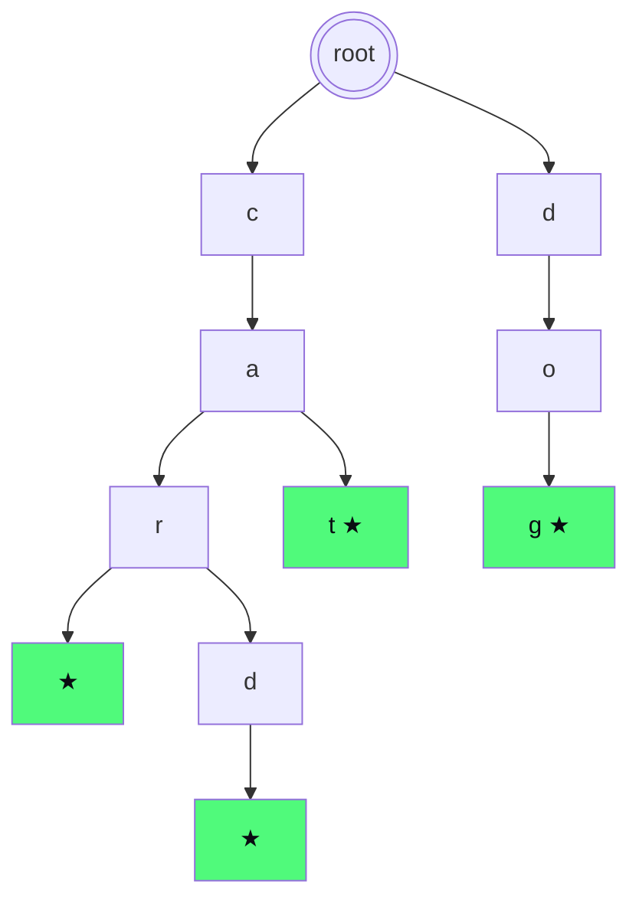

# Trie

Il trie (si pronuncia "try", da "re**TRIE**val") è una struttura ad albero specializzata per **stringhe**. Vince contro le hashmap quando devi cercare per **prefisso**, non per chiave intera.

## Parte 1 — Il problema motivante

### Autocomplete

Quando scrivi "ca" su Google, ti appaiono "casa", "calcio", "cane", "caraibi"... Come si fa?

Hai un dizionario di milioni di parole. Devi, dato un prefisso, restituire **tutte** le parole che lo estendono.

**Hashmap**: scorri tutte le chiavi e controlli `startswith(prefix)`. O(N × P) dove N = numero parole, P = lunghezza prefisso. Lento.

**Lista ordinata**: binary search del prefisso. Trovi il range, lo scorri. O(P log N + risultati). Funziona ma cresce con la lista.

**Trie**: O(P + risultati). Indipendente da N. Magia.

## Parte 2 — Come funziona

### L'idea: condividere i prefissi comuni

Pensa al dizionario `{"cat", "car", "card", "dog"}`. Hanno prefissi in comune ("ca", "car"). Un trie sfrutta questa condivisione organizzando le parole come **cammini in un albero**.



Le ★ verdi indicano `is_end = True` (terminano una parola valida).

Ogni nodo rappresenta **un carattere**. Le foglie marcate (con `*`) terminano una parola. I cammini condividono i prefissi.

- "cat": root → c → a → t*. Cammino di 3 archi.
- "car": root → c → a → r*. Cammino di 3 archi, condivide "ca" con cat.
- "card": root → c → a → r → d*. Estende "car".
- "dog": root → d → o → g*.

### Vantaggi

- **Cerca prefisso**: scendi l'albero seguendo i caratteri del prefisso. Se ti perdi (nodo mancante), il prefisso non esiste.
- **Memoria**: parole con prefissi comuni occupano meno spazio totale rispetto a memorizzarle separatamente.
- **Enumera tutte le estensioni**: dopo aver navigato fino al nodo del prefisso, fai DFS per raccogliere tutte le parole.

### Implementazione

```python
class TrieNode:
    def __init__(self):
        self.children = {}    # char → TrieNode
        self.is_end = False   # marca fine di parola

class Trie:
    def __init__(self):
        self.root = TrieNode()

    def insert(self, word):
        n = self.root
        for c in word:
            if c not in n.children:
                n.children[c] = TrieNode()
            n = n.children[c]
        n.is_end = True

    def search(self, word):
        n = self._walk(word)
        return n is not None and n.is_end

    def starts_with(self, prefix):
        return self._walk(prefix) is not None

    def _walk(self, s):
        n = self.root
        for c in s:
            if c not in n.children:
                return None
            n = n.children[c]
        return n
```

### Complessità

| Operazione | Tempo |
|---|---|
| Insert(word) | O(L) dove L = lunghezza parola |
| Search(word) | O(L) |
| Starts_with(prefix) | O(P) dove P = lunghezza prefisso |
| Spazio totale | O(somma lunghezze parole) |

## Parte 3 — Versione "array" per alfabeto fisso

Se l'alfabeto è piccolo e fisso (es. 26 lettere minuscole), un array di 26 figli è **più veloce** del dict (no hashing overhead).

```python
class TrieNode:
    __slots__ = ('children', 'is_end')
    def __init__(self):
        self.children = [None] * 26
        self.is_end = False

def insert(root, word):
    n = root
    for c in word:
        i = ord(c) - ord('a')
        if not n.children[i]:
            n.children[i] = TrieNode()
        n = n.children[i]
    n.is_end = True
```

`__slots__` riduce memoria evitando il `__dict__` interno di ogni istanza.

## Parte 4 — Quando usare il trie

### Casi d'oro

1. **Autocomplete**: dato prefisso, trova suggerimenti.
2. **Spell check**: la parola esiste? Suggerisci correzioni vicine.
3. **Word search in griglia** (cap. 08 esercizio): hai una lista di parole da cercare; il trie taglia rami che non possono diventare nessuna parola.
4. **Longest prefix matching** (IP routing nei router).
5. **XOR maximum**: trie binario sui bit per trovare max(a XOR b).

### Casi in cui NON usarlo

Per cercare **chiavi intere** (no prefisso), hashmap è migliore: O(1) vs O(L). Trie vince solo se sfrutti il prefisso.

## Parte 5 — Pattern: word search II con trie

### Il problema

Hai una griglia di lettere e una lista di parole. Trova quali parole compaiono come cammino nella griglia (4-vicini, no riuso di celle).

Griglia:

| | c0 | c1 | c2 | c3 |
|--|--|--|--|--|
| **r0** | o | a | a | n |
| **r1** | e | t | a | e |
| **r2** | i | h | k | r |
| **r3** | i | f | l | v |

Parole da cercare: `["oath", "pea", "eat", "rain"]`.

### Approccio naive

Per ogni parola, fai DFS dalla griglia. O(W × R × C × 4^L). Lento.

### Approccio con trie (intelligente)

1. Costruisci trie con **tutte** le parole.
2. DFS dalla griglia, naviga in parallelo nel trie.
3. Quando la cella corrente non corrisponde a nessun figlio del nodo corrente del trie → **prune** (esci subito).
4. Quando incontri `is_end` → registra la parola.

```python
class TrieNode:
    def __init__(self):
        self.children = {}
        self.word = None

def find_words(board, words):
    R, C = len(board), len(board[0])
    root = TrieNode()
    # Costruisci trie
    for w in words:
        n = root
        for c in w:
            n = n.children.setdefault(c, TrieNode())
        n.word = w

    res = []
    def dfs(r, c, node):
        ch = board[r][c]
        if ch not in node.children:
            return
        nxt = node.children[ch]
        if nxt.word:
            res.append(nxt.word)
            nxt.word = None   # evita duplicati
        board[r][c] = '#'   # marca visited
        for dr, dc in [(-1,0),(1,0),(0,-1),(0,1)]:
            nr, nc = r + dr, c + dc
            if 0 <= nr < R and 0 <= nc < C and board[nr][nc] != '#':
                dfs(nr, nc, nxt)
        board[r][c] = ch   # backtrack
    for r in range(R):
        for c in range(C):
            dfs(r, c, root)
    return res
```

**Trucchi**:

- `word` invece di `is_end` per recuperare direttamente la parola completa.
- `nxt.word = None` dopo aver trovato: previene duplicati nello stesso run.
- `board[r][c] = '#'` marker temporaneo.

Velocità: il trie consente di tagliare interi sotto-alberi di esplorazione → speedup drammatico vs naive.

## Parte 6 — Trie binario per XOR maximum

Dato array di interi, trova `max(a XOR b)` con `a, b ∈ arr`.

**Brute force**: O(n²).

**Idea trie binario**: inserisci ogni numero come sequenza di bit (MSB → LSB) in un trie. Per ogni numero, naviga il trie cercando di andare nel ramo opposto a ogni bit (massimizza XOR).

```python
def find_maximum_xor(arr):
    root = {}
    # Insert
    for x in arr:
        n = root
        for i in range(31, -1, -1):
            b = (x >> i) & 1
            n = n.setdefault(b, {})
    # Query
    best = 0
    for x in arr:
        n = root
        cur = 0
        for i in range(31, -1, -1):
            b = (x >> i) & 1
            opp = 1 - b
            if opp in n:
                cur |= (1 << i)
                n = n[opp]
            else:
                n = n[b]
        best = max(best, cur)
    return best
```

O(32 × n) = O(n).

Trie binario è la generalizzazione del trie a un alfabeto di 2 simboli (0, 1).

## Parte 7 — Esercizi

### Esercizio 9.1 — Implement Trie <span class="problem-tag medium">MEDIUM</span>

`insert`, `search`, `startsWith`.

<details><summary>Soluzione</summary>

Vedi parte 2.
</details>

### Esercizio 9.2 — Word Dictionary con wildcard <span class="problem-tag medium">MEDIUM</span>

Search con `.` come jolly per qualsiasi carattere.

<details><summary>Ragionamento</summary>

Quando il carattere è `.`, devi provare **tutti** i figli. Ricorsione.

```python
class WordDictionary:
    def __init__(self):
        self.root = TrieNode()
    def addWord(self, word):
        n = self.root
        for c in word:
            n = n.children.setdefault(c, TrieNode())
        n.is_end = True
    def search(self, word):
        def dfs(n, i):
            if i == len(word):
                return n.is_end
            c = word[i]
            if c == '.':
                return any(dfs(child, i + 1) for child in n.children.values())
            return c in n.children and dfs(n.children[c], i + 1)
        return dfs(self.root, 0)
```

Worst case con tutti `.`: O(26^L). In pratica veloce per dizionari reali.
</details>

### Esercizio 9.3 — Word Search II <span class="problem-tag hard">HARD</span>

Vedi parte 5.

### Esercizio 9.4 — Longest Word in Dictionary <span class="problem-tag medium">MEDIUM</span>

Parola più lunga del dizionario che si può costruire una lettera alla volta da altre parole del dizionario.

<details><summary>Idea</summary>

Costruisci trie. Poi DFS: scendi finché ogni nodo intermedio (eccetto root) è `is_end`. La parola più profonda raggiungibile è la risposta.
</details>

### Esercizio 9.5 — Replace Words <span class="problem-tag medium">MEDIUM</span>

Lista di radici + frase. Sostituisci ogni parola con la sua radice più corta.

<details><summary>Soluzione</summary>

```python
def replace_words(roots, sentence):
    root = TrieNode()
    for r in roots:
        n = root
        for c in r:
            n = n.children.setdefault(c, TrieNode())
        n.is_end = True

    def shortest(word):
        n = root
        for i, c in enumerate(word):
            if c not in n.children: return word
            n = n.children[c]
            if n.is_end: return word[:i + 1]
        return word

    return " ".join(shortest(w) for w in sentence.split())
```

O(W × L) dove W = parole della frase, L = max lunghezza.
</details>

### Esercizio 9.6 — Maximum XOR of Two Numbers <span class="problem-tag medium">MEDIUM</span>

Vedi parte 6.

## Riassunto

1. **Trie = albero specializzato per prefissi**. Ogni nodo rappresenta un carattere; cammini = parole.
2. **Operazioni O(L)** invece di O(N × L) di una lista.
3. **Quando**: autocomplete, spell check, word search in griglia, XOR puzzle.
4. **Versione dict** flessibile; versione array (26 figli) più veloce.
5. **Pattern killer in Word Search II**: trie + DFS con pruning sui rami non promettenti.

Trie è una struttura "specialista" — non per ogni problema, ma quando serve, brilla.
