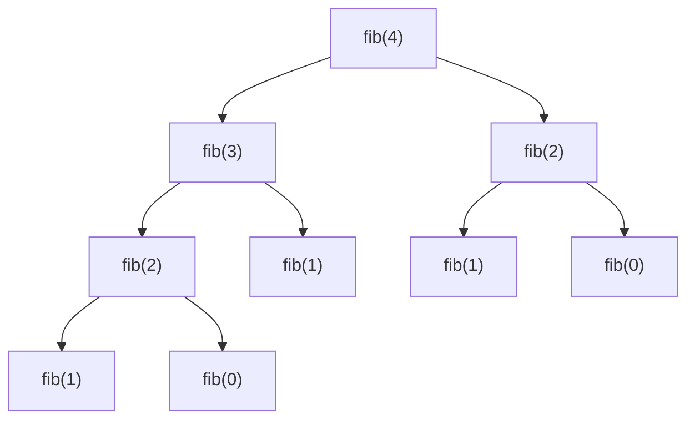
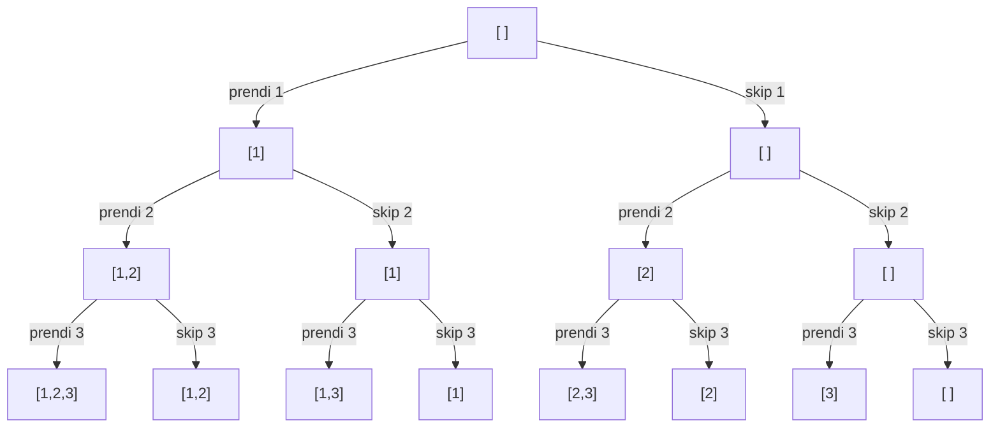

# Ricorsione e backtracking

La ricorsione è il concetto che spacca in due le persone: o ti viene naturale dopo molto esercizio, o ti sembra magia nera. Questo capitolo ti porta dal "non capisco" al "lo vedo".

## Parte 1 — Cosa è la ricorsione, davvero

### L'analogia della matrioska

Hai mai aperto una matrioska? È una bambola che dentro contiene un'altra bambola identica ma più piccola, che dentro contiene un'altra ancora più piccola, e così via fino alla più piccola che non si apre.

La ricorsione è esattamente questo: **una funzione che chiama se stessa con un input "più piccolo"**, fino ad arrivare al caso base che si risolve direttamente.

### Definizione formale

Una funzione ricorsiva ha due parti:

1. **Base case**: l'input più piccolo, risolto direttamente, senza ulteriore ricorsione.
2. **Recursive case**: l'input generico, risolto chiamando se stessa su un input più piccolo.

Esempio del libro: il **fattoriale**.

```python
def fact(n):
    if n == 0:           # base case
        return 1
    return n * fact(n-1)  # recursive case
```

Trace di `fact(4)`:

```
fact(4) → 4 * fact(3)
        → 4 * (3 * fact(2))
        → 4 * (3 * (2 * fact(1)))
        → 4 * (3 * (2 * (1 * fact(0))))
        → 4 * (3 * (2 * (1 * 1)))
        → 4 * (3 * (2 * 1))
        → 4 * (3 * 2)
        → 4 * 6
        → 24
```

### Il "salto di fede"

Il punto chiave per scrivere ricorsione: **non cercare di seguire mentalmente tutto l'albero di chiamate**. Fidati.

Quando scrivi `fact(n-1)` e ottieni un valore, **fidati** che sia corretto (perché la stessa funzione lo calcolerà bene per input minori, e induttivamente per tutti). Tu devi solo:

1. **Definire correttamente il base case**.
2. **Combinare correttamente** il risultato della chiamata ricorsiva con il valore corrente.

Se queste due cose sono giuste, la funzione è giusta. Tutto. Non serve simulare 1000 chiamate annidate in testa.

Questo è il "leap of faith" che separa chi capisce la ricorsione da chi non la capisce.

### I 3 step per scrivere una funzione ricorsiva

1. **Definisci esattamente cosa significa una chiamata**. Es: *"`f(arr, i)` ritorna la somma di `arr[i..fine]`"*.
2. **Identifica il base case**: l'input minimo, risposta diretta.
3. **Spezza il problema**: come ridurre a un sottoproblema?

Esempio: somma di un array.

```python
def somma(arr, i=0):
    # 1. Una chiamata: somma di arr[i..fine]
    # 2. Base: se i è fuori, somma = 0
    if i == len(arr): return 0
    # 3. Combina: arr[i] + somma del resto
    return arr[i] + somma(arr, i+1)
```

## Parte 2 — Albero di chiamate: visualizzare la ricorsione

Per problemi più complessi, disegnare l'albero di chiamate **a mano** chiarisce tutto.

Esempio: Fibonacci.

```python
def fib(n):
    if n < 2: return n
    return fib(n-1) + fib(n-2)
```

Trace di `fib(4)`:



Osservazioni cruciali:

1. **Il numero totale di chiamate è esponenziale**: ~2ⁿ. Per fib(40) sono già 10⁹ chiamate.
2. **Tante chiamate sono ripetute**: fib(2) compare due volte, fib(1) tre volte, ecc.
3. La profondità massima dell'albero è `n`. Quindi spazio = O(n) (stack).

Questo motiva la **memoization** e poi la **DP** (cap. 14): se ricordo i risultati delle chiamate precedenti, le riuso invece di ricalcolare.

```python
from functools import lru_cache
@lru_cache(maxsize=None)
def fib(n):
    if n < 2: return n
    return fib(n-1) + fib(n-2)
```

Con `lru_cache`, fib(40) diventa O(n) tempo. La differenza con `fib(40)` "puro" è **30 secondi vs istantaneo**.

## Parte 3 — Ricorsione vs iterazione

Ogni algoritmo ricorsivo si può scrivere iterativamente. Ma alcuni problemi sono **molto più naturali ricorsivamente** (alberi, grafi, backtracking).

| Vantaggi ricorsione | Vantaggi iterazione |
|---|---|
| Codice elegante per problemi "decomponibili" | No stack overhead |
| Naturale per alberi/grafi | Niente RecursionError |
| Espressivo | Spesso più veloce (no overhead chiamate) |

In colloquio:

- **Scrivi prima la versione ricorsiva** (più semplice).
- Se l'intervistatore chiede, converti a iterativa (con stack esplicito).
- Per grandi input (`n > 10⁴`), considera iterativa per evitare `RecursionError`.

## Parte 4 — Backtracking: ricorsione con cancellazione

### L'idea base

Il backtracking è una **ricorsione che esplora un albero di scelte**. Quando una scelta porta a un dead end, "torna indietro" (back-track) e prova un'altra.

Esempio mentale: hai un labirinto. Provi un corridoio. Se finisce in un muro, torni indietro e provi un altro corridoio. Se anche quello è cieco, ancora indietro. E così via.

### Template universale

```python
def backtrack(stato_corrente):
    if soluzione_completa(stato_corrente):
        salva(stato_corrente)
        return

    for scelta in scelte_possibili():
        applica(scelta, stato_corrente)
        backtrack(stato_corrente)
        annulla(scelta, stato_corrente)    # ← QUI è il "back" di "backtrack"
```

L'**annulla** è la parte critica. Stato condiviso (veloce ma serve pulirlo) vs stato copiato (lento ma robusto).

### Visualizzazione: subsets di [1, 2, 3]

L'albero di chiamate del backtracking per "tutti i sottoinsiemi" di `[1, 2, 3]`:



Ogni foglia dell'albero rappresenta un sottoinsieme. Numero totale di foglie: 2³ = 8.

```python
def subsets(arr):
    res = []
    def go(i, cur):
        if i == len(arr):
            res.append(cur[:])   # IMPORTANTE: copia
            return
        # Non prendo arr[i]
        go(i+1, cur)
        # Prendo arr[i]
        cur.append(arr[i])
        go(i+1, cur)
        cur.pop()    # backtrack
    go(0, [])
    return res
```

Notare:

- `cur[:]` per copiare. Senza, tutti i sottoinsiemi puntano alla stessa lista.
- `cur.pop()` per annullare la modifica. Senza, `cur` conserva valori di branch precedenti.

## Parte 5 — I 5 pattern di backtracking

### Pattern 1 — Subsets (power set)

Tutti i 2ⁿ sottoinsiemi. Per ogni elemento: includi o escludi.

Vista sopra.

### Pattern 2 — Permutations

Tutte le `n!` permutazioni. Ad ogni passo scegli un elemento non ancora usato.

```python
def perms(arr):
    res = []
    used = [False] * len(arr)
    def go(cur):
        if len(cur) == len(arr):
            res.append(cur[:])
            return
        for i, x in enumerate(arr):
            if used[i]: continue
            used[i] = True
            cur.append(x)
            go(cur)
            cur.pop()
            used[i] = False
    go([])
    return res
```

Con duplicati: ordina + skip `arr[i] == arr[i-1] and not used[i-1]` (evita generare la stessa permutazione due volte).

### Pattern 3 — Combinations

Sottoinsiemi di **fissa dimensione**.

```python
def combinations(n, k):
    res = []
    def go(start, cur):
        if len(cur) == k:
            res.append(cur[:])
            return
        for i in range(start, n + 1):
            cur.append(i)
            go(i + 1, cur)
            cur.pop()
    go(1, [])
    return res
```

Trucco: passi `i+1` al next per evitare ripetizioni e mantenere ordine crescente.

### Pattern 4 — Combination Sum

Cerca combinazioni che sommano al target.

```python
def combination_sum(candidates, target):
    res = []
    def go(start, remaining, cur):
        if remaining == 0:
            res.append(cur[:])
            return
        if remaining < 0: return
        for i in range(start, len(candidates)):
            cur.append(candidates[i])
            go(i, remaining - candidates[i], cur)   # passo `i`, NON i+1 (riusabile)
            cur.pop()
    go(0, target, [])
    return res
```

Per "senza riuso" passi `i+1`.

### Pattern 5 — Constraint Satisfaction

Esplora una griglia con vincoli (N-Queens, Sudoku, Word Search). Quando un vincolo è violato, indietro.

## Parte 6 — Pruning: tagliare l'albero prima

Senza pruning, il backtracking esplora tutto l'albero. Con pruning, tagli rami impossibili **prima** di scendere.

### Tre tecniche

**1. Bounding**: se la soluzione parziale non può migliorare il best globale, esci.

```python
if current_cost >= best_so_far: return  # questa branch non migliorerà
```

**2. Constraint propagation**: dopo una scelta, deduci altre scelte forzate.

Es. Sudoku: se metti 5 in (3,3), non puoi mettere 5 nella stessa riga/colonna/box.

**3. Memoization**: se hai sotto-stati che si ripetono, ricorda i risultati (= DP).

## Parte 7 — Le 5 trappole comuni

### Trappola 1 — `res.append(cur)` invece di `res.append(cur[:])`

Se aggiungi `cur` direttamente, ogni soluzione nel risultato **punta alla stessa lista**. Modifiche successive (anche pop di backtrack) modificano "le copie già salvate".

Sempre **copia** (`cur[:]` o `list(cur)`).

### Trappola 2 — Stato non resettato

Se modifichi una variabile e dimentichi di resettarla nel backtrack, la prossima iterazione vede lo stato sporco.

```python
# SBAGLIATO:
cur.append(x)
go(...)
# manca cur.pop()!
```

### Trappola 3 — Esplosione di stato

Backtracking è O(branching^depth). Per n=30 con 2 branch, sono 10⁹ chiamate → impossibile.

Se vedi `n > 20` su un problema "tutte le ..." con 2 scelte per livello, è quasi sicuramente DP, non backtracking.

### Trappola 4 — Mancata distinzione tra elementi uguali

In permutazioni con duplicati `[1, 1, 2]`, le permutazioni "uniche" sono 3, non 6. Devi skippare i duplicati esplicitamente.

```python
arr.sort()
def go(cur):
    ...
    for i in range(len(arr)):
        if used[i]: continue
        if i > 0 and arr[i] == arr[i-1] and not used[i-1]:
            continue   # skip duplicato
        ...
```

### Trappola 5 — Ordine sbagliato di append/pop

```python
# SBAGLIATO:
go(i+1, cur)        # ricorri prima di applicare la scelta
cur.append(arr[i])  # tardi
```

Sequenza corretta: **applica → ricorri → annulla**.

## Parte 8 — Esercizi guidati

### Esercizio 10.1 — Subsets <span class="problem-tag medium">MEDIUM</span>

<details><summary>Soluzione</summary>

Vedi parte 4.

Versione iterativa (notevole eleganza):

```python
def subsets(arr):
    res = [[]]
    for x in arr:
        res += [s + [x] for s in res]
    return res
```

Idea: ad ogni elemento, raddoppi la lista esistente (con e senza x).
</details>

### Esercizio 10.2 — Permutations <span class="problem-tag medium">MEDIUM</span>

<details><summary>Soluzione</summary>

Vedi parte 5.
</details>

### Esercizio 10.3 — Combination Sum <span class="problem-tag medium">MEDIUM</span>

<details><summary>Soluzione</summary>

Vedi parte 5.
</details>

### Esercizio 10.4 — Letter Combinations of Phone Number <span class="problem-tag medium">MEDIUM</span>

Tastierino: "23" → "ad", "ae", "af", "bd", ..., "cf".

<details><summary>Soluzione</summary>

```python
def letter_combos(digits):
    if not digits: return []
    m = {'2':'abc','3':'def','4':'ghi','5':'jkl','6':'mno','7':'pqrs','8':'tuv','9':'wxyz'}
    res = []
    def go(i, cur):
        if i == len(digits):
            res.append(cur)
            return
        for c in m[digits[i]]:
            go(i + 1, cur + c)
    go(0, "")
    return res
```

In questo caso `cur + c` crea una nuova stringa, quindi non serve backtrack esplicito.
</details>

### Esercizio 10.5 — Generate Parentheses <span class="problem-tag medium">MEDIUM</span>

Tutte le combinazioni valide di n coppie di parentesi.

<details><summary>Ragionamento</summary>

Per essere valida una sequenza di parentesi:

1. In ogni prefisso, `open_count ≥ close_count`.
2. Alla fine, `open_count == close_count == n`.

Backtracking con due contatori:

```python
def gen_parens(n):
    res = []
    def go(cur, opened, closed):
        if len(cur) == 2 * n:
            res.append(cur)
            return
        if opened < n:
            go(cur + '(', opened + 1, closed)
        if closed < opened:
            go(cur + ')', opened, closed + 1)
    go("", 0, 0)
    return res
```

Pruning: non aggiungere `)` se equivale a chiudere prima di aprire.

Per n=3: ["((()))","(()())","(())()","()(())","()()()"]
</details>

### Esercizio 10.6 — Word Search <span class="problem-tag medium">MEDIUM</span>

Cerca una parola in una griglia 2D (4-vicini, no riuso).

<details><summary>Ragionamento</summary>

Per ogni cella, prova ad iniziare la parola da lì. DFS ricorsivo che matcha carattere per carattere.

Trucco: marca la cella visitata mettendo un placeholder (`'#'`), poi ripristina al backtrack.

```python
def exist(board, word):
    R, C = len(board), len(board[0])
    def dfs(r, c, k):
        if k == len(word): return True
        if not (0 <= r < R and 0 <= c < C) or board[r][c] != word[k]:
            return False
        tmp = board[r][c]
        board[r][c] = '#'   # marca come visitato
        ok = any(dfs(r + dr, c + dc, k + 1) for dr, dc in [(-1,0),(1,0),(0,-1),(0,1)])
        board[r][c] = tmp   # backtrack
        return ok
    for r in range(R):
        for c in range(C):
            if dfs(r, c, 0): return True
    return False
```

**Lezione**: il "marker temporaneo" è un trucco generale per "non rivisitare" in DFS senza un set separato.
</details>

### Esercizio 10.7 — N-Queens <span class="problem-tag hard">HARD</span>

Posiziona n regine su scacchiera n×n senza che si attacchino.

<details><summary>Ragionamento</summary>

Procedi riga per riga. Su ogni riga prova ogni colonna.

Vincoli: nessuna regina nella stessa colonna, stessa diagonale principale (`r-c` costante), stessa anti-diagonale (`r+c` costante).

Tracking efficiente: 3 set per cols, diag1, diag2.

```python
def solve_n_queens(n):
    res = []
    cols = set(); d1 = set(); d2 = set()
    def go(r, queens):
        if r == n:
            res.append(['.'*c + 'Q' + '.'*(n-c-1) for c in queens])
            return
        for c in range(n):
            if c in cols or (r - c) in d1 or (r + c) in d2:
                continue
            cols.add(c); d1.add(r - c); d2.add(r + c)
            queens.append(c)
            go(r + 1, queens)
            queens.pop()
            cols.discard(c); d1.discard(r - c); d2.discard(r + c)
    go(0, [])
    return res
```

O(n!).

**Lezione**: in problemi di constraint, identifica gli **invarianti facili da tracciare in O(1)**. Qui le diagonali si tracciano come `r-c` o `r+c` costante.
</details>

### Esercizio 10.8 — Sudoku Solver <span class="problem-tag hard">HARD</span>

<details><summary>Soluzione</summary>

```python
def solve_sudoku(board):
    rows = [set() for _ in range(9)]
    cols = [set() for _ in range(9)]
    boxes = [set() for _ in range(9)]
    empty = []
    for r in range(9):
        for c in range(9):
            v = board[r][c]
            if v == '.':
                empty.append((r, c))
            else:
                rows[r].add(v); cols[c].add(v); boxes[(r//3)*3 + c//3].add(v)
    def go(i):
        if i == len(empty): return True
        r, c = empty[i]
        b = (r//3)*3 + c//3
        for d in '123456789':
            if d not in rows[r] and d not in cols[c] and d not in boxes[b]:
                rows[r].add(d); cols[c].add(d); boxes[b].add(d)
                board[r][c] = d
                if go(i + 1): return True
                rows[r].discard(d); cols[c].discard(d); boxes[b].discard(d)
                board[r][c] = '.'
        return False
    go(0)
```
</details>

### Esercizio 10.9 — Restore IP Addresses <span class="problem-tag medium">MEDIUM</span>

Inserisci 3 punti in una stringa di cifre per formare un IP valido.

<details><summary>Soluzione</summary>

```python
def restore_ip(s):
    res = []
    def valid(p):
        return (len(p) == 1) or (p[0] != '0' and int(p) <= 255)
    def go(start, parts):
        if len(parts) == 4:
            if start == len(s):
                res.append('.'.join(parts))
            return
        for length in (1, 2, 3):
            if start + length > len(s): break
            p = s[start:start+length]
            if valid(p):
                go(start + length, parts + [p])
    go(0, [])
    return res
```
</details>

### Esercizio 10.10 — Palindrome Partitioning <span class="problem-tag medium">MEDIUM</span>

Tutte le partizioni di `s` in sottostringhe palindrome.

<details><summary>Soluzione</summary>

```python
def partition(s):
    res = []
    def is_pal(x): return x == x[::-1]
    def go(start, cur):
        if start == len(s):
            res.append(cur[:])
            return
        for end in range(start + 1, len(s) + 1):
            p = s[start:end]
            if is_pal(p):
                cur.append(p)
                go(end, cur)
                cur.pop()
    go(0, [])
    return res
```

Pattern combinato: backtracking + check di proprietà (palindromo).
</details>

## Riassunto del capitolo

1. **Ricorsione = funzione che chiama sé stessa con input più piccolo**, fino al base case.
2. **Salto di fede**: fidati delle chiamate ricorsive. Tu definisci solo base + combine.
3. **Backtracking = ricorsione + applica/annulla**. Template universale.
4. **5 pattern**: subsets, permutations, combinations, combination sum, constraint satisfaction.
5. **Trappole top**: `append(cur)` invece di `append(cur[:])`, mancato pop al backtrack, esplosione esponenziale.

Quando ti viene "naturale" pensare ricorsivamente, **alberi, grafi, DP** diventano facili. Tutto il resto del materiale si basa su questo capitolo.
