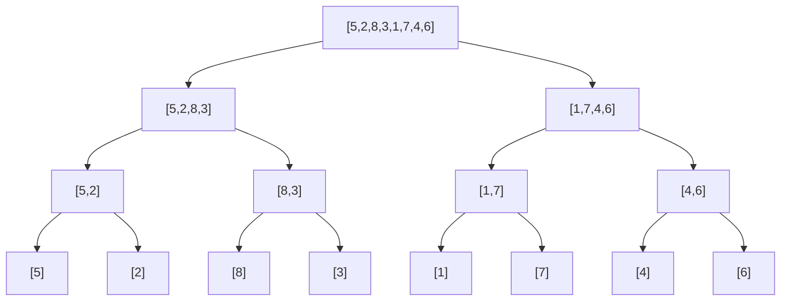
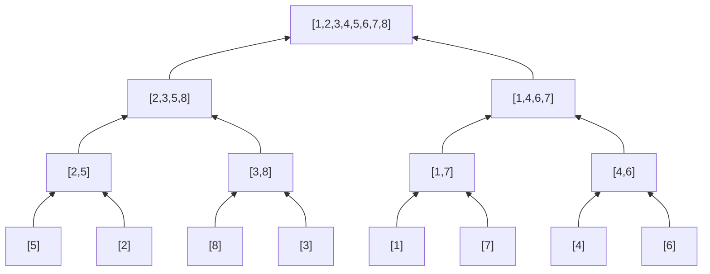

# Sorting e searching

Sorting e searching sono i due algoritmi più antichi del CS. Sembrano "semplici", ma sotto la superficie ci sono dettagli pieni di bug.

Iniziamo dal sorting, poi entriamo nella foresta del binary search.

## Parte 1 — Sorting: la mappa generale

### In Python usi `sort()`. Ma...

Per il 99% dei casi pratici, Python ha `sorted()` e `list.sort()`. Entrambi usano **TimSort**, un algoritmo ibrido O(n log n), stabile, ottimizzato per dati "quasi-ordinati".

Quindi nella vita reale non implementi mai un sorting. In colloquio invece:

1. Devi conoscere i sorting algorithms classici e i loro trade-off.
2. Devi sapere implementare merge sort e quick sort (le domande "implementa sorting" sono comuni per Apple/Bloomberg).
3. Devi capire **quando** sorting è la mossa giusta.

### La tabella di riferimento

| Algoritmo | Tempo medio | Tempo worst | Spazio | Stabile? | In-place? |
|---|---|---|---|---|---|
| **Bubble sort** | O(n²) | O(n²) | O(1) | sì | sì |
| **Insertion sort** | O(n²) | O(n²) | O(1) | sì | sì |
| **Selection sort** | O(n²) | O(n²) | O(1) | no | sì |
| **Merge sort** | O(n log n) | O(n log n) | O(n) | sì | no |
| **Quick sort** | O(n log n) | O(n²) | O(log n) stack | no | sì |
| **Heap sort** | O(n log n) | O(n log n) | O(1) | no | sì |
| **Counting sort** | O(n + k) | O(n + k) | O(k) | sì | no |
| **Radix sort** | O(d (n + k)) | O(d (n + k)) | O(n + k) | sì | no |

### Cos'è "stabile"

Un sort è **stabile** se elementi uguali mantengono il loro ordine relativo.

Esempio: ordini coppie `[(1, 'a'), (1, 'b'), (2, 'c')]` per il primo elemento. Stabile → `[(1, 'a'), (1, 'b'), (2, 'c')]`. Non stabile → potrebbe diventare `[(1, 'b'), (1, 'a'), (2, 'c')]`.

Importante in colloquio: **TimSort è stabile**, quindi `sorted()` di Python è stabile.

## Parte 2 — Implementazioni in dettaglio

### Insertion sort (perché iniziare da qui)

L'intuizione di come ordini un mazzo di carte in mano. Una alla volta, inseriscila al posto giusto nella parte "già ordinata".

```python
def insertion_sort(arr):
    for i in range(1, len(arr)):
        cur = arr[i]
        j = i - 1
        while j >= 0 and arr[j] > cur:
            arr[j+1] = arr[j]
            j -= 1
        arr[j+1] = cur
```

O(n²). Lento per grandi n, ma:

- O(n) se l'array è **già quasi ordinato**.
- Buono per `n ≤ 30`.
- Stabile.
- TimSort lo usa internamente come step finale.

### Merge sort (il classico O(n log n))

**Idea (divide et impera)**:

1. Splitta l'array a metà.
2. Ricorsivamente ordina ogni metà.
3. Fai merge delle due metà ordinate.

```python
def merge_sort(arr):
    if len(arr) <= 1:
        return arr
    mid = len(arr) // 2
    left = merge_sort(arr[:mid])
    right = merge_sort(arr[mid:])
    return merge(left, right)

def merge(a, b):
    out = []
    i = j = 0
    while i < len(a) and j < len(b):
        if a[i] <= b[j]:
            out.append(a[i])
            i += 1
        else:
            out.append(b[j])
            j += 1
    out.extend(a[i:])
    out.extend(b[j:])
    return out
```

Visualizzazione (split top-down, merge bottom-up):



Poi merge bottom-up:



**Complessità**:

- Tempo: T(n) = 2T(n/2) + O(n) → O(n log n) (master theorem).
- Spazio: O(n) (array ausiliari).

**Stabile**. **Sempre O(n log n)** anche worst case.

### Quick sort (più veloce in pratica)

**Idea**: scegli un **pivot** dall'array. Partiziona: a sinistra del pivot, tutti i minori; a destra, tutti i maggiori. Poi ricorri.

```python
def quicksort(arr, lo=0, hi=None):
    if hi is None: hi = len(arr) - 1
    if lo >= hi: return
    p = partition(arr, lo, hi)
    quicksort(arr, lo, p - 1)
    quicksort(arr, p + 1, hi)

def partition(arr, lo, hi):
    pivot = arr[hi]
    i = lo
    for j in range(lo, hi):
        if arr[j] < pivot:
            arr[i], arr[j] = arr[j], arr[i]
            i += 1
    arr[i], arr[hi] = arr[hi], arr[i]
    return i
```

**Tempo medio**: O(n log n).
**Tempo worst**: O(n²) (array ordinato + pivot all'estremo).

**Mitigazione del worst case**: pivot randomico.

```python
import random
pivot_idx = random.randint(lo, hi)
arr[pivot_idx], arr[hi] = arr[hi], arr[pivot_idx]
# poi partition normale
```

**Non stabile**, **in-place**, ~3× più veloce di merge sort in pratica (cache-friendly).

### Counting sort (quando l'alfabeto è piccolo)

Se i valori sono interi in un range piccolo, conta le frequenze e ricostruisci.

```python
def counting_sort(arr):
    if not arr: return []
    lo, hi = min(arr), max(arr)
    cnt = [0] * (hi - lo + 1)
    for x in arr:
        cnt[x - lo] += 1
    out = []
    for i, c in enumerate(cnt):
        out.extend([i + lo] * c)
    return out
```

O(n + k) dove k = range dei valori.

**Quando**: valori interi in range piccolo (es. età, voti, lettere). Per range enorme è inutile.

## Parte 3 — Quickselect: k-esimo elemento in O(n) medio

Variante di quicksort che cerca **solo** il k-esimo elemento. Non ordina tutto.

**Idea**: dopo partition, sai dove sta il pivot. Se è in posizione k, l'hai trovato. Altrimenti ricorri solo sulla metà giusta.

```python
import random
def quickselect(arr, k):
    """Ritorna il k-esimo più piccolo (1-indexed)."""
    def partition(lo, hi, pivot_idx):
        pivot = arr[pivot_idx]
        arr[pivot_idx], arr[hi] = arr[hi], arr[pivot_idx]
        store = lo
        for i in range(lo, hi):
            if arr[i] < pivot:
                arr[store], arr[i] = arr[i], arr[store]
                store += 1
        arr[store], arr[hi] = arr[hi], arr[store]
        return store

    def select(lo, hi, k):
        if lo == hi: return arr[lo]
        pivot_idx = random.randint(lo, hi)
        p = partition(lo, hi, pivot_idx)
        if k == p: return arr[k]
        elif k < p: return select(lo, p - 1, k)
        else: return select(p + 1, hi, k)

    return select(0, len(arr) - 1, k - 1)
```

**Tempo medio**: O(n). Master theorem su T(n) = T(n/2) + O(n) (in media butti via metà) → O(n).
**Worst**: O(n²) ma estremamente raro con pivot randomico.

Usato in: kth largest, mediana streaming, top-k senza sortare tutto.

## Parte 4 — Binary search: la teoria

### L'idea base

Hai un array **ordinato**. Cerchi un target.

```python
def search(arr, target):
    lo, hi = 0, len(arr) - 1
    while lo <= hi:
        mid = (lo + hi) // 2
        if arr[mid] == target:
            return mid
        elif arr[mid] < target:
            lo = mid + 1
        else:
            hi = mid - 1
    return -1
```

A ogni iterazione **dimezzi** lo spazio di ricerca → O(log n).

Per `n = 1 milione`: ~20 iterazioni. Per `n = 1 miliardo`: ~30. Magia.

### Off-by-one: il punto debole

Il 99% dei bug in binary search sono off-by-one. Tre questioni da settare consistentemente:

1. **Estremi**: `[lo, hi]` (inclusivi) o `[lo, hi)` (hi esclusivo)?
2. **Condizione del while**: `<=` o `<`?
3. **Update**: `mid + 1`, `mid - 1`, `mid`?

**Devi scegliere una convenzione e seguirla**. Non improvvisare.

### Convenzione 1 — `[lo, hi]` inclusivi

```python
lo, hi = 0, len(arr) - 1
while lo <= hi:
    mid = (lo + hi) // 2
    if arr[mid] == target: return mid
    elif arr[mid] < target: lo = mid + 1
    else: hi = mid - 1
```

- Esci dal loop con `lo > hi` (range vuoto).
- Update salta mid: `lo = mid + 1` o `hi = mid - 1`.

### Convenzione 2 — `[lo, hi)` hi esclusivo (bisect-style)

```python
lo, hi = 0, len(arr)
while lo < hi:
    mid = (lo + hi) // 2
    if arr[mid] < target: lo = mid + 1
    else: hi = mid          # NON mid - 1!
return lo  # primo indice con arr[lo] >= target
```

- Esci dal loop con `lo == hi`.
- `lo` finale è il "punto di inserimento" per mantenere ordine.

Questa è la base di `bisect.bisect_left` di Python.

### Quale usare?

In colloquio:

- Per "cerca esattamente target": Convenzione 1.
- Per "trova primo X con condizione" o "binary search sulla risposta": Convenzione 2.

Una volta scelta, applicala identica in ogni problema. Non mischiare.

## Parte 5 — Le 7 varianti di binary search

### 1. Search "find exact"

Visto sopra (convenzione 1).

### 2. Lower bound (`bisect_left`)

Primo indice `i` con `arr[i] >= target`.

```python
def lower_bound(arr, target):
    lo, hi = 0, len(arr)
    while lo < hi:
        mid = (lo + hi) // 2
        if arr[mid] < target: lo = mid + 1
        else: hi = mid
    return lo
```

Se `lo == len(arr)`, target è > di tutti.

### 3. Upper bound (`bisect_right`)

Primo indice `i` con `arr[i] > target`.

```python
def upper_bound(arr, target):
    lo, hi = 0, len(arr)
    while lo < hi:
        mid = (lo + hi) // 2
        if arr[mid] <= target: lo = mid + 1
        else: hi = mid
    return lo
```

### 4. Modulo `bisect` di Python

```python
from bisect import bisect_left, bisect_right, insort
bisect_left(arr, x)   # primo idx con arr[idx] >= x
bisect_right(arr, x)  # primo idx con arr[idx] > x
insort(arr, x)        # inserisci mantenendo ordine
```

**Usa sempre `bisect` in colloquio** quando puoi. Meno bug.

### 5. Binary search "sulla risposta"

Spesso il problema non è "cerca un valore in array", ma:

> *"Qual è il minimo X tale che ok(X) sia vero?"*

Se `ok(X)` è **monotona** (se vale per X allora vale per tutti i Y ≥ X), puoi binary-searchare su X.

Template:

```python
def search_answer(lo, hi, ok):
    while lo < hi:
        mid = (lo + hi) // 2
        if ok(mid): hi = mid
        else: lo = mid + 1
    return lo
```

Esempi: "minima capacità di nave per spedire in d giorni", "minima velocità di Koko".

Questo è il pattern più **chiesto** in colloquio. Imparalo davvero.

### 6. Binary search su array ruotato

`[4, 5, 6, 7, 0, 1, 2]` è un array ordinato ruotato. C'è ancora struttura: **una delle due metà è sempre ordinata**.

```python
def search_rotated(arr, target):
    lo, hi = 0, len(arr) - 1
    while lo <= hi:
        mid = (lo + hi) // 2
        if arr[mid] == target: return mid
        if arr[lo] <= arr[mid]:   # left half sorted
            if arr[lo] <= target < arr[mid]:
                hi = mid - 1
            else:
                lo = mid + 1
        else:                      # right half sorted
            if arr[mid] < target <= arr[hi]:
                lo = mid + 1
            else:
                hi = mid - 1
    return -1
```

Identifica quale metà è ordinata, poi decidi se il target ci sta dentro.

### 7. Binary search "find peak / find minimum"

Per array con un singolo minimo (o massimo), confronta `arr[mid]` con `arr[mid+1]` per decidere dove sta il peak.

```python
def find_peak(arr):
    lo, hi = 0, len(arr) - 1
    while lo < hi:
        mid = (lo + hi) // 2
        if arr[mid] > arr[mid + 1]:
            hi = mid
        else:
            lo = mid + 1
    return lo
```

## Parte 6 — Le 4 trappole principali del binary search

### Trappola 1 — Inconsistenza di convenzione

Mischiare `<=` con `< len(arr)` o `mid - 1` con `mid` → loop infiniti o off-by-one.

**Soluzione**: scegli una convenzione e attieniti.

### Trappola 2 — `mid = (lo + hi) // 2` in linguaggi con overflow

In Python interi sono illimitati. In C/Java per array enormi `lo + hi` può overfloware. Usa `mid = lo + (hi - lo) // 2`.

### Trappola 3 — Loop infinito con `lo = mid` invece di `lo = mid + 1`

```python
lo, hi = 0, 1
while lo < hi:
    mid = (0 + 1) // 2 = 0
    if cond: lo = mid     # LOOP INFINITO! mid è ancora 0
    else: hi = mid
```

Se usi `lo = mid`, devi cambiare `mid` calculation a `mid = (lo + hi + 1) // 2` (arrotonda in alto).

### Trappola 4 — Array con duplicati ruotato

`[1, 1, 1, 2, 1, 1]`. Quando `arr[lo] == arr[mid]`, non sai quale metà è ordinata → degenera in O(n).

## Esercizi guidati

### Esercizio 11.1 — Binary Search <span class="problem-tag easy">EASY</span>

Cerca target in array ordinato.

Vedi parte 4.

### Esercizio 11.2 — First Bad Version <span class="problem-tag easy">EASY</span>

Versioni 1..n. Una versione `f` è "bad" e tutte le successive lo sono. Trova `f` in O(log n) chiamate API.

<details><summary>Soluzione</summary>

```python
def first_bad(n, isBadVersion):
    lo, hi = 1, n
    while lo < hi:
        mid = (lo + hi) // 2
        if isBadVersion(mid):
            hi = mid
        else:
            lo = mid + 1
    return lo
```

Convenzione 2 (lower_bound style).
</details>

### Esercizio 11.3 — Search in Rotated Sorted <span class="problem-tag medium">MEDIUM</span>

Vedi parte 5 variante 6.

### Esercizio 11.4 — Find Minimum in Rotated Sorted <span class="problem-tag medium">MEDIUM</span>

<details><summary>Soluzione</summary>

```python
def find_min(arr):
    lo, hi = 0, len(arr) - 1
    while lo < hi:
        mid = (lo + hi) // 2
        if arr[mid] > arr[hi]:
            lo = mid + 1
        else:
            hi = mid
    return arr[lo]
```

Idea: confronta con `hi`. Se mid > hi, il minimo è nella metà destra (rotazione passa per il mezzo). Altrimenti nella metà sinistra.
</details>

### Esercizio 11.5 — Find Peak Element <span class="problem-tag medium">MEDIUM</span>

Vedi parte 5 variante 7.

### Esercizio 11.6 — Koko Eating Bananas <span class="problem-tag medium">MEDIUM</span>

Pile di banane. Koko mangia `k` banane/ora (max). Trova minimo `k` per finire entro `h` ore.

<details><summary>Ragionamento (importante!)</summary>

**Pattern binary search sulla risposta.**

Lo spazio delle risposte è `k ∈ [1, max(piles)]`. Per ogni `k`, posso calcolare ore totali in O(n).

Funzione `ok(k)`: ore necessarie ≤ h.

**Monotonia**: se k funziona, ogni k' > k funziona. Posso binary-searchare.

```python
def min_eating_speed(piles, h):
    def hours(k):
        return sum((p + k - 1) // k for p in piles)   # ceil
    lo, hi = 1, max(piles)
    while lo < hi:
        mid = (lo + hi) // 2
        if hours(mid) <= h:
            hi = mid
        else:
            lo = mid + 1
    return lo
```

O(n log(max_pile)).

**Lezione**: quando vedi "qual è il minimo X tale che ...", chiediti se la condizione è monotona in X. Se sì, binary search sulla risposta.
</details>

### Esercizio 11.7 — Capacity to Ship Within D Days <span class="problem-tag medium">MEDIUM</span>

<details><summary>Soluzione</summary>

```python
def ship_capacity(weights, days):
    def needed(cap):
        d, cur = 1, 0
        for w in weights:
            if cur + w > cap:
                d += 1
                cur = 0
            cur += w
        return d
    lo, hi = max(weights), sum(weights)
    while lo < hi:
        mid = (lo + hi) // 2
        if needed(mid) <= days:
            hi = mid
        else:
            lo = mid + 1
    return lo
```

Stesso pattern.
</details>

### Esercizio 11.8 — Kth Largest Element <span class="problem-tag medium">MEDIUM</span>

<details><summary>Soluzione</summary>

Quickselect (vedi parte 3).

Versione heap-based (più semplice, O(n log k)):

```python
import heapq
def kth_largest(arr, k):
    return heapq.nlargest(k, arr)[-1]
```
</details>

### Esercizio 11.9 — Sort Colors (Dutch Flag) <span class="problem-tag medium">MEDIUM</span>

Array di 0, 1, 2. Ordina in-place, **una passata**.

<details><summary>Ragionamento (tre puntatori)</summary>

Tre puntatori `l, m, r`:

- `[0..l-1]` sono 0.
- `[l..m-1]` sono 1.
- `[m..r]` sconosciuti.
- `[r+1..n-1]` sono 2.

Iniziamo con `l=0, m=0, r=n-1`. Mentre `m <= r`:

- Se `arr[m] == 0`: swap con `arr[l]`. `l++; m++`.
- Se `arr[m] == 1`: `m++`.
- Se `arr[m] == 2`: swap con `arr[r]`. `r--` (NON incrementi m perché l'elemento appena swapped è sconosciuto).

```python
def sort_colors(arr):
    l, m, r = 0, 0, len(arr) - 1
    while m <= r:
        if arr[m] == 0:
            arr[l], arr[m] = arr[m], arr[l]
            l += 1; m += 1
        elif arr[m] == 1:
            m += 1
        else:
            arr[m], arr[r] = arr[r], arr[m]
            r -= 1
```

O(n), O(1). Pattern "Dutch national flag" di Dijkstra. Bellissimo.
</details>

### Esercizio 11.10 — Wiggle Sort II <span class="problem-tag medium">MEDIUM</span>

Riordina array in modo che `arr[0] < arr[1] > arr[2] < arr[3] > ...`.

<details><summary>Idea</summary>

1. Quickselect per trovare la **mediana**.
2. Three-way partition (Dutch flag) attorno alla mediana.
3. Posiziona alternando in O(n) extra spazio (o con index magic).

Difficile, raro.
</details>

### Esercizio 11.11 — Median of Two Sorted Arrays <span class="problem-tag hard">HARD</span>

Vedi cap. 02.

## Riassunto del capitolo

1. **TimSort di Python** è O(n log n) stabile. Usa `sorted()`/`list.sort()` per default.
2. **Merge sort vs quick sort**: merge è stabile e prevedibile (O(n log n) sempre). Quick è in-place e più veloce in pratica.
3. **Quickselect**: O(n) medio per il k-esimo. Conoscilo.
4. **Binary search**: scegli una convenzione (`[lo, hi]` o `[lo, hi)`) e attieniti.
5. **Pattern binary search sulla risposta**: spesso il problema è "minimo X tale che ok(X)". Riconoscilo.
6. **Modulo `bisect`** ti salva da off-by-one. Usalo.

Quando questo capitolo è metabolizzato, problemi tipo "Koko" o "rotated search" sembrano facili. Vai al [cap. 12 — Two pointers e sliding window](12-two-pointers-sliding-window.html).
