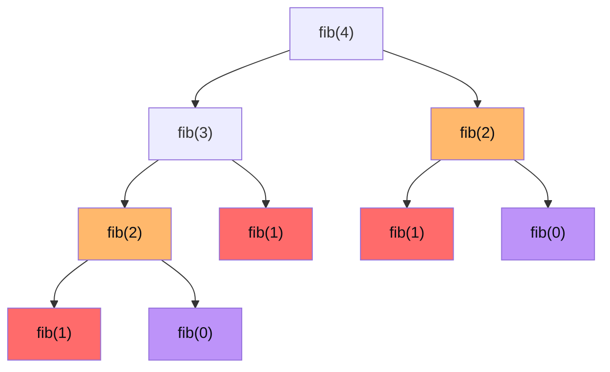

# Dynamic programming

DP è il capitolo dove la maggior parte dei candidati molla. È anche il capitolo dove **fai la differenza**: chi sa DP solidamente passa molti più colloqui.

Questo capitolo costruisce DP **da zero**, partendo dalla ricorsione che già conosci.

## Parte 1 — Da dove nasce DP

### Il problema del Fibonacci ingenuo

Riprendiamo:

```python
def fib(n):
    if n < 2: return n
    return fib(n-1) + fib(n-2)
```

Abbiamo visto nel cap. 10 che `fib(4)` ha questo albero:



Colorati i nodi duplicati: arancio `fib(2)`, rosso `fib(1)`, viola `fib(0)`.

`fib(2)` compare **due volte**. `fib(1)` tre volte. `fib(0)` due volte.

Per fib(40) il numero totale di chiamate è ~1.6 miliardi. Esponenziale.

### L'osservazione chiave

**Calcoliamo gli stessi sotto-problemi più volte**. È spreco puro.

### Soluzione: ricorda

Se memorizziamo il risultato di ogni `fib(k)` la prima volta che lo calcoliamo, e poi quando lo ri-incontriamo restituiamo il valore memorizzato:

```python
memo = {}
def fib(n):
    if n in memo: return memo[n]
    if n < 2: return n
    res = fib(n-1) + fib(n-2)
    memo[n] = res
    return res
```

Ora `fib(40)` fa solo `40` chiamate effettive. **Lineare**.

Questa tecnica si chiama **memoization** (o "top-down DP").

### Equivalente con `lru_cache`

Python ha un decoratore che fa esattamente questo:

```python
from functools import lru_cache

@lru_cache(maxsize=None)
def fib(n):
    if n < 2: return n
    return fib(n-1) + fib(n-2)
```

Stesso effetto, una riga in più.

### Cosa è DP

**Dynamic Programming = ricorsione con memoization**. È solo questo, fondamentalmente.

Ma c'è una variante più "old-school" e spesso più veloce: **bottom-up DP**.

## Parte 2 — Bottom-up DP: costruire la tabella

Invece di calcolare ricorsivamente, **inizia dal base case** e costruisci risultati per input via via più grandi, salvandoli in una tabella.

Fibonacci bottom-up:

```python
def fib(n):
    if n < 2: return n
    dp = [0] * (n + 1)
    dp[0] = 0; dp[1] = 1
    for i in range(2, n + 1):
        dp[i] = dp[i-1] + dp[i-2]
    return dp[n]
```

Stessa O(n), niente stack di ricorsione.

### Ottimizzazione spazio

Notare: ci servono solo gli ultimi 2 valori. Possiamo sostituire l'array con 2 variabili.

```python
def fib(n):
    if n < 2: return n
    a, b = 0, 1
    for _ in range(n):
        a, b = b, a + b
    return a
```

O(n) tempo, **O(1) spazio**.

Questo è l'ultimo step della maturazione di un algoritmo DP: riconoscere quali stati passati ti servono davvero e tagliare il resto.

## Parte 3 — I 4 passi per risolvere QUALSIASI problema DP

Quando l'intervistatore ti dà un problema che pensi sia DP, segui questi 4 passi:

### Passo 1 — Identifica lo stato

**Quali variabili definiscono univocamente un sotto-problema?**

In Fibonacci: solo `n`. Stato = `n`.

In *"min cost path in una griglia"*: posizione attuale `(r, c)`. Stato = `(r, c)`.

In *"knapsack 0/1"*: l'item che stai considerando + capacità rimanente. Stato = `(i, capacity)`.

### Passo 2 — Definisci la transizione

**Come si arriva da uno stato al successivo? Come `dp[stato]` dipende da `dp` di stati precedenti?**

In Fibonacci: `dp[n] = dp[n-1] + dp[n-2]`.

In min path: `dp[r][c] = grid[r][c] + min(dp[r-1][c], dp[r][c-1])`.

In knapsack: `dp[i][c] = max(dp[i-1][c], dp[i-1][c - w_i] + v_i)`.

### Passo 3 — Definisci i base case

I sotto-problemi più piccoli, con risposta nota.

In Fibonacci: `dp[0] = 0`, `dp[1] = 1`.

In min path: `dp[0][0] = grid[0][0]`. La prima riga e la prima colonna hanno solo un modo per essere raggiunte.

### Passo 4 — Ordine di computazione (bottom-up)

In che ordine compili la tabella? Sempre: dal piccolo al grande, in modo che quando hai bisogno di `dp[stato]`, gli stati richiesti siano già calcolati.

In Fibonacci: `for i in range(2, n+1)`.

In min path: `for r in range(R): for c in range(C):` (riga per riga, sinistra a destra).

In knapsack: `for i in range(1, n+1): for c in range(W+1):`.

### Top-down vs bottom-up

| | Top-down (memoization) | Bottom-up |
|---|---|---|
| Stile | ricorsivo + cache | iterativo + tabella |
| Overhead | stack di ricorsione | nessuno |
| Velocità | leggermente più lento | spesso più veloce (no chiamate funzione) |
| Scrittura | facile (parti dalla ricorsione naturale) | richiede ragionamento su ordine |
| Quando preferire | problemi con tanti stati ma solo alcuni raggiungibili (sparse) | problemi con riempimento denso della tabella |

**Best practice in colloquio**: scrivi prima top-down (più facile), poi se chiesto converti a bottom-up.

## Parte 4 — Esempi step-by-step con tabella

### Esempio A — Climbing Stairs

Problema: hai una scala di `n` gradini. Ad ogni passo sali 1 o 2 gradini. Quanti modi di arrivare in cima?

**Passo 1 (stato)**: `dp[i]` = numero di modi per arrivare al gradino `i`.

**Passo 2 (transizione)**: per arrivare al gradino `i`, devi aver fatto un salto di 1 dal gradino `i-1` o un salto di 2 dal gradino `i-2`. Quindi `dp[i] = dp[i-1] + dp[i-2]`.

**Passo 3 (base)**: `dp[0] = 1` (1 modo "vuoto" di stare al gradino 0), `dp[1] = 1`.

**Passo 4 (ordine)**: da 2 a n.

Tabella per n = 5:

| i | 0 | 1 | 2 | 3 | 4 | 5 |
|---|---|---|---|---|---|---|
| **dp[i]** | 1 | 1 | **2** | **3** | 5 | **8** |

- `dp[2] = dp[1] + dp[0] = 1 + 1 = 2`
- `dp[3] = dp[2] + dp[1] = 2 + 1 = 3`
- `dp[5] = dp[4] + dp[3] = 5 + 3 = 8`

8 modi per arrivare al gradino 5.

```python
def climb(n):
    if n < 2: return 1
    a, b = 1, 1
    for _ in range(n - 1):
        a, b = b, a + b
    return b
```

### Esempio B — House Robber

Problema: array `nums` di valori delle case. Devi rubare il massimo possibile **senza rubare due case adiacenti**.

**Passo 1 (stato)**: `dp[i]` = massimo bottino considerando le case `[0..i]`.

**Passo 2 (transizione)**: due opzioni per ogni casa:
1. **Non rubo `i`**: `dp[i] = dp[i-1]`.
2. **Rubo `i`**: non posso aver rubato `i-1`, quindi `dp[i] = nums[i] + dp[i-2]`.

`dp[i] = max(dp[i-1], nums[i] + dp[i-2])`.

**Passo 3 (base)**: `dp[0] = nums[0]`, `dp[1] = max(nums[0], nums[1])`.

**Passo 4 (ordine)**: da 2 a n-1.

Tabella per `nums = [2, 7, 9, 3, 1]`:

| i | 0 | 1 | 2 | 3 | 4 |
|---|---|---|---|---|---|
| **nums[i]** | 2 | 7 | 9 | 3 | 1 |
| **dp[i]** | 2 | **7** | **11** | 11 | **12** |

- `dp[1] = max(2, 7) = 7`
- `dp[2] = max(7, 9+2) = 11`
- `dp[4] = max(11, 1+11) = 12`

Risultato: 12 (case 0, 2, 4 = 2+9+1 oppure case 1, 3 = 7+3 = 10... aspetta, 2+9+1 = 12 vs 7+3 = 10. Sì, 12).

```python
def rob(nums):
    a = b = 0
    for x in nums:
        a, b = b, max(b, a + x)
    return b
```

Ottimizzato a O(1) spazio.

### Esempio C — Coin Change (minimo monete)

Problema: dato un set di monete e un amount, trova il minimo numero di monete per fare amount (riusabili). -1 se impossibile.

**Stato**: `dp[i]` = minimo numero di monete per fare amount `i`.

**Transizione**: per ogni moneta `c`, `dp[i] = min(dp[i - c]) + 1` (se `c ≤ i`). Cioè: prendo una moneta di valore c, e devo riempire `i - c` con il minimo.

**Base**: `dp[0] = 0` (0 monete per amount 0).

**Ordine**: i da 1 a amount.

Tabella per `coins = [1, 2, 5]`, `amount = 11`:

| i | 0 | 1 | 2 | 3 | 4 | 5 | 6 | 7 | 8 | 9 | 10 | 11 |
|---|---|---|---|---|---|---|---|---|---|---|---|---|
| **dp[i]** | 0 | 1 | 1 | **2** | 2 | 1 | 2 | 2 | 3 | 3 | 2 | **3** |

- `dp[0] = 0` (base case).
- `dp[3] = min(dp[2], dp[1]) + 1 = 2`.
- `dp[11] = min(dp[10], dp[9], dp[6]) + 1 = 3` (es. 5+5+1).

Risultato: 3 (es. 5+5+1).

```python
def coin_change(coins, amount):
    dp = [float('inf')] * (amount + 1)
    dp[0] = 0
    for i in range(1, amount + 1):
        for c in coins:
            if c <= i:
                dp[i] = min(dp[i], dp[i - c] + 1)
    return dp[amount] if dp[amount] != float('inf') else -1
```

O(n · m).

### Esempio D — Unique Paths (2D)

Problema: in una griglia m × n, parti da top-left, devi arrivare bottom-right, muovendoti solo down o right. Quanti cammini possibili?

**Stato**: `dp[r][c]` = numero di cammini da (0,0) a (r,c).

**Transizione**: `dp[r][c] = dp[r-1][c] + dp[r][c-1]` (vieni da sopra o da sinistra).

**Base**: `dp[0][c] = 1` per ogni c (un solo cammino lungo prima riga). `dp[r][0] = 1` per ogni r.

Tabella per 3×3:

| | **c=0** | **c=1** | **c=2** |
|---|---|---|---|
| **r=0** | 1 | 1 | 1 |
| **r=1** | 1 | **2** | 3 |
| **r=2** | 1 | 3 | **6** |

- `dp[1][1] = dp[0][1] + dp[1][0] = 1 + 1 = 2`
- `dp[2][2] = dp[1][2] + dp[2][1] = 3 + 3 = 6`

6 cammini possibili.

```python
def unique_paths(m, n):
    dp = [[1] * n for _ in range(m)]
    for r in range(1, m):
        for c in range(1, n):
            dp[r][c] = dp[r-1][c] + dp[r][c-1]
    return dp[m-1][n-1]
```

**Ottimizzazione spazio**: ti basta una riga (1D), perché ogni riga dipende solo dalla precedente.

```python
def unique_paths(m, n):
    dp = [1] * n
    for r in range(1, m):
        for c in range(1, n):
            dp[c] += dp[c-1]   # dp[c] è "sopra", dp[c-1] è "a sinistra"
    return dp[-1]
```

### Esempio E — Knapsack 0/1

Problema: hai n oggetti, ognuno con peso `w_i` e valore `v_i`. Zaino con capacità `W`. Massimizza valore totale. Ogni oggetto preso al massimo una volta.

**Stato**: `dp[i][c]` = valore massimo considerando i primi `i` oggetti, con capacità `c` rimanente.

**Transizione**: per l'oggetto `i`, due opzioni:
1. **Non prendere**: `dp[i][c] = dp[i-1][c]`.
2. **Prendere** (se `w_i ≤ c`): `dp[i][c] = dp[i-1][c - w_i] + v_i`.

`dp[i][c] = max(dp[i-1][c], dp[i-1][c - w_i] + v_i)`.

**Base**: `dp[0][c] = 0` per ogni c (0 oggetti = 0 valore).

```python
def knapsack(weights, values, W):
    n = len(weights)
    dp = [[0] * (W + 1) for _ in range(n + 1)]
    for i in range(1, n + 1):
        for c in range(W + 1):
            dp[i][c] = dp[i-1][c]
            if weights[i-1] <= c:
                dp[i][c] = max(dp[i][c], dp[i-1][c - weights[i-1]] + values[i-1])
    return dp[n][W]
```

O(n · W). Notare: dipende da W (pseudo-polinomiale, non vero poly se W è esponenziale rispetto a `log W`).

## Parte 5 — Le 6 famiglie di problemi DP

### Famiglia 1 — DP 1D lineare

Stato `dp[i]`. Dipende da pochi precedenti. Esempi: Climbing Stairs, House Robber, Word Break, Decode Ways, LIS.

### Famiglia 2 — DP 2D griglia

Stato `dp[i][j]`. Esempi: Unique Paths, Min Path Sum.

### Famiglia 3 — Knapsack family

Decisioni "prendo/non prendo" su una sequenza di oggetti. Esempi: 0/1, unbounded, subset sum, partition.

### Famiglia 4 — DP su stringhe

Stato `dp[i][j]` su due stringhe. Esempi: LCS, Edit Distance, Regex matching.

### Famiglia 5 — DP su intervalli

Stato `dp[i][j]` = miglior risultato per il range `arr[i..j]`. Esempi: Burst Balloons, Matrix Chain Multiplication, Palindrome Partitioning.

### Famiglia 6 — DP con bitmask

Stato include una bitmask (sottoinsieme di n elementi). Solo per `n ≤ 20`. Esempi: TSP, Partition to K Equal Sum Subsets.

## Parte 6 — LIS e LCS in dettaglio

Due problemi-cult.

### LIS (Longest Increasing Subsequence)

`arr = [10, 9, 2, 5, 3, 7, 101, 18]`. LIS = `[2, 3, 7, 101]`, lunghezza 4.

**DP O(n²)**:

`dp[i]` = lunghezza della LIS che **termina** in `arr[i]`.

`dp[i] = 1 + max(dp[j])` per ogni `j < i` con `arr[j] < arr[i]`. Se nessuno, `dp[i] = 1`.

```python
def lis(arr):
    n = len(arr)
    dp = [1] * n
    for i in range(n):
        for j in range(i):
            if arr[j] < arr[i]:
                dp[i] = max(dp[i], dp[j] + 1)
    return max(dp) if arr else 0
```

**Versione O(n log n)** con binary search:

Idea: mantieni un array `tails` dove `tails[k]` = ultimo elemento più piccolo possibile di una LIS di lunghezza `k+1`. Per ogni nuovo `x`, binary-search dove va in `tails`.

```python
from bisect import bisect_left
def lis_fast(arr):
    tails = []
    for x in arr:
        i = bisect_left(tails, x)
        if i == len(tails):
            tails.append(x)
        else:
            tails[i] = x
    return len(tails)
```

`tails` finale **non è** la LIS, ma ne ha la lunghezza corretta. Algoritmo "Patience sorting".

### LCS (Longest Common Subsequence)

Date due stringhe, trova la più lunga sottosequenza comune (non necessariamente contigua).

`a = "ABCBDAB"`, `b = "BDCABA"`. LCS = "BDAB" o "BCAB" o "BCBA", lunghezza 4.

**Stato**: `dp[i][j]` = LCS di `a[0..i-1]` e `b[0..j-1]`.

**Transizione**:
- Se `a[i-1] == b[j-1]`: `dp[i][j] = dp[i-1][j-1] + 1` (matchano, prendi entrambi).
- Altrimenti: `dp[i][j] = max(dp[i-1][j], dp[i][j-1])` (skip uno dei due).

```python
def lcs(a, b):
    n, m = len(a), len(b)
    dp = [[0] * (m+1) for _ in range(n+1)]
    for i in range(1, n+1):
        for j in range(1, m+1):
            if a[i-1] == b[j-1]:
                dp[i][j] = dp[i-1][j-1] + 1
            else:
                dp[i][j] = max(dp[i-1][j], dp[i][j-1])
    return dp[n][m]
```

O(n · m).

### Edit Distance (Levenshtein)

Minimo numero di operazioni (insert, delete, replace) per trasformare `a` in `b`.

**Stato**: `dp[i][j]` = edit distance tra `a[0..i-1]` e `b[0..j-1]`.

**Transizione**:
- Se uguali: `dp[i][j] = dp[i-1][j-1]`.
- Altrimenti: `dp[i][j] = 1 + min(dp[i-1][j-1], dp[i-1][j], dp[i][j-1])` (replace, delete, insert).

**Base**: `dp[i][0] = i`, `dp[0][j] = j`.

```python
def edit_distance(a, b):
    n, m = len(a), len(b)
    dp = [[0]*(m+1) for _ in range(n+1)]
    for i in range(n+1): dp[i][0] = i
    for j in range(m+1): dp[0][j] = j
    for i in range(1, n+1):
        for j in range(1, m+1):
            if a[i-1] == b[j-1]:
                dp[i][j] = dp[i-1][j-1]
            else:
                dp[i][j] = 1 + min(dp[i-1][j-1], dp[i-1][j], dp[i][j-1])
    return dp[n][m]
```

## Parte 7 — Ottimizzazione spazio

Pattern frequente: se `dp[i]` dipende solo da `dp[i-1]` (e magari `dp[i-2]`), non ti serve tutto l'array.

Per DP 2D, se `dp[i][j]` dipende solo da `dp[i-1][...]` e `dp[i][...]`, basta tenere 1-2 righe.

Per knapsack: usa **una riga, iterata in reverse**:

```python
dp = [0] * (W + 1)
for w_i, v_i in items:
    for c in range(W, w_i - 1, -1):   # reverse!
        dp[c] = max(dp[c], dp[c - w_i] + v_i)
```

L'iterazione in reverse evita di "riusare" l'item stesso nella stessa passata.

## Parte 8 — Riconoscere un problema DP

Trigger linguistici:

- *"Numero di modi di..."* → DP di conteggio.
- *"Massimizza/minimizza costo/profitto..."* → DP di ottimizzazione.
- *"Esiste cammino con somma X"* → DP booleano.
- *"Più lungo/più corto..."* → DP su stringhe/array.
- "Greedy non funziona" + "backtracking è troppo lento" → quasi sicuramente DP.

Esempio negativo: *"trova la sottostringa palindroma più lunga"* — sembra DP ma c'è anche expand-around-center O(n²). Conosci entrambi.

## Esercizi

### Esercizio 14.1 — Climbing Stairs <span class="problem-tag easy">EASY</span>

Vedi parte 4 esempio A.

### Esercizio 14.2 — House Robber <span class="problem-tag medium">MEDIUM</span>

Vedi parte 4 esempio B.

### Esercizio 14.3 — House Robber II <span class="problem-tag medium">MEDIUM</span>

Case in cerchio (prima e ultima adiacenti).

<details><summary>Soluzione</summary>

```python
def rob(nums):
    def helper(a):
        x = y = 0
        for v in a: x, y = y, max(y, x + v)
        return y
    if len(nums) == 1: return nums[0]
    return max(helper(nums[1:]), helper(nums[:-1]))
```

Trucco: due chiamate. Una esclude la prima (può rubare l'ultima), una esclude l'ultima (può rubare la prima). Max.
</details>

### Esercizio 14.4 — Coin Change <span class="problem-tag medium">MEDIUM</span>

Vedi parte 4 esempio C.

### Esercizio 14.5 — Coin Change II <span class="problem-tag medium">MEDIUM</span>

Numero di modi diversi di formare amount.

<details><summary>Soluzione</summary>

```python
def change(amount, coins):
    dp = [0] * (amount + 1)
    dp[0] = 1
    for c in coins:
        for i in range(c, amount + 1):
            dp[i] += dp[i - c]
    return dp[amount]
```

**Importante**: outer loop su monete, inner su amount. Se inverti, conti permutazioni invece di combinazioni.
</details>

### Esercizio 14.6 — LIS <span class="problem-tag medium">MEDIUM</span>

Vedi parte 6.

### Esercizio 14.7 — Word Break <span class="problem-tag medium">MEDIUM</span>

Data `s` e dizionario `words`, può `s` essere "spezzata" in parole del dizionario?

<details><summary>Soluzione</summary>

```python
def word_break(s, words):
    words = set(words)
    n = len(s)
    dp = [False] * (n + 1)
    dp[0] = True
    for i in range(1, n + 1):
        for j in range(i):
            if dp[j] and s[j:i] in words:
                dp[i] = True
                break
    return dp[n]
```

`dp[i]` = True se `s[0..i-1]` è spezzabile.

Per ogni i, controlla tutti gli split point j. Se dp[j] è True e s[j..i] è una parola, dp[i] è True.

O(n²) tempo (con check su set O(1)).
</details>

### Esercizio 14.8 — Partition Equal Subset Sum <span class="problem-tag medium">MEDIUM</span>

Puoi dividere `nums` in due sottoinsiemi con stessa somma?

<details><summary>Soluzione</summary>

Riduzione a "subset sum = total/2".

```python
def can_partition(nums):
    total = sum(nums)
    if total % 2: return False
    target = total // 2
    dp = {0}
    for x in nums:
        dp |= {s + x for s in dp}
    return target in dp
```

Versione "set delle somme raggiungibili". Compatta ed elegante.
</details>

### Esercizio 14.9 — Unique Paths / Min Path Sum <span class="problem-tag medium">MEDIUM</span>

Vedi parte 4 esempio D.

### Esercizio 14.10 — Edit Distance <span class="problem-tag hard">HARD</span>

Vedi parte 6.

### Esercizio 14.11 — LCS <span class="problem-tag medium">MEDIUM</span>

Vedi parte 6.

### Esercizio 14.12 — Maximum Product Subarray <span class="problem-tag medium">MEDIUM</span>

<details><summary>Ragionamento</summary>

Trucco con negativi: un numero negativo grande × un altro negativo grande = positivo grande. Devi tracciare sia max che min correnti.

```python
def max_product(nums):
    mx = mn = best = nums[0]
    for x in nums[1:]:
        if x < 0:
            mx, mn = mn, mx
        mx = max(x, mx * x)
        mn = min(x, mn * x)
        best = max(best, mx)
    return best
```

**Lezione**: a volte un singolo stato non basta. Tieni multipli stati paralleli.
</details>

### Esercizio 14.13 — Stock with Cooldown <span class="problem-tag medium">MEDIUM</span>

<details><summary>Soluzione</summary>

Tre stati: holding, sold (cooldown), rest.

```python
def max_profit(prices):
    hold = float('-inf')
    sold = 0
    rest = 0
    for p in prices:
        prev_sold = sold
        sold = hold + p
        hold = max(hold, rest - p)
        rest = max(rest, prev_sold)
    return max(sold, rest)
```

DP su stati. Pattern "state machine".
</details>

### Esercizio 14.14 — Decode Ways <span class="problem-tag medium">MEDIUM</span>

Stringa di cifre. Numero di decodifiche in lettere (A=1 ... Z=26).

<details><summary>Soluzione</summary>

```python
def num_decodings(s):
    if not s or s[0] == '0': return 0
    n = len(s)
    a, b = 1, 1
    for i in range(1, n):
        cur = 0
        if s[i] != '0': cur += b
        two = int(s[i-1:i+1])
        if 10 <= two <= 26: cur += a
        a, b = b, cur
    return b
```

Come Fibonacci con vincoli: dp[i] = dp[i-1] (se s[i] ≠ 0) + dp[i-2] (se s[i-1:i+1] è 10-26).
</details>

### Esercizio 14.15 — Regex Matching <span class="problem-tag hard">HARD</span>

Match `s` contro pattern con `.` e `*`.

<details><summary>Soluzione (memoization)</summary>

```python
from functools import lru_cache
def is_match(s, p):
    @lru_cache(None)
    def go(i, j):
        if j == len(p): return i == len(s)
        first = i < len(s) and p[j] in (s[i], '.')
        if j + 1 < len(p) and p[j+1] == '*':
            return go(i, j+2) or (first and go(i+1, j))
        return first and go(i+1, j+1)
    return go(0, 0)
```

Stato `(i, j)` = "matchando da s[i:] con p[j:]". Caso `*`: skip pattern (`go(i, j+2)`) o consuma uno e ripeti (`go(i+1, j)`).
</details>

### Esercizio 14.16 — Burst Balloons <span class="problem-tag hard">HARD</span>

DP su intervalli.

<details><summary>Idea</summary>

Pad con 1 ai due lati. `dp[i][j]` = punti massimi scoppiando tutti i palloncini in `(i, j)` esclusi. Inverti: per ogni k tra i e j, considera k come **ultimo** palloncino scoppiato. Allora puoi calcolare il suo contributo `nums[i] × nums[k] × nums[j]` (i vicini di k a quel punto sono i bordi i e j).

```python
def max_coins(nums):
    nums = [1] + nums + [1]
    n = len(nums)
    dp = [[0]*n for _ in range(n)]
    for length in range(2, n):
        for i in range(n - length):
            j = i + length
            for k in range(i+1, j):
                dp[i][j] = max(dp[i][j], dp[i][k] + dp[k][j] + nums[i]*nums[k]*nums[j])
    return dp[0][n-1]
```

O(n³). Pattern intervalli classico.
</details>

### Esercizio 14.17 — Maximal Rectangle <span class="problem-tag hard">HARD</span>

Matrice binaria, rettangolo più grande di 1.

<details><summary>Idea</summary>

Per ogni riga, calcola "histogram di altezze cumulate". Applica `largest_rect` (cap. 05) per ogni riga.

```python
def maximal_rectangle(matrix):
    if not matrix: return 0
    h = [0] * len(matrix[0])
    best = 0
    for row in matrix:
        for c, v in enumerate(row):
            h[c] = h[c] + 1 if v == '1' else 0
        best = max(best, largest_rect(h[:]))
    return best
```

Combinazione di DP (altezza cumulativa) + monotonic stack (largest_rect).
</details>

## Riassunto del capitolo

1. **DP = ricorsione con memoization**. Niente di più, niente di meno.
2. **4 passi**: stato, transizione, base, ordine.
3. **Top-down (memoization) vs bottom-up (tabella)**. Inizia top-down, converti se serve.
4. **6 famiglie**: 1D, 2D griglia, knapsack, stringhe, intervalli, bitmask.
5. **Ottimizzazione spazio**: se `dp[i]` dipende solo dai pochi precedenti, comprimi.
6. **Linguaggio del problema**: "modi di...", "max/min", "esiste...", "più lungo...".

DP è un muscolo. Si costruisce solo facendo **molti** problemi. Non c'è scorciatoia. Dopo 30-40 problemi DP, il pattern recognition diventa automatico.
