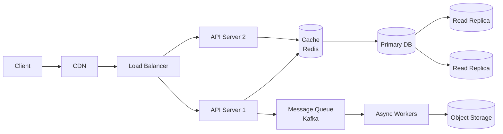

# System design — fondamenti

I round di system design (45-60 min, soprattutto per ruoli mid/senior) ti chiedono *"design Twitter / WhatsApp / Uber / YouTube"*. Non vogliono che TU costruisca davvero quel sistema, ma vogliono vedere **come strutturi un problema ambiguo**, conosci i building block, fai trade-off espliciti.

Questo capitolo ti dà le fondamenta. Il prossimo (cap. 18) ha gli esempi end-to-end.

## Parte 1 — Cosa significa "sistema distribuito"

### Il problema della scala

Un singolo server può:

- Servire **migliaia** di richieste al secondo (forse decine).
- Tenere **TB** di dati su disco.
- Gestire **GB** di RAM.

Va bene per un blog o un piccolo SaaS. Ma:

- Facebook ha **3 miliardi** di utenti.
- Google fa **8 miliardi** di query al giorno.
- Netflix serve **15%** del traffico internet mondiale.

Un singolo server **non basta**. Serve un sistema **distribuito**: tanti computer (chiamati **nodi**) che lavorano insieme, ognuno facendo una parte.

### Le sfide

Distribuire è facile a parole, brutale in pratica:

1. **Coordinazione**: come fanno i nodi a parlarsi senza creare colli di bottiglia?
2. **Coerenza**: se aggiorno un dato su un nodo, gli altri lo vedono subito?
3. **Affidabilità**: se un nodo cade, il sistema sopravvive?
4. **Latenza**: messaggi tra nodi sono lenti rispetto ad accesso locale (μs vs ns).
5. **Costo**: 1000 server costano più di 1.

L'arte del system design è scegliere **trade-off** ragionati.

## Parte 2 — Framework di risposta in 6 step

In colloquio, sempre seguire questo ordine:

### Step 1 — Requirements clarification (5-10 min)

**Functional**: cosa fa l'utente? (post tweet, vedere feed, fare ricerca...)

**Non-functional**: scala, latenza, availability, consistency. Numeri concreti:

- DAU (daily active users)?
- QPS (query per second)?
- Latenza target (es. < 200 ms al 99° percentile)?
- Availability target (99.9% = 8 ore down/anno, 99.99% = 50 minuti/anno)?

**Out of scope**: cosa NON tratti (ad es. "skip authentication, skip payment").

### Step 2 — Back-of-envelope estimation

Calcoli rapidi:

- DAU × azioni/utente = QPS medio.
- × peak factor (3-5x) = QPS picco.
- Storage: dati per oggetto × oggetti totali × anni.
- Bandwidth: media payload × QPS.

Esempio Twitter: 200M DAU × 2 tweet/giorno = 400M tweet/giorno = 4600/sec medio.

### Step 3 — API design

Quali endpoint? Request/response formats.

```
POST /tweet     { text, user_id }
GET  /feed      { user_id, cursor? }
POST /follow    { follower, followee }
```

### Step 4 — Data model

Schema tabelle/documenti. Chiavi, indici.

### Step 5 — High-level architecture

Disegna le scatole: client → LB → API → cache → DB → storage. Connessioni e cosa scorre.

Esempio di template generico:



### Step 6 — Deep dive (su 1-2 componenti)

Scegli 1-2 componenti critici e approfondisci: sharding, replication, cache invalidation.

**Errore tipico**: deep dive su tutto. Non hai tempo, e l'intervistatore vuole vedere come **prioritizzi**.

## Parte 3 — Building blocks essenziali

### 1. Load balancer

Distribuisce traffico tra server. Analogia: il vigile urbano davanti a un incrocio.

**Algoritmi**:

- **Round-robin**: a turno. Semplice.
- **Least connections**: a chi ha meno carico.
- **IP hash**: client X va sempre allo stesso server (per session stickiness).
- **Weighted**: server più potenti ricevono più traffico.

**Layer**:

- **L4 (transport)**: vede solo TCP/UDP packet, non payload. Veloce, ma "stupido".
- **L7 (application)**: vede HTTP. Può routare in base a path/header.

Esempi prodotto: HAProxy, NGINX, AWS ELB.

### 2. Reverse proxy

Davanti ai server applicativi. Funzioni:

- SSL termination.
- Compressione.
- Cache statica.
- Rate limiting.

Spesso un LB **è** un reverse proxy (NGINX, HAProxy).

### 3. Cache

Memorizza dati frequenti per evitare di ricalcolarli o leggerli da DB.

**Livelli**:

- **Client-side**: browser cache.
- **CDN** (Cloudflare, Akamai): cache geograficamente distribuita per asset statici (immagini, video, JS).
- **Application cache** (Redis, Memcached): sessioni, query DB.
- **Database cache**: query plan, buffer pool.

**Politiche di eviction**: LRU (least recently used), LFU (least frequently), FIFO, TTL.

**Strategy di scrittura**:

- **Write-through**: scrivi a cache E DB sincronamente. Consistente ma lento.
- **Write-back**: scrivi solo a cache, flush a DB periodicamente. Veloce ma rischi perdita dati.
- **Write-around**: bypassi cache in scrittura. Cache popolata su read miss.

**Cache invalidation**: il problema più difficile. Strategie: TTL, esplicita, write-through, versioning.

> *"There are only two hard problems in computer science: cache invalidation and naming things."* — Phil Karlton

### 4. Database

#### Relazionali (RDBMS)

PostgreSQL, MySQL.

**Caratteristiche**:

- **Schema rigido**: tabelle con colonne definite.
- **ACID**: transazioni con garanzie forti.
- **JOIN**: query complesse tra tabelle.
- **SQL** (linguaggio standard).

**Quando usarli**: integrità referenziale, transazioni complesse, query analitiche.

#### NoSQL

Famiglie diverse, ognuna ottimizzata per uno scopo:

- **Document** (MongoDB, CouchDB): JSON-like, schema flessibile.
- **Key-value** (Redis, DynamoDB): lookup O(1) per chiave.
- **Wide-column** (Cassandra, HBase): scalabilità orizzontale enorme.
- **Graph** (Neo4j): relazioni come prima cittadini.
- **Time-series** (InfluxDB, TimescaleDB): dati temporali.

**Quando NoSQL**: scala orizzontale, schema flessibile, query semplici per chiave, write-heavy.

### 5. Replication

Una scrittura → copie su più nodi. Scopo: alta disponibilità e parallelismo in lettura.

**Master-slave (primary-replica)**: scritture sul master, letture distribuite tra repliche.

- Replicazione **sincrona**: scrittura confermata solo dopo che le repliche hanno conferma. Consistente ma lento.
- Replicazione **asincrona**: master conferma subito, repliche aggiornate "presto". Veloce ma eventual consistency.

**Multi-master**: scritture su qualsiasi nodo. Più scalabile ma serve risolvere conflitti.

### 6. Sharding (partitioning)

Dividere i dati su più macchine. Necessario quando un singolo nodo non basta.

**Strategie**:

- **Range-based**: range di ID/data. Es. utenti A-M su nodo 1, N-Z su nodo 2. Semplice ma rischio hotspot.
- **Hash-based**: hash(key) % numero shard. Distribuzione uniforme, ma no range query.
- **Geo-based**: per regione. Riduce latenza utenti.
- **Consistent hashing**: minimizza re-shuffling quando aggiungi/rimuovi nodi. Usato in DynamoDB, Cassandra.

### 7. Message queue / Pub-sub

Disaccoppia producer e consumer.

**Kafka**: log distribuito ad alta throughput, retention lunga, replay possibile. Streaming.

**RabbitMQ**: code tradizionali, routing flessibile.

**AWS SQS, Google Pub/Sub**: managed.

**Casi d'uso**: async jobs, event-driven, buffering picchi, fan-out.

### 8. CDN

Cache geograficamente distribuita per asset statici. Riduce latenza utenti remoti, scarica i server origin.

### 9. API Gateway

Punto d'ingresso unico per microservizi: routing, autenticazione, rate limiting, transformations.

### 10. Object storage

S3, GCS, Azure Blob. Per file grandi (immagini, video, backup). Non DB.

## Parte 4 — CAP theorem

Il teorema più famoso dei sistemi distribuiti. **In presenza di partizione di rete**, puoi scegliere solo 2 su 3:

- **C**onsistency: tutti i nodi vedono lo stesso dato simultaneamente.
- **A**vailability: ogni richiesta riceve risposta.
- **P**artition tolerance: il sistema funziona anche con partizioni di rete.

In pratica P è "obbligatorio" — le partizioni capitano. Quindi scegli tra:

### CP — Consistency over Availability

Quando c'è partizione, **rifiuta** scritture (o letture) per non divergere.

Esempi: HBase, MongoDB (default), Zookeeper, etcd.

### AP — Availability over Consistency

Quando c'è partizione, **accetta** scritture anche se i nodi divergono. Riconcili dopo.

Esempi: Cassandra, DynamoDB, CouchDB.

### Esempio pratico

Un carrello e-commerce in 2 datacenter. Partizione tra i due. CP: blocca il carrello (frustrante). AP: lascia l'utente comprare, riconcili dopo (puoi avere "scorta venduta più di quella disponibile").

## Parte 5 — PACELC

Estensione del CAP. In **assenza** di partizione, scegli ancora tra Latency e Consistency:

- **PA/EL**: Cassandra, Dynamo. Sempre Availability, e in assenza di P preferisce Latenza.
- **PC/EC**: BigTable, HBase. Sempre Consistency.
- **PA/EC**: Mongo default. Disponibile in partizione, consistente in assenza.

In colloquio raramente lo citi, ma sapere che esiste mostra profondità.

## Parte 6 — Tecniche di scalabilità

### Vertical scaling

Più CPU/RAM/disk sulla stessa macchina. Semplice ma con un tetto.

### Horizontal scaling

Più macchine. Architettura "shared nothing". Richiede LB, sharding, replication. Scala illimitata in teoria.

### Caching

Già visto. Riduce carico DB.

### Asynchronous processing

Lavori lunghi su queue + worker, non in request-response. L'utente riceve "in processing, ti notifico".

### Read replicas

Letture da repliche, scritture sul master. Buon trade-off per workload read-heavy (90% delle app web).

### Denormalization

Schema NoSQL spesso duplica dati per evitare JOIN. Costa storage e complica scritture, ma velocizza letture.

### Indexing

Strutture (B-tree, hash, inverted index) per query veloci. Costa storage e rallenta write.

## Parte 7 — Back-of-envelope numbers

Da memorizzare:

| Operazione | Tempo |
|---|---|
| L1 cache | 1 ns |
| L2 cache | 10 ns |
| RAM access | 100 ns |
| SSD read | 100 μs |
| Network within DC | 500 μs |
| HDD seek | 10 ms |
| Network NY → London | 100 ms |
| Network NY → Sydney | 200 ms |

| Quantità | Numero |
|---|---|
| 1 day | 86 400 sec |
| 1 year | 31.5M sec |
| 1 KB | 10³ byte |
| 1 MB | 10⁶ byte |
| 1 GB | 10⁹ byte |

### Esempio stima

> Twitter ha 200M DAU. Quanti tweet/giorno? Quanto storage in 5 anni?

- 200M utenti × 2 tweet/giorno = **400M tweet/giorno**.
- 400M / 86 400 ≈ **4 600 tweet/sec**.
- Picco (×3): ~14 000 tweet/sec.
- 1 tweet ≈ 300 byte payload + 700 byte meta = **1 KB**.
- 400M × 365 × 5 × 1 KB ≈ **700 TB**.
- Bandwidth scrittura: 4600 × 1 KB = 4.6 MB/sec medio.

Numeri ragionevoli. Mostra la skill.

## Parte 8 — Trade-off da menzionare sempre

- **Latency vs throughput**: minimizzo singola latenza o massimizzo richieste/sec?
- **Consistency vs availability** (CAP).
- **Storage vs compute**: denormalizzo (più storage, meno compute) o normalizzo (viceversa)?
- **Push vs pull**: server spinge dati al client, o client li chiede?
- **SQL vs NoSQL**.
- **Sync vs async**.

L'intervistatore ama sentirti dire *"questa scelta ottimizza per X, ma trade-off Y. Possiamo cambiare se le priorità sono diverse"*.

## Parte 9 — Strategia in colloquio

### Cosa fare

- **Spendi tempo sui requirements**. Vale 1/3 del round.
- **Disegna mentre parli**. Box e frecce semplici.
- **Numeri**: ogni decisione giustificata da una stima.
- **Trade-off espliciti**: ogni componente "preferisce X a Y".
- **Deep dive su 1-2 componenti** che l'intervistatore vuole approfondire.

### Cosa NON fare

- **Tirare buzzword senza giustificarli**: "uso Kafka". *Perché*?
- **Disegnare scatole senza spiegare come parlano**.
- **Ignorare stime**.
- **Andare deep su tutto**.

## Parte 10 — Risorse per andare oltre

- **"Designing Data-Intensive Applications"** (Kleppmann) — bibbia del system design moderno.
- **System Design Primer** (donnemartin) su GitHub — gratis.
- **ByteByteGo, Hello Interview** (YouTube) — esempi visivi.
- **The Morning Paper** (blog di Adrian Colyer) — paper accademici accessibili.

## Riassunto

1. **Sistema distribuito** = tanti nodi che collaborano. Sfide: coordinazione, coerenza, affidabilità.
2. **Building blocks**: LB, cache, DB (SQL/NoSQL), replication, sharding, queue, CDN, API gateway, object storage.
3. **CAP**: in presenza di partizione, scegli C o A. PACELC: anche senza partizione, scegli L o C.
4. **Scaling**: vertical (limite hardware) vs horizontal (preferito).
5. **Back-of-envelope**: ~10⁸ op/s, RAM 100 ns, network DC 500 μs, network globale 100 ms.
6. **Framework risposta**: requirements → stime → API → data model → architettura → deep dive.

System design è "esperienza" più che "studio". Pratica facendo a voce alta 10+ sistemi (cap. 18).
