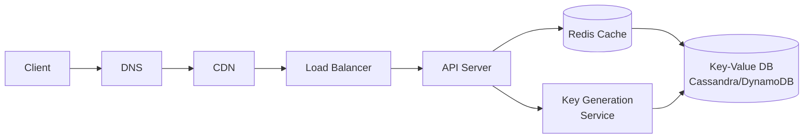
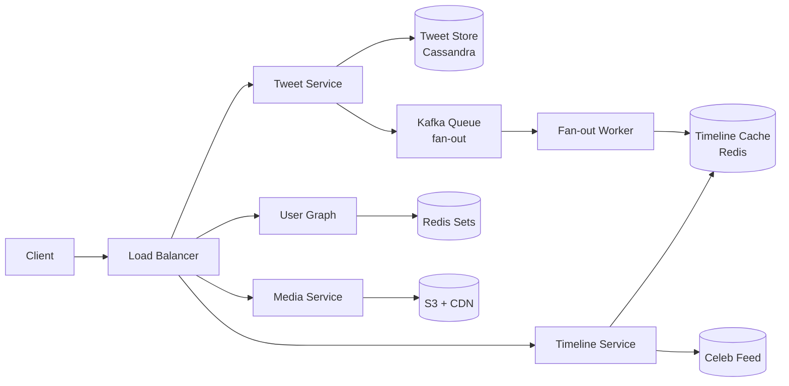
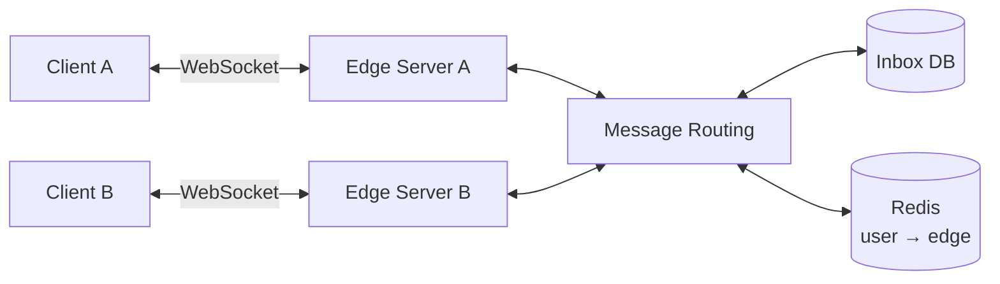
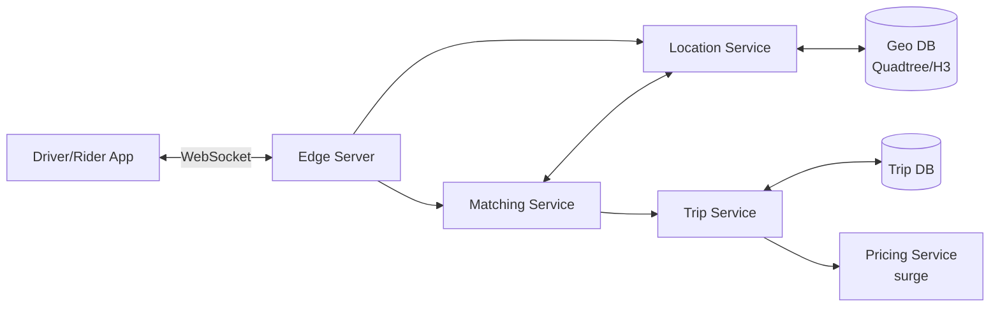
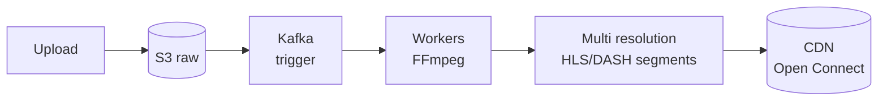
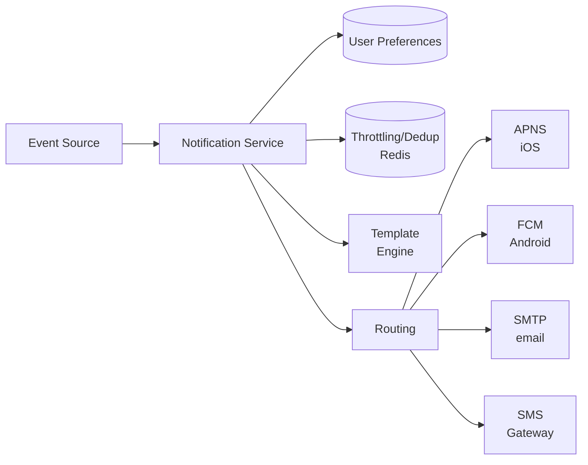

# System design — esempi end-to-end

In ogni esempio segui lo stesso schema: **requirements → estimation → API → data model → high-level → deep dive**. Allenati a farli **a voce alta**, con foglio bianco.

---

## 1. Design TinyURL (URL shortener)

> Servizio tipo bit.ly: trasforma URL lunghi in URL corti, e li espande quando uno li visita.

### Requirements clarification

**Functional**:
- `shorten(long_url) → short_url`.
- `resolve(short) → 302 redirect to long_url`.
- Custom alias opzionale.
- Expiration opzionale.

**Non-functional**:
- Latenza redirect < 100 ms.
- Availability 99.99%.
- Short URL non guessable (sicurezza).

### Estimation

- 100M nuovi URL/mese → ~40/sec scritture. Picco ×5 = 200/sec.
- Lettura/scrittura ratio: 100:1 → 4000/sec letture, 20000/sec picco.
- 5 anni × 100M × 12 = 6 miliardi URL totali.
- Per URL: ~500 byte (long_url + metadata) → **3 TB**.
- Cache 80% hit rate → solo 800 letture/sec sul DB.

### API

```
POST /shorten
  body: { url, custom?, ttl? }
  response: { short }

GET /:short
  response: 302 Location: <long_url>
```

### Data model

| Campo | Tipo |
|---|---|
| short_key (PK) | varchar(7) |
| long_url | text |
| created_at | timestamp |
| expires_at | timestamp? |
| user_id | uuid? |

### Generazione short key — il punto critico

Tre approcci:

**Approccio 1 — Hash MD5/SHA(long_url) → base62**: deterministico, ma collisioni. Devi ri-hashare con suffix.

**Approccio 2 — Random base62 di 7 char**: 62⁷ ≈ 3.5×10¹² combinazioni. Check su DB se già esistente.

**Approccio 3 — Pre-generated keys (preferito)**: un **Key Generation Service** pre-genera un ranger di chiavi disponibili (es. 1 miliardo) e le distribuisce in batch agli API server. Niente collisioni, niente lock condivisi, distribuzione veloce.

### Architecture



### Deep dive

**Hot URL (viral)**: cache layer + replicas DB. CDN può cachare il redirect (Cache-Control).

**Analytics**: ogni redirect → message Kafka → consumer aggrega in batch.

**Expiration**: TTL su Redis (auto-cleanup). Su DB, job notturno cancella expired.

**Custom alias**: check unique nel DB, error 409 se taken.

---

## 2. Design Twitter

> Post tweet, follow, vedi timeline degli utenti che segui.

### Requirements

- Post tweet (≤ 280 char).
- Follow/unfollow.
- Vedi own timeline + feed di chi segui.

**Non-functional**:
- 300M utenti, 200M DAU.
- Timeline load < 200 ms.

### Estimation

- 200M DAU × 2 tweet/giorno = **400M tweet/giorno = ~4600/sec**.
- Timeline views: 200M × 5 = 1B/giorno = 12 000/sec.
- Storage tweet: 1KB × 400M × 365 × 5 ≈ **700 TB**.
- Lettura/scrittura ratio: ~250:1. Heavy read.

### Architettura: il pattern fan-out

**Approccio A — Fan-out on WRITE** (push):
- Quando posti, inserisci in tutte le "timeline cache" dei tuoi follower.
- Read O(1): leggi la tua timeline cache.
- Write costoso: per Lady Gaga (90M follower), 1 post = 90M scritture.

**Approccio B — Fan-out on READ** (pull):
- Timeline calcolata al volo leggendo recenti tweet di chi segui.
- Read costoso ma write O(1).

**Approccio C — Hybrid (Twitter usa questo)**:
- Fan-out on write per **utenti normali** (< 1M follower).
- Fan-out on read per **celebrities**.
- Quando un utente apre timeline: leggi precomputed da cache + merge con celebrity timelines on-the-fly.

### Components



### Data model

- **tweets**: id, user_id, text, created_at, media_url? → wide-column (Cassandra).
- **followers**: follower_id → set(followee_id) → Redis Set.
- **timeline cache**: user_id → list of tweet_id (lunghezza ~800).

### Deep dive

**Trending topics**: count-min sketch streaming su Kafka.

**Search**: Elasticsearch su tweet indexati.

**Push notification**: queue → consumer → APNS/FCM.

**Edge case**: utente segue 5000 celebrities → la pull diventa lenta. Limite di follow + cache aggressiva del celebrity feed.

---

## 3. Design WhatsApp (Chat)

> Messaggi real-time, gruppi, online status, read receipts, end-to-end encryption.

### Requirements

- 1-1 chat e gruppi.
- Consegna affidabile anche se destinatario offline.
- Latenza < 100 ms.
- Encryption end-to-end.

### Architettura

Il pattern centrale: **WebSocket** per connessione persistente.



**Edge servers**: terminano WebSocket. Stato `user_id → server_id` in Redis (servono per sapere dove mandare i messaggi).

**Flusso messaggio**:
1. A invia messaggio via WS al suo edge.
2. Edge → routing service → cerca dove sta B in Redis.
3. Se B online → forward al server di B → push a B via WS.
4. Se B offline → persisti in **inbox queue** di B.
5. Quando B torna online, edge legge inbox, flusha.

### Data model

- **messages**: id, sender, recipient (user o group), content (encrypted blob), sent_at, status.
- **inbox per user**: queue di message_id non ancora consegnati.

### Group chat

Server fa fan-out manuale: itera membri, invia a ciascuno.

### Delivery guarantees

- Ack di livello applicativo (non solo TCP). Client conferma ricezione.
- Retry con exponential backoff su fallimenti.

### End-to-end encryption (Signal protocol)

Client cifra il messaggio con chiave del destinatario (ottenuta tramite key exchange). Server vede solo bytes opachi. Anche se compromesso, server non legge.

### Deep dive

- **Online status**: heartbeat da client. "Lazy update" (non in real-time, ma "circa").
- **Storage**: WhatsApp cancella messaggi dopo consegna. Solo l'inbox temporanea.
- **Sync multi-device**: tutti i device del destinatario riceveranno copia.

---

## 4. Design Uber

> Rider richiede ride, driver accetta, tracking real-time.

### Requirements

- Rider richiede ride.
- Driver accetta.
- Tracking real-time.
- Pricing dinamico (surge).

### Estimation

- 5M ride/giorno globale = 60/sec medio. Picco ×10 = 600/sec.
- 1M driver attivi × 0.25 update posizione/sec = **250 000 location update/sec**.

### Architettura



### Geospatial indexing — il punto critico

Voglio rispondere a "trova tutti i driver entro 5 km da P". Due tecniche:

**Quadtree**: divide il mondo in 4 quadranti, ricorsivamente. Cella massima = 500 driver. Query "vicini a P" scende il quadtree.

**Geohash**: encode coordinate in stringa di 6-12 char. 6 char ≈ 1.2 km. Range query → prefix match.

Uber usa **H3** (esagoni gerarchici di Uber).

### Matching

1. Rider richiede ride a coordinate (lat, lng).
2. Geo service query: driver entro raggio.
3. Per ognuno, calcola **ETA** (tempo di arrivo) usando road network.
4. Scegli driver con ETA minore + qualità driver + load balancing.
5. Notifica driver via push.

### Real-time tracking

Server push posizione driver al rider ogni 2 sec via WS. Frontend interpola tra update per smoothness.

### Deep dive

- **Update frequency**: ogni driver invia ogni 4 sec. Server aggrega per ridurre carico DB.
- **Pricing surge**: per zona, ratio domanda/offerta. Se > 1.5, surge.
- **Resilienza**: matching deve completare in < 5 sec anche con picchi.

---

## 5. Design Netflix (video streaming)

### Requirements

- Upload, transcode video.
- Browse catalogo.
- Streaming adattivo (4K, 720p, mobile).
- Low buffering globale.

### Architettura

#### Pipeline upload



**Output transcoding**: manifest HLS/DASH + segmenti video di 10 sec in 5-10 qualità (240p, 360p, 480p, 720p, 1080p, 4K).

#### Playback

```
Client → DNS → CDN edge più vicino → manifest → segmenti
```

**ABR (Adaptive Bitrate)**: client misura bandwidth, sceglie qualità per il prossimo segmento. Cambia ad ogni segmento se bandwidth varia.

#### CDN strategy

Netflix ha la propria CDN ("Open Connect"). Appliance dentro i grandi ISP riducono trasporto interurbano. 90% del traffico Netflix serve da Open Connect.

### Catalog & Search

- **Browse**: Elasticsearch su catalogo.
- **Recommendation**: ML offline batch (ranking) + real-time signals (clicks, watch time).

### Deep dive

- **Resilienza**: Chaos Monkey (Netflix) — uccidono istanze in produzione per testare.
- **A/B testing**: ordinamento righe, artwork.
- **DRM**: Widevine (Android), FairPlay (Apple), PlayReady (Edge).

---

## 6. Design Instagram

> Post foto/video, segui, vedi feed.

Simile a Twitter ma più "image-heavy".

### Components

- **Upload service**: client → API → upload diretto a S3 con presigned URL → metadata in DB.
- **Image processing**: thumbnail, filters, EXIF strip → async pipeline (Kafka + workers).
- **Feed service**: simile fan-out hybrid di Twitter.
- **CDN**: serve immagini globalmente.

### Schema

```
photos(id, user_id, s3_url, caption, created_at)
follows(follower_id, followee_id)
likes(user_id, photo_id, ts)
```

### Deep dive

**Counter di like**: count veloce. Usa contatore atomico in Redis + flush batch a DB.

**Hashtag/explore**: inverted index in Elasticsearch + ranking ML.

**Stories (24h ephemeral)**: storage temporaneo, TTL.

---

## 7. Design Notification System

> Sistema centrale per push mobile, email, SMS, in-app.

### Requirements

- Channel multipli: APNS (iOS), FCM (Android), SMTP, SMS gateway.
- Topics + user preferences.
- Throttling + dedupe.

### Architettura



### Componenti

- **Topic subscription**: user X sottoscritto a topic Y? Memorizzato in DB.
- **Throttling**: rate limit per user/topic in Redis (sliding window).
- **Template engine**: rendering server-side con dati dinamici.
- **Retry**: exponential backoff su fail (es. APNS down → retry 1s, 2s, 4s...).
- **DLQ (dead letter queue)**: dopo N retry, manda in DLQ per investigazione.

### Deep dive

**Idempotency**: stesso event può arrivare 2 volte (consumer fa retry). Idempotency key per dedupe.

**Per-channel optimization**:
- APNS richiede payload < 4KB.
- SMS è caro: rate limit aggressivo.
- Email: pixel tracking per open rate.

---

## Cheatsheet: sistemi tipici

| Sistema | Componenti chiave |
|---|---|
| URL shortener | hash/base62 + cache + KV DB |
| Twitter/Insta | fan-out hybrid + timeline cache + graph |
| WhatsApp | WebSocket + edge sticky + inbox queue |
| Uber | geohash/quadtree + matching + tracking RT |
| Netflix | CDN + transcoding pipeline + ABR |
| Search engine | crawler + inverted index + ranker (BM25/ML) |
| Rate limiter | token bucket / sliding window in Redis |
| Distributed cache | consistent hashing + replication |
| Distributed file system | metadata service + chunk servers |

## Errori killer in colloquio

- **Saltare i requirements**. 1/3 del round vale.
- **Buzzword senza giustificazione** ("uso Kafka"... perché?).
- **Scatole senza spiegare come parlano**.
- **Ignorare scale & estimation**.
- **Deep dive su tutto**. Scegli 1-2 component.
- **Pretendere di sapere tutto**. Va benissimo dire *"non ho mai progettato X di questa scala, ma il mio ragionamento è..."*.

## Riassunto

Ogni sistema = stesso scheletro: clarify → estimate → API → data model → architettura → deep dive.

Pratica **a voce alta** con foglio bianco. **10+ sistemi** prima del primo loop senior.
