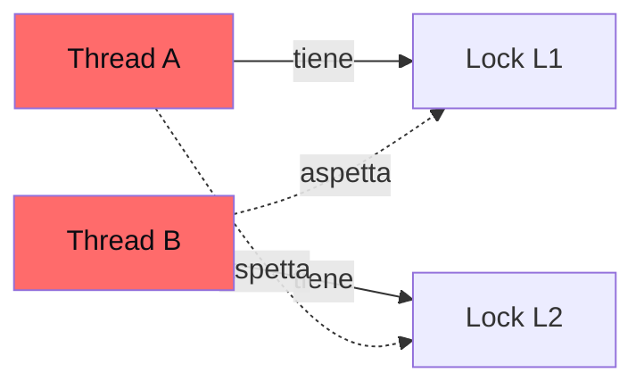

# Concorrenza e parallelismo

Argomento "deep CS" che entra di più nei colloqui infra/backend. Per ruoli puramente algoritmici resta secondario, ma una solida infarinatura ti distingue.

## Parte 1 — Concorrenza vs parallelismo

### Definizioni

- **Concorrenza**: più task **logicamente** in corso. Possono interleavare su una sola CPU (multitasking).
- **Parallelismo**: più task **fisicamente** in esecuzione su più CPU.

Analogia (Rob Pike):

- Concorrenza: un cuoco che cucina più piatti, alternando i passi.
- Parallelismo: 4 cuochi, ognuno con il suo piatto.

In Python il **GIL** (Global Interpreter Lock) impedisce a thread di eseguire bytecode Python in parallelo. Quindi thread sono utili per I/O-bound (rilasciano GIL durante I/O), ma **non per CPU-bound** parallelo. Per parallelismo CPU, usa `multiprocessing` (processi separati) o C-extension che rilasciano GIL.

## Parte 2 — Processi vs thread

### Processo

Un **processo** è un'istanza in esecuzione di un programma. Ha:

- Spazio di memoria proprio (isolamento totale).
- File descriptors.
- Tabella di system resources.
- Almeno 1 thread.

### Thread

Un **thread** è un'unità di scheduling all'interno di un processo. Condivide con altri thread dello stesso processo:

- Heap (memoria dinamica).
- File descriptors.
- Codice.

Ognuno ha proprio:

- Stack (call stack + variabili locali).
- Registri CPU.

### Tabella di confronto

| | Processo | Thread |
|---|---|---|
| Memoria | propria | condivisa con peers |
| Comunicazione | IPC (pipe, socket, queue) | variabili condivise |
| Crash | isolato (altri processi vivi) | rischia di abbattere il processo |
| Spawn cost | alto | basso |
| Context switch | costoso | leggero |

### Context switch

Quando l'OS sospende un task e ne avvia un altro: salva registri/PC del corrente, carica quelli del prossimo. Costo: 1-10 μs su Linux. Causa cache miss → impatto reale più alto.

## Parte 3 — Race condition

Il problema più infame della concorrenza. Due thread leggono/scrivono lo stesso dato senza sincronizzazione → risultato dipendente dall'**interleaving**.

### Esempio classico

```python
counter = 0
def inc():
    global counter
    counter += 1
```

Cosa succede a livello macchina:

1. Carica `counter` in registro.
2. +1.
3. Scrive registro in memoria.

Tre operazioni separate. Se due thread eseguono `inc()` contemporaneamente:

```
Thread A: carica counter (=0) in reg
Thread B: carica counter (=0) in reg
Thread A: +1 → reg=1
Thread A: scrive 1 → counter=1
Thread B: +1 → reg=1
Thread B: scrive 1 → counter=1
```

Risultato: counter = 1, non 2. Un incremento "perso".

Con 1000 thread che fanno inc(), il valore finale **non sarà 1000**.

### Soluzione: lock (mutex)

Una "regione critica" accessibile da un solo thread alla volta.

```python
import threading
lock = threading.Lock()
counter = 0

def inc():
    global counter
    with lock:
        counter += 1
```

Ora i tre passi sono **atomici** (dal punto di vista degli altri thread). 1000 thread → 1000 finale, garantito.

## Parte 4 — Sync primitives

### Mutex (lock)

1 thread alla volta. Acquisisci → lavora → rilascia.

### Semaforo

Generalizzazione: N thread possono entrare contemporaneamente. Contatore interno.

```python
sem = threading.Semaphore(5)   # max 5 simultanei
sem.acquire()
# lavoro...
sem.release()
```

Usato per: limit di connessioni concorrenti, pool di risorse.

### Condition variable

Wait/signal su un predicato. *"Aspetta che qualcuno mi svegli quando la condizione X è vera."*

```python
cond = threading.Condition()
with cond:
    while not predicate():
        cond.wait()   # rilascia il lock e aspetta
    # qui predicate è vero
```

Da un altro thread:

```python
with cond:
    cambia_stato()
    cond.notify()       # sveglia 1 thread che aspetta
    # oppure cond.notify_all()
```

### Spinlock

"Busy-wait": loop finché il lock è disponibile. Veloce per attese brevi (no context switch). Spreca CPU se l'attesa è lunga.

### RWLock (reader-writer)

Molti reader contemporaneamente, ma writer esclusivo. Utile per workload read-heavy.

### Atomic operations

Operazioni hardware che leggono+modificano+scrivono in **un singolo step** (CAS, fetch-add). Senza lock per cose semplici.

In Python: la maggior parte non sono atomiche per via del GIL. In C/Java esistono `AtomicInteger`, `compare_exchange_strong`, ecc.

## Parte 5 — Deadlock

Due thread aspettano l'uno la risorsa dell'altro.



Circular wait → nessuno può avanzare. **Deadlock**.

### Condizioni di Coffman

Tutte e 4 devono valere:

1. **Mutual exclusion**: risorse non condivisibili.
2. **Hold and wait**: un thread tiene una risorsa mentre ne aspetta un'altra.
3. **No preemption**: l'OS non può strappare risorse.
4. **Circular wait**: catena circolare di attese.

### Prevenzione

Rompi almeno una condizione. La più semplice: **ordinamento globale dei lock**. Ogni thread acquisisce in ordine fisso (es. sempre L1 prima di L2).

Altra: `try_acquire` con timeout. Se non riesci, rilascia tutto e ricomincia.

## Parte 6 — Altri problemi sottili

### Livelock

I thread si "accorgono" e si scansano a vicenda, ma non avanzano mai. Es. due persone che si scansano nello stesso senso in corridoio.

### Starvation

Un thread non riesce mai a prendere il lock perché altri sono sempre più "fortunati". Soluzione: lock **fair** (FIFO).

### Race condition senza data race

Anche senza accesso concorrente alla stessa variabile, l'**ordine** delle operazioni può rompere logica. Es. "check then act" non atomico.

```python
# Race condition logica:
if file_exists(path):    # check
    open(path)            # act
# Se qualcuno cancella file tra check e act, crash.
```

## Parte 7 — Producer-consumer (il problema canonico)

Producer mettono item in coda. Consumer li tolgono. Coda condivisa, **bloccante** quando vuota (consumer aspetta) o piena (producer aspetta).

```python
import threading, queue

q = queue.Queue(maxsize=10)

def producer():
    while True:
        item = produce()
        q.put(item)   # blocca se piena

def consumer():
    while True:
        item = q.get()   # blocca se vuota
        consume(item)
        q.task_done()
```

`queue.Queue` di Python è thread-safe (lock interno). Soluzione standard.

## Parte 8 — Async/await (concorrenza single-threaded)

Modello alternativo per **I/O-bound**: niente thread. Single thread con un event loop che gestisce migliaia di task "in attesa".

```python
import asyncio
import aiohttp

async def fetch(session, url):
    async with session.get(url) as r:
        return await r.text()

async def main(urls):
    async with aiohttp.ClientSession() as session:
        results = await asyncio.gather(*[fetch(session, u) for u in urls])
    return results
```

**Quando**:

- Tante richieste I/O concorrenti (HTTP, DB).
- Niente CPU-bound (un singolo thread non parallelizza CPU).

Pro: niente lock, niente context switch costosi. Pro: scali a **10000+** task in un singolo thread.

Contro: codice "viral" — devi propagare `async` ovunque. Debugging meno familiare.

## Parte 9 — Altri modelli

### Actor model (Erlang, Akka)

Ogni "actor" ha:
- Mailbox (queue di messaggi in arrivo).
- Stato privato (no condivisione!).
- Handler che processa messaggi.

Comunicazione **solo per messaggi**. Niente memoria condivisa, niente race condition.

### CSP / channels (Go)

> *"Don't communicate by sharing memory; share memory by communicating."*

Goroutine (thread leggeri) + channel (queue tipizzata). Modello elegante per gran parte dei problemi concorrenti.

## Parte 10 — Esercizi

### Esercizio 19.1 — Bounded Blocking Queue <span class="problem-tag medium">MEDIUM</span>

Implementa coda thread-safe con dimensione massima.

<details><summary>Soluzione</summary>

```python
import threading
class BoundedBlockingQueue:
    def __init__(self, cap):
        self.cap = cap
        self.q = []
        self.lock = threading.Lock()
        self.not_full = threading.Condition(self.lock)
        self.not_empty = threading.Condition(self.lock)

    def enqueue(self, x):
        with self.not_full:
            while len(self.q) >= self.cap:
                self.not_full.wait()
            self.q.append(x)
            self.not_empty.notify()

    def dequeue(self):
        with self.not_empty:
            while not self.q:
                self.not_empty.wait()
            x = self.q.pop(0)
            self.not_full.notify()
            return x

    def size(self):
        with self.lock:
            return len(self.q)
```

Pattern condition variable: `while not predicate(): cond.wait()`.
</details>

### Esercizio 19.2 — Print in Order <span class="problem-tag easy">EASY</span>

Tre thread chiamano `first()`, `second()`, `third()` in ordine arbitrario. Forza output 1→2→3.

<details><summary>Soluzione</summary>

```python
import threading
class Foo:
    def __init__(self):
        self.s2 = threading.Semaphore(0)
        self.s3 = threading.Semaphore(0)
    def first(self, fn):
        fn()
        self.s2.release()
    def second(self, fn):
        self.s2.acquire()
        fn()
        self.s3.release()
    def third(self, fn):
        self.s3.acquire()
        fn()
```

Semafori inizializzati a 0. `second` aspetta `s2` (rilasciato da first). `third` aspetta `s3` (rilasciato da second). Catena.
</details>

### Esercizio 19.3 — Dining Philosophers <span class="problem-tag hard">HARD</span>

5 filosofi, 5 forchette in cerchio. Ognuno serve 2 forchette adiacenti. Niente deadlock, niente starvation.

<details><summary>Soluzione (un'approccio)</summary>

Filosofi pari prendono prima sinistra, dispari prima destra. Rompe il circular wait.

Alternativa: un "waiter" (semaforo globale) permette al massimo 4 filosofi a sedere → impossibile deadlock.
</details>

### Esercizio 19.4 — Building H2O <span class="problem-tag medium">MEDIUM</span>

Thread emettono `H` o `O`. Devi raggrupparli in molecole 2H + 1O alla volta.

<details><summary>Soluzione</summary>

```python
import threading
class H2O:
    def __init__(self):
        self.h_sem = threading.Semaphore(2)
        self.o_sem = threading.Semaphore(0)
        self.barrier = threading.Barrier(3)
    def hydrogen(self, rel):
        self.h_sem.acquire()
        self.barrier.wait()
        rel()
        self.o_sem.release()
    def oxygen(self, rel):
        self.o_sem.acquire(); self.o_sem.acquire()
        self.barrier.wait()
        rel()
        self.h_sem.release(); self.h_sem.release()
```

Barrier sincronizza 3 thread (2H + 1O) prima di rilasciare.
</details>

### Esercizio 19.5 — Web Crawler Multithreaded <span class="problem-tag medium">MEDIUM</span>

Approccio concettuale: pool di worker, queue di URL pending, set visited thread-safe (con lock), rate limiting per host (token bucket).

### Esercizio 19.6 — Fizz Buzz Multithreaded <span class="problem-tag medium">MEDIUM</span>

4 thread: stampano "Fizz", "Buzz", "FizzBuzz", numero. Coordina l'ordine.

<details><summary>Soluzione (skeleton)</summary>

Lock + condition variable. Ogni thread aspetta finché non è il suo turno (basato su `i % 3 == 0` o `% 5 == 0`).
</details>

## Riassunto

1. **Concorrenza ≠ parallelismo**. In Python (GIL), thread sono utili per I/O, non per CPU-bound.
2. **Processi**: isolati, IPC per comunicare. **Thread**: condividono memoria nello stesso processo.
3. **Race condition**: due thread accedono concorrentemente → bug nondeterministici. Risolvi con lock.
4. **Deadlock**: 4 condizioni di Coffman. Rompi una (es. ordinamento lock globale).
5. **Sync primitives**: mutex, semaforo, condition variable, RWLock, atomic.
6. **Producer/consumer**: pattern canonico. In Python `queue.Queue` thread-safe.
7. **Async/await**: alternativa single-threaded per I/O-bound.

Concorrenza è "muscolo" che si costruisce con la pratica e con i fallimenti reali. In colloquio: padroneggia i pattern base sopra.
