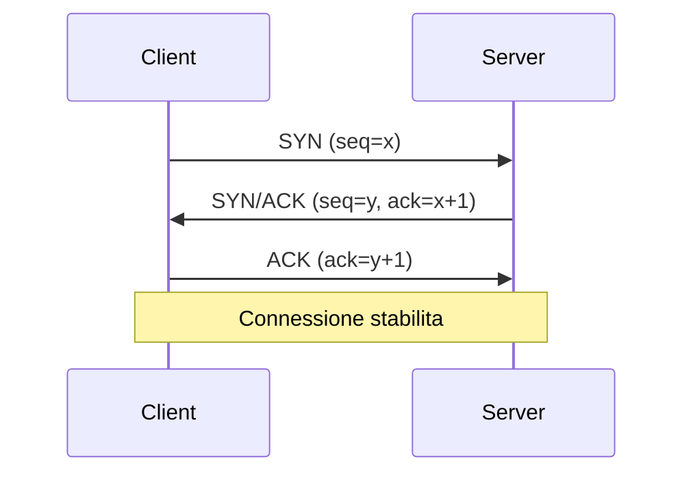
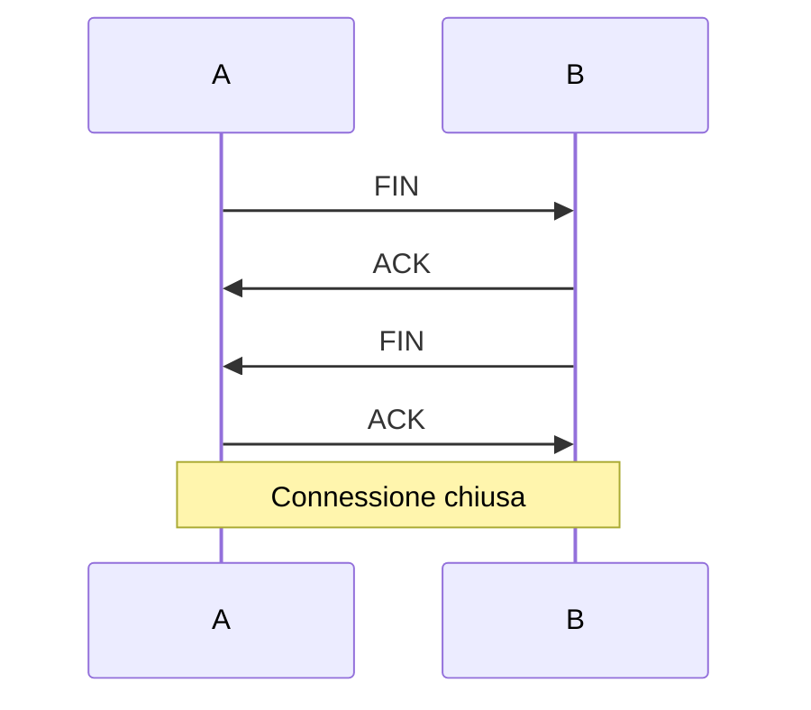

# OS e networking

Spesso queste domande arrivano intervallate al coding ("Cos'è un page fault?"), specialmente nelle prime fasi del loop. Devi rispondere con sicurezza in 1-2 frasi.

Questo capitolo ti dà le fondamenta + risposte memorizzate alle 20 domande più frequenti.

## Parte 1 — Sistema operativo

### Cos'è

Software base che fa girare il computer. Compiti principali:

1. **Gestione processi**: avvia, sospende, schedule.
2. **Gestione memoria**: alloca, isola, virtualizza.
3. **Gestione I/O**: dischi, rete, dispositivi.
4. **Sicurezza**: separazione utenti, permessi.

Esempi: Linux, Windows, macOS, Android (Linux-based), iOS.

### Kernel space vs user space

Il **kernel** è il "core" privilegiato dell'OS. Accede direttamente all'hardware. Le applicazioni utente vivono in **user space**, protetto.

Per fare cose privilegiate (aprire file, allocare memoria), l'app fa una **system call** → trap nel kernel → kernel esegue per conto dell'app.

System call sono costose (decine di μs). Per questo si batchano (`writev`, `sendmsg`, ecc.).

## Parte 2 — Processi

### Cos'è

Un processo è un'**istanza in esecuzione** di un programma. Ha:

- Spazio di indirizzi proprio (virtual memory).
- File descriptors aperti.
- PCB (Process Control Block) con stato, registri, priorità.
- Almeno 1 thread.

In Linux puoi vederli con `ps`, `top`.

### Stati di un processo

- **Running**: sta usando la CPU.
- **Ready**: pronto, in coda di scheduling.
- **Blocked**: aspetta I/O o evento.
- **Zombie**: terminato ma il padre non ha ancora letto exit code.

### Fork & exec (Unix)

- `fork()`: duplica il processo corrente. Bambino e padre proseguono identici.
- `exec()`: rimpiazza il programma corrente con uno nuovo.

Pattern "fork + exec": crei un nuovo processo che esegue un altro programma.

### Process ID

`getpid()` ritorna il PID. PID 1 è `init` (avviato dal kernel al boot).

## Parte 3 — Thread (richiamo)

Già visto nel cap. 19. Sintesi:

- Stesso processo → memoria condivisa.
- Diverso processo → memoria isolata, IPC per comunicare.

## Parte 4 — Scheduling

L'OS decide quale processo/thread eseguire in ogni momento.

**Algoritmi**:

- **FCFS (FIFO)**: a turno. Semplice ma "convoy effect" (processi lunghi bloccano corti).
- **Round Robin**: time slice fisso (es. 10 ms). Equo.
- **Priority**: alta priorità prima. Rischio starvation.
- **MLFQ (Multi-Level Feedback Queue)**: moderni OS. Processi I/O-bound salgono di priorità, CPU-bound scendono. Premia interattività.

Linux usa **CFS** (Completely Fair Scheduler) — variante di fair share.

### Preemptive vs cooperative

- **Preemptive**: OS può interrompere qualsiasi processo. Linux, Windows, macOS.
- **Cooperative**: processi cedono volontariamente. Vecchi OS, alcuni runtime (Lua, vecchi Mac OS).

## Parte 5 — Memoria virtuale

Concetto chiave: **ogni processo vede uno spazio di indirizzi virtuale "completo"**, come se avesse tutta la RAM solo per sé.

### Page table

L'**MMU** (Memory Management Unit) traduce indirizzi virtuali → fisici tramite una **page table**.

Memoria divisa in **pagine** (tipicamente 4 KB). Ogni pagina virtuale mappata a una pagina fisica (o swap su disco).

### Vantaggi

- **Isolamento**: il processo A non vede memoria di B.
- **Memoria > fisica**: pagine inattive vanno in swap. L'OS può "promettere" più RAM di quanta hai.
- **Lazy loading**: pagine allocate ma non ancora usate non occupano RAM.

### Page fault

Quando un processo accede a una pagina **non in RAM**, MMU genera un page fault → kernel la carica dal disco (o swap). Costoso: 1-10 ms (1 milione di volte più lento di accesso RAM).

### TLB

Cache della page table. Hit O(1) per traduzione, miss → walk della page table (costoso).

### Thrashing

Quando troppi page fault → CPU passa più tempo a paginare che a lavorare. Sintomo: disco al 100%, sistema lentissimo.

## Parte 6 — Heap vs stack

Due regioni di memoria di un processo:

### Stack

- **Variabili locali**, parametri di funzione, return address.
- LIFO. Cresce verso il basso.
- Limite ~1-8 MB. Stack overflow se superi.
- Veloce: allocazione = decremento di un puntatore.

### Heap

- **Memoria allocata dinamicamente** (`malloc`, `new`, Python `list = [...]`).
- Limitata da RAM totale.
- Più lento: gestione di blocchi, fragmentation.
- Garbage collector (Java, Python, Go) o manuale (C, C++).

In Python: ogni oggetto è sul heap. Le variabili locali sono riferimenti agli oggetti (sul stack).

## Parte 7 — Filesystem

### Inode

Metadata di un file: size, owner, permessi, timestamp, lista di blocchi su disco. Inode NON contiene il nome del file.

### Directory

Un mapping nome → inode. Le directory sono file speciali.

### Hard link vs soft link

- **Hard link**: due nomi → stesso inode. Cancellare uno non cancella il file (se ci sono altri link). Stesso filesystem.
- **Soft link** (symlink): file che contiene il path di destinazione. Può puntare cross-filesystem o a file inesistenti.

### Permissions (Unix)

```
-rwxr-xr-x  owner=alice  group=devs
```

- `r` = read, `w` = write, `x` = execute.
- 3 gruppi: owner, group, other.
- In ottale: `rwxr-xr-x` = `755`.

## Parte 8 — Networking essenziale

### OSI / TCP-IP stack

7 layer OSI (modello accademico), 5 nello stack TCP/IP pratico:

1. **Physical**: bit su filo / radio.
2. **Data link**: frame, MAC. Ethernet, WiFi.
3. **Network**: pacchetti, IP, routing.
4. **Transport**: TCP, UDP. Affidabilità, multiplexing.
5. **Application**: HTTP, DNS, SMTP, SSH.

### IP (Internet Protocol)

- **IPv4**: 32 bit (4 byte). 4 miliardi indirizzi, **esauriti**. Es: `192.168.1.10`.
- **IPv6**: 128 bit. Sostituendo IPv4. Es: `2001:0db8:85a3::8a2e:0370:7334`.
- **CIDR**: notazione `10.0.0.0/24` = primi 24 bit fissi (subnet), ultimi 8 variabili (host).
- **NAT**: stesso IP pubblico per più device privati (router casa).

### TCP vs UDP

| | TCP | UDP |
|---|---|---|
| Connection-oriented | sì (3-way handshake) | no |
| Reliable | sì (retransmit, ack) | no |
| Ordered | sì | no |
| Flow control | sì | no |
| Overhead | alto | basso |
| Use case | HTTP, SSH, DB | DNS, video streaming, gaming, DoH |

### TCP 3-way handshake



3 round trip per stabilire connessione. Per HTTPS aggiungi TLS handshake (1-2 RTT). Per questo HTTP/3 sopra QUIC riduce a 1 RTT.

### TCP teardown (4-way)



### TCP congestion control

TCP "rallenta" se sospetta congestione (loss detection).

- **Slow start**: cwnd raddoppia ogni RTT (esponenziale fino a soglia).
- **Congestion avoidance**: cwnd cresce lineare dopo soglia.
- **Fast retransmit/recovery**: su duplicate ACK.

Algoritmi: Reno, Cubic (default Linux), BBR (Google, basato su bandwidth).

## Parte 9 — DNS

Risoluzione nome → IP. Es. `google.com` → `142.250.184.46`.

### Gerarchia

Domain Name System è gerarchico:

- **Root** (`.`) → 13 root server in tutto il mondo.
- **TLD** (top-level domain): `.com`, `.org`, `.it`...
- **Authoritative**: server con la verità per un dominio (es. ns1.google.com).
- **Recursive resolver**: il tuo ISP o 8.8.8.8 fa il giro per te.

### Cache

DNS aggressivo nel cache. TTL su ogni record. Modifica DNS = aspetti la propagazione.

### Tipi di record

- **A**: IPv4.
- **AAAA**: IPv6.
- **CNAME**: alias di un altro nome.
- **MX**: server email.
- **TXT**: testo libero (SPF, DKIM, DNSSEC).
- **NS**: name server autoritativi.

## Parte 10 — HTTP

### Metodi

- **GET**: idempotente, safe, cacheable.
- **POST**: NON idempotente (creazione).
- **PUT**: idempotente (upsert).
- **PATCH**: parziale, di solito non idempotente.
- **DELETE**: idempotente.
- HEAD, OPTIONS, TRACE.

### Status codes

- **1xx** informational.
- **2xx** success: 200 OK, 201 Created, 204 No Content.
- **3xx** redirect: 301 permanent, 302 temp, 304 not modified.
- **4xx** client error: 400 bad, 401 unauthorized, 403 forbidden, 404 not found, 429 rate limit.
- **5xx** server error: 500 internal, 502 bad gateway, 503 unavailable, 504 gateway timeout.

### Versioni

- **HTTP/1.1**: text-based, 1 richiesta/connessione (pipelining mal supportato), header ripetuti.
- **HTTP/2**: binario, **multiplexing** (tante richieste in parallelo su una connessione), header compression (HPACK), server push.
- **HTTP/3** (su QUIC, sopra UDP): 1-RTT setup, niente head-of-line blocking, 0-RTT con resume.

### Headers comuni

- `Content-Type`, `Content-Length`
- `Authorization: Bearer <token>`
- `Cache-Control`, `ETag`, `Last-Modified` (caching)
- `Cookie` / `Set-Cookie`
- `Access-Control-Allow-Origin` (CORS)

### REST vs gRPC vs GraphQL

- **REST**: HTTP + JSON, risorse/verbi. Cacheable. Verboso (overfetching).
- **gRPC**: HTTP/2 + Protobuf. Streaming bidirezionale. Polyglot. Più veloce. Meno debuggabile.
- **GraphQL**: query specificate dal client. Riduce overfetching. Complica caching e backend.

## Parte 11 — TLS

Encryption + authentication.

### Handshake (semplificato)

1. Client Hello: "Vorrei comunicare. Ecco i cipher che supporto."
2. Server Hello + certificato (proviene la sua identità).
3. Client verifica certificato vs CA root (preinstallate in OS/browser).
4. Key exchange (Diffie-Hellman) per derivare chiavi simmetriche.
5. "Finished" → da qui in poi tutto encrypted.

**TLS 1.3** riduce a 1-RTT. Resume con 0-RTT.

### Cert chain

```
Server cert (es. *.google.com)
  ← firmato da intermediate CA
    ← firmato da root CA (preinstalled in trust store)
```

## Parte 12 — Idempotency

Stessa richiesta più volte = stesso effetto della prima. Critico per retry safe.

POST tipicamente non idempotente (crea risorsa). Per fixarlo: **Idempotency-Key** in header.

```
POST /payment
Idempotency-Key: abc123
```

Server memorizza la chiave; chiamate duplicate con la stessa key ritornano il primo risultato senza ricreare.

## Parte 13 — Le 15 domande quick (memorizza le risposte)

### 1. Cosa succede quando digiti `google.com`?

1. Browser cerca cache locale + hostfile.
2. Se miss, DNS query → recursive resolver → root → TLD (.com) → authoritative.
3. Ricevi A record (IP).
4. TCP handshake con IP, porta 443.
5. TLS handshake.
6. HTTP GET / con headers.
7. Server: LB → app server → cache + DB → genera HTML.
8. Server risponde con HTML + asset links.
9. Browser parsifica, scarica CSS/JS/img in parallelo (anche CDN).
10. Renderizza DOM, esegue JS.

### 2. Differenza processo vs thread?

Vedi parte 2-3. Sintetica: thread condividono memoria nello stesso processo; processi sono isolati.

### 3. Page fault?

Accesso a pagina non in RAM → MMU genera trap → OS carica da disco. ms vs ns: 1M× più lento.

### 4. `kill -9`?

SIGKILL: non gestibile dal processo. OS lo termina immediatamente. Niente cleanup, niente signal handler.

### 5. HTTP vs WebSocket?

HTTP: request-response. WebSocket: full duplex, persistent. Inizia con HTTP upgrade handshake.

### 6. TCP congestion window?

Quanti byte non-ack-ati possono essere in flight. Aumenta con successo, diminuisce con loss.

### 7. TCP vs UDP?

Vedi parte 8.

### 8. DNS?

Vedi parte 9.

### 9. Zombie process?

Processo terminato il cui exit code non è ancora stato letto dal padre (`waitpid`). Occupa una entry in PID table.

### 10. Fork vs exec?

Fork: clona processo. Exec: rimpiazza programma del processo.

### 11. GIL?

Global Interpreter Lock di Python. Impedisce a thread di eseguire bytecode in parallelo. Per parallelismo CPU usa multiprocessing.

### 12. Quando UDP invece di TCP?

Quando perdite OK + latenza importa: video streaming, gaming, DNS, DoH.

### 13. HTTP/1 vs 2 vs 3?

1: text, 1 req/conn. 2: binario, multiplexing, HPACK. 3: su QUIC/UDP, 1-RTT, no head-of-line block.

### 14. REST: verbi idempotenti?

GET, PUT, DELETE, HEAD, OPTIONS. POST e PATCH no (per default).

### 15. SAML/OAuth/JWT?

- **SAML**: standard XML per SSO enterprise (un po' obsoleto).
- **OAuth2**: framework di authorization. Permette a un'app di accedere a risorse per conto di un utente senza ricevere la password.
- **JWT**: formato di token (JSON + firma). Spesso usato come access token in OAuth.

### 16. Mutex vs semaforo?

Mutex: 1 thread. Semaforo: N thread.

### 17. Memoria virtuale?

Ogni processo vede uno spazio virtuale. MMU traduce in fisico. Isolamento, swap, lazy loading.

### 18. Heap vs stack?

Stack: variabili locali, LIFO, limite ~MB. Heap: allocato dinamicamente, limite ~RAM.

### 19. `select` / `epoll`?

System call per gestire I/O multiplexing: un thread che gestisce migliaia di socket. `epoll` (Linux) scala meglio di `select`.

### 20. Load balancer L4 vs L7?

L4: vede solo TCP/UDP, routes per IP+port. L7: vede HTTP, routes per path/header.

## Riassunto

1. **Processo** = istanza programma. **Thread** = unità di scheduling dentro processo.
2. **Memoria virtuale**: ogni processo vede spazio virtuale isolato. Page fault = costoso.
3. **TCP** affidabile/connection-oriented, **UDP** veloce/no-guarantees.
4. **HTTP**: metodi, status code, idempotency, headers di cache.
5. **DNS**: gerarchico, cached aggressivamente.
6. **TLS**: handshake con cert chain → encryption simmetrica.

Memorizza le 20 risposte sopra. In colloquio quick technical, una buona risposta in 30 secondi distingue.
