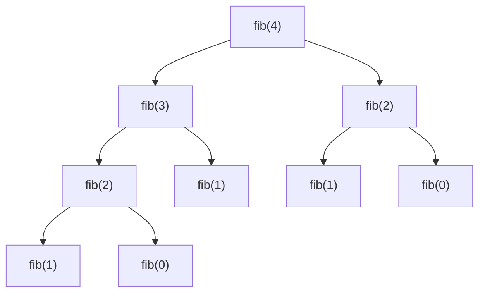

# Computational complexity

Before diving in: **this chapter is fundamental**. If you digest it well, all the following chapters will seem easy. If you skip it, you'll navigate blind.

Let's start from nothing.

## Part 1 — What an algorithm is, and why we care how "fast" it is

### An algorithm is a recipe

Think of a recipe to bake a cake: a sequence of instructions that, followed precisely, produces a result. An algorithm is exactly the same, applied to a computer. It's a series of steps that, given an input, produces an output.

Example (informal): *"given a list of numbers, find the largest"*.

Algorithm:
1. Keep "the champion" in mind. Initially it's the first number.
2. Go through the remaining numbers one by one.
3. For each number, if it's larger than the champion, replace the champion with it.
4. At the end, the champion is the max.

In Python:

```python
def find_max(arr):
    champion = arr[0]
    for x in arr[1:]:
        if x > champion:
            champion = x
    return champion
```

### Why measure "speed"?

A simple recipe can take 10 minutes or 4 hours. For the afternoon in the kitchen it changes everything. For a computer, the difference between a "fast" and a "slow" algorithm is the difference between:

- Google giving you results in 200 ms vs 3 hours.
- A bank processing a transfer in 1 second vs the next day.
- Netflix making a recommendation in real time vs tomorrow morning.

In FAANG interviews you'll **always** be asked to declare how fast your solution is. If you can't say it, it's like saying "I baked a cake" without being able to answer "how long did it take?". Immediate bad impression.

### Why we don't measure in seconds

Natural question: "why don't I just run the code and see how many seconds it takes?". Three problems:

1. **Depends on the machine**. My computer is 10× faster than yours? Is the algorithm better or worse?
2. **Depends on the input**. Works great with 100 elements, but with 1 million? Do I have to try every possible size?
3. **Depends on the moment**. Are you running other programs? Is the CPU in throttling?

So we don't measure in **absolute time** (seconds). We measure in **number of operations** as a function of the input. It's an **abstract** but **universal** measure: it works for any machine, any language, any moment.

## Part 2 — Counting operations: the first intuition

Back to `find_max`. How many operations does it do?

- 1 operation to initialize `champion = arr[0]`.
- For each list element (call `n` the length), it does **1 comparison** (`if x > champion`) and **maybe 1 assignment** (`champion = x`).

So: about `1 + n × 2 = 2n + 1` operations.

If the list has `n = 10` elements → 21 operations.
If it has `n = 1000` → 2001 operations.
If it has `n = 1,000,000` → 2,000,001 operations.

### Question: is 2n+1 "fast" or "slow"?

We'll see soon. But first, a key fact: notice that **that "+1" and that "× 2" aren't very important**. That is, if `n` is huge, the only thing that matters is that it's **proportional to n**. The `2` in front and the `+1` change little.

See for yourself: for `n = 1,000,000`:

- `n` = 1,000,000
- `2n + 1` = 2,000,001
- `5n + 100` = 5,000,100
- `100n` = 100,000,000

All these things are **of the same order of magnitude**: they're all "roughly linear". The leading number is a "constant" that doesn't change the general shape of the growth.

### Contrast: what's "different order of magnitude"?

Now compare with this algorithm:

```python
def equal_pairs(arr):
    """Returns pairs (i, j) with arr[i] == arr[j], i < j."""
    pairs = []
    for i in range(len(arr)):
        for j in range(i+1, len(arr)):
            if arr[i] == arr[j]:
                pairs.append((i, j))
    return pairs
```

How many operations? Two nested loops. For each `i`, the inner loop does `n - i - 1` iterations. Total: `(n-1) + (n-2) + ... + 1 + 0 = n(n-1)/2` comparisons.

For `n = 1,000,000`: `n(n-1)/2 ≈ 500 billion`. On a machine doing ~10⁸ operations/second: **~5000 seconds = ~1.5 hours**.

Compare with `find_max` on `n = 1,000,000`: 2 million operations → **~20 milliseconds**.

**Same order?** No. One scales **linearly** with `n`, the other **quadratically**. For `n = 10` the difference is negligible. For `n = 10⁶` the difference is 5 orders of magnitude.

Big-O is exactly this: classifying algorithms by **how they grow as the input grows**.

## Part 3 — Big-O notation

Big-O writes `O(f(n))` to say "this algorithm, ignoring constants and small terms, grows like f(n)".

- `find_max`: `O(n)` — linear.
- `equal_pairs`: `O(n²)` — quadratic.

The formal rules are two and very simple:

### Rule 1 — Ignore multiplicative constants

`5n` is O(n). `1000n` is O(n). `0.001n` is O(n). All **linear**.

**Why?** Because the constant depends on irrelevant details: language, compiler, hardware. What matters is the **shape of growth**, not the precise slope.

### Rule 2 — Ignore non-dominant terms

`n² + 100n + 5000` is `O(n²)`. When `n` is large, `n²` dominates everything else.

Verify: `n = 1000`. `n² = 1,000,000`. `100n = 100,000`. `5000 = 5000`. The first term is 10× the second and 200× the third. For `n = 10⁶`, the first is 10000× the second. Yes, we can ignore it.

### So, to analyze an algorithm:

1. Count operations as a function of `n` (even roughly).
2. Keep only the fastest-growing term.
3. Throw away constants.

## Part 4 — Complexity classes you must recognize

Here's the "scale" of most common complexities, from fastest to slowest:

| Notation | Name | Example | n=10⁶ | time (10⁸ op/s) |
|---|---|---|---|---|
| `O(1)` | constant | `arr[i]` access | 1 | instant |
| `O(log n)` | logarithmic | binary search | ~20 | instant |
| `O(n)` | linear | single scan | 10⁶ | 10 ms |
| `O(n log n)` | linearithmic | merge sort | ~2·10⁷ | 0.2 s |
| `O(n²)` | quadratic | nested loop | 10¹² | **3 hours** |
| `O(n³)` | cubic | triple loop | 10¹⁸ | impossible |
| `O(2ⁿ)` | exponential | subset enumeration | explodes | impossible at n=40 |
| `O(n!)` | factorial | all permutations | explodes | impossible at n=12 |

### Visualization (important for building intuition)

Here are the growth curves of the most common complexities, from fastest to slowest:

<div style="background:#161922;border:1px solid #262b3a;border-radius:8px;padding:16px;margin:16px 0;overflow-x:auto;">
<svg viewBox="0 0 700 420" xmlns="http://www.w3.org/2000/svg" style="max-width:100%;height:auto;display:block;margin:auto;font-family:'Cascadia Code',monospace;font-size:12px;">
  <defs>
    <style>
      .axis { stroke:#7a8194; stroke-width:1.5; fill:none; }
      .axis-label { fill:#b6bdcc; font-size:13px; }
      .grid { stroke:#262b3a; stroke-width:1; stroke-dasharray:3,3; }
      .curve { fill:none; stroke-width:2.5; }
      .legend { font-size:12px; font-weight:600; }
    </style>
  </defs>
  <line class="grid" x1="60" y1="80"  x2="660" y2="80"/>
  <line class="grid" x1="60" y1="160" x2="660" y2="160"/>
  <line class="grid" x1="60" y1="240" x2="660" y2="240"/>
  <line class="grid" x1="60" y1="320" x2="660" y2="320"/>
  <line class="axis" x1="60" y1="20" x2="60" y2="380"/>
  <line class="axis" x1="60" y1="380" x2="680" y2="380"/>
  <text class="axis-label" x="20" y="30">operations</text>
  <text class="axis-label" x="640" y="400">n (input)</text>
  <path class="curve" stroke="#7a8194" d="M 60 370 L 660 370"/>
  <text class="legend" fill="#7a8194" x="600" y="360">O(1)</text>
  <path class="curve" stroke="#50fa7b" d="M 60 370 Q 200 345 350 330 T 660 310"/>
  <text class="legend" fill="#50fa7b" x="600" y="305">O(log n)</text>
  <path class="curve" stroke="#6cf" d="M 60 370 L 660 220"/>
  <text class="legend" fill="#6cf" x="600" y="215">O(n)</text>
  <path class="curve" stroke="#bd93f9" d="M 60 370 Q 250 320 460 220 T 660 130"/>
  <text class="legend" fill="#bd93f9" x="595" y="125">O(n log n)</text>
  <path class="curve" stroke="#ffb86c" d="M 60 370 Q 330 320 520 200 T 660 60"/>
  <text class="legend" fill="#ffb86c" x="615" y="55">O(n²)</text>
  <path class="curve" stroke="#ff6b6b" d="M 60 370 Q 200 320 280 200 Q 320 80 350 25"/>
  <text class="legend" fill="#ff6b6b" x="360" y="30">O(2ⁿ)</text>
  <path class="curve" stroke="#ff79c6" d="M 60 370 Q 130 300 180 180 Q 210 60 230 25"/>
  <text class="legend" fill="#ff79c6" x="180" y="20">O(n!)</text>
</svg>
</div>

Exponential and factorial curves **explode** quickly (red/pink). Quadratic and linearithmic (orange/purple) grow fast. Linear (cyan) is "reasonable". Logarithmic (green) is **nearly flat**. Constant (gray) never changes.

### A note on O(1)

`O(1)` means **constant**, i.e. "doesn't depend on n". It doesn't mean "fast", it means "time doesn't change if input grows". An algorithm that always takes exactly 3 seconds is `O(1)`. Slow but constant.

### A note on O(log n)

The logarithm is the function "inverse of the exponential". `log₂(8) = 3` because `2³ = 8`. `log₂(1024) = 10` because `2¹⁰ = 1024`.

The logarithm grows **very slowly**:

- `log₂(1) = 0`
- `log₂(1,000) ≈ 10`
- `log₂(1,000,000) ≈ 20`
- `log₂(1,000,000,000) ≈ 30`

When you divide the problem **in half at each step**, you need `log n` steps to get the answer. It's the magic of binary search.

## Part 5 — How to recognize complexity by reading code

Three practical rules, always to apply.

### Rule A — Single loops are O(n)

```python
for x in arr:    # n iterations
    do_thing()   # each O(1)
# Total: O(n)
```

### Rule B — Nested loops are O(n × m)

If two loops scan independently on the same array:

```python
for i in range(n):
    for j in range(n):
        ...
# O(n × n) = O(n²)
```

If they're two different arrays:

```python
for x in arr1:    # length n
    for y in arr2:  # length m
        ...
# O(n × m)
```

**Subtle trap**: not always two nested loops are `O(n²)`. Example:

```python
i, j = 0, n-1
while i < j:
    if condition: i += 1
    else: j -= 1
```

They look like "two pointers moving". But each iteration consumes **one element** (either advances `i`, or retreats `j`). So the total number of iterations is at most `n`. **This is O(n), not O(n²)**.

### Rule C — Halving = O(log n)

```python
while n > 1:
    n = n // 2  # halves each time
```

This loop does `log₂(n)` iterations. If you see "I halve at each step" → `log n`.

### Rule D — For recursion, draw the tree

See dedicated section below.

## Part 6 — Step-by-step guided examples

Let's practice. Here are various code snippets: try to analyze them **before reading the answer**.

### Example 6.1

```python
def f1(arr):
    s = 0
    for x in arr:
        s += x
    return s
```

Think... Answer: **O(n)**. One loop, one operation inside.

### Example 6.2

```python
def f2(arr):
    s = 0
    for x in arr:
        for y in arr:
            s += x * y
    return s
```

Answer: **O(n²)**. Two nested loops, each O(n).

### Example 6.3

```python
def f3(n):
    i = 1
    while i < n:
        print(i)
        i *= 2
```

Answer: **O(log n)**. Variable `i` doubles each step. Takes `log₂(n)` steps to reach `n`.

### Example 6.4

```python
def f4(arr):
    for i in range(len(arr)):
        for j in range(i, len(arr)):
            print(arr[i], arr[j])
```

Number of iterations: `n + (n-1) + (n-2) + ... + 1 = n(n+1)/2`.

Answer: **O(n²)**. Even if the inner loop isn't "up to n" every time, the sum is quadratic. Constants disappear.

### Example 6.5

```python
def f5(arr):
    sorted_arr = sorted(arr)
    for x in sorted_arr:
        print(x)
```

Answer: **O(n log n)**. `sorted` is `O(n log n)`, the loop is `O(n)`. Sum is `O(n log n) + O(n)`, which reduces to `O(n log n)` (dominant term rule).

### Example 6.6

```python
def f6(arr):
    for x in arr:
        if x in arr:  # WARNING
            print(x)
```

Answer: **O(n²)**. The `in` operator on a **list** is O(n). If `arr` were a `set`, it'd be O(1) and total O(n). One of the most common interview traps.

### Example 6.7

```python
def f7(s):
    result = ""
    for c in s:
        result += c
```

Answer: **O(n²)**. **Classic trap question**. String concatenation in Python creates a new string each time, copying previous characters. Iteration `i`: copies `i` chars. Sum: `1+2+...+n = O(n²)`.

Fix: `''.join(char_list)` → O(n).

## Part 7 — Recursion complexity

For recursive algorithms you can't "count loops". You must think of the **call tree**.

Example:

```python
def fib(n):
    if n < 2: return n
    return fib(n-1) + fib(n-2)
```

Draw the call tree for `fib(4)`:



The tree has depth `n` and each node has 2 children → total nodes ≈ `2ⁿ`. **`O(2ⁿ)`**. Horribly slow.

### How it's formalized: recurrences

A **recurrence relation** describes `T(n)` in terms of `T` of smaller inputs.

For `fib`: `T(n) = T(n-1) + T(n-2) + O(1)` → grows like `φⁿ ≈ 2ⁿ`.

For `binary_search` (see ch. 11): `T(n) = T(n/2) + O(1)` → `O(log n)`. Halve at each step.

For `merge_sort`: `T(n) = 2 T(n/2) + O(n)`. The "+O(n)" is the merge. Solution: `O(n log n)`.

### The "Master theorem" simplified

For recurrences of type `T(n) = a · T(n/b) + O(nᵈ)`:

1. Compare `log_b(a)` with `d`.
2. If `log_b(a) < d` → `O(nᵈ)`.
3. If `log_b(a) = d` → `O(nᵈ · log n)`.
4. If `log_b(a) > d` → `O(n^log_b(a))`.

Examples:

- **Merge sort**: `T(n) = 2T(n/2) + O(n)`. `a=2, b=2, d=1`. `log_2(2) = 1 = d` → case 3 → `O(n log n)`. ✓
- **Binary search**: `T(n) = T(n/2) + O(1)`. `a=1, b=2, d=0`. `log_2(1) = 0 = d` → case 3 → `O(log n)`. ✓
- **Karatsuba (fast multiplication)**: `T(n) = 3T(n/2) + O(n)`. `log_2(3) ≈ 1.58 > 1 = d` → case 4 → `O(n^1.58)`.

You don't need to memorize it. You need to recognize that it exists and apply it.

## Part 8 — Space complexity

Not only time. **Space** = how much extra memory the algorithm uses, beyond the input.

Examples:

```python
def sum_arr(arr):
    s = 0
    for x in arr: s += x
    return s
```

Space: **O(1)**. Only one variable `s`, regardless of `n`.

```python
def doubled(arr):
    result = []
    for x in arr: result.append(x * 2)
    return result
```

Space: **O(n)**. The `result` list grows with `n`.

### Recursive stack

Recursion also consumes memory, because the computer must **remember where to return** after each call. This memory is called **call stack**.

```python
def sum_rec(arr, i=0):
    if i == len(arr): return 0
    return arr[i] + sum_rec(arr, i+1)
```

Time: O(n). **Space: O(n)** — because there are `n` calls stacked simultaneously.

In Python the default limit is ~1000 recursive calls. So if `n > 1000`, the recursion crashes with `RecursionError`. The iterative version, instead, is O(1) space (beyond input).

## Part 9 — The "10⁸ rule of thumb"

A modern computer does ~10⁸ (one hundred million) simple operations per second. So:

- Want the program to finish within **1 second**? Total operations must be **≤ ~10⁸**.

Combining with input size, you can figure out **what complexity you need**:

| max n | expected complexity |
|---|---|
| 10⁸ | O(n) — nothing more |
| 10⁶ | O(n log n) ok |
| 10⁴ | O(n²) ok |
| 500 | O(n³) ok |
| 20 | O(2ⁿ) ok |
| 10 | O(n!) ok |

**Use it backwards**: when the interviewer says *"n can reach 10⁵"*, they're telling you **implicitly** that the expected solution is `O(n log n)` or `O(n)`. If you propose `O(n²)`, they'll push you to improve.

This is a crucial skill: **read the problem, deduce the target complexity, aim for it**.

## Part 10 — Best case, worst case, average case

Big-O by default refers to the **worst case**. Example:

- Search for an element in an unsorted array. **Worst case**: element is in last position → O(n). **Best case**: in first position → O(1).

In interview, unless explicitly requested, **always declare worst case**.

### Amortized complexity

Some data structures have operations that are **occasionally slow** but on average fast.

Example: `list.append(x)` in Python. Internally Python keeps an array that **doubles capacity** when full. When this happens, you pay O(n) to copy everything to the new array. But it doubles → happens only `log n` times.

On average: O(1) per append. Declared as **O(1) amortized**. In interview: *"Append is O(1) amortized — worst case O(n), but total of n appends is O(n)"*.

## Part 11 — Python operations cheat-sheet

To always keep in mind:

| Operation | Complexity |
|---|---|
| `list[i]`, `list[i] = x`, `len(list)` | O(1) |
| `list.append(x)`, `list.pop()` | O(1) amortized |
| `list.insert(0, x)`, `list.pop(0)` | **O(n)** — use `collections.deque`! |
| `list.index(x)`, `x in list` | **O(n)** |
| `sorted(list)`, `list.sort()` | O(n log n) |
| `dict[k]`, `dict[k] = v`, `k in dict` | O(1) avg |
| `set` add/in/remove | O(1) avg |
| `collections.deque` append/popleft | O(1) |
| `heapq.heappush/heappop` | O(log n) |
| `''.join(list_of_str)` | O(total chars) |
| `string + string` in loop | **O(n²) — avoid!** |

### Typical traps

```python
# BAD: O(n²)
s = ""
for c in chars: s += c

# GOOD: O(n)
s = "".join(chars)
```

```python
# BAD: O(n²) — pop(0) is O(n)
while arr:
    first = arr.pop(0)
    process(first)

# GOOD: O(n)
from collections import deque
arr = deque(arr)
while arr:
    first = arr.popleft()
    process(first)
```

```python
# BAD: O(n²)
seen = []
for x in arr:
    if x in seen: ...   # 'in' on list is O(n)
    seen.append(x)

# GOOD: O(n)
seen = set()
for x in arr:
    if x in seen: ...   # 'in' on set is O(1)
    seen.add(x)
```

## Part 12 — How to declare complexity in interview

At the end of every solution, **before the interviewer asks**, declare:

> *"Time is O(n log n) because I sort the array, then do a linear pass. Space is O(n) because I keep a dict of n elements. Counting the recursion stack, total space is O(n)."*

If you know your solution is suboptimal, **anticipate it**:

> *"This is the brute force O(n²). I can do better leveraging hashmap, getting to O(n) time at cost of O(n) space. Should I proceed to that?"*

This demonstrates awareness and mastery — one of the main hire criteria.

## Guided exercises

### Exercise 1.1 <span class="problem-tag easy">EASY</span>

What's the complexity of:

```python
for i in range(n):
    for j in range(i, n):
        print(i, j)
```

<details><summary>Guided reasoning</summary>

Think about total iterations of the inner loop:

- For `i=0`: inner loop does `n` iterations.
- For `i=1`: does `n-1`.
- For `i=2`: does `n-2`.
- ...
- For `i=n-1`: does `1`.

Sum: `n + (n-1) + ... + 1 = n(n+1)/2`.

Dominant term is `n²/2`. Constants are thrown away.

**Answer: O(n²)**.

Intuition: "double loop where second depends on first, but in a linear way" is almost always `O(n²)`. Even if the iteration matrix is "triangular" instead of "square", the class stays the same.
</details>

### Exercise 1.2 <span class="problem-tag easy">EASY</span>

```python
i = 1
while i < n:
    i *= 2
```

<details><summary>Reasoning</summary>

`i` doubles at each iteration. After `k` iterations, `i = 2^k`. We want to know for which `k` we reach or pass `n`:

`2^k ≥ n` → `k ≥ log₂(n)`.

So `log₂(n)` iterations are needed. **O(log n)**.

Intuition: every time you see "multiply/divide by a constant", think logarithm.
</details>

### Exercise 1.3 <span class="problem-tag medium">MEDIUM</span>

```python
for i in range(n):
    j = 1
    while j < n:
        j *= 2
```

<details><summary>Reasoning</summary>

Outer loop: O(n). Inner loop: O(log n) (from above).

Nested loops → multiply.

**Answer: O(n log n)**.

This is the complexity of many sorting algorithms (merge sort, heap sort, Python's TimSort).
</details>

### Exercise 1.4 <span class="problem-tag medium">MEDIUM</span>

```python
def f(n):
    if n <= 1: return
    f(n-1)
    f(n-1)
```

<details><summary>Reasoning</summary>

Draw the call tree. Each node has 2 children, depth `n`. Total nodes: `2^0 + 2^1 + ... + 2^(n-1) = 2^n - 1 ≈ 2^n`.

**Time: O(2ⁿ)**.

**Space: O(n)**. At any moment, the "chain" of active calls has depth at most `n` (a path from top to bottom of the tree), not the entire tree.

Lesson: time and space of recursion **are not equal**. Time is total number of calls, space is max stack depth.
</details>

### Exercise 1.5 <span class="problem-tag medium">MEDIUM</span>

You have an array of `n` strings, each at most `k` characters long. What's the complexity of `sorted(arr)`?

<details><summary>Reasoning</summary>

`sorted` does `O(n log n)` comparisons. But each string comparison is not `O(1)`: to compare two `k`-length strings, worst case you look at all chars → `O(k)`.

**Answer: O(n · k · log n)**.

Many candidates say only `O(n log n)` and lose points. **When comparing complex objects, count the comparison cost.**
</details>

### Exercise 1.6 <span class="problem-tag hard">HARD</span>

```python
def f(n):
    if n <= 1: return 1
    return f(n//2) + f(n//2) + f(n//2)
```

<details><summary>Reasoning</summary>

Recurrence: `T(n) = 3 T(n/2) + O(1)`.

Master theorem: `a=3, b=2, d=0`. `log_2(3) ≈ 1.58`. Compare with `d=0` → case 3.

**Answer: O(n^log₂(3)) ≈ O(n^1.58)**.

Strange, right? Not linear, not quadratic, but a fractional power. This is exactly the complexity of Karatsuba for fast multiplication.
</details>

### Exercise 1.7 <span class="problem-tag medium">MEDIUM</span>

Interviewer says *"n can reach 200,000"*. Which complexities are acceptable (within 1 second)?

<details><summary>Reasoning</summary>

Threshold: ~10⁸ total operations.

- `O(n)` → 2·10⁵ operations. ✓
- `O(n log n)` → ~3.5·10⁶ operations. ✓
- `O(n √n)` → ~10⁸. ✓ (limit)
- `O(n²)` → 4·10¹⁰. ✗ (400 seconds)

**The interviewer is telling you the expected solution is O(n log n) or O(n)**. If you propose O(n²), they'll push you to improve.

Knowing how to read constraints is a fundamental skill.
</details>

### Exercise 1.8 <span class="problem-tag medium">MEDIUM</span>

```python
def f(arr):
    n = len(arr)
    for i in range(n):
        for j in range(i+1, n):
            for k in range(j+1, n):
                ...
```

<details><summary>Reasoning</summary>

Three nested loops, each dependent on the previous. The number of iterations is the number of "triplets" `(i, j, k)` with `i < j < k`, which is `C(n, 3) = n(n-1)(n-2)/6`.

Dominant term: `n³/6`. **Answer: O(n³)**.

When you see triple loop, think `O(n³)`. E.g. 3Sum brute force.
</details>

## Summary in 5 points

1. **Big-O measures how an algorithm grows as input grows**, ignoring constants and small terms.
2. **Time and space** are two different metrics, declare both.
3. **Mnemonic scale**: `O(1) < O(log n) < O(n) < O(n log n) < O(n²) < O(2ⁿ) < O(n!)`.
4. **The 10⁸ rule**: ~10⁸ operations/second. Use constraints to deduce target complexity.
5. **Recursion**: time = total calls (often a tree), space = max stack depth.

When you've assimilated this chapter, every problem in the following chapters will become *"which algorithm gets me from naive complexity to target complexity?"*. It's literally the mental framework of the entire interview.
