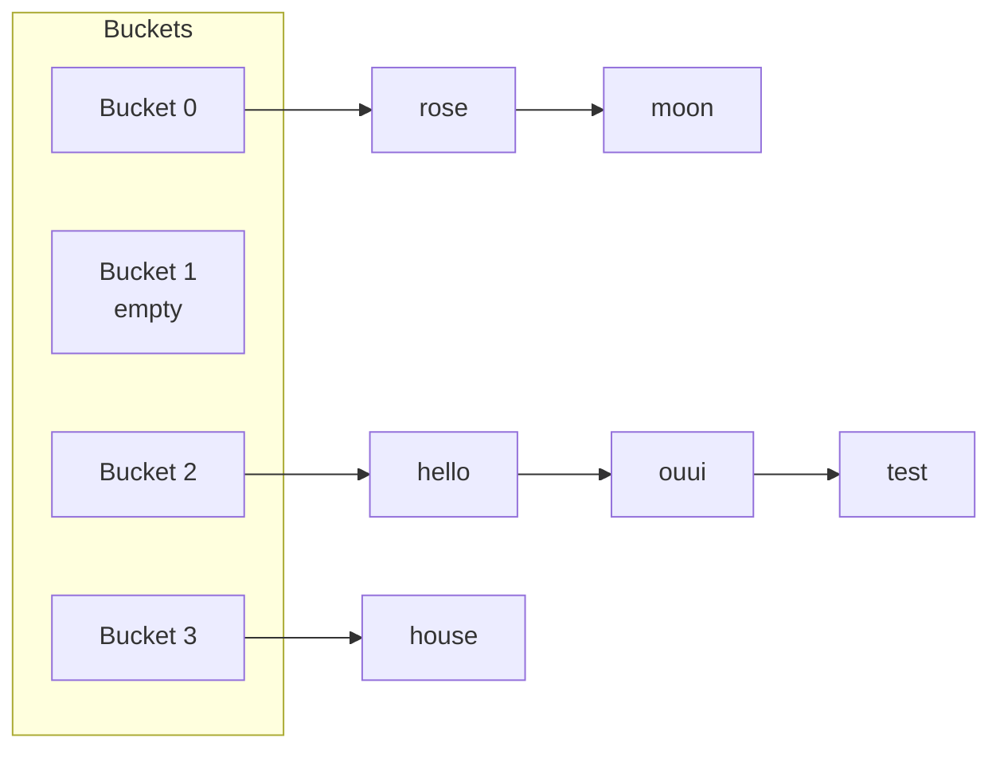

# Hashmap and set

If you must memorize a single lesson from this entire path, you'd probably pick this: **when you see a problem that looks O(n²), think hashmap and it probably becomes O(n)**.

Let's start from foundations.

## Part 1 — The problem hashmap solves

Suppose you have a list of 1 million elements and I ask: "is the value 42456 in there?"

**Array approach**: scan one by one. O(n). For 1 million: ~10 ms. To do 1 million such queries: 10000 seconds (3 hours).

**Sorted array + binary search**: O(log n). For 1 million queries: 20·10⁶ = 20 ms total. Good. But insert/remove is O(n).

**Hashmap**: O(1) per query, O(1) for insert/delete. For 1 million queries: ~10 ms total.

Hashmap is the most powerful data structure in everyday CS. Whenever you can answer "what's the key?", a hashmap solves in O(1).

## Part 2 — How it works internally: the hash function

### Base idea

Imagine you have 10 numbered drawers from 0 to 9, and you want to store 100 objects. How do you decide which drawer each object goes into?

Simple solution: a **deterministic rule** that converts the object into a number between 0 and 9. This is the hash.

Example: object = string, rule = "sum of ASCII codes of characters, modulo 10".

```python
def my_hash(s):
    total = sum(ord(c) for c in s)
    return total % 10
```

`my_hash("hello")` = (104+101+108+108+111) % 10 = 532 % 10 = **2**. Goes in drawer 2.

To search "hello", just compute the hash → drawer 2 → look there. Lookup in **one hash operation + one drawer visit**.

### Properties of a good hash function

1. **Deterministic**: same input → same output.
2. **Fast to compute**: O(1) ideally.
3. **Uniformly distributed**: each drawer receives roughly the same number of objects.
4. **Sensitive to changes**: changing a single character should give a completely different hash ("avalanche" effect).

Python uses specific hash functions for various types (int, str, tuple) much better than my toy example.

### Collisions — the real problem

What if two objects end up in the same drawer? It's called **collision**.

Example: `my_hash("hello") = 2`, but also `my_hash("ouui")` could end up in 2 if codes sum to a multiple of 10 plus 2.

**You have two classic strategies** to handle collisions:

#### Strategy 1 — Chaining

Each drawer contains a **list** of all objects falling there. To search: go to drawer, scan the list.



#### Strategy 2 — Open addressing

If the drawer is occupied, try the **next free** one (linear probing) or another following some scheme (quadratic, double hashing).

Pros: uses only the array, no extra lists. Cons: delete handling complex, performance degrades when full.

Python `dict` uses open addressing with random probing.

### Resize: how O(1) performance is maintained

The more objects you put in, the more collisions. The ratio `n_objects / n_drawers` is the **load factor**. When it exceeds ~0.7, the hashmap **doubles capacity** and **re-hashes** all objects.

Cost: O(n) for resize. But amortized over `n` inserts: O(1) per insert.

### Complexity summary

All base operations:

- **Get/put/delete**: **O(1) average**.
- **Worst case**: O(n) (when everything collides in the same bucket).

In practice O(1) always. If the interviewer asks, cite "average O(1), worst case O(n) for adversarial inputs".

## Part 3 — Hashmap in Python: complete API

### Dict (Python's hashmap)

```python
d = {}                  # empty
d = {"a": 1, "b": 2}    # with initial values

d[k] = v                # set / update
v = d[k]                # get; KeyError if missing
v = d.get(k)            # None if missing
v = d.get(k, default)   # default instead of None
k in d                  # exists, O(1)
del d[k]                # delete, KeyError if missing
d.pop(k)                # delete and return value, KeyError if missing
d.pop(k, default)       # safe pop

list(d.keys())          # list of keys
list(d.values())        # list of values
list(d.items())         # list of (key, value)

len(d)                  # number of entries
d.clear()               # empty

# Iteration
for k in d: ...         # iterate over keys
for k, v in d.items(): ...   # iterate over pairs
```

### Set (hashmap without values)

A set is a hashmap storing only keys. Same O(1) lookup properties.

```python
s = set()
s = {1, 2, 3}          # NB: {} is empty dict, not empty set!

s.add(x)               # O(1)
s.remove(x)            # KeyError if missing
s.discard(x)           # safe, ignores if missing
x in s                 # O(1)

# Set operations (powerful!)
a | b                  # union
a & b                  # intersection
a - b                  # difference (in a but not in b)
a ^ b                  # symmetric difference
a <= b, a < b          # subset
a >= b                 # superset
```

### The 3 superstars of `collections`

```python
from collections import defaultdict, Counter, OrderedDict
```

#### defaultdict

A dict that **creates default value automatically** when accessing a missing key. Eliminates KeyError bugs.

```python
g = defaultdict(list)
g['a'].append(1)   # g['a'] auto-created as [], then append
g['a'].append(2)   # now g = {'a': [1, 2]}
```

Default factory: `int` (default 0), `list` (default []), `set` (default set()), `dict` (default {}).

#### Counter

Counts automatically. One of the most useful classes in everyday CS.

```python
c = Counter("abracadabra")
# Counter({'a': 5, 'b': 2, 'r': 2, 'c': 1, 'd': 1})

c.most_common(3)         # [('a', 5), ('b', 2), ('r', 2)]
c['z']                   # 0, NOT KeyError. Counter returns 0 for missing.
c.update("aaa")          # adds frequencies
c1 + c2                  # element-wise sum
c1 - c2                  # subtraction (clamp to 0)
c1 & c2                  # element-wise min (multiset intersection)
c1 | c2                  # max (multiset union)
```

#### OrderedDict

A dict that **remembers insertion order** and has `move_to_end()`. Historic importance, but since Python 3.7+ even normal dicts maintain order. `OrderedDict` remains useful for `move_to_end` (crucial for LRU cache).

```python
od = OrderedDict()
od['a'] = 1; od['b'] = 2; od['c'] = 3
od.move_to_end('a')           # now order: b, c, a
od.move_to_end('a', last=False)  # now order: a, b, c
od.popitem(last=False)        # removes and returns first entry (FIFO)
od.popitem()                  # removes and returns last (LIFO)
```

## Part 4 — The 6 fundamental hashmap patterns

### Pattern 1 — Complement for sum

Already seen in ch. 02 (Two Sum). **The general idea**: you're looking for two elements that combine (sum, product, XOR, etc.); instead of double loop, memorize what you've seen and look for the complement.

```python
def two_sum(arr, t):
    seen = {}
    for i, x in enumerate(arr):
        comp = t - x
        if comp in seen:
            return [seen[comp], i]
        seen[x] = i
```

Generalization: **from "find X and Y such that ..."** to **"find X such that (something Y derived from X) is already in memory"**.

### Pattern 2 — Frequency

Count occurrences. Three typical uses:

```python
# Is there an element appearing > n/2 times?
def majority(arr):
    c = Counter(arr)
    return c.most_common(1)[0][0]

# Are two strings anagrams?
def anagrams(a, b):
    return Counter(a) == Counter(b)

# Substring with exactly k distinct chars?
# (Sliding window + Counter, see ch. 12)
```

### Pattern 3 — Group by derived key

Group elements sharing a "fingerprint".

```python
# Group anagrams: "fingerprint" is sorted(s)
g = defaultdict(list)
for s in strs:
    g[''.join(sorted(s))].append(s)
return list(g.values())
```

Other key examples: `tuple(sorted(...))` for lists, `(x % 10, x // 10)` for digits, etc.

### Pattern 4 — Prefix sum + hashmap (exact subarray sums)

Combine prefix sum and hashmap to count/find subarrays with specific sum.

**Key idea**: sum of subarray `arr[i..j]` is `prefix[j+1] - prefix[i]`. I want it equal to `k`. So: `prefix[j+1] - prefix[i] = k` → `prefix[i] = prefix[j+1] - k`.

That is: I scan the array computing current prefix. For each position, I look for how many previous prefixes have value `prefix_current - k`. Those give me **all subarrays ending here with sum k**.

```python
def subarray_sum_equals_k(arr, k):
    seen = {0: 1}   # sum 0 seen 1 time (empty prefix)
    pre = 0
    count = 0
    for x in arr:
        pre += x
        count += seen.get(pre - k, 0)   # how many previous prefixes have pre - k
        seen[pre] = seen.get(pre, 0) + 1
    return count
```

**Why `seen = {0: 1}` at start?** Because a subarray starting from the beginning (`arr[0..j]`) has sum `prefix[j+1] - prefix[0] = prefix[j+1] - 0`. I must be able to "see" the prefix=0 (empty sum).

Trace on `arr = [1, 1, 1]`, `k = 2`:

```
i=0 x=1: pre=1, look for pre-k=-1 in seen{0:1} → 0. count=0. seen={0:1, 1:1}
i=1 x=1: pre=2, look for pre-k=0 in seen → found 1 time. count=1. seen={0:1, 1:1, 2:1}
i=2 x=1: pre=3, look for pre-k=1 in seen → found 1 time. count=2. seen={0:1, 1:1, 2:1, 3:1}
```

Result: 2 subarrays with sum 2 (`[1,1]` at indices [0,1] and [1,2]). ✓

**Lesson**: this pattern appears in MANY problems in disguise. "Subarray with sum X", "subarray with sum divisible by k", "binary array with as many 0s as 1s" (map 0 → -1, k = 0).

### Pattern 5 — Set for "already seen"

Cycle detection, duplicates, intersection between lists.

```python
def has_duplicate(arr):
    seen = set()
    for x in arr:
        if x in seen: return True
        seen.add(x)
    return False
```

### Pattern 6 — Hashmap of objects

In graph/tree problems, map node → metadata (visited, distance, parent).

```python
# BFS on graph
visited = {start}
parent = {start: None}
queue = deque([start])
while queue:
    u = queue.popleft()
    for v in graph[u]:
        if v not in visited:
            visited.add(v)
            parent[v] = u
            queue.append(v)
```

## Part 5 — The 5 common traps

### Trap 1 — Non-hashable keys

To be a dict key (or set element), the object must be **hashable**. In Python:

- Hashable: `int, float, str, tuple` (if all its elements are hashable), `frozenset`, custom class with `__hash__`.
- **NOT** hashable: `list, dict, set` (mutable).

```python
d = {}
d[[1, 2]] = "x"   # TypeError: unhashable type: 'list'
d[(1, 2)] = "x"   # OK, tuple
```

For dict of arrays, **convert to tuple**. For dict of sets, **convert to frozenset**.

### Trap 2 — Iteration + modification

Already seen in ch. 02 but also valid for dict:

```python
for k in d:
    if cond(k): del d[k]   # RuntimeError

# Solution: copy keys first
for k in list(d.keys()):
    if cond(k): del d[k]
```

### Trap 3 — `d[k] += 1` on missing key

```python
d = {}
d['a'] += 1   # KeyError!

# Alternatives:
d['a'] = d.get('a', 0) + 1     # Verbose but explicit
# Or:
from collections import defaultdict
d = defaultdict(int)
d['a'] += 1   # OK
# Or:
c = Counter()
c['a'] += 1   # OK
```

### Trap 4 — Comparing empty `Counter`

```python
Counter("aab") == Counter("aba")   # True (anagrams)
Counter() == {}                     # True (both empty)
```

`Counter` behaves like `dict` for `==`. Useful for the anagram pattern.

### Trap 5 — Mutating keys after insertion

If you insert `(list, ...)` and then modify the list — disaster. But lists aren't hashable, so Python blocks this error. With **custom classes**, though, beware: if you modify an attribute entering `__hash__`, the object "gets lost" in the hashmap.

## Part 6 — Golden snippet

### LRU Cache (the "simple" OrderedDict version)

```python
from collections import OrderedDict

class LRUCache:
    def __init__(self, capacity):
        self.cache = OrderedDict()
        self.cap = capacity

    def get(self, k):
        if k not in self.cache:
            return -1
        self.cache.move_to_end(k)   # now it's "most recently used"
        return self.cache[k]

    def put(self, k, v):
        if k in self.cache:
            self.cache.move_to_end(k)
        self.cache[k] = v
        if len(self.cache) > self.cap:
            self.cache.popitem(last=False)   # removes LRU (first inserted)
```

All O(1). This is one of the most asked problems in interviews (Amazon, Google, Microsoft, Stripe).

"Real" version without OrderedDict (with dict + doubly linked list manually) is in ch. 04.

## Guided exercises

### Exercise 3.1 — Contains Duplicate <span class="problem-tag easy">EASY</span>

Does the array contain at least one duplicate?

<details><summary>Solution</summary>

```python
def has_dup(arr):
    return len(set(arr)) < len(arr)
```

O(n) time, O(n) space.

"Early exit" alternative:

```python
def has_dup(arr):
    seen = set()
    for x in arr:
        if x in seen: return True
        seen.add(x)
    return False
```

Advantage: on average faster on inputs with early duplicates.
</details>

### Exercise 3.2 — Valid Anagram <span class="problem-tag easy">EASY</span>

<details><summary>Solution</summary>

```python
from collections import Counter
def is_anagram(s, t):
    return Counter(s) == Counter(t)
```

O(n).
</details>

### Exercise 3.3 — Top K Frequent Elements <span class="problem-tag medium">MEDIUM</span>

<details><summary>Reasoning</summary>

Counter + `most_common(k)`.

```python
from collections import Counter
def top_k(arr, k):
    return [x for x, _ in Counter(arr).most_common(k)]
```

`most_common` internally uses a heap → O(n log k). For small k, great.

**Bucket sort O(n) version**: create bucket[freq] = list of values with that frequency. Scan from high to low freq.

```python
def top_k_bucket(arr, k):
    c = Counter(arr)
    buckets = [[] for _ in range(len(arr) + 1)]
    for val, freq in c.items():
        buckets[freq].append(val)
    res = []
    for freq in range(len(buckets) - 1, 0, -1):
        for val in buckets[freq]:
            res.append(val)
            if len(res) == k: return res
```

In interview discuss with: "Heap is O(n log k). If we want strictly O(n), we can use bucket sort by frequency".
</details>

### Exercise 3.4 — Subarray Sum Equals K <span class="problem-tag medium">MEDIUM</span>

<details><summary>Solution</summary>

See Pattern 4 above. Code and trace included.
</details>

### Exercise 3.5 — Longest Consecutive Sequence <span class="problem-tag medium">MEDIUM</span>

Given an unsorted array of integers, find the length of the longest consecutive sequence. O(n).

<details><summary>Reasoning</summary>

**Naive idea**: sort + scan → O(n log n).

**To reach O(n)**:

1. Put all values in a set.
2. For each value `x` in the set, **start the sequence only if `x-1` is NOT in the set** (otherwise `x` is mid-sequence, not the head).
3. From `x`, count while `x+1, x+2, ...` are in the set.

**Why is it O(n)**? Each element is visited at most 2 times: once in the outer iteration, once in the "expansion" of its own sequence.

```python
def longest_consec(arr):
    s = set(arr)
    best = 0
    for x in s:
        if x - 1 in s:
            continue   # I'm not the head of the sequence
        y = x
        while y + 1 in s:
            y += 1
        best = max(best, y - x + 1)
    return best
```

Trace on `[100, 4, 200, 1, 3, 2]`:

```
set = {100, 4, 200, 1, 3, 2}
x=100: 99 not in set → start. 100→101 no. length=1. best=1.
x=4: 3 in set → skip (4 not head).
x=200: 199 not in set → start. 200→201 no. length=1. best=1.
x=1: 0 not in set → start. 1→2 yes, 2→3 yes, 3→4 yes, 4→5 no. length=4. best=4.
x=3: 2 in set → skip.
x=2: 1 in set → skip.
```

Result: 4 (sequence 1,2,3,4). ✓
</details>

### Exercise 3.6 — First Non-Repeating Character <span class="problem-tag easy">EASY</span>

<details><summary>Solution</summary>

```python
from collections import Counter
def first_unique(s):
    c = Counter(s)
    for i, ch in enumerate(s):
        if c[ch] == 1:
            return i
    return -1
```

Two passes. O(n).
</details>

### Exercise 3.7 — Happy Number <span class="problem-tag easy">EASY</span>

A number is "happy" if, repeating the "sum of squares of digits" operation, you reach 1. Otherwise you end up in a cycle.

<details><summary>Solution</summary>

```python
def is_happy(n):
    seen = set()
    while n != 1 and n not in seen:
        seen.add(n)
        n = sum(int(c)**2 for c in str(n))
    return n == 1
```

Set for cycle detection. O(log n) time (numbers shrink quickly).

O(1) space variant: Floyd's cycle detection (slow/fast). See ch. 04.
</details>

### Exercise 3.8 — Group Anagrams <span class="problem-tag medium">MEDIUM</span>

<details><summary>Solution</summary>

See Pattern 3.
</details>

### Exercise 3.9 — Longest Substring with At Most K Distinct <span class="problem-tag medium">MEDIUM</span>

<details><summary>Reasoning</summary>

Sliding window + Counter. Expand right; when distinct count exceeds k, contract left.

```python
from collections import defaultdict
def longest_k_distinct(s, k):
    cnt = defaultdict(int)
    l = 0
    best = 0
    for r, c in enumerate(s):
        cnt[c] += 1
        while len(cnt) > k:
            cnt[s[l]] -= 1
            if cnt[s[l]] == 0:
                del cnt[s[l]]
            l += 1
        best = max(best, r - l + 1)
    return best
```

The `del` is important: without it, `len(cnt)` doesn't decrease when a key reaches 0.

O(n).
</details>

### Exercise 3.10 — Minimum Window Substring <span class="problem-tag hard">HARD</span>

Shortest substring of `s` containing all characters of `t` (with multiplicity).

<details><summary>Reasoning (one of the most asked problems)</summary>

**Sliding window "shortest covering" approach**:

1. `need = Counter(t)`: required characters.
2. `have`: characters currently in window.
3. `missing`: how many characters still missing to cover `t` (counting multiplicity).

Expand right: each "useful" char decrements `missing`. When `missing == 0`, valid window → try to contract.

```python
from collections import Counter
def min_window(s, t):
    need = Counter(t)
    have = {}
    missing = len(t)
    l = 0
    best = (float('inf'), 0, 0)
    for r, c in enumerate(s):
        if need.get(c, 0) > 0:
            if have.get(c, 0) < need[c]:
                missing -= 1
        have[c] = have.get(c, 0) + 1
        while missing == 0:
            if r - l + 1 < best[0]:
                best = (r - l + 1, l, r)
            have[s[l]] -= 1
            if need.get(s[l], 0) > 0 and have[s[l]] < need[s[l]]:
                missing += 1
            l += 1
    return "" if best[0] == float('inf') else s[best[1]:best[2]+1]
```

O(n+m). One of the most asked (Meta, Google).
</details>

### Exercise 3.11 — Design HashMap <span class="problem-tag medium">MEDIUM</span>

Implement a hashmap without using predefined structures.

<details><summary>Solution</summary>

```python
class MyHashMap:
    def __init__(self):
        self.size = 1009   # prime number
        self.table = [[] for _ in range(self.size)]

    def _bucket(self, k):
        return self.table[k % self.size]

    def put(self, k, v):
        b = self._bucket(k)
        for i, (kk, vv) in enumerate(b):
            if kk == k:
                b[i] = (k, v)
                return
        b.append((k, v))

    def get(self, k):
        for kk, vv in self._bucket(k):
            if kk == k:
                return vv
        return -1

    def remove(self, k):
        b = self._bucket(k)
        for i, (kk, vv) in enumerate(b):
            if kk == k:
                b.pop(i)
                return
```

Chaining with lists. A real hashmap also does dynamic resize.
</details>

## Chapter summary

1. **Hashmap = O(1) lookup** thanks to hash + buckets + collision handling.
2. **Worst case O(n)** but in practice O(1). Cite only if requested.
3. **Killer pattern**: transform O(n²) problems into O(n) by memorizing "what I've seen" → look for the complement.
4. **Python tools to memorize**: `dict`, `set`, `defaultdict`, `Counter`, `OrderedDict`.
5. **Traps**: non-hashable keys, modification during iteration, `+= 1` on missing key.

The 6 patterns of this chapter cover **30% of medium problems** you'll see. Memorize them deeply.
