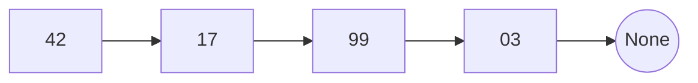
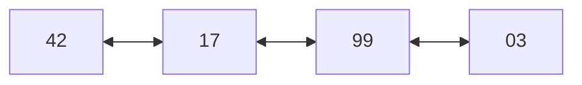
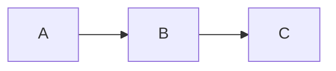
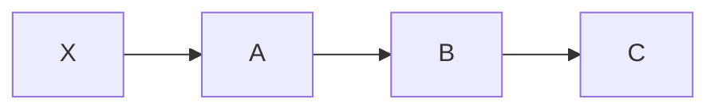
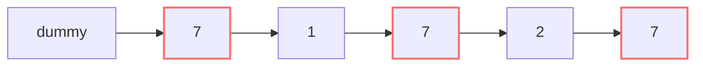
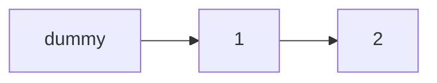

# Linked list

Linked lists are interview bread and butter. Even though Python rarely uses them in real life (lists are dynamic arrays), they appear in 30% of interview problems.

And they have a teaching superpower: they **force you to think in pointers**, a fundamental skill that pays in many other contexts.

## Part 1 — What a pointer really is

### Memory + addresses: recap

As seen in ch. 02, memory is a tape of cells, each with a numeric address (0, 1, 2, ...).

A **pointer** is simply a number representing a memory address. *"Pointer p equals 1000"* means *"p points to the cell at address 1000"*.

In Python you don't see pointers as numbers, but they exist: every variable **doesn't contain** the object, it contains a reference (implicit pointer).

```python
a = [1, 2, 3]
b = a   # b points to the same object as a
b.append(4)
print(a)   # [1, 2, 3, 4] !! Modify via b, but a sees the change
```

`a` and `b` are two pointers to the same list. Modifying the list from one makes the other "see" it.

### A linked list is a chain of connected nodes

Imagine wanting to store a sequence of numbers, but **not in contiguous memory cells**. Instead, scattered everywhere, and each "node" knows **where the next is**.



Each node has:

- `val`: the value.
- `next`: a pointer to the next node (or `None` if last).

In Python:

```python
class ListNode:
    def __init__(self, val=0, next=None):
        self.val = val
        self.next = next
```

### Doubly linked list

Variant: each node also has `prev` (pointer to previous).

```python
class DListNode:
    def __init__(self, val=0):
        self.val = val
        self.prev = None
        self.next = None
```

Visualization:



## Part 2 — Why does it exist? Array vs Linked List

| | Array | Singly LL |
|---|---|---|
| Memory | contiguous | sparse, each node anywhere |
| Access to `i`-th | **O(1)** | O(n) (must traverse) |
| Insert/Delete at head | O(n) (shifts all) | **O(1)** |
| Insert/Delete at tail | O(1) amortized | O(n) or O(1) (with tail ptr) |
| Insert/Delete in middle (with ptr to prev) | O(n) (shifts all) | **O(1)** |
| Cache-friendly | yes (close in index = close in mem) | no (scattered) |
| Memory overhead | low | high (next ptr per node) |

### When does it make sense in real life?

In Python: pretty much never (`list` is enough for everything). In systems languages like C++, yes:

- When you have **many inserts/deletes in the middle** and random access doesn't matter.
- To implement structures like queue, deque, hashmap (chaining), graphs (adjacency list).

**In interviews, linked lists serve mainly as mental gymnastics for reasoning with pointers**.

## Part 3 — The fundamental operations

### 3.1 Traverse

Print or process all nodes:

```python
cur = head
while cur:
    print(cur.val)
    cur = cur.next
```

Important the idiom `while cur:` — exits when `cur is None` (end of list).

### 3.2 Length

```python
def length(head):
    n = 0
    cur = head
    while cur:
        n += 1
        cur = cur.next
    return n
```

O(n).

### 3.3 Insert at head

```python
def insert_head(head, val):
    new_node = ListNode(val)
    new_node.next = head
    return new_node   # new head
```

O(1).

**Before**:



**After**:



### 3.4 Insert after a node

```python
def insert_after(node, val):
    new_node = ListNode(val)
    new_node.next = node.next
    node.next = new_node
```

O(1). The order matters! If you invert the two lines, you lose the reference to the next:

```python
# WRONG:
node.next = new_node       # Now node points to new_node
new_node.next = node.next  # But node.next is now new_node itself → cycle!
```

### 3.5 Delete after a node

```python
def delete_after(node):
    if node.next:
        node.next = node.next.next
```

O(1). The "skipped" node will be collected by garbage collector (in Python).

## Part 4 — Trick number 1: the dummy node

Many linked list problems have a special case: **modification might involve the head**.

Example: "remove all nodes with value 7". If the head itself is 7, you must change the head. If the second is also 7, again. Bug-prone.

**Solution: add a "virtual" dummy node before the head**.

```python
def delete_value(head, target):
    dummy = ListNode(0, head)
    cur = dummy
    while cur.next:
        if cur.next.val == target:
            cur.next = cur.next.next   # skip
        else:
            cur = cur.next
    return dummy.next   # new head
```

Visualization:

**Before** (removing nodes with value 7):



**After**:



No special case for the head: the dummy absorbs the complexity.

**Use the dummy whenever the head could change**.

## Part 5 — Reverse a linked list (explained 3 times)

The most asked LL problem ever. You must know how to write it in 30 seconds.

### Version 1: explained in words

We want to invert `A → B → C → D` into `D → C → B → A`.

Idea: scan node by node. For each, **flip the arrow**.

But there's a problem: as soon as you flip `A.next`, you lose the reference to `B`. So you must **save the next before flipping**.

```python
def reverse(head):
    prev = None       # at start, "before head" is None
    cur = head
    while cur:
        nxt = cur.next    # 1. SAVE next
        cur.next = prev   # 2. FLIP cur's arrow
        prev = cur        # 3. ADVANCE prev
        cur = nxt         # 4. ADVANCE cur
    return prev   # new head (last valid cur)
```

### Version 2: visually explained

Trace on `A → B → C → D`:

```
Step 0 (init):
  prev=None
  cur=A → B → C → D

Step 1 (iteration 1):
  nxt = B   (save)
  A.next = None  (flip: A no longer points to B, points to None)
  prev = A
  cur = B
  List state: None ← A   ;   B → C → D

Step 2:
  nxt = C
  B.next = A   (flip)
  prev = B
  cur = C
  State: None ← A ← B   ;   C → D

Step 3:
  nxt = D
  C.next = B
  prev = C
  cur = D
  State: None ← A ← B ← C   ;   D

Step 4:
  nxt = None
  D.next = C
  prev = D
  cur = None
  State: None ← A ← B ← C ← D

Loop exits (cur is None).
Return prev = D.
```

Result: `D → C → B → A → None`. ✓

### Version 3: recursively explained

```python
def reverse_rec(head):
    if not head or not head.next:
        return head   # base: empty list or single node

    new_head = reverse_rec(head.next)   # reverse the rest
    head.next.next = head               # connect "me" to end of reversed rest
    head.next = None                    # I become the last
    return new_head
```

O(n) time, **O(n) space** for recursion stack. For long lists (n > 1000), prefer the iterative version.

### Which to remember?

All three. In interview write the iterative (simpler, no stack). If they ask recursive, you know.

## Part 6 — Fast & slow pointers (Floyd's algorithm)

An extraordinarily elegant pattern. Also called **Tortoise and Hare**.

### The idea

Two pointers start together from the head. One (slow) advances 1 node at a time. The other (fast) advances 2.

```
Step 0: slow=A, fast=A
Step 1: slow=B, fast=C
Step 2: slow=C, fast=E
...
```

### Use 1: find the middle

When `fast` reaches the end (or can't advance 2 more), `slow` is exactly in the middle. Single pass, O(n).

```python
def find_middle(head):
    slow = fast = head
    while fast and fast.next:
        slow = slow.next
        fast = fast.next.next
    return slow
```

For even list (e.g. 4 nodes), `slow` ends on the **second** of the two medians. If you need the first, use `while fast.next and fast.next.next`.

### Use 2: cycle detection

If the list has a cycle (some `next` points back), fast and slow **will meet**.

```python
def has_cycle(head):
    slow = fast = head
    while fast and fast.next:
        slow = slow.next
        fast = fast.next.next
        if slow is fast:
            return True
    return False
```

**Why does it work?** If there's a cycle, once both pointers enter the cycle they stay there. Fast is "1 ahead more" each iteration (because it does 2 steps vs 1). So sooner or later it reaches slow (one cycle step behind). It's like fast chasing slow on a circular track.

### Use 3: find the start of the cycle

After they've met:

1. Reset one of the pointers to the head.
2. Advance both by 1.
3. They'll meet **at the start of the cycle**.

```python
def detect_cycle(head):
    slow = fast = head
    while fast and fast.next:
        slow = slow.next
        fast = fast.next.next
        if slow is fast:
            p = head
            while p is not slow:
                p = p.next
                slow = slow.next
            return p
    return None
```

**Why?** Proof (algebra):

Let `a` = distance head → cycle start. `b` = distance cycle start → meeting point (in cycle direction). `c` = cycle length.

When they meet:

- slow has traveled `a + b`.
- fast has traveled `a + b + k·c` for some `k` ≥ 1 (k extra cycle laps).
- fast has 2× speed of slow: `a + b + k·c = 2(a + b)` → `k·c = a + b` → `a = k·c - b`.

So if we start from head and from meeting point at speed 1, we travel `a` steps each. Slow reaches `a + b + a = a + (kc - b) + b = a + kc` = "cycle start + k laps" = cycle start. Head reaches exactly cycle start. **They meet there**. □

## Part 7 — Pattern: Merge of two sorted lists

```python
def merge(a, b):
    dummy = ListNode()
    tail = dummy
    while a and b:
        if a.val <= b.val:
            tail.next = a
            a = a.next
        else:
            tail.next = b
            b = b.next
        tail = tail.next
    tail.next = a or b   # attach remainders
    return dummy.next
```

Idea: two pointers, always take the smaller. Dummy node to elegantly handle the head.

## Part 8 — Pattern: intersection of two lists

Given two lists that merge at some point, find the merge node.

**Elegant trick**: scan both lists. When a pointer reaches `None`, make it restart from the other head. They'll meet at the intersection point (or both at `None`).

```python
def intersection(a, b):
    pa, pb = a, b
    while pa is not pb:
        pa = pa.next if pa else b
        pb = pb.next if pb else a
    return pa
```

Why it works: after traversing both lists, they've covered the same total length (`|a| + |b|`). So they arrive "in phase" at the intersection point.

## Part 9 — Common traps

### Trap 1 — Dereferencing None

```python
while cur:
    if cur.next.val == target:   # CRASH if cur.next is None
        ...

# Correct:
while cur and cur.next:
    if cur.next.val == target: ...
```

### Trap 2 — Save next before overwriting

```python
# WRONG:
cur.next = prev   # now you've lost reference to next!

# Correct:
nxt = cur.next    # SAVE first
cur.next = prev
cur = nxt
```

### Trap 3 — Accidental cycle

If you assign `a.next = b` when `b` indirectly points to `a`, you create a cycle. For debug: print the list limiting to N nodes.

```python
def safe_print(head, max_nodes=50):
    out = []
    cur = head
    while cur and len(out) < max_nodes:
        out.append(str(cur.val))
        cur = cur.next
    return " → ".join(out)
```

### Trap 4 — Doubly linked: forgetting `prev`

In doubly linked, every operation requires updating both `next` and `prev`. Common oversight:

```python
# Insert new after node (doubly linked)
new.prev = node
new.next = node.next
if node.next:
    node.next.prev = new   # OFTEN FORGOTTEN
node.next = new
```

### Trap 5 — Changing head

Already said: use the **dummy node** to avoid special cases.

## Guided exercises

### Exercise 4.1 — Reverse Linked List <span class="problem-tag easy">EASY</span>

<details><summary>Solution</summary>

See Part 5. Memorize the iterative version.
</details>

### Exercise 4.2 — Merge Two Sorted Lists <span class="problem-tag easy">EASY</span>

<details><summary>Solution</summary>

See Part 7.
</details>

### Exercise 4.3 — Linked List Cycle <span class="problem-tag easy">EASY</span>

<details><summary>Solution</summary>

See Part 6 use 2.
</details>

### Exercise 4.4 — Cycle II (find cycle start) <span class="problem-tag medium">MEDIUM</span>

<details><summary>Solution</summary>

See Part 6 use 3 with proof.
</details>

### Exercise 4.5 — Remove Nth Node From End <span class="problem-tag medium">MEDIUM</span>

Remove the n-th node from the end, in **single pass**.

<details><summary>Reasoning</summary>

**Classic trick**: two pointers with gap of `n`.

1. `fast` starts from head and advances `n` nodes.
2. Then `slow` starts from head, and both advance together until `fast` reaches the last.
3. At that point, `slow` is **right before** the n-th from end.

```python
def remove_nth(head, n):
    dummy = ListNode(0, head)
    fast = slow = dummy
    for _ in range(n):
        fast = fast.next
    while fast.next:
        fast = fast.next
        slow = slow.next
    slow.next = slow.next.next
    return dummy.next
```

Dummy use to handle "n = list length" (i.e. removing the head).

O(n) time, O(1) space, single pass.
</details>

### Exercise 4.6 — Palindrome Linked List <span class="problem-tag easy">EASY</span>

Check if the list is palindrome. O(n) time, **O(1) space**.

<details><summary>Reasoning</summary>

**Brute force O(n) space**: copy to Python list, check palindrome. But we want O(1).

**Technique**:

1. Find middle (fast/slow).
2. Reverse second half.
3. Compare first half and second half (reversed).
4. (Optionally: re-reverse to restore).

```python
def is_pal(head):
    # 1. Find middle
    slow = fast = head
    while fast and fast.next:
        slow = slow.next
        fast = fast.next.next
    # 2. Reverse second half starting from slow
    prev = None
    while slow:
        nxt = slow.next
        slow.next = prev
        prev = slow
        slow = nxt
    # 3. Compare
    left = head
    right = prev   # new head of reversed second half
    while right:
        if left.val != right.val:
            return False
        left = left.next
        right = right.next
    return True
```

O(n) time, O(1) space.

**Lesson**: combining two base techniques (fast/slow + reverse) solves problems that seem to require extra structures.
</details>

### Exercise 4.7 — Add Two Numbers <span class="problem-tag medium">MEDIUM</span>

Two numbers represented as linked list (least significant digit at head). Return sum as linked list.

<details><summary>Solution</summary>

```python
def add_two(a, b):
    dummy = ListNode()
    tail = dummy
    carry = 0
    while a or b or carry:
        v = carry + (a.val if a else 0) + (b.val if b else 0)
        carry, v = divmod(v, 10)
        tail.next = ListNode(v)
        tail = tail.next
        if a: a = a.next
        if b: b = b.next
    return dummy.next
```

Trace on `342 + 465 = 807` represented as `2→4→3` + `5→6→4`:

```
iter 1: v=2+5+0=7, carry=0. Output: 7
iter 2: v=4+6+0=10, carry=1, v=0. Output: 7→0
iter 3: v=3+4+1=8, carry=0. Output: 7→0→8
end: 7→0→8 which is 807. ✓
```

O(max(n, m)).
</details>

### Exercise 4.8 — Copy List with Random Pointer <span class="problem-tag medium">MEDIUM</span>

List where each node has `next` and `random`. Do deep copy.

<details><summary>Reasoning</summary>

**Idea**: for each original node, we create its copy. But `random` points to another original node, and we must make it point to the copy of that node.

**Hashmap solution**: mapping `original → copy`. Two passes.

```python
def copy_random(head):
    if not head: return None
    m = {}
    # Pass 1: create copies (no links)
    cur = head
    while cur:
        m[cur] = Node(cur.val)
        cur = cur.next
    # Pass 2: connect next and random
    cur = head
    while cur:
        m[cur].next = m.get(cur.next)
        m[cur].random = m.get(cur.random)
        cur = cur.next
    return m[head]
```

O(n) time, O(n) space.

**O(1) space version**: interleaving (insert copy AFTER each original, then split). More complex but elegant.
</details>

### Exercise 4.9 — Reverse Nodes in K-Group <span class="problem-tag hard">HARD</span>

Reverse every k-node group. Last incomplete group: leave as is.

<details><summary>Solution</summary>

```python
def reverse_k_group(head, k):
    dummy = ListNode(0, head)
    group_prev = dummy
    while True:
        # Find k-th node after group_prev
        kth = group_prev
        for _ in range(k):
            kth = kth.next
            if not kth:
                return dummy.next   # incomplete group, end
        group_next = kth.next
        # Reverse [group_prev.next .. kth]
        prev, cur = group_next, group_prev.next
        while cur is not group_next:
            nxt = cur.next
            cur.next = prev
            prev = cur
            cur = nxt
        # "Reconnect" group_prev → kth, and advance group_prev
        tmp = group_prev.next   # will become new "last" of group
        group_prev.next = kth   # group is reversed, kth is first
        group_prev = tmp        # advance for next group
```

Hard. You must draw it to understand. "Boss" exercise of linked lists.
</details>

### Exercise 4.10 — LRU Cache (doubly linked list version) <span class="problem-tag medium">MEDIUM</span>

Without OrderedDict. Hashmap + doubly linked list.

<details><summary>Solution</summary>

```python
class Node:
    def __init__(self, k=0, v=0):
        self.k = k
        self.v = v
        self.prev = self.next = None

class LRUCache:
    def __init__(self, cap):
        self.cap = cap
        self.map = {}
        self.head = Node()   # dummy
        self.tail = Node()   # dummy
        self.head.next = self.tail
        self.tail.prev = self.head

    def _remove(self, n):
        n.prev.next = n.next
        n.next.prev = n.prev

    def _add_front(self, n):
        n.next = self.head.next
        n.prev = self.head
        self.head.next.prev = n
        self.head.next = n

    def get(self, k):
        if k not in self.map:
            return -1
        n = self.map[k]
        self._remove(n)
        self._add_front(n)
        return n.v

    def put(self, k, v):
        if k in self.map:
            self._remove(self.map[k])
        n = Node(k, v)
        self.map[k] = n
        self._add_front(n)
        if len(self.map) > self.cap:
            lru = self.tail.prev
            self._remove(lru)
            del self.map[lru.k]
```

Structure:

```
head ↔ MRU ↔ ... ↔ LRU ↔ tail
```

Dummy head/tail eliminate "empty list" or "remove first/last" special cases.

All O(1). This is THE most asked interview question.
</details>

### Exercise 4.11 — Sort List <span class="problem-tag medium">MEDIUM</span>

Sort a linked list in O(n log n).

<details><summary>Solution</summary>

Merge sort.

```python
def sort_list(head):
    if not head or not head.next:
        return head
    # Split in middle
    slow, fast = head, head.next
    while fast and fast.next:
        slow = slow.next
        fast = fast.next.next
    mid = slow.next
    slow.next = None
    return merge(sort_list(head), sort_list(mid))
```

Merge as seen in Part 7.

O(n log n) time. Stack O(log n).
</details>

## Chapter summary

1. **Pointer = number representing an address**. In Python, variables "are" pointers to objects.
2. **Linked list = chain of nodes**. Middle insert/delete O(1), i-th access O(n).
3. **Dummy node**: add it before head to avoid special cases. Always.
4. **Iterative reverse**: `prev/cur/nxt`. Memorize it.
5. **Fast & slow pointers**: middle, cycle detection, cycle start. Killer pattern.
6. **Hashmap+LL pattern**: LRU cache.

Can you write reverse in 30 seconds? Can you draw fast/slow? Have you mastered the dummy? Then this chapter is done. Go to [ch. 05 — Stack and queue](05-stack-queue.html).
