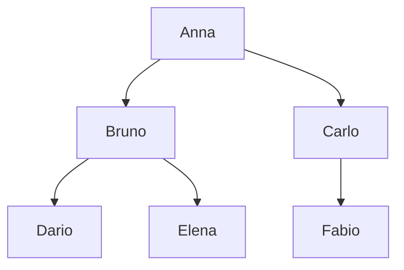
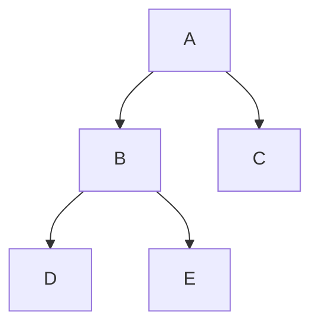
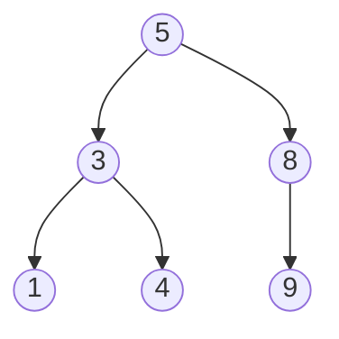
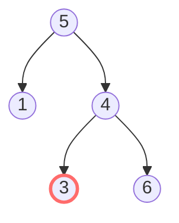
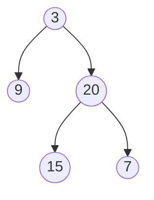

# Trees

At least **20%** of medium problems in FAANG interviews involve trees. The good news: by mastering the foundations, **all problems follow the same mental scheme**.

In this chapter we build intuition from scratch. The key is not memorizing code: it's learning to think recursively.

## Part 1 — What a tree is

### The family analogy (the best)

Think of a family tree:



Anna has two children, Bruno and Carlo. Bruno in turn has two children (Dario and Elena). Carlo has one child (Fabio). Dario, Elena and Fabio have no children (they're "leaves").

In CS, a tree is the same:

- A special node called **root** (the "matriarch").
- Each node can have **children**.
- A node without children is a **leaf**.
- Every node (except root) has exactly **one parent**.

### Formal definition

A tree is a connected graph, **acyclic** (no cycles), **directed** (arrows go from parent to children) and **hierarchical** (one "starting point", the root).

### Binary tree

The most studied tree: each node has **at most 2 children**, called `left` and `right`.

```python
class TreeNode:
    def __init__(self, val=0, left=None, right=None):
        self.val = val
        self.left = left
        self.right = right
```

In memory, a binary tree "lives" as a network of objects connected by pointers, similar to a linked list.

### Terminology

Learn once and for all:

- **Root**: the "top" node. The only one without a parent.
- **Parent / Child**: parent-child relationship.
- **Sibling**: nodes with same parent.
- **Leaf**: node without children.
- **Internal node**: non-leaf node.
- **Depth** of a node: edges from root to node. Root has depth 0.
- **Height** of a node: max edges from node to a leaf. Leaves have height 0.
- **Tree height** = root height.
- **Subtree**: a node + all its descendants.

### Special tree types

- **Full tree**: every node has 0 or 2 children.
- **Complete tree**: all levels full except possibly last, filled left-to-right.
- **Perfect tree**: full + all leaves at same depth.
- **Balanced tree**: for every node, |height(left) - height(right)| ≤ 1.

Why we care? Because in a **balanced** tree with `n` nodes, height is **O(log n)**. All operations going "vertically" become O(log n).

In an **unbalanced** one (e.g. "list" — each node only left child), height is O(n). Everything degenerates.

## Part 2 — Thinking recursively: the key to everything

### The CEO analogy

You're the CEO of a company. The board asks: "what's the total company revenue?".

You don't personally go to each branch to count. You ask each division's CEO: *"what's YOUR division's revenue?"*. Each does the same with their subordinates, down to base employees.

You **sum** the answers and give the total.

This is exactly how to think recursively on trees: **delegate to children and combine**.

### The universal pattern

For almost every tree problem, the recursive function follows this scheme:

```python
def solve(node):
    # 1. Base case: what happens on a None node?
    if not node:
        return base_value

    # 2. Solve on children
    left_result = solve(node.left)
    right_result = solve(node.right)

    # 3. Combine results with this node
    return combine(node.val, left_result, right_result)
```

You only need to decide:

- **What does the recursive call return?** (the "question" you ask the child)
- **What's the base case?**
- **How do you combine results?**

### Pattern examples

**1. Tree height**

Question to child: "what's your height?"

```python
def height(node):
    if not node: return 0
    return 1 + max(height(node.left), height(node.right))
```

**2. Count nodes**

```python
def count(node):
    if not node: return 0
    return 1 + count(node.left) + count(node.right)
```

**3. Sum values**

```python
def sum_tree(node):
    if not node: return 0
    return node.val + sum_tree(node.left) + sum_tree(node.right)
```

**4. Find max**

```python
def find_max(node):
    if not node: return float('-inf')
    return max(node.val, find_max(node.left), find_max(node.right))
```

Note: once the pattern is understood, they're all the same. Only `combine` changes.

## Part 3 — Traversals: the 4 ways to visit a tree

Visiting a tree means "going through all nodes once". The 4 fundamental orders:

### Preorder: ROOT → LEFT → RIGHT

```python
def preorder(node):
    if not node: return
    print(node.val)            # ROOT: first visit
    preorder(node.left)
    preorder(node.right)
```

Visualization on:



Preorder visits: **A, B, D, E, C**.

**When to use it**: when you must process the node before its children. E.g. copy a tree, serialize.

### Inorder: LEFT → ROOT → RIGHT

```python
def inorder(node):
    if not node: return
    inorder(node.left)
    print(node.val)
    inorder(node.right)
```

Same tree: **D, B, E, A, C**.

**Magic with BST**: inorder on a Binary Search Tree gives values **in ascending order**.

### Postorder: LEFT → RIGHT → ROOT

```python
def postorder(node):
    if not node: return
    postorder(node.left)
    postorder(node.right)
    print(node.val)
```

Same tree: **D, E, B, C, A**.

**When to use it**: when you must process children before the node. E.g. delete a tree (must delete children first), computations depending on children's results (height, sum).

### Level order (BFS)

Visit level by level, left to right:

```python
from collections import deque
def level_order(root):
    if not root: return
    q = deque([root])
    while q:
        node = q.popleft()
        print(node.val)
        if node.left: q.append(node.left)
        if node.right: q.append(node.right)
```

Same tree: **A, B, C, D, E**.

**When to use it**: shortest path in unweighted edges, level-by-level processes (e.g. zigzag, right side view, min depth).

### Practical summary

| What you need | Traversal |
|---|---|
| Visit BST in ascending order | Inorder |
| Validate BST | Inorder (must be strictly increasing) |
| Copy / clone | Preorder |
| Serialize | Preorder (with null marker) |
| Computations requiring children | Postorder |
| Safe deletion | Postorder |
| Print level by level | BFS |
| Min depth | BFS (early exit at first leaf) |
| Max depth | DFS (postorder or preorder) |
| Find node by value | Preorder with early exit |

### Iterative DFS (with explicit stack)

For deep trees `n > 10⁴`, recursion stack can explode. Then use explicit stack.

```python
def preorder_iter(root):
    if not root: return []
    st = [root]
    out = []
    while st:
        n = st.pop()
        out.append(n.val)
        if n.right: st.append(n.right)   # right first!
        if n.left: st.append(n.left)
    return out
```

Trick: `right` first on stack, so `left` is popped first (LIFO).

Iterative inorder is subtler:

```python
def inorder_iter(root):
    st = []
    cur = root
    out = []
    while cur or st:
        while cur:
            st.append(cur)
            cur = cur.left
        cur = st.pop()
        out.append(cur.val)
        cur = cur.right
    return out
```

Idea: go all left (push everything on stack), then pop, go right, repeat.

## Part 4 — Binary Search Tree (BST)

### Definition

A BST is a binary tree where, for **every node**:

- All values in **left** subtree are **less than** the node.
- All values in **right** subtree are **greater than** the node.



Note: 1 < 3 < 4 < 5 < 8 < 9. **Inorder = sorted sequence**.

### Operations

**Search**: go left if target is smaller, right if larger.

```python
def search_bst(root, target):
    cur = root
    while cur and cur.val != target:
        cur = cur.left if target < cur.val else cur.right
    return cur
```

O(h) time, where `h` is the height. For **balanced** BST: O(log n). For unbalanced: O(n).

**Insert**: like search, but at the end of the path you create a node.

```python
def insert_bst(root, val):
    if not root: return TreeNode(val)
    if val < root.val:
        root.left = insert_bst(root.left, val)
    else:
        root.right = insert_bst(root.right, val)
    return root
```

**Delete**: three cases:

1. Leaf: remove.
2. One child: disconnect, attach child to parent.
3. Two children: find inorder successor (smallest of right subtree), copy its value to the node to delete, delete the successor (case 1 or 2).

### Balancing

Inserting already-sorted values in a BST, you get a degenerate list → O(n).

Inserting 1, 2, 3, 4, 5 in order:


To guarantee O(log n), you need **self-balancing BSTs**: AVL, Red-Black, Treap, B-tree. Don't implement them in interview (a day of coding). Just know they exist and that Python's `set`/`dict` are NOT BSTs (they're hashmaps).

## Part 5 — Lowest Common Ancestor (LCA)

The first common ancestor of two nodes. Classic problem, two variants:

### LCA on BST

Exploit the BST property: descend until the two targets are "split" (one left, one right). That node is LCA.

```python
def lca_bst(root, p, q):
    while root:
        if p.val < root.val and q.val < root.val:
            root = root.left
        elif p.val > root.val and q.val > root.val:
            root = root.right
        else:
            return root   # they split here
```

### LCA on generic binary tree

Without BST property. "Find p or q that bubbles up" recursion.

```python
def lca(root, p, q):
    if not root or root is p or root is q:
        return root
    L = lca(root.left, p, q)
    R = lca(root.right, p, q)
    if L and R: return root   # p and q in different subtrees → root is LCA
    return L or R              # both in same subtree
```

**Why it works?** The recursion returns:

- `None` if neither p nor q is in subtree.
- `p` or `q` if only one is.
- The LCA if both are.

When the root sees one in left and one in right → it's the LCA. Otherwise propagates.

## Part 6 — Common traps

### Trap 1 — Validating BST with only local comparisons

```python
# WRONG:
def is_bst(node):
    if not node: return True
    if node.left and node.left.val >= node.val: return False
    if node.right and node.right.val <= node.val: return False
    return is_bst(node.left) and is_bst(node.right)
```

This passes on `[5, 1, 4, null, null, 3, 6]`:



Local comparison: 4 has 3 < 4 ✓ and 6 > 4 ✓. Seems OK. **But wrong**: 3 must be > 5 because it's in right subtree of 5.

**Correct**: pass bounds (min, max) down.

```python
def is_bst(node, lo=float('-inf'), hi=float('inf')):
    if not node: return True
    if not (lo < node.val < hi): return False
    return is_bst(node.left, lo, node.val) and is_bst(node.right, node.val, hi)
```

### Trap 2 — Stack overflow on unbalanced trees

For a "list" tree with n = 10⁵, recursion stack exceeds Python limit (~1000 default).

Solution: increase limit (`sys.setrecursionlimit(10**6)`) or use explicit stack.

### Trap 3 — Forgotten None checks

Almost every tree bug comes from `node.left.val` where `node.left is None`.

Safe idiom: `if node.left:` or `node.left.val if node.left else default`.

### Trap 4 — Confusing "height" and "depth"

- **Depth**: from top to node (root = 0).
- **Height**: from node to bottom (leaves = 0).

They're dual. Confusing them leads to off-by-one bugs.

### Trap 5 — Iterating a dict while modifying it

Also valid with `Counter` of tree values. Use `list(d.items())`.

## Guided exercises

### Exercise 6.1 — Maximum Depth <span class="problem-tag easy">EASY</span>

<details><summary>Solution</summary>

```python
def max_depth(root):
    if not root: return 0
    return 1 + max(max_depth(root.left), max_depth(root.right))
```

Classic recursive pattern. Ask children "what's your depth?", add 1.
</details>

### Exercise 6.2 — Invert Binary Tree <span class="problem-tag easy">EASY</span>

Mirror (swap left/right recursively).

<details><summary>Solution</summary>

```python
def invert(root):
    if not root: return None
    root.left, root.right = invert(root.right), invert(root.left)
    return root
```

Problem made famous by Max Howell's tweet: *"Google: 90% of our engineers use the software you wrote (Homebrew), but you can't invert a binary tree on a whiteboard so f*** off"*.
</details>

### Exercise 6.3 — Same Tree <span class="problem-tag easy">EASY</span>

<details><summary>Solution</summary>

```python
def same(a, b):
    if not a and not b: return True
    if not a or not b: return False
    return a.val == b.val and same(a.left, b.left) and same(a.right, b.right)
```
</details>

### Exercise 6.4 — Symmetric Tree <span class="problem-tag easy">EASY</span>

Is the tree mirrored around the root?

<details><summary>Solution</summary>

```python
def is_sym(root):
    def mirror(a, b):
        if not a and not b: return True
        if not a or not b: return False
        return a.val == b.val and mirror(a.left, b.right) and mirror(a.right, b.left)
    return mirror(root, root) if root else True
```

Helper function `mirror(a, b)` checking if two subtrees are mirror images.
</details>

### Exercise 6.5 — Balanced Binary Tree <span class="problem-tag easy">EASY</span>

<details><summary>Reasoning</summary>

**Naive**: for each node, compute child heights and compare. O(n²).

**Optimal**: single pass. Recursion returns height, or `-1` if unbalanced (sentinel). If a subtree is already unbalanced, propagate `-1` up.

```python
def is_balanced(root):
    def h(node):
        if not node: return 0
        l = h(node.left)
        if l == -1: return -1
        r = h(node.right)
        if r == -1 or abs(l - r) > 1: return -1
        return 1 + max(l, r)
    return h(root) != -1
```

O(n).

**Lesson**: sometimes "early exit" is done with sentinel value in recursion.
</details>

### Exercise 6.6 — Diameter <span class="problem-tag easy">EASY</span>

Max number of edges between any two nodes.

<details><summary>Reasoning</summary>

Diameter **passing through a specific node** = (left height) + (right height).

So: recursion that computes height, and in parallel updates a `best` global with `left_h + right_h`.

```python
def diameter(root):
    best = 0
    def h(node):
        nonlocal best
        if not node: return 0
        l = h(node.left)
        r = h(node.right)
        best = max(best, l + r)
        return 1 + max(l, r)
    h(root)
    return best
```

**Lesson (important)**: the "two variables" trick:

- The **recursive function** returns something needed by the parent to be composable (here: height).
- The **global/nonlocal variable** tracks the "best global result" passing through nodes.

This trick is used in MANY hard tree problems.
</details>

### Exercise 6.7 — Validate BST <span class="problem-tag medium">MEDIUM</span>

<details><summary>Solution</summary>

See Part 6 trap 1.
</details>

### Exercise 6.8 — LCA (Binary Tree) <span class="problem-tag medium">MEDIUM</span>

<details><summary>Solution</summary>

See Part 5.
</details>

### Exercise 6.9 — Path Sum II <span class="problem-tag medium">MEDIUM</span>

All root→leaf paths with sum = target.

<details><summary>Solution (with backtracking)</summary>

```python
def path_sum(root, target):
    res = []
    def dfs(node, path, rem):
        if not node: return
        path.append(node.val)
        if not node.left and not node.right and rem == node.val:
            res.append(path[:])   # IMPORTANT: copy!
        else:
            dfs(node.left, path, rem - node.val)
            dfs(node.right, path, rem - node.val)
        path.pop()   # backtrack
    dfs(root, [], target)
    return res
```

Backtracking pattern: append before recursing, pop on return. Results saved by copy (`path[:]`), otherwise all point to same list.
</details>

### Exercise 6.10 — Level Order Traversal <span class="problem-tag medium">MEDIUM</span>

<details><summary>Solution</summary>

BFS collecting nodes per level:

```python
def level_order(root):
    if not root: return []
    q = deque([root])
    out = []
    while q:
        level = []
        for _ in range(len(q)):  # number of nodes at current level
            n = q.popleft()
            level.append(n.val)
            if n.left: q.append(n.left)
            if n.right: q.append(n.right)
        out.append(level)
    return out
```

Trick: `for _ in range(len(q))` gives you level size before adding next level.
</details>

### Exercise 6.11 — Right Side View <span class="problem-tag medium">MEDIUM</span>

<details><summary>Solution</summary>

BFS, take last node of each level:

```python
def right_view(root):
    if not root: return []
    q = deque([root])
    res = []
    while q:
        size = len(q)
        for i in range(size):
            n = q.popleft()
            if i == size - 1:
                res.append(n.val)   # last of level
            if n.left: q.append(n.left)
            if n.right: q.append(n.right)
    return res
```
</details>

### Exercise 6.12 — Kth Smallest in BST <span class="problem-tag medium">MEDIUM</span>

<details><summary>Solution</summary>

Iterative inorder, stop at k-th.

```python
def kth_smallest(root, k):
    st = []
    cur = root
    while True:
        while cur:
            st.append(cur)
            cur = cur.left
        cur = st.pop()
        k -= 1
        if k == 0: return cur.val
        cur = cur.right
```

O(h + k). Bonus: lazy implementation.
</details>

### Exercise 6.13 — Serialize/Deserialize Binary Tree <span class="problem-tag hard">HARD</span>

<details><summary>Solution</summary>

Preorder with marker `'#'` for null.

```python
class Codec:
    def serialize(self, root):
        out = []
        def go(n):
            if not n:
                out.append('#'); return
            out.append(str(n.val))
            go(n.left); go(n.right)
        go(root)
        return ' '.join(out)

    def deserialize(self, data):
        it = iter(data.split())
        def build():
            v = next(it)
            if v == '#': return None
            n = TreeNode(int(v))
            n.left = build()
            n.right = build()
            return n
        return build()
```

Preorder is natural choice: visit order is also reconstruction order.
</details>

### Exercise 6.14 — Binary Tree Maximum Path Sum <span class="problem-tag hard">HARD</span>

Max path sum between any two nodes (can also be just one node).

<details><summary>Reasoning (important)</summary>

Same Diameter trick, generalized.

The recursive function returns: **best sum going down from the node toward ONE of the children** (composable).

The global variable tracks: **best sum passing through this node as "bend"** (going left to right through the node).

```python
def max_path_sum(root):
    best = float('-inf')
    def gain(node):
        nonlocal best
        if not node: return 0
        l = max(gain(node.left), 0)   # discard if negative
        r = max(gain(node.right), 0)
        best = max(best, node.val + l + r)   # "bend" here
        return node.val + max(l, r)          # propagate up only one side
    gain(root)
    return best
```

**Trick**: `max(..., 0)` to discard negative contributions. If adding a subtree worsens, better not add it.

Golden pattern: the function **doesn't return** what you want (best), it returns what the **parent needs** to be composed. The "your" result travels in an external variable.
</details>

### Exercise 6.15 — Construct from Preorder + Inorder <span class="problem-tag medium">MEDIUM</span>

<details><summary>Reasoning</summary>

**Insight**: the first element of preorder is the **root**. Find it in inorder → everything to its left is the left subtree, right is the right.

```python
def build_tree(preorder, inorder):
    idx = {v: i for i, v in enumerate(inorder)}
    pre_it = iter(preorder)
    def go(lo, hi):
        if lo > hi: return None
        val = next(pre_it)
        n = TreeNode(val)
        m = idx[val]
        n.left = go(lo, m - 1)
        n.right = go(m + 1, hi)
        return n
    return go(0, len(inorder) - 1)
```

O(n) with hashmap for inorder lookup.

Final tree:


</details>

## Chapter summary

1. **Tree = root + children recursively**. Think "family".
2. **Recursive thinking**: ask children, combine. Don't do "everything in one iterative function".
3. **4 traversals**: preorder, inorder, postorder, BFS. You know by heart what each is for.
4. **BST**: inorder = sorted sequence. Search O(h).
5. **"Two variables" pattern**: recursion returns what parent needs; global variable tracks best global.
6. **Trap n.1**: validating BST requires bounds, not just local comparisons.

When you master trees, you're ready for **graphs** (ch. 08). A tree is a special case of a graph. All algorithms learned on trees (DFS, BFS, recursion) generalize.
