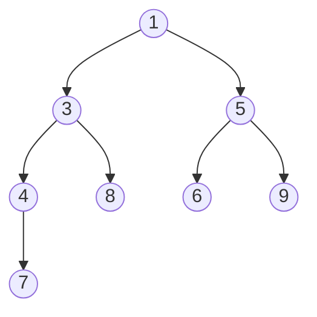

# Heap and priority queue

The heap is the right structure when you must **repeatedly extract minimum (or maximum)**. It's at the heart of Dijkstra, top-K, streaming median.

In Python it's `heapq` and is **only min-heap**. For max-heap you cheat.

## Part 1 — What a heap really is

### Complete binary tree

A heap is a **complete binary tree** (all levels full except possibly last, filled left-to-right) with a special property: for every node, **value is ≤ children** (min-heap) or **≥ children** (max-heap).

Example min-heap:



Note:

- 1 is the min. Always at top.
- 1 ≤ 3, 1 ≤ 5. 3 ≤ 4, 3 ≤ 8. 5 ≤ 6, 5 ≤ 9. 4 ≤ 7.
- Tree is "compact", filled left-to-right.

### NOT a BST

In a BST, left < node < right. Here no: 4 and 8 are both children of 3, but there's no "total" ordering on children. Just "every parent ≤ children".

So a heap **doesn't** support "find value X in O(log n)". For that you need BSTs. Heap only supports "what's the min/max" (O(1)) and "extract min/max" (O(log n)).

### Implementation: array, not pointers

Genius trick: represent complete binary tree as array, exploiting numerical positions.

For node at index `i`:

- Parent: `(i-1) // 2`
- Left child: `2i + 1`
- Right child: `2i + 2`

Heap above as array: `[1, 3, 5, 4, 8, 6, 9, 7]`.

Verify: node `4` at index 3. Parent = (3-1)//2 = 1 = `3`. ✓

**No pointers**, **contiguous memory**, **cache-friendly**. Elegant.

## Part 2 — Operations: how they work

### Push (heappush): O(log n)

1. Add value at end of array.
2. **Bubble up**: compare with parent. If smaller (min-heap), swap. Repeat.

`log n` comparisons at most (tree height).

### Pop (heappop): O(log n)

1. Result is root (`arr[0]`).
2. Move last element to root.
3. **Bubble down**: compare with smaller child. If larger, swap. Repeat.

`log n`.

### Heapify (list → heap in O(n))

Surprisingly, building a heap from an array is **O(n)**, not O(n log n). Bubble-down from middle up to root.

Analysis: most nodes are near leaves (few operations). Few high nodes pay O(log n). Sum: O(n).

## Part 3 — Python `heapq` API

```python
import heapq
h = []
heapq.heappush(h, x)         # O(log n)
x = heapq.heappop(h)         # O(log n), returns min
top = h[0]                   # peek without pop, O(1)
heapq.heapify(arr)           # in-place, O(n)

# Top K smallest or largest
heapq.nsmallest(k, arr)
heapq.nlargest(k, arr)

# Push + pop in one shot (faster)
heapq.heappushpop(h, x)      # push then pop
heapq.heapreplace(h, x)      # pop then push (assumes non-empty)
```

### Max-heap in Python: negate values

`heapq` is only min-heap. Standard trick: negate.

```python
# Simulated max-heap
h = []
heapq.heappush(h, -x)
top_max = -heapq.heappop(h)
```

### Heap of tuples

When comparing by composite priority, use tuples. Python compares lexicographically.

```python
heapq.heappush(h, (priority, value))
```

**Subtle problem**: if two tuples have same priority and `value` isn't comparable (e.g. dict, custom object), Python raises TypeError.

**Solution**: add a counter as "tiebreaker":

```python
counter = 0
heapq.heappush(h, (priority, counter, value))
counter += 1
```

## Part 4 — Fundamental patterns

### Pattern 1 — Top K elements

Typical question: "the K largest/smallest/most frequent elements".

**Brute force**: sort everything → O(n log n).

**Optimal with heap**: keep a **min-heap of size k**. For each new element, if larger than top (i.e. min of k you have), replace.

```python
def top_k_largest(arr, k):
    h = []
    for x in arr:
        if len(h) < k:
            heapq.heappush(h, x)
        elif x > h[0]:
            heapq.heapreplace(h, x)
    return h   # the k largest, not sorted
```

**Why min-heap for k largest?** Because top (min) is the **candidate to discard** if a better new element arrives.

Complexity: **O(n log k)**, O(k) space. For `n=1M`, `k=10`: ~33M ops vs 20M → similar in practice but with O(k) memory.

### Pattern 2 — Merge K sorted lists

Given K sorted lists, merge them.

**Idea**: initial heap with first element of each list. Pop min, push next from same list.

```python
def merge_k(lists):
    h = []
    for i, lst in enumerate(lists):
        if lst:
            heapq.heappush(h, (lst[0].val, i, lst[0]))
    dummy = tail = ListNode()
    while h:
        v, i, node = heapq.heappop(h)
        tail.next = node
        tail = tail.next
        if node.next:
            heapq.heappush(h, (node.next.val, i, node.next))
    return dummy.next
```

Complexity: O(N log k) where N is total, k is number of lists.

### Pattern 3 — Two heaps for streaming median

Problem: receive numbers one at a time, must answer in O(1) "what's the median of all I've seen so far?".

**Brilliant idea**: keep two heaps.

- `lo`: max-heap (negated) of lower half.
- `hi`: min-heap of upper half.

Maintain invariant: `lo` has same number of elements as `hi`, or one more.

Median:

- If `|lo| > |hi|`: median = top of `lo`.
- If equal: median = (top lo + top hi) / 2.

When adding a new number:

1. Push to lo (with negation).
2. Move max of lo to hi (maintains order).
3. If hi has more elements than lo, move back.

```python
import heapq
class MedianFinder:
    def __init__(self):
        self.lo = []   # max-heap (negated)
        self.hi = []   # min-heap

    def add(self, x):
        heapq.heappush(self.lo, -heapq.heappushpop(self.hi, x))
        if len(self.lo) > len(self.hi):
            heapq.heappush(self.hi, -heapq.heappop(self.lo))

    def find_median(self):
        if len(self.hi) > len(self.lo):
            return self.hi[0]
        return (self.hi[0] - self.lo[0]) / 2
```

O(log n) per add, O(1) per find.

### Pattern 4 — Scheduling / Simulation

Heap on `(next_event_time, event)`. Always extract closest event.

Examples: Meeting Rooms II, Task Scheduler.

### Pattern 5 — Dijkstra

Heap of `(distance, node)`. Always extract unvisited node with smallest distance. Already seen in ch. 08.

## Part 5 — Common traps

### 1. `heapq` is only min-heap

For max, negate. Forgetting it is a common bug.

### 2. Heap does NOT maintain global order

Only "top is min". Iterating a heap does **not** give elements in order. To get them sorted, do repeated pops.

### 3. Comparison of non-comparable objects

Tuples `(priority, object)` break if two have same priority and object doesn't implement `__lt__`. Add intermediate counter.

### 4. `heapify(arr)` modifies `arr` in-place

If you want to keep the original, copy first.

### 5. `heapq.nlargest(k, arr)` on huge array

`nlargest` is O(n log k). For `k > n/2`, prefer `sorted(arr)[-k:]` (O(n log n)).

## Exercises

### Exercise 7.1 — Kth Largest Element <span class="problem-tag medium">MEDIUM</span>

<details><summary>Solution</summary>

```python
import heapq
def kth_largest(arr, k):
    return heapq.nlargest(k, arr)[-1]
```

O(n log k). For O(n) you'd need Quickselect.
</details>

### Exercise 7.2 — Top K Frequent Elements <span class="problem-tag medium">MEDIUM</span>

<details><summary>Solution</summary>

```python
from collections import Counter
def top_k(arr, k):
    c = Counter(arr)
    return heapq.nlargest(k, c.keys(), key=c.get)
```

`heapq.nlargest` with `key` lets you order by custom key.
</details>

### Exercise 7.3 — K Closest Points to Origin <span class="problem-tag medium">MEDIUM</span>

<details><summary>Solution</summary>

Max-heap of size k. For each point, if closer than top, replace.

```python
def k_closest(points, k):
    h = []
    for x, y in points:
        d = x*x + y*y
        if len(h) < k:
            heapq.heappush(h, (-d, x, y))   # max-heap via negation
        elif -h[0][0] > d:
            heapq.heapreplace(h, (-d, x, y))
    return [[x, y] for _, x, y in h]
```

O(n log k).

**Note**: we use squared distance (no sqrt) — faster and preserves order.
</details>

### Exercise 7.4 — Merge K Sorted Lists <span class="problem-tag hard">HARD</span>

See Part 4 pattern 2.

### Exercise 7.5 — Find Median from Data Stream <span class="problem-tag hard">HARD</span>

See Part 4 pattern 3.

### Exercise 7.6 — Meeting Rooms II <span class="problem-tag medium">MEDIUM</span>

Given `intervals = [(start, end), ...]`, min number of rooms needed.

<details><summary>Reasoning</summary>

**Idea**: sort by start. Heap of end times of currently occupied rooms.

For each new meeting:

- If the room that frees earliest (heap top) frees by the new start → reuse it (pop).
- Push new end time.

Result = final heap size.

```python
def min_meeting_rooms(intervals):
    intervals.sort(key=lambda x: x[0])
    h = []
    for s, e in intervals:
        if h and h[0] <= s:
            heapq.heappop(h)
        heapq.heappush(h, e)
    return len(h)
```

O(n log n).
</details>

### Exercise 7.7 — Task Scheduler <span class="problem-tag medium">MEDIUM</span>

You have tasks with cooldown n between same tasks. Min time to complete them.

<details><summary>Solution</summary>

Max-heap of frequencies + queue of tasks in cooldown.

```python
from collections import Counter, deque
def least_interval(tasks, n):
    c = Counter(tasks)
    h = [-v for v in c.values()]
    heapq.heapify(h)
    time = 0
    q = deque()   # (negated_count, ready_time)
    while h or q:
        time += 1
        if h:
            cnt = heapq.heappop(h) + 1
            if cnt < 0:
                q.append((cnt, time + n))
        if q and q[0][1] == time:
            heapq.heappush(h, q.popleft()[0])
    return time
```
</details>

### Exercise 7.8 — Kth Smallest in Sorted Matrix <span class="problem-tag medium">MEDIUM</span>

n×n matrix with sorted rows and columns. K-th smallest.

<details><summary>Solution</summary>

Min-heap initialized with (mat[0][0], 0, 0). Pop, push neighbors.

```python
def kth_smallest(M, k):
    n = len(M)
    h = [(M[0][0], 0, 0)]
    seen = {(0, 0)}
    for _ in range(k - 1):
        v, i, j = heapq.heappop(h)
        for di, dj in [(1, 0), (0, 1)]:
            ni, nj = i + di, j + dj
            if ni < n and nj < n and (ni, nj) not in seen:
                heapq.heappush(h, (M[ni][nj], ni, nj))
                seen.add((ni, nj))
    return h[0][0]
```

O(k log k).

Binary search on value in O(n log(max-min)) also exists, but less intuitive.
</details>

### Exercise 7.9 — Last Stone Weight <span class="problem-tag easy">EASY</span>

<details><summary>Solution</summary>

Max-heap. Extract two largest; if different, reinsert difference.

```python
def last_stone_weight(stones):
    h = [-s for s in stones]
    heapq.heapify(h)
    while len(h) > 1:
        a = -heapq.heappop(h)
        b = -heapq.heappop(h)
        if a > b:
            heapq.heappush(h, -(a - b))
    return -h[0] if h else 0
```
</details>

### Exercise 7.10 — Reorganize String <span class="problem-tag medium">MEDIUM</span>

Rearrange string so no adjacent character is equal. "" if impossible.

<details><summary>Solution</summary>

Max-heap of frequencies. At each step take the **two most frequent** available, add to output, decrement.

```python
def reorganize(s):
    c = Counter(s)
    if max(c.values()) > (len(s) + 1) // 2:
        return ""
    h = [(-v, k) for k, v in c.items()]
    heapq.heapify(h)
    out = []
    while len(h) >= 2:
        v1, c1 = heapq.heappop(h)
        v2, c2 = heapq.heappop(h)
        out += [c1, c2]
        if v1 + 1: heapq.heappush(h, (v1 + 1, c1))
        if v2 + 1: heapq.heappush(h, (v2 + 1, c2))
    if h:
        out.append(h[0][1])
    return "".join(out)
```

**Initial check**: if a character has frequency > ceil(n/2), impossible. E.g. "aab" has a=2 and (3+1)/2 = 2. OK. "aaab" has a=3 > (4+1)/2 = 2. Impossible.
</details>

## Summary

1. **Heap = complete binary tree + parent vs children invariant**. Implemented as array.
2. **O(log n) push/pop**, **O(1) peek**, **O(n) heapify**.
3. **`heapq` is min-heap**. For max, negate.
4. **Top-K**: min-heap of size k, replace if larger than top.
5. **Two heaps for streaming median**: max-heap lower + min-heap upper.
6. **Scheduling pattern**: heap on next event times.
