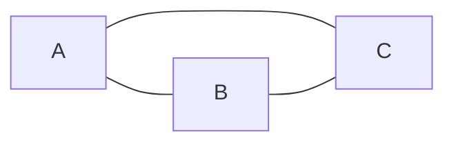
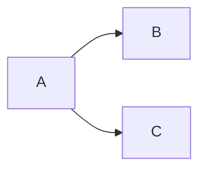
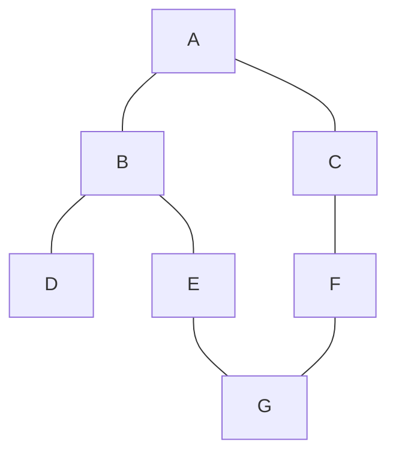
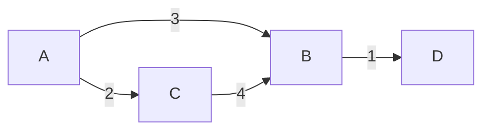

# Graphs

Graphs are **everywhere** in real life and interviews: social networks, maps, task dependencies, internet, web crawlers. They're the richest and deepest chapter of the FAANG material.

Let's start from scratch.

## Part 1 — What a graph is

### Analogy: the city map

Imagine a sheet with cities drawn, connected by roads.

- **Cities** are the **nodes** (vertices).
- **Roads** are the **edges**.

A graph is exactly this: a set of nodes and a set of edges connecting them.

### Types of graphs

**Directed vs undirected**

- **Undirected**: edges are bidirectional. If there's a road A↔B, there's also B↔A. E.g. road map, Facebook friendships.
- **Directed** (digraph): edges have direction. E.g. Twitter followers (you can follow X without X following you), course prerequisites.

**Undirected**:



**Directed**:



**Weighted vs unweighted**

- **Unweighted**: all edges equal. Counts only "exists or not".
- **Weighted**: each edge has a value (cost, distance, time). E.g. highway network with km.

**Acyclic vs cyclic**

- **Acyclic (DAG)**: no cycles. Important for topological sort.
- **Cyclic**: has cycles.

**Connected vs disconnected**

- **Connected**: a path exists between every pair of nodes (in directed case, "strongly connected").
- **Disconnected**: isolated groups.

### A tree is a special graph

A tree is a graph that's **connected**, **acyclic**, **undirected** (or directed from the root). Every node has exactly one parent except root.

So all algorithms you learned on trees are special cases of graph algorithms.

## Part 2 — How to represent a graph in code

Three main ways. Choose by problem.

### Representation 1 — Adjacency list (most used)

For each node, a list of its neighbors.

```python
from collections import defaultdict
graph = defaultdict(list)
graph[u].append(v)
# If undirected, also add:
graph[v].append(u)
```

Example: undirected graph with edges `(0,1), (0,2), (1,2), (2,3)`:

```python
graph = {
    0: [1, 2],
    1: [0, 2],
    2: [0, 1, 3],
    3: [2]
}
```

**Space**: O(V + E).
**Iterate neighbors of u**: O(deg(u)).
**Check "edge (u, v) exists?"**: O(deg(u)).

### Representation 2 — Adjacency matrix

`n × n` matrix where `M[u][v] = 1` if edge from u to v exists, `0` otherwise. For weighted graph, `M[u][v] = weight`.

```python
n = 4
M = [[0]*n for _ in range(n)]
M[u][v] = 1
# Undirected: also M[v][u] = 1
```

**Space**: O(V²).
**Check "edge (u, v) exists?"**: O(1).
**Iterate neighbors of u**: O(V) (must scan entire row).

Good if graph is **dense** (E ≈ V²) or you need O(1) check on edge existence.

### Representation 3 — Edge list

List of all triples (u, v, weight).

```python
edges = [(0, 1, 5), (0, 2, 3), (1, 2, 1), (2, 3, 4)]
```

**Space**: O(E).
Useful for algorithms processing edges in order (Kruskal MST, Bellman-Ford).

### Implicit graph

Often the graph isn't given explicitly. **The problem constructs it**:

- **2D grid**: each cell is a node, neighbors = 4 (or 8) adjacent cells.
- **Puzzle states**: each state is a node, each move an edge.
- **Words**: each word a node, two words neighbors if they differ by one letter.

In these cases you DON'T build the graph explicitly: you "navigate" it generating neighbors on the fly.

## Part 3 — BFS (Breadth-First Search)

### The idea: explore in concentric circles

You're in central square. Explore like this:

- Step 1: visit all streets 1 block away.
- Step 2: all 2 blocks away.
- Step 3: all 3 blocks away.
- ...

BFS is the key for **shortest path in unweighted graphs**: visit nodes in order of increasing distance.

### Visualization

Graph:



BFS starting from A:

```
Step 0: visit A.            Queue: [B, C]
Step 1: visit B, then C.    Queue: [D, E, F]
Step 2: visit D, E, F.      Queue: [G]
Step 3: visit G.            Queue: []
```

Order: A, B, C, D, E, F, G. **By level**.

### Code

```python
from collections import deque

def bfs(start, graph):
    visited = {start}
    q = deque([(start, 0)])   # (node, distance)
    while q:
        node, dist = q.popleft()
        print(f"Visit {node} at distance {dist}")
        for nb in graph[node]:
            if nb not in visited:
                visited.add(nb)
                q.append((nb, dist + 1))
```

### Key: mark visited on PUSH, not on POP

Classic trap. If you mark on pop, the same node can end up in the queue 10 times before being visited.

```python
# CORRECT (mark on push)
if nb not in visited:
    visited.add(nb)
    q.append(nb)

# WRONG (mark on pop)
# can add the same node to queue many times
```

### Multi-source BFS

What if we start from **multiple nodes simultaneously**? Initialize the queue with all.

Example: "given a grid, distance from each cell to the nearest door".

```python
def bfs_multi(sources, graph):
    q = deque([(s, 0) for s in sources])
    visited = set(sources)
    while q:
        node, dist = q.popleft()
        ...
```

Killer pattern for problems like "Rotting Oranges", "Walls and Gates".

### BFS complexity

O(V + E). Each node added/removed from queue once, each edge explored once.

### 0-1 BFS

If edges have weight 0 or 1, use **deque**: weight 0 → `appendleft`, weight 1 → `append`. Find shortest path in O(V+E).

## Part 4 — DFS (Depth-First Search)

### The idea: depth first

Always go deep on a branch, then back up.

Graph (same as before):


DFS from A: `A → B → D → (back) → E → G → (back x3) → C → F → (G already seen)`.

Visit order: **A, B, D, E, G, C, F**.

### Recursive code

```python
def dfs(node, graph, visited):
    visited.add(node)
    print(f"Visit {node}")
    for nb in graph[node]:
        if nb not in visited:
            dfs(nb, graph, visited)
```

### Iterative code (with explicit stack)

```python
def dfs_iter(start, graph):
    visited = {start}
    st = [start]
    while st:
        node = st.pop()
        print(f"Visit {node}")
        for nb in graph[node]:
            if nb not in visited:
                visited.add(nb)
                st.append(nb)
```

Note the difference with BFS: only `popleft` → `pop` and `deque` → `list`. Everything else identical.

### When to use DFS vs BFS

| You want... | Use |
|---|---|
| Shortest path in unweighted edges | BFS |
| Connected components / "path exists?" | DFS or BFS, equivalent |
| Cycle detection | DFS (more natural) |
| Topological sort | DFS or BFS (Kahn) |
| Weighted pathfinding | Dijkstra (BFS variant with priority queue) |
| All paths (exhaustive exploration) | DFS + backtracking |

### Cycle detection in directed graphs

Use "3-coloring": each node is WHITE (not visited), GRAY (visiting), BLACK (visit complete).

If during DFS you meet a GRAY node → there's a **back-edge** → cycle.

```python
WHITE, GRAY, BLACK = 0, 1, 2

def has_cycle(graph, n):
    color = [WHITE] * n
    def dfs(u):
        color[u] = GRAY
        for v in graph[u]:
            if color[v] == GRAY: return True   # cycle!
            if color[v] == WHITE and dfs(v): return True
        color[u] = BLACK
        return False
    return any(color[u] == WHITE and dfs(u) for u in range(n))
```

For **undirected** graphs, just pass the "parent" and ignore the back edge to him.

## Part 5 — Topological sort

For DAGs (Directed Acyclic Graphs). Order nodes such that every edge goes from before to after.

### Analogy: planning university courses

You must take CS101 before CS201, CS201 before CS301. Which is a valid order?

`CS101 → CS201 → CS301`. Obvious. For larger graphs with many constraints, you need an algorithm.

### Kahn's algorithm (BFS-based, uses indegree)

A node's **indegree** is the number of incoming edges.

**Idea**: start from nodes with indegree 0 (no dependencies). Process them. When you process a node, "remove" its outgoing edges by decrementing target indegrees. If anyone reaches indegree 0, add to queue.

```python
from collections import deque, defaultdict

def topo_sort(n, edges):
    graph = defaultdict(list)
    indeg = [0] * n
    for u, v in edges:
        graph[u].append(v)
        indeg[v] += 1
    q = deque(i for i in range(n) if indeg[i] == 0)
    out = []
    while q:
        u = q.popleft()
        out.append(u)
        for v in graph[u]:
            indeg[v] -= 1
            if indeg[v] == 0:
                q.append(v)
    return out if len(out) == n else []   # empty if cycle
```

**Bonus**: Kahn automatically detects **cycles**: if output has fewer than `n` nodes, there's a cycle.

### DFS-based topo sort

Do DFS. When you finish visiting a node (postorder), push it on a stack. The **reverse** of the stack is the topo sort.

## Part 6 — Dijkstra (shortest path with non-negative weights)

### The problem

You have a weighted graph. What are the shortest distances from a source `s` to all other nodes?

### The idea

Generalization of BFS. Use a **priority queue** (min-heap) instead of FIFO queue. Always extract the node with currently smallest distance.

```python
import heapq

def dijkstra(graph, n, src):
    dist = [float('inf')] * n
    dist[src] = 0
    h = [(0, src)]
    while h:
        d, u = heapq.heappop(h)
        if d > dist[u]: continue   # already processed with better distance
        for v, w in graph[u]:
            nd = d + w
            if nd < dist[v]:
                dist[v] = nd
                heapq.heappush(h, (nd, v))
    return dist
```

**Complexity**: O((V + E) log V) with binary heap.

### Limits

- **Doesn't work with negative weights**. Use Bellman-Ford (O(VE)).
- **Negative cycles**: Dijkstra doesn't detect them. Bellman-Ford does.

### Visualization

Graph (weighted edges):



Dijkstra from A:

```
Step 1: extract (0, A). Push (3, B), (2, C). Heap: [(2, C), (3, B)]
Step 2: extract (2, C). dist[C]=2. Push (2+4, B)=(6, B). Heap: [(3, B), (6, B)]
Step 3: extract (3, B). dist[B]=3. Push (3+1, D)=(4, D). Heap: [(4, D), (6, B)]
Step 4: extract (4, D). dist[D]=4.
Step 5: extract (6, B). 6 > dist[B]=3 → skip.
End.
```

Distances: A=0, B=3, C=2, D=4. ✓

## Part 7 — Union-Find (Disjoint Set Union, DSU)

### The problem

You have a set of objects. Group them in **disjoint sets** (components). Two operations:

- `find(x)`: which set does x belong to?
- `union(x, y)`: merge the sets containing x and y.

### Use cases

- **Dynamic connected components** (each time you add an edge, possibly merge two components).
- **Cycle detection in undirected graphs**: before adding edge (u, v), if find(u) == find(v), there's already a cycle.
- **Kruskal MST**.

### Implementation

Idea: each set is represented by a **tree**. The tree's root is the set's "representative".

```python
class DSU:
    def __init__(self, n):
        self.parent = list(range(n))   # each node starts as its own parent
        self.rank = [0] * n            # tree height for optimization

    def find(self, x):
        # Path compression: make link to root direct
        while self.parent[x] != x:
            self.parent[x] = self.parent[self.parent[x]]
            x = self.parent[x]
        return x

    def union(self, x, y):
        rx, ry = self.find(x), self.find(y)
        if rx == ry: return False   # already in same set
        # Union by rank: attach smaller tree under larger
        if self.rank[rx] < self.rank[ry]:
            rx, ry = ry, rx
        self.parent[ry] = rx
        if self.rank[rx] == self.rank[ry]:
            self.rank[rx] += 1
        return True
```

**Complexity with both optimizations**: O(α(n)) per operation, where `α` is the **inverse Ackermann** function. Practically O(1) for any realistic n (< 65536).

### Kruskal MST

Algorithm for MST (Minimum Spanning Tree): the minimum set of edges connecting all nodes.

```python
def kruskal(n, edges):
    edges.sort(key=lambda e: e[2])   # sort by weight
    dsu = DSU(n)
    total = 0
    for u, v, w in edges:
        if dsu.union(u, v):
            total += w
    return total
```

O(E log E).

## Part 8 — Fundamental patterns

### Pattern 1 — Grid BFS/DFS

Each cell a node, neighbors = 4 (or 8).

```python
DIRS = [(-1,0),(1,0),(0,-1),(0,1)]
def neighbors(grid, r, c):
    R, C = len(grid), len(grid[0])
    for dr, dc in DIRS:
        nr, nc = r+dr, c+dc
        if 0 <= nr < R and 0 <= nc < C:
            yield nr, nc
```

### Pattern 2 — Connected components

How many groups of connected nodes? DFS or DSU.

### Pattern 3 — Shortest path

| Case | Algorithm |
|---|---|
| Unweighted | BFS |
| Non-negative weights | Dijkstra |
| Any weights | Bellman-Ford |
| All pairs | Floyd-Warshall |

### Pattern 4 — Topological order

Dependency planning. Kahn or DFS postorder.

### Pattern 5 — Bipartite check

Color with 2 colors in BFS. If conflict → not bipartite.

```python
def is_bipartite(graph, n):
    color = [-1] * n
    for start in range(n):
        if color[start] != -1: continue
        q = deque([start])
        color[start] = 0
        while q:
            u = q.popleft()
            for v in graph[u]:
                if color[v] == -1:
                    color[v] = 1 - color[u]
                    q.append(v)
                elif color[v] == color[u]:
                    return False
    return True
```

## Part 9 — Common traps

### 1. Marking visited on pop instead of push

See Part 3. Slow and potentially wrong.

### 2. Stack overflow on recursive DFS for large graphs

`n > 10⁵` → use iterative DFS.

### 3. Infinite loop without visited

By default, always track visited.

### 4. Dijkstra with negative weights

Wrong. Use Bellman-Ford.

### 5. Confusing directed and undirected

In undirected add both (u,v) and (v,u) in adjacency list.

## Exercises

### Exercise 8.1 — Number of Islands <span class="problem-tag medium">MEDIUM</span>

Count islands in binary grid.

<details><summary>Solution</summary>

```python
def num_islands(grid):
    if not grid: return 0
    R, C = len(grid), len(grid[0])
    def dfs(r, c):
        if not (0 <= r < R and 0 <= c < C): return
        if grid[r][c] != '1': return
        grid[r][c] = '0'
        for dr, dc in [(-1,0),(1,0),(0,-1),(0,1)]:
            dfs(r+dr, c+dc)
    count = 0
    for r in range(R):
        for c in range(C):
            if grid[r][c] == '1':
                dfs(r, c)
                count += 1
    return count
```

Trick: we modify the grid itself (`'1'` → `'0'`) to avoid a separate visited set.
</details>

### Exercise 8.2 — Clone Graph <span class="problem-tag medium">MEDIUM</span>

<details><summary>Solution</summary>

```python
def clone(node):
    if not node: return None
    m = {}
    def dfs(n):
        if n in m: return m[n]
        c = Node(n.val)
        m[n] = c
        for nb in n.neighbors:
            c.neighbors.append(dfs(nb))
        return c
    return dfs(node)
```

Hashmap `original → copy`. DFS that uses the map to avoid infinite loops.
</details>

### Exercise 8.3 — Course Schedule <span class="problem-tag medium">MEDIUM</span>

Can you complete all courses given the prerequisites?

<details><summary>Solution</summary>

Topological sort (Kahn). If you complete all nodes → no cycle → yes.

```python
def can_finish(n, prereq):
    g = defaultdict(list); indeg = [0]*n
    for a, b in prereq:
        g[b].append(a); indeg[a] += 1
    q = deque(i for i in range(n) if indeg[i] == 0)
    done = 0
    while q:
        u = q.popleft(); done += 1
        for v in g[u]:
            indeg[v] -= 1
            if indeg[v] == 0: q.append(v)
    return done == n
```
</details>

### Exercise 8.4 — Course Schedule II <span class="problem-tag medium">MEDIUM</span>

Return a valid order. Same as above but collect output.

### Exercise 8.5 — Pacific Atlantic Water Flow <span class="problem-tag medium">MEDIUM</span>

<details><summary>Reasoning</summary>

Reverse thinking: instead of asking "from which cell can I reach the Pacific?", start from the edges and climb up to higher cells. Two multi-source BFS/DFS. Output: cells reachable from **both** oceans.

```python
def pacific_atlantic(M):
    if not M: return []
    R, C = len(M), len(M[0])
    pac = set(); atl = set()
    def dfs(r, c, seen):
        seen.add((r,c))
        for dr, dc in [(-1,0),(1,0),(0,-1),(0,1)]:
            nr, nc = r+dr, c+dc
            if 0 <= nr < R and 0 <= nc < C and (nr,nc) not in seen and M[nr][nc] >= M[r][c]:
                dfs(nr, nc, seen)
    for r in range(R):
        dfs(r, 0, pac); dfs(r, C-1, atl)
    for c in range(C):
        dfs(0, c, pac); dfs(R-1, c, atl)
    return list(pac & atl)
```

Pattern: **reverse BFS/DFS** when "reaching the edge" is easier than "reaching the center".
</details>

### Exercise 8.6 — Word Ladder <span class="problem-tag hard">HARD</span>

<details><summary>Solution</summary>

BFS on implicit graph: two words are "neighbors" if they differ by one letter.

```python
def ladder_length(begin, end, word_list):
    words = set(word_list)
    if end not in words: return 0
    q = deque([(begin, 1)])
    while q:
        w, d = q.popleft()
        if w == end: return d
        for i in range(len(w)):
            for c in 'abcdefghijklmnopqrstuvwxyz':
                nw = w[:i] + c + w[i+1:]
                if nw in words:
                    words.discard(nw)
                    q.append((nw, d+1))
    return 0
```

Trick: remove visited words from the set to avoid cycles and speed up.
</details>

### Exercise 8.7 — Network Delay (Dijkstra) <span class="problem-tag medium">MEDIUM</span>

Time for a signal sent from k to reach all nodes (or -1 if unreachable).

<details><summary>Solution</summary>

Plain Dijkstra. Answer: `max(dist)`.

```python
def network_delay(times, n, k):
    g = defaultdict(list)
    for u, v, w in times: g[u].append((v, w))
    dist = {k: 0}; h = [(0, k)]
    while h:
        d, u = heapq.heappop(h)
        if d > dist.get(u, float('inf')): continue
        for v, w in g[u]:
            nd = d + w
            if nd < dist.get(v, float('inf')):
                dist[v] = nd
                heapq.heappush(h, (nd, v))
    if len(dist) < n: return -1
    return max(dist.values())
```
</details>

### Exercise 8.8 — Cheapest Flights K Stops <span class="problem-tag medium">MEDIUM</span>

<details><summary>Solution (modified Bellman-Ford)</summary>

```python
def find_cheapest(n, flights, src, dst, k):
    dist = [float('inf')]*n; dist[src] = 0
    for _ in range(k+1):
        tmp = dist[:]
        for u, v, w in flights:
            if dist[u] + w < tmp[v]:
                tmp[v] = dist[u] + w
        dist = tmp
    return dist[dst] if dist[dst] != float('inf') else -1
```

Pattern: k+1 bounded relaxation iterations.
</details>

### Exercise 8.9 — Redundant Connection <span class="problem-tag medium">MEDIUM</span>

<details><summary>Solution</summary>

DSU. The edge that joins two already-connected nodes is the redundant one.

```python
def redundant_connection(edges):
    dsu = DSU(len(edges) + 1)
    for u, v in edges:
        if not dsu.union(u, v):
            return [u, v]
```
</details>

### Exercise 8.10 — Min Cost to Connect Points (MST) <span class="problem-tag medium">MEDIUM</span>

<details><summary>Solution</summary>

Kruskal on complete graph with Manhattan distance.

```python
def min_cost_connect(points):
    n = len(points)
    edges = []
    for i in range(n):
        for j in range(i+1, n):
            d = abs(points[i][0] - points[j][0]) + abs(points[i][1] - points[j][1])
            edges.append((d, i, j))
    edges.sort()
    dsu = DSU(n); total = 0; count = 0
    for d, u, v in edges:
        if dsu.union(u, v):
            total += d; count += 1
            if count == n - 1: break
    return total
```
</details>

### Exercise 8.11 — Alien Dictionary <span class="problem-tag hard">HARD</span>

Given alphabetically ordered words in an alien language, find the letter ordering.

<details><summary>Solution</summary>

Topological sort. Compare consecutive pairs: the first difference is an edge "a precedes b".

```python
def alien_order(words):
    g = defaultdict(set)
    indeg = {c: 0 for w in words for c in w}
    for w1, w2 in zip(words, words[1:]):
        if len(w1) > len(w2) and w1.startswith(w2): return ""
        for a, b in zip(w1, w2):
            if a != b:
                if b not in g[a]:
                    g[a].add(b); indeg[b] += 1
                break
    q = deque([c for c in indeg if indeg[c] == 0])
    out = []
    while q:
        c = q.popleft(); out.append(c)
        for nb in g[c]:
            indeg[nb] -= 1
            if indeg[nb] == 0: q.append(nb)
    return "".join(out) if len(out) == len(indeg) else ""
```
</details>

### Exercise 8.12 — Word Search II <span class="problem-tag hard">HARD</span>

See ch. 09 (with trie).

## Chapter summary

1. **Graph** = nodes + edges. 4 dimensions: directed/un, weighted/un, cyclic/acyclic, connected/dis.
2. **Representations**: adjacency list (default), matrix (dense), edge list (Kruskal).
3. **BFS** for unweighted shortest path, level-order, multi-source.
4. **DFS** for components, cycle detection, exhaustive exploration.
5. **Dijkstra** for weighted shortest path (non-negative). Bellman-Ford for general.
6. **Topological sort** for DAG (Kahn = BFS+indegree, DFS postorder).
7. **Union-Find** for dynamic components, MST (Kruskal), cycle in undirected.

Graph interview questions are "rich": one alone can combine BFS + hash + parent tracking. Pattern recognition comes with practice.
