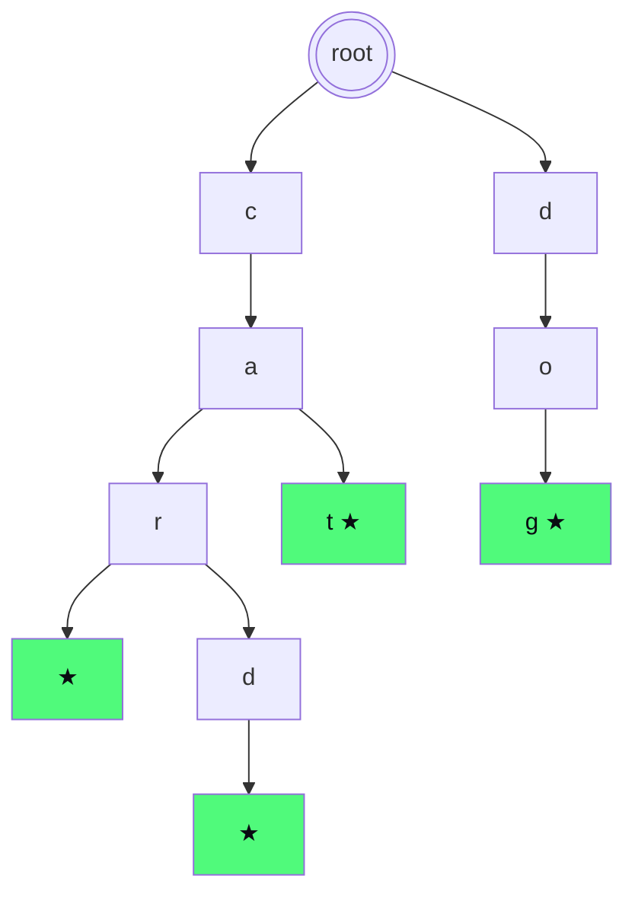

# Trie

The trie (pronounced "try", from re**TRIE**val) is a tree structure specialized for **strings**. It beats hashmaps when you need to look up by **prefix**, not by full key.

## Part 1 — The motivating problem

### Autocomplete

When you type "ca" on Google, you see "casa", "calcio", "cane", "caribbean"... How is this done?

You have a dictionary of millions of words. Given a prefix, you must return **all** words extending it.

**Hashmap**: scan all keys and check `startswith(prefix)`. O(N × P) where N = number of words, P = prefix length. Slow.

**Sorted list**: binary search the prefix. Find the range, scan it. O(P log N + results). Works but grows with the list.

**Trie**: O(P + results). Independent of N. Magic.

## Part 2 — How it works

### The idea: share common prefixes

Think of dictionary `{"cat", "car", "card", "dog"}`. They share prefixes ("ca", "car"). A trie exploits this sharing by organizing words as **paths in a tree**.



Green ★ indicates `is_end = True` (ends a valid word).

Each node represents **one character**. Leaves marked with `*` end a word. Paths share prefixes.

- "cat": root → c → a → t*. Path of 3 edges.
- "car": root → c → a → r*. Path of 3 edges, shares "ca" with cat.
- "card": root → c → a → r → d*. Extends "car".
- "dog": root → d → o → g*.

### Advantages

- **Search by prefix**: descend the tree following prefix chars. If you get lost (missing node), the prefix doesn't exist.
- **Memory**: words with shared prefixes occupy less total space than storing them separately.
- **Enumerate all extensions**: after navigating to the prefix node, DFS to collect all words.

### Implementation

```python
class TrieNode:
    def __init__(self):
        self.children = {}    # char → TrieNode
        self.is_end = False   # marks end of word

class Trie:
    def __init__(self):
        self.root = TrieNode()

    def insert(self, word):
        n = self.root
        for c in word:
            if c not in n.children:
                n.children[c] = TrieNode()
            n = n.children[c]
        n.is_end = True

    def search(self, word):
        n = self._walk(word)
        return n is not None and n.is_end

    def starts_with(self, prefix):
        return self._walk(prefix) is not None

    def _walk(self, s):
        n = self.root
        for c in s:
            if c not in n.children:
                return None
            n = n.children[c]
        return n
```

### Complexity

| Operation | Time |
|---|---|
| Insert(word) | O(L) where L = word length |
| Search(word) | O(L) |
| Starts_with(prefix) | O(P) where P = prefix length |
| Total space | O(sum of word lengths) |

## Part 3 — "Array" version for fixed alphabet

If alphabet is small and fixed (e.g. 26 lowercase letters), an array of 26 children is **faster** than dict (no hashing overhead).

```python
class TrieNode:
    __slots__ = ('children', 'is_end')
    def __init__(self):
        self.children = [None] * 26
        self.is_end = False

def insert(root, word):
    n = root
    for c in word:
        i = ord(c) - ord('a')
        if not n.children[i]:
            n.children[i] = TrieNode()
        n = n.children[i]
    n.is_end = True
```

`__slots__` saves memory by avoiding each instance's internal `__dict__`.

## Part 4 — When to use trie

### Golden cases

1. **Autocomplete**: given prefix, find suggestions.
2. **Spell check**: does the word exist? Suggest close corrections.
3. **Word search in grid** (ch. 08 exercise): you have a list of words to find; trie cuts branches that can't become any word.
4. **Longest prefix matching** (IP routing in routers).
5. **XOR maximum**: binary trie on bits to find max(a XOR b).

### Cases where NOT to use it

To look up **full keys** (no prefix), hashmap is better: O(1) vs O(L). Trie wins only if you exploit the prefix.

## Part 5 — Pattern: word search II with trie

### The problem

Given a grid of letters and a list of words. Find which words appear as a path in the grid (4-neighbors, no cell reuse).

Grid:

| | c0 | c1 | c2 | c3 |
|--|--|--|--|--|
| **r0** | o | a | a | n |
| **r1** | e | t | a | e |
| **r2** | i | h | k | r |
| **r3** | i | f | l | v |

Words to find: `["oath", "pea", "eat", "rain"]`.

### Naive approach

For each word, DFS from the grid. O(W × R × C × 4^L). Slow.

### Approach with trie (smart)

1. Build trie with **all** words.
2. DFS from the grid, navigate trie in parallel.
3. When current cell doesn't match any child of current trie node → **prune** (exit immediately).
4. When you hit `is_end` → record the word.

```python
class TrieNode:
    def __init__(self):
        self.children = {}
        self.word = None

def find_words(board, words):
    R, C = len(board), len(board[0])
    root = TrieNode()
    # Build trie
    for w in words:
        n = root
        for c in w:
            n = n.children.setdefault(c, TrieNode())
        n.word = w

    res = []
    def dfs(r, c, node):
        ch = board[r][c]
        if ch not in node.children:
            return
        nxt = node.children[ch]
        if nxt.word:
            res.append(nxt.word)
            nxt.word = None   # avoid duplicates
        board[r][c] = '#'   # mark visited
        for dr, dc in [(-1,0),(1,0),(0,-1),(0,1)]:
            nr, nc = r + dr, c + dc
            if 0 <= nr < R and 0 <= nc < C and board[nr][nc] != '#':
                dfs(nr, nc, nxt)
        board[r][c] = ch   # backtrack
    for r in range(R):
        for c in range(C):
            dfs(r, c, root)
    return res
```

**Tricks**:

- `word` instead of `is_end` to directly recover the full word.
- `nxt.word = None` after finding: prevents duplicates in the same run.
- `board[r][c] = '#'` temporary marker.

Speed: the trie allows cutting entire subtrees of exploration → dramatic speedup vs naive.

## Part 6 — Binary trie for XOR maximum

Given an integer array, find `max(a XOR b)` with `a, b ∈ arr`.

**Brute force**: O(n²).

**Binary trie idea**: insert each number as a sequence of bits (MSB → LSB) in a trie. For each number, navigate the trie trying to go to the opposite branch at each bit (maximizes XOR).

```python
def find_maximum_xor(arr):
    root = {}
    # Insert
    for x in arr:
        n = root
        for i in range(31, -1, -1):
            b = (x >> i) & 1
            n = n.setdefault(b, {})
    # Query
    best = 0
    for x in arr:
        n = root
        cur = 0
        for i in range(31, -1, -1):
            b = (x >> i) & 1
            opp = 1 - b
            if opp in n:
                cur |= (1 << i)
                n = n[opp]
            else:
                n = n[b]
        best = max(best, cur)
    return best
```

O(32 × n) = O(n).

Binary trie is the generalization of trie to a 2-symbol alphabet (0, 1).

## Part 7 — Exercises

### Exercise 9.1 — Implement Trie <span class="problem-tag medium">MEDIUM</span>

`insert`, `search`, `startsWith`.

<details><summary>Solution</summary>

See Part 2.
</details>

### Exercise 9.2 — Word Dictionary with wildcard <span class="problem-tag medium">MEDIUM</span>

Search supports `.` as wildcard for any character.

<details><summary>Reasoning</summary>

When the character is `.`, you must try **all** children. Recursion.

```python
class WordDictionary:
    def __init__(self):
        self.root = TrieNode()
    def addWord(self, word):
        n = self.root
        for c in word:
            n = n.children.setdefault(c, TrieNode())
        n.is_end = True
    def search(self, word):
        def dfs(n, i):
            if i == len(word):
                return n.is_end
            c = word[i]
            if c == '.':
                return any(dfs(child, i + 1) for child in n.children.values())
            return c in n.children and dfs(n.children[c], i + 1)
        return dfs(self.root, 0)
```

Worst case with all `.`: O(26^L). In practice fast for real dictionaries.
</details>

### Exercise 9.3 — Word Search II <span class="problem-tag hard">HARD</span>

See Part 5.

### Exercise 9.4 — Longest Word in Dictionary <span class="problem-tag medium">MEDIUM</span>

Longest dictionary word that can be built one letter at a time from other dictionary words.

<details><summary>Idea</summary>

Build trie. Then DFS: descend while every intermediate node (except root) is `is_end`. The deepest reachable word is the answer.
</details>

### Exercise 9.5 — Replace Words <span class="problem-tag medium">MEDIUM</span>

List of roots + sentence. Replace each word with its shortest root.

<details><summary>Solution</summary>

```python
def replace_words(roots, sentence):
    root = TrieNode()
    for r in roots:
        n = root
        for c in r:
            n = n.children.setdefault(c, TrieNode())
        n.is_end = True

    def shortest(word):
        n = root
        for i, c in enumerate(word):
            if c not in n.children: return word
            n = n.children[c]
            if n.is_end: return word[:i + 1]
        return word

    return " ".join(shortest(w) for w in sentence.split())
```

O(W × L) where W = sentence words, L = max length.
</details>

### Exercise 9.6 — Maximum XOR of Two Numbers <span class="problem-tag medium">MEDIUM</span>

See Part 6.

## Summary

1. **Trie = tree specialized for prefixes**. Each node represents a character; paths = words.
2. **O(L) operations** instead of O(N × L) of a list.
3. **When**: autocomplete, spell check, grid word search, XOR puzzles.
4. **Dict version** flexible; array version (26 children) faster.
5. **Killer pattern in Word Search II**: trie + DFS with pruning on non-promising branches.

Trie is a "specialist" structure — not for every problem, but when needed, it shines.
