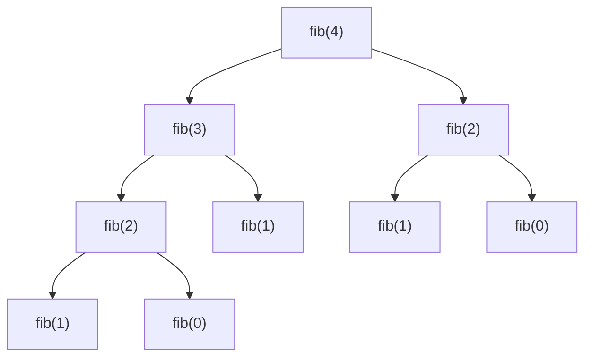
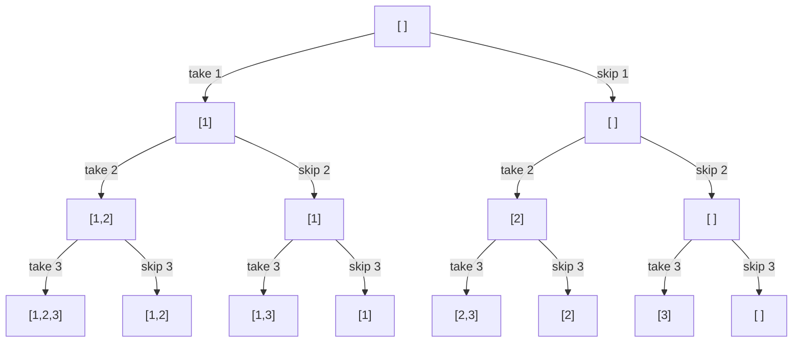

# Recursion and backtracking

Recursion is the concept that splits people in two: either it becomes natural after lots of practice, or it seems black magic. This chapter takes you from "I don't understand" to "I see it".

## Part 1 — What recursion really is

### The matryoshka analogy

Ever opened a matryoshka doll? It's a doll containing an identical but smaller doll, which contains yet another smaller one, down to the smallest that doesn't open.

Recursion is exactly this: **a function that calls itself with a "smaller" input**, until it reaches the base case that resolves directly.

### Formal definition

A recursive function has two parts:

1. **Base case**: smallest input, resolved directly without further recursion.
2. **Recursive case**: generic input, resolved by calling itself on a smaller input.

Textbook example: **factorial**.

```python
def fact(n):
    if n == 0:           # base case
        return 1
    return n * fact(n-1)  # recursive case
```

Trace of `fact(4)`:

```
fact(4) → 4 * fact(3)
        → 4 * (3 * fact(2))
        → 4 * (3 * (2 * fact(1)))
        → 4 * (3 * (2 * (1 * fact(0))))
        → 4 * (3 * (2 * (1 * 1)))
        → 4 * (3 * (2 * 1))
        → 4 * (3 * 2)
        → 4 * 6
        → 24
```

### The "leap of faith"

The key point to write recursion: **don't try to mentally follow the entire call tree**. Trust.

When you write `fact(n-1)` and get a value, **trust** that it's correct (because the same function will compute it well for smaller inputs, and inductively for all). You only need to:

1. **Define the base case correctly**.
2. **Correctly combine** the recursive call's result with the current value.

If these two things are right, the function is right. That's it. No need to simulate 1000 nested calls in your head.

This is the "leap of faith" that separates those who understand recursion from those who don't.

### The 3 steps to write a recursive function

1. **Define exactly what a call means**. E.g.: *"`f(arr, i)` returns sum of `arr[i..end]`"*.
2. **Identify the base case**: minimum input, direct answer.
3. **Break down the problem**: how to reduce to a sub-problem?

Example: array sum.

```python
def total(arr, i=0):
    # 1. One call: sum of arr[i..end]
    # 2. Base: if i is out, sum = 0
    if i == len(arr): return 0
    # 3. Combine: arr[i] + sum of rest
    return arr[i] + total(arr, i+1)
```

## Part 2 — Call tree: visualizing recursion

For more complex problems, drawing the call tree **by hand** clarifies everything.

Example: Fibonacci.

```python
def fib(n):
    if n < 2: return n
    return fib(n-1) + fib(n-2)
```

Trace of `fib(4)`:



Crucial observations:

1. **Total calls is exponential**: ~2ⁿ. For fib(40) it's already 10⁹ calls.
2. **Many calls are repeated**: fib(2) appears twice, fib(1) three times, etc.
3. Max depth of tree is `n`. So space = O(n) (stack).

This motivates **memoization** and then **DP** (ch. 14): if I remember previous calls' results, I reuse them instead of recomputing.

```python
from functools import lru_cache
@lru_cache(maxsize=None)
def fib(n):
    if n < 2: return n
    return fib(n-1) + fib(n-2)
```

With `lru_cache`, fib(40) becomes O(n) time. The difference vs raw `fib(40)` is **30 seconds vs instant**.

## Part 3 — Recursion vs iteration

Every recursive algorithm can be written iteratively. But some problems are **much more natural recursively** (trees, graphs, backtracking).

| Recursion advantages | Iteration advantages |
|---|---|
| Elegant code for "decomposable" problems | No stack overhead |
| Natural for trees/graphs | No RecursionError |
| Expressive | Often faster (no call overhead) |

In interview:

- **Write the recursive version first** (simpler).
- If the interviewer asks, convert to iterative (with explicit stack).
- For large inputs (`n > 10⁴`), consider iterative to avoid `RecursionError`.

## Part 4 — Backtracking: recursion with undo

### The basic idea

Backtracking is a **recursion that explores a tree of choices**. When a choice leads to a dead end, "back-tracks" and tries another.

Mental example: you have a labyrinth. You try a corridor. If it dead-ends, you go back and try another. If that's also blocked, back again. And so on.

### Universal template

```python
def backtrack(current_state):
    if complete_solution(current_state):
        save(current_state)
        return

    for choice in possible_choices():
        apply(choice, current_state)
        backtrack(current_state)
        undo(choice, current_state)    # ← HERE is the "back" of "backtrack"
```

The **undo** is the critical part. Shared state (fast but needs cleaning) vs copied state (slow but robust).

### Visualization: subsets of [1, 2, 3]

The backtracking call tree for "all subsets" of `[1, 2, 3]`:



Each leaf represents a subset. Total leaves: 2³ = 8.

```python
def subsets(arr):
    res = []
    def go(i, cur):
        if i == len(arr):
            res.append(cur[:])   # IMPORTANT: copy
            return
        # Don't take arr[i]
        go(i+1, cur)
        # Take arr[i]
        cur.append(arr[i])
        go(i+1, cur)
        cur.pop()    # backtrack
    go(0, [])
    return res
```

Note:

- `cur[:]` to copy. Without it, all subsets point to the same list.
- `cur.pop()` to undo modification. Without it, `cur` retains values from previous branches.

## Part 5 — The 5 backtracking patterns

### Pattern 1 — Subsets (power set)

All 2ⁿ subsets. For each element: include or exclude.

Seen above.

### Pattern 2 — Permutations

All `n!` permutations. At each step pick an unused element.

```python
def perms(arr):
    res = []
    used = [False] * len(arr)
    def go(cur):
        if len(cur) == len(arr):
            res.append(cur[:])
            return
        for i, x in enumerate(arr):
            if used[i]: continue
            used[i] = True
            cur.append(x)
            go(cur)
            cur.pop()
            used[i] = False
    go([])
    return res
```

With duplicates: sort + skip `arr[i] == arr[i-1] and not used[i-1]` (avoids generating same permutation twice).

### Pattern 3 — Combinations

Subsets of **fixed size**.

```python
def combinations(n, k):
    res = []
    def go(start, cur):
        if len(cur) == k:
            res.append(cur[:])
            return
        for i in range(start, n + 1):
            cur.append(i)
            go(i + 1, cur)
            cur.pop()
    go(1, [])
    return res
```

Trick: pass `i+1` to next to avoid repetitions and maintain ascending order.

### Pattern 4 — Combination Sum

Look for combinations summing to target.

```python
def combination_sum(candidates, target):
    res = []
    def go(start, remaining, cur):
        if remaining == 0:
            res.append(cur[:])
            return
        if remaining < 0: return
        for i in range(start, len(candidates)):
            cur.append(candidates[i])
            go(i, remaining - candidates[i], cur)   # pass `i`, NOT i+1 (reusable)
            cur.pop()
    go(0, target, [])
    return res
```

For "no reuse" pass `i+1`.

### Pattern 5 — Constraint Satisfaction

Explore a grid with constraints (N-Queens, Sudoku, Word Search). When a constraint is violated, back.

## Part 6 — Pruning: cutting the tree early

Without pruning, backtracking explores the whole tree. With pruning, you cut impossible branches **before** descending.

### Three techniques

**1. Bounding**: if the partial solution can't improve the global best, exit.

```python
if current_cost >= best_so_far: return  # this branch won't improve
```

**2. Constraint propagation**: after a choice, deduce other forced choices.

E.g. Sudoku: if you put 5 in (3,3), you can't put 5 in the same row/column/box.

**3. Memoization**: if you have repeating sub-states, remember the results (= DP).

## Part 7 — The 5 common traps

### Trap 1 — `res.append(cur)` instead of `res.append(cur[:])`

If you add `cur` directly, every solution in the result **points to the same list**. Subsequent modifications (even backtrack pops) modify "already saved copies".

Always **copy** (`cur[:]` or `list(cur)`).

### Trap 2 — Non-reset state

If you modify a variable and forget to reset it in backtrack, next iteration sees dirty state.

```python
# WRONG:
cur.append(x)
go(...)
# missing cur.pop()!
```

### Trap 3 — State explosion

Backtracking is O(branching^depth). For n=30 with 2 branches, that's 10⁹ calls → impossible.

If you see `n > 20` on an "all ..." problem with 2 choices per level, it's almost certainly DP, not backtracking.

### Trap 4 — Failing to distinguish equal elements

In permutations with duplicates `[1, 1, 2]`, the "unique" permutations are 3, not 6. You must explicitly skip duplicates.

```python
arr.sort()
def go(cur):
    ...
    for i in range(len(arr)):
        if used[i]: continue
        if i > 0 and arr[i] == arr[i-1] and not used[i-1]:
            continue   # skip duplicate
        ...
```

### Trap 5 — Wrong order of append/pop

```python
# WRONG:
go(i+1, cur)        # recurse before applying choice
cur.append(arr[i])  # too late
```

Correct sequence: **apply → recurse → undo**.

## Part 8 — Guided exercises

### Exercise 10.1 — Subsets <span class="problem-tag medium">MEDIUM</span>

<details><summary>Solution</summary>

See Part 4.

Iterative version (notable elegance):

```python
def subsets(arr):
    res = [[]]
    for x in arr:
        res += [s + [x] for s in res]
    return res
```

Idea: at each element, you double the existing list (with and without x).
</details>

### Exercise 10.2 — Permutations <span class="problem-tag medium">MEDIUM</span>

<details><summary>Solution</summary>

See Part 5.
</details>

### Exercise 10.3 — Combination Sum <span class="problem-tag medium">MEDIUM</span>

<details><summary>Solution</summary>

See Part 5.
</details>

### Exercise 10.4 — Letter Combinations of Phone Number <span class="problem-tag medium">MEDIUM</span>

Phone keypad: "23" → "ad","ae","af","bd","be","bf","cd","ce","cf".

<details><summary>Solution</summary>

```python
def letter_combos(digits):
    if not digits: return []
    m = {'2':'abc','3':'def','4':'ghi','5':'jkl','6':'mno','7':'pqrs','8':'tuv','9':'wxyz'}
    res = []
    def go(i, cur):
        if i == len(digits):
            res.append(cur)
            return
        for c in m[digits[i]]:
            go(i + 1, cur + c)
    go(0, "")
    return res
```

In this case `cur + c` creates a new string, so no explicit backtrack needed.
</details>

### Exercise 10.5 — Generate Parentheses <span class="problem-tag medium">MEDIUM</span>

All valid combinations of n parenthesis pairs.

<details><summary>Reasoning</summary>

For a parenthesis sequence to be valid:

1. In every prefix, `open_count ≥ close_count`.
2. At end, `open_count == close_count == n`.

Backtracking with two counters:

```python
def gen_parens(n):
    res = []
    def go(cur, opened, closed):
        if len(cur) == 2 * n:
            res.append(cur)
            return
        if opened < n:
            go(cur + '(', opened + 1, closed)
        if closed < opened:
            go(cur + ')', opened, closed + 1)
    go("", 0, 0)
    return res
```

Pruning: don't add `)` if it equals closing before opening.

For n=3: ["((()))","(()())","(())()","()(())","()()()"]
</details>

### Exercise 10.6 — Word Search <span class="problem-tag medium">MEDIUM</span>

Search a word in a 2D grid (4-neighbors, no letter reuse).

<details><summary>Solution</summary>

For each cell, try starting the word from there. Recursive DFS matching char by char.

Trick: mark visited cell with placeholder (`'#'`), then restore on backtrack.

```python
def exist(board, word):
    R, C = len(board), len(board[0])
    def dfs(r, c, k):
        if k == len(word): return True
        if not (0 <= r < R and 0 <= c < C) or board[r][c] != word[k]:
            return False
        tmp = board[r][c]
        board[r][c] = '#'   # mark visited
        ok = any(dfs(r + dr, c + dc, k + 1) for dr, dc in [(-1,0),(1,0),(0,-1),(0,1)])
        board[r][c] = tmp   # backtrack
        return ok
    for r in range(R):
        for c in range(C):
            if dfs(r, c, 0): return True
    return False
```

**Lesson**: the "temporary marker" is a general trick for "don't revisit" in DFS without a separate set.
</details>

### Exercise 10.7 — N-Queens <span class="problem-tag hard">HARD</span>

Place n queens on n×n chessboard without attacks.

<details><summary>Solution</summary>

Proceed row by row. On each row try each column.

Constraints: no queen in same column, same main diagonal (`r-c` constant), same anti-diagonal (`r+c` constant).

Efficient tracking: 3 sets for cols, diag1, diag2.

```python
def solve_n_queens(n):
    res = []
    cols = set(); d1 = set(); d2 = set()
    def go(r, queens):
        if r == n:
            res.append(['.'*c + 'Q' + '.'*(n-c-1) for c in queens])
            return
        for c in range(n):
            if c in cols or (r - c) in d1 or (r + c) in d2:
                continue
            cols.add(c); d1.add(r - c); d2.add(r + c)
            queens.append(c)
            go(r + 1, queens)
            queens.pop()
            cols.discard(c); d1.discard(r - c); d2.discard(r + c)
    go(0, [])
    return res
```

O(n!).

**Lesson**: in constraint problems, identify the **easy-to-track O(1) invariants**. Here diagonals track as `r-c` or `r+c` constant.
</details>

### Exercise 10.8 — Sudoku Solver <span class="problem-tag hard">HARD</span>

<details><summary>Solution</summary>

```python
def solve_sudoku(board):
    rows = [set() for _ in range(9)]
    cols = [set() for _ in range(9)]
    boxes = [set() for _ in range(9)]
    empty = []
    for r in range(9):
        for c in range(9):
            v = board[r][c]
            if v == '.':
                empty.append((r, c))
            else:
                rows[r].add(v); cols[c].add(v); boxes[(r//3)*3 + c//3].add(v)
    def go(i):
        if i == len(empty): return True
        r, c = empty[i]
        b = (r//3)*3 + c//3
        for d in '123456789':
            if d not in rows[r] and d not in cols[c] and d not in boxes[b]:
                rows[r].add(d); cols[c].add(d); boxes[b].add(d)
                board[r][c] = d
                if go(i + 1): return True
                rows[r].discard(d); cols[c].discard(d); boxes[b].discard(d)
                board[r][c] = '.'
        return False
    go(0)
```
</details>

### Exercise 10.9 — Restore IP Addresses <span class="problem-tag medium">MEDIUM</span>

Insert 3 dots in a digit string to form a valid IP.

<details><summary>Solution</summary>

```python
def restore_ip(s):
    res = []
    def valid(p):
        return (len(p) == 1) or (p[0] != '0' and int(p) <= 255)
    def go(start, parts):
        if len(parts) == 4:
            if start == len(s):
                res.append('.'.join(parts))
            return
        for length in (1, 2, 3):
            if start + length > len(s): break
            p = s[start:start+length]
            if valid(p):
                go(start + length, parts + [p])
    go(0, [])
    return res
```
</details>

### Exercise 10.10 — Palindrome Partitioning <span class="problem-tag medium">MEDIUM</span>

All partitions of `s` into palindromic substrings.

<details><summary>Solution</summary>

```python
def partition(s):
    res = []
    def is_pal(x): return x == x[::-1]
    def go(start, cur):
        if start == len(s):
            res.append(cur[:])
            return
        for end in range(start + 1, len(s) + 1):
            p = s[start:end]
            if is_pal(p):
                cur.append(p)
                go(end, cur)
                cur.pop()
    go(0, [])
    return res
```

Combined pattern: backtracking + property check (palindrome).
</details>

## Chapter summary

1. **Recursion = function calling itself with smaller input**, until base case.
2. **Leap of faith**: trust the recursive calls. You only define base + combine.
3. **Backtracking = recursion + apply/undo**. Universal template.
4. **5 patterns**: subsets, permutations, combinations, combination sum, constraint satisfaction.
5. **Top traps**: `append(cur)` instead of `append(cur[:])`, missing pop on backtrack, exponential explosion.

When recursive thinking comes "naturally" to you, **trees, graphs, DP** become easy. All other material is based on this chapter.
