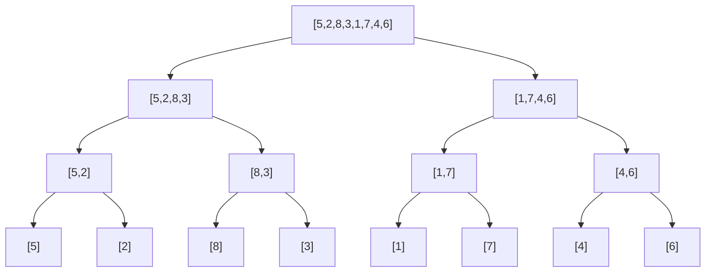
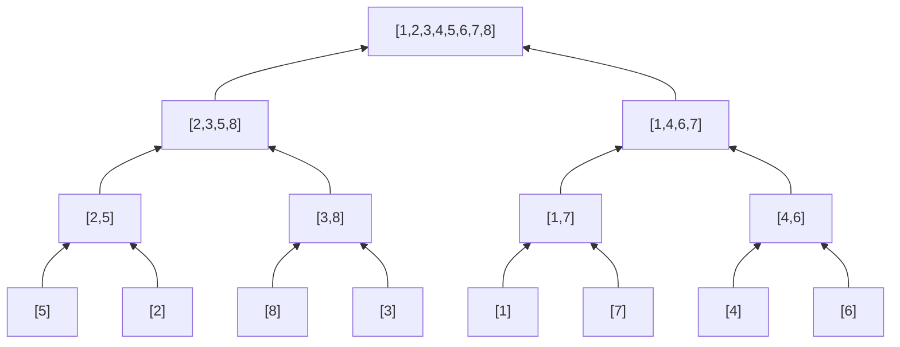

# Sorting and searching

Sorting and searching are the two oldest algorithms in CS. They look "simple", but under the surface there are detail-rich bugs.

Let's start with sorting, then enter the binary search forest.

## Part 1 — Sorting: the general map

### In Python you use `sort()`. But...

For 99% of practical cases, Python has `sorted()` and `list.sort()`. Both use **TimSort**, a hybrid algorithm O(n log n), stable, optimized for "nearly-sorted" data.

So in real life you never implement a sort. In interviews instead:

1. You must know classic sorting algorithms and their trade-offs.
2. You must know how to implement merge sort and quick sort ("implement sorting" questions are common for Apple/Bloomberg).
3. You must understand **when** sorting is the right move.

### Reference table

| Algorithm | Avg time | Worst time | Space | Stable? | In-place? |
|---|---|---|---|---|---|
| **Bubble sort** | O(n²) | O(n²) | O(1) | yes | yes |
| **Insertion sort** | O(n²) | O(n²) | O(1) | yes | yes |
| **Selection sort** | O(n²) | O(n²) | O(1) | no | yes |
| **Merge sort** | O(n log n) | O(n log n) | O(n) | yes | no |
| **Quick sort** | O(n log n) | O(n²) | O(log n) stack | no | yes |
| **Heap sort** | O(n log n) | O(n log n) | O(1) | no | yes |
| **Counting sort** | O(n + k) | O(n + k) | O(k) | yes | no |
| **Radix sort** | O(d (n + k)) | O(d (n + k)) | O(n + k) | yes | no |

### What "stable" means

A sort is **stable** if equal elements keep their relative order.

Example: sort pairs `[(1, 'a'), (1, 'b'), (2, 'c')]` by first element. Stable → `[(1, 'a'), (1, 'b'), (2, 'c')]`. Not stable → could become `[(1, 'b'), (1, 'a'), (2, 'c')]`.

Important in interview: **TimSort is stable**, so Python's `sorted()` is stable.

## Part 2 — Detailed implementations

### Insertion sort (why start here)

The intuition for sorting cards in your hand. One at a time, insert in the right spot among the "already sorted" part.

```python
def insertion_sort(arr):
    for i in range(1, len(arr)):
        cur = arr[i]
        j = i - 1
        while j >= 0 and arr[j] > cur:
            arr[j+1] = arr[j]
            j -= 1
        arr[j+1] = cur
```

O(n²). Slow for large n, but:

- O(n) if array is **nearly sorted**.
- Good for `n ≤ 30`.
- Stable.
- TimSort uses it internally as final step.

### Merge sort (the classic O(n log n))

**Idea (divide and conquer)**:

1. Split the array in half.
2. Recursively sort each half.
3. Merge the two sorted halves.

```python
def merge_sort(arr):
    if len(arr) <= 1:
        return arr
    mid = len(arr) // 2
    left = merge_sort(arr[:mid])
    right = merge_sort(arr[mid:])
    return merge(left, right)

def merge(a, b):
    out = []
    i = j = 0
    while i < len(a) and j < len(b):
        if a[i] <= b[j]:
            out.append(a[i])
            i += 1
        else:
            out.append(b[j])
            j += 1
    out.extend(a[i:])
    out.extend(b[j:])
    return out
```

Visualization (split top-down, merge bottom-up):



Then merge bottom-up:



**Complexity**:

- Time: T(n) = 2T(n/2) + O(n) → O(n log n) (master theorem).
- Space: O(n) (auxiliary arrays).

**Stable**. **Always O(n log n)** even worst case.

### Quick sort (faster in practice)

**Idea**: pick a **pivot** from the array. Partition: left of pivot, all smaller; right, all larger. Then recurse.

```python
def quicksort(arr, lo=0, hi=None):
    if hi is None: hi = len(arr) - 1
    if lo >= hi: return
    p = partition(arr, lo, hi)
    quicksort(arr, lo, p - 1)
    quicksort(arr, p + 1, hi)

def partition(arr, lo, hi):
    pivot = arr[hi]
    i = lo
    for j in range(lo, hi):
        if arr[j] < pivot:
            arr[i], arr[j] = arr[j], arr[i]
            i += 1
    arr[i], arr[hi] = arr[hi], arr[i]
    return i
```

**Avg time**: O(n log n).
**Worst time**: O(n²) (sorted array + pivot at end).

**Worst case mitigation**: random pivot.

```python
import random
pivot_idx = random.randint(lo, hi)
arr[pivot_idx], arr[hi] = arr[hi], arr[pivot_idx]
# then normal partition
```

**Not stable**, **in-place**, ~3× faster than merge sort in practice (cache-friendly).

### Counting sort (when alphabet is small)

If values are integers in a small range, count frequencies and rebuild.

```python
def counting_sort(arr):
    if not arr: return []
    lo, hi = min(arr), max(arr)
    cnt = [0] * (hi - lo + 1)
    for x in arr:
        cnt[x - lo] += 1
    out = []
    for i, c in enumerate(cnt):
        out.extend([i + lo] * c)
    return out
```

O(n + k) where k = range of values.

**When**: integer values in small range (e.g. age, grades, letters). For huge range it's useless.

## Part 3 — Quickselect: k-th element in O(n) average

Quicksort variant that searches **only** the k-th element. Doesn't sort everything.

**Idea**: after partition, you know where the pivot is. If it's in position k, found. Otherwise recurse only on the right half.

```python
import random
def quickselect(arr, k):
    """Returns k-th smallest (1-indexed)."""
    def partition(lo, hi, pivot_idx):
        pivot = arr[pivot_idx]
        arr[pivot_idx], arr[hi] = arr[hi], arr[pivot_idx]
        store = lo
        for i in range(lo, hi):
            if arr[i] < pivot:
                arr[store], arr[i] = arr[i], arr[store]
                store += 1
        arr[store], arr[hi] = arr[hi], arr[store]
        return store

    def select(lo, hi, k):
        if lo == hi: return arr[lo]
        pivot_idx = random.randint(lo, hi)
        p = partition(lo, hi, pivot_idx)
        if k == p: return arr[k]
        elif k < p: return select(lo, p - 1, k)
        else: return select(p + 1, hi, k)

    return select(0, len(arr) - 1, k - 1)
```

**Avg time**: O(n). Master theorem on T(n) = T(n/2) + O(n) (avg you throw half away) → O(n).
**Worst**: O(n²) but extremely rare with random pivot.

Used in: kth largest, median, top-k without sorting everything.

## Part 4 — Binary search: theory

### The basic idea

You have a **sorted** array. Looking for a target.

```python
def search(arr, target):
    lo, hi = 0, len(arr) - 1
    while lo <= hi:
        mid = (lo + hi) // 2
        if arr[mid] == target:
            return mid
        elif arr[mid] < target:
            lo = mid + 1
        else:
            hi = mid - 1
    return -1
```

Each iteration **halves** the search space → O(log n).

For `n = 1 million`: ~20 iterations. For `n = 1 billion`: ~30. Magic.

### Off-by-one: the weak point

99% of binary search bugs are off-by-one. Three questions to set consistently:

1. **Extremes**: `[lo, hi]` (inclusive) or `[lo, hi)` (hi exclusive)?
2. **While condition**: `<=` or `<`?
3. **Update**: `mid + 1`, `mid - 1`, `mid`?

**You must pick a convention and follow it**. Don't improvise.

### Convention 1 — `[lo, hi]` inclusive

```python
lo, hi = 0, len(arr) - 1
while lo <= hi:
    mid = (lo + hi) // 2
    if arr[mid] == target: return mid
    elif arr[mid] < target: lo = mid + 1
    else: hi = mid - 1
```

- Exit loop with `lo > hi` (empty range).
- Update skips mid: `lo = mid + 1` or `hi = mid - 1`.

### Convention 2 — `[lo, hi)` hi exclusive (bisect-style)

```python
lo, hi = 0, len(arr)
while lo < hi:
    mid = (lo + hi) // 2
    if arr[mid] < target: lo = mid + 1
    else: hi = mid          # NOT mid - 1!
return lo  # first index with arr[lo] >= target
```

- Exit loop with `lo == hi`.
- Final `lo` is the "insertion point" to keep order.

This is the basis of Python's `bisect.bisect_left`.

### Which to use?

In interview:

- For "find exact target": Convention 1.
- For "find first X with condition" or "binary search on answer": Convention 2.

Once chosen, apply it identically in every problem. Don't mix.

## Part 5 — The 7 binary search variants

### 1. Search "find exact"

Seen above (convention 1).

### 2. Lower bound (`bisect_left`)

First index `i` with `arr[i] >= target`.

```python
def lower_bound(arr, target):
    lo, hi = 0, len(arr)
    while lo < hi:
        mid = (lo + hi) // 2
        if arr[mid] < target: lo = mid + 1
        else: hi = mid
    return lo
```

If `lo == len(arr)`, target is > everything.

### 3. Upper bound (`bisect_right`)

First index `i` with `arr[i] > target`.

```python
def upper_bound(arr, target):
    lo, hi = 0, len(arr)
    while lo < hi:
        mid = (lo + hi) // 2
        if arr[mid] <= target: lo = mid + 1
        else: hi = mid
    return lo
```

### 4. Python `bisect` module

```python
from bisect import bisect_left, bisect_right, insort
bisect_left(arr, x)   # first idx with arr[idx] >= x
bisect_right(arr, x)  # first idx with arr[idx] > x
insort(arr, x)        # insert keeping order
```

**Always use `bisect` in interview** when you can. Fewer bugs.

### 5. Binary search "on the answer"

Often the problem isn't "search a value in array", but:

> *"What's the minimum X such that ok(X) is true?"*

If `ok(X)` is **monotonic** (if it holds for X then for all Y ≥ X), you can binary-search on X.

Template:

```python
def search_answer(lo, hi, ok):
    while lo < hi:
        mid = (lo + hi) // 2
        if ok(mid): hi = mid
        else: lo = mid + 1
    return lo
```

Examples: "minimum ship capacity for d days", "minimum Koko speed".

This is the most **asked** pattern in interviews. Really learn it.

### 6. Binary search on rotated array

`[4, 5, 6, 7, 0, 1, 2]` is a rotated sorted array. There's still structure: **one of the two halves is always sorted**.

```python
def search_rotated(arr, target):
    lo, hi = 0, len(arr) - 1
    while lo <= hi:
        mid = (lo + hi) // 2
        if arr[mid] == target: return mid
        if arr[lo] <= arr[mid]:   # left half sorted
            if arr[lo] <= target < arr[mid]:
                hi = mid - 1
            else:
                lo = mid + 1
        else:                      # right half sorted
            if arr[mid] < target <= arr[hi]:
                lo = mid + 1
            else:
                hi = mid - 1
    return -1
```

Identify which half is sorted, then decide if target is in it.

### 7. Binary search "find peak / find minimum"

For array with a single min (or max), compare `arr[mid]` with `arr[mid+1]` to decide where the peak is.

```python
def find_peak(arr):
    lo, hi = 0, len(arr) - 1
    while lo < hi:
        mid = (lo + hi) // 2
        if arr[mid] > arr[mid + 1]:
            hi = mid
        else:
            lo = mid + 1
    return lo
```

## Part 6 — The 4 main binary search traps

### Trap 1 — Convention inconsistency

Mixing `<=` with `< len(arr)` or `mid - 1` with `mid` → infinite loops or off-by-one.

**Solution**: pick a convention and stick to it.

### Trap 2 — `mid = (lo + hi) // 2` in languages with overflow

In Python integers are unlimited. In C/Java for huge arrays `lo + hi` can overflow. Use `mid = lo + (hi - lo) // 2`.

### Trap 3 — Infinite loop with `lo = mid` instead of `lo = mid + 1`

```python
lo, hi = 0, 1
while lo < hi:
    mid = (0 + 1) // 2 = 0
    if cond: lo = mid     # INFINITE LOOP! mid is still 0
    else: hi = mid
```

If you use `lo = mid`, you must change `mid` calc to `mid = (lo + hi + 1) // 2` (round up).

### Trap 4 — Rotated array with duplicates

`[1, 1, 1, 2, 1, 1]`. When `arr[lo] == arr[mid]`, you don't know which half is sorted → degenerates to O(n).

## Guided exercises

### Exercise 11.1 — Binary Search <span class="problem-tag easy">EASY</span>

Find target in sorted array.

See Part 4.

### Exercise 11.2 — First Bad Version <span class="problem-tag easy">EASY</span>

Versions 1..n. One version `f` is "bad" and all subsequent ones too. Find `f` in O(log n) API calls.

<details><summary>Solution</summary>

```python
def first_bad(n, isBadVersion):
    lo, hi = 1, n
    while lo < hi:
        mid = (lo + hi) // 2
        if isBadVersion(mid):
            hi = mid
        else:
            lo = mid + 1
    return lo
```

Convention 2 (lower_bound style).
</details>

### Exercise 11.3 — Search in Rotated Sorted <span class="problem-tag medium">MEDIUM</span>

See Part 5 variant 6.

### Exercise 11.4 — Find Minimum in Rotated Sorted <span class="problem-tag medium">MEDIUM</span>

<details><summary>Solution</summary>

```python
def find_min(arr):
    lo, hi = 0, len(arr) - 1
    while lo < hi:
        mid = (lo + hi) // 2
        if arr[mid] > arr[hi]:
            lo = mid + 1
        else:
            hi = mid
    return arr[lo]
```

Idea: compare with `hi`. If mid > hi, min is in right half (rotation passes through middle). Otherwise in left half.
</details>

### Exercise 11.5 — Find Peak Element <span class="problem-tag medium">MEDIUM</span>

See Part 5 variant 7.

### Exercise 11.6 — Koko Eating Bananas <span class="problem-tag medium">MEDIUM</span>

Banana piles. Koko eats `k` bananas/hour (max). Find min `k` to finish within `h` hours.

<details><summary>Reasoning (important!)</summary>

**Binary search on answer pattern.**

Answer space is `k ∈ [1, max(piles)]`. For each `k`, I can compute total hours in O(n).

Function `ok(k)`: hours needed ≤ h.

**Monotonicity**: if k works, every k' > k works. I can binary-search.

```python
def min_eating_speed(piles, h):
    def hours(k):
        return sum((p + k - 1) // k for p in piles)   # ceil
    lo, hi = 1, max(piles)
    while lo < hi:
        mid = (lo + hi) // 2
        if hours(mid) <= h:
            hi = mid
        else:
            lo = mid + 1
    return lo
```

O(n log(max_pile)).

**Lesson**: when you see "what's the minimum X such that ...", ask if the condition is monotonic in X. If yes, binary search on the answer.
</details>

### Exercise 11.7 — Capacity to Ship Within D Days <span class="problem-tag medium">MEDIUM</span>

<details><summary>Solution</summary>

```python
def ship_capacity(weights, days):
    def needed(cap):
        d, cur = 1, 0
        for w in weights:
            if cur + w > cap:
                d += 1
                cur = 0
            cur += w
        return d
    lo, hi = max(weights), sum(weights)
    while lo < hi:
        mid = (lo + hi) // 2
        if needed(mid) <= days:
            hi = mid
        else:
            lo = mid + 1
    return lo
```

Same pattern.
</details>

### Exercise 11.8 — Kth Largest Element <span class="problem-tag medium">MEDIUM</span>

<details><summary>Solution</summary>

Quickselect (see Part 3).

Heap-based version (simpler, O(n log k)):

```python
import heapq
def kth_largest(arr, k):
    return heapq.nlargest(k, arr)[-1]
```
</details>

### Exercise 11.9 — Sort Colors (Dutch Flag) <span class="problem-tag medium">MEDIUM</span>

Array of 0, 1, 2. Sort in-place, **single pass**.

<details><summary>Reasoning (three pointers)</summary>

Three pointers `l, m, r`:

- `[0..l-1]` are 0.
- `[l..m-1]` are 1.
- `[m..r]` unknown.
- `[r+1..n-1]` are 2.

Start with `l=0, m=0, r=n-1`. While `m <= r`:

- If `arr[m] == 0`: swap with `arr[l]`. `l++; m++`.
- If `arr[m] == 1`: `m++`.
- If `arr[m] == 2`: swap with `arr[r]`. `r--` (DON'T increment m because the just-swapped element is unknown).

```python
def sort_colors(arr):
    l, m, r = 0, 0, len(arr) - 1
    while m <= r:
        if arr[m] == 0:
            arr[l], arr[m] = arr[m], arr[l]
            l += 1; m += 1
        elif arr[m] == 1:
            m += 1
        else:
            arr[m], arr[r] = arr[r], arr[m]
            r -= 1
```

O(n), O(1). Dijkstra's "Dutch national flag" pattern. Beautiful.
</details>

### Exercise 11.10 — Wiggle Sort II <span class="problem-tag medium">MEDIUM</span>

Reorder array so `arr[0] < arr[1] > arr[2] < arr[3] > ...`.

<details><summary>Idea</summary>

1. Quickselect to find the **median**.
2. Three-way partition (Dutch flag) around median.
3. Position alternating in O(n) extra space (or with index magic).

Hard, rare.
</details>

### Exercise 11.11 — Median of Two Sorted Arrays <span class="problem-tag hard">HARD</span>

See ch. 02.

## Chapter summary

1. **Python's TimSort** is O(n log n) stable. Use `sorted()`/`list.sort()` by default.
2. **Merge sort vs quick sort**: merge is stable and predictable (always O(n log n)). Quick is in-place and faster in practice.
3. **Quickselect**: O(n) avg for k-th. Know it.
4. **Binary search**: pick a convention (`[lo, hi]` or `[lo, hi)`) and stick to it.
5. **Binary search on answer pattern**: often the problem is "min X such that ok(X)". Recognize it.
6. **`bisect` module** saves you from off-by-one. Use it.

When this chapter is internalized, problems like "Koko" or "rotated search" seem easy. Go to [ch. 12 — Two pointers and sliding window](12-two-pointers-sliding-window.html).
