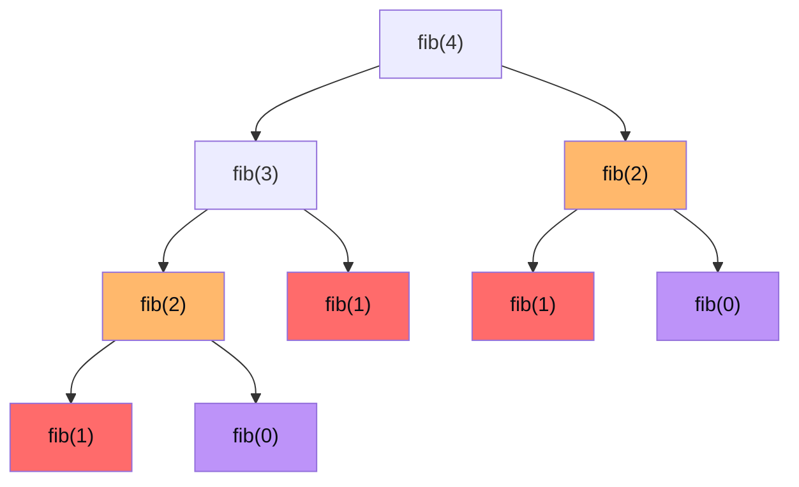

# Dynamic programming

DP is the chapter where most candidates give up. It's also the chapter where **you make the difference**: those who know DP solidly pass many more interviews.

This chapter builds DP **from scratch**, starting from the recursion you already know.

## Part 1 — Where DP comes from

### The naive Fibonacci problem

Recap:

```python
def fib(n):
    if n < 2: return n
    return fib(n-1) + fib(n-2)
```

We saw in ch. 10 that `fib(4)` has this tree:



Duplicate nodes colored: orange `fib(2)`, red `fib(1)`, purple `fib(0)`.

`fib(2)` appears **twice**. `fib(1)` three times. `fib(0)` twice.

For fib(40) the total number of calls is ~1.6 billion. Exponential.

### The key observation

**We compute the same sub-problems multiple times**. Pure waste.

### Solution: remember

If we memorize each `fib(k)` result the first time we compute it, and then when re-encountering it, return the stored value:

```python
memo = {}
def fib(n):
    if n in memo: return memo[n]
    if n < 2: return n
    res = fib(n-1) + fib(n-2)
    memo[n] = res
    return res
```

Now `fib(40)` does only `40` effective calls. **Linear**.

This technique is called **memoization** (or "top-down DP").

### Equivalent with `lru_cache`

Python has a decorator that does exactly this:

```python
from functools import lru_cache

@lru_cache(maxsize=None)
def fib(n):
    if n < 2: return n
    return fib(n-1) + fib(n-2)
```

Same effect, one extra line.

### What DP is

**Dynamic Programming = recursion with memoization**. That's basically it.

But there's a more "old-school" and often faster variant: **bottom-up DP**.

## Part 2 — Bottom-up DP: building the table

Instead of computing recursively, **start from the base case** and build results for larger and larger inputs, saving them in a table.

Bottom-up Fibonacci:

```python
def fib(n):
    if n < 2: return n
    dp = [0] * (n + 1)
    dp[0] = 0; dp[1] = 1
    for i in range(2, n + 1):
        dp[i] = dp[i-1] + dp[i-2]
    return dp[n]
```

Same O(n), no recursion stack.

### Space optimization

Notice: we only need the last 2 values. We can replace the array with 2 variables.

```python
def fib(n):
    if n < 2: return n
    a, b = 0, 1
    for _ in range(n):
        a, b = b, a + b
    return a
```

O(n) time, **O(1) space**.

This is the final maturation step of a DP algorithm: recognize which past states you really need and trim the rest.

## Part 3 — The 4 steps to solve ANY DP problem

When the interviewer gives you a problem you think is DP, follow these 4 steps:

### Step 1 — Identify the state

**Which variables uniquely define a sub-problem?**

In Fibonacci: just `n`. State = `n`.

In *"min cost path in a grid"*: current position `(r, c)`. State = `(r, c)`.

In *"0/1 knapsack"*: item under consideration + remaining capacity. State = `(i, capacity)`.

### Step 2 — Define the transition

**How do you go from one state to the next? How does `dp[state]` depend on previous `dp` states?**

In Fibonacci: `dp[n] = dp[n-1] + dp[n-2]`.

In min path: `dp[r][c] = grid[r][c] + min(dp[r-1][c], dp[r][c-1])`.

In knapsack: `dp[i][c] = max(dp[i-1][c], dp[i-1][c - w_i] + v_i)`.

### Step 3 — Define the base cases

The smallest sub-problems, with known answers.

In Fibonacci: `dp[0] = 0`, `dp[1] = 1`.

In min path: `dp[0][0] = grid[0][0]`. First row and first column have only one way to be reached.

### Step 4 — Computation order (bottom-up)

What order do you fill the table? Always: from small to large, so that when you need `dp[state]`, the required states are already computed.

In Fibonacci: `for i in range(2, n+1)`.

In min path: `for r in range(R): for c in range(C):` (row by row, left to right).

In knapsack: `for i in range(1, n+1): for c in range(W+1):`.

### Top-down vs bottom-up

| | Top-down (memoization) | Bottom-up |
|---|---|---|
| Style | recursive + cache | iterative + table |
| Overhead | recursion stack | none |
| Speed | slightly slower | often faster (no function calls) |
| Writing | easy (start from natural recursion) | needs order reasoning |
| When to prefer | problems with many states but only some reachable (sparse) | problems with dense table filling |

**Interview best practice**: write top-down first (easier), then convert to bottom-up if asked.

## Part 4 — Step-by-step examples with table

### Example A — Climbing Stairs

Problem: you have a staircase with `n` steps. At each step you go up 1 or 2 stairs. How many ways to reach the top?

**Step 1 (state)**: `dp[i]` = number of ways to reach step `i`.

**Step 2 (transition)**: to reach step `i`, you must have made a jump of 1 from step `i-1` or a jump of 2 from step `i-2`. So `dp[i] = dp[i-1] + dp[i-2]`.

**Step 3 (base)**: `dp[0] = 1` (1 "empty" way of being on step 0), `dp[1] = 1`.

**Step 4 (order)**: from 2 to n.

Table for n = 5:

| i | 0 | 1 | 2 | 3 | 4 | 5 |
|---|---|---|---|---|---|---|
| **dp[i]** | 1 | 1 | **2** | **3** | 5 | **8** |

- `dp[2] = dp[1] + dp[0] = 1 + 1 = 2`
- `dp[3] = dp[2] + dp[1] = 2 + 1 = 3`
- `dp[5] = dp[4] + dp[3] = 5 + 3 = 8`

8 ways to reach step 5.

```python
def climb(n):
    if n < 2: return 1
    a, b = 1, 1
    for _ in range(n - 1):
        a, b = b, a + b
    return b
```

### Example B — House Robber

Problem: `nums` array of house values. You must rob the max possible **without robbing two adjacent houses**.

**Step 1 (state)**: `dp[i]` = max loot considering houses `[0..i]`.

**Step 2 (transition)**: two options for each house:
1. **Don't rob `i`**: `dp[i] = dp[i-1]`.
2. **Rob `i`**: can't have robbed `i-1`, so `dp[i] = nums[i] + dp[i-2]`.

`dp[i] = max(dp[i-1], nums[i] + dp[i-2])`.

**Step 3 (base)**: `dp[0] = nums[0]`, `dp[1] = max(nums[0], nums[1])`.

**Step 4 (order)**: from 2 to n-1.

Table for `nums = [2, 7, 9, 3, 1]`:

| i | 0 | 1 | 2 | 3 | 4 |
|---|---|---|---|---|---|
| **nums[i]** | 2 | 7 | 9 | 3 | 1 |
| **dp[i]** | 2 | **7** | **11** | 11 | **12** |

- `dp[1] = max(2, 7) = 7`
- `dp[2] = max(7, 9+2) = 11`
- `dp[4] = max(11, 1+11) = 12`

```python
def rob(nums):
    a = b = 0
    for x in nums:
        a, b = b, max(b, a + x)
    return b
```

Optimized to O(1) space.

### Example C — Coin Change (min coins)

Problem: given a set of coins and an amount, find min number of coins to make amount (reusable). -1 if impossible.

**State**: `dp[i]` = min number of coins to make amount `i`.

**Transition**: for each coin `c`, `dp[i] = min(dp[i - c]) + 1` (if `c ≤ i`). That is: take a coin of value c, and must fill `i - c` with the minimum.

**Base**: `dp[0] = 0` (0 coins for amount 0).

**Order**: i from 1 to amount.

Table for `coins = [1, 2, 5]`, `amount = 11`:

| i | 0 | 1 | 2 | 3 | 4 | 5 | 6 | 7 | 8 | 9 | 10 | 11 |
|---|---|---|---|---|---|---|---|---|---|---|---|---|
| **dp[i]** | 0 | 1 | 1 | **2** | 2 | 1 | 2 | 2 | 3 | 3 | 2 | **3** |

- `dp[0] = 0` (base case).
- `dp[3] = min(dp[2], dp[1]) + 1 = 2`.
- `dp[11] = min(dp[10], dp[9], dp[6]) + 1 = 3` (e.g. 5+5+1).

```python
def coin_change(coins, amount):
    dp = [float('inf')] * (amount + 1)
    dp[0] = 0
    for i in range(1, amount + 1):
        for c in coins:
            if c <= i:
                dp[i] = min(dp[i], dp[i - c] + 1)
    return dp[amount] if dp[amount] != float('inf') else -1
```

O(n · m).

### Example D — Unique Paths (2D)

Problem: in an m × n grid, start at top-left, must reach bottom-right, moving only down or right. How many possible paths?

**State**: `dp[r][c]` = number of paths from (0,0) to (r,c).

**Transition**: `dp[r][c] = dp[r-1][c] + dp[r][c-1]` (come from above or from left).

**Base**: `dp[0][c] = 1` for every c (single path along first row). `dp[r][0] = 1` for every r.

Table for 3×3:

| | **c=0** | **c=1** | **c=2** |
|---|---|---|---|
| **r=0** | 1 | 1 | 1 |
| **r=1** | 1 | **2** | 3 |
| **r=2** | 1 | 3 | **6** |

- `dp[1][1] = dp[0][1] + dp[1][0] = 1 + 1 = 2`
- `dp[2][2] = dp[1][2] + dp[2][1] = 3 + 3 = 6`

6 possible paths.

```python
def unique_paths(m, n):
    dp = [[1] * n for _ in range(m)]
    for r in range(1, m):
        for c in range(1, n):
            dp[r][c] = dp[r-1][c] + dp[r][c-1]
    return dp[m-1][n-1]
```

**Space optimization**: one row is enough (1D), because each row depends only on the previous.

```python
def unique_paths(m, n):
    dp = [1] * n
    for r in range(1, m):
        for c in range(1, n):
            dp[c] += dp[c-1]   # dp[c] is "above", dp[c-1] is "left"
    return dp[-1]
```

### Example E — Knapsack 0/1

Problem: you have n items, each with weight `w_i` and value `v_i`. Knapsack with capacity `W`. Maximize total value. Each item taken at most once.

**State**: `dp[i][c]` = max value considering the first `i` items, with remaining capacity `c`.

**Transition**: for item `i`, two options:
1. **Don't take**: `dp[i][c] = dp[i-1][c]`.
2. **Take** (if `w_i ≤ c`): `dp[i][c] = dp[i-1][c - w_i] + v_i`.

`dp[i][c] = max(dp[i-1][c], dp[i-1][c - w_i] + v_i)`.

**Base**: `dp[0][c] = 0` for every c (0 items = 0 value).

```python
def knapsack(weights, values, W):
    n = len(weights)
    dp = [[0] * (W + 1) for _ in range(n + 1)]
    for i in range(1, n + 1):
        for c in range(W + 1):
            dp[i][c] = dp[i-1][c]
            if weights[i-1] <= c:
                dp[i][c] = max(dp[i][c], dp[i-1][c - weights[i-1]] + values[i-1])
    return dp[n][W]
```

O(n · W). Note: depends on W (pseudo-polynomial, not truly poly if W is exponential vs `log W`).

## Part 5 — The 6 families of DP problems

### Family 1 — Linear 1D DP

State `dp[i]`. Depends on few predecessors. Examples: Climbing Stairs, House Robber, Word Break, Decode Ways, LIS.

### Family 2 — Grid 2D DP

State `dp[i][j]`. Examples: Unique Paths, Min Path Sum.

### Family 3 — Knapsack family

"Take/don't take" decisions on a sequence of items. Examples: 0/1, unbounded, subset sum, partition.

### Family 4 — String DP

State `dp[i][j]` on two strings. Examples: LCS, Edit Distance, Regex matching.

### Family 5 — Interval DP

State `dp[i][j]` = best result for range `arr[i..j]`. Examples: Burst Balloons, Matrix Chain Multiplication, Palindrome Partitioning.

### Family 6 — DP with bitmask

State includes a bitmask (subset of n elements). Only for `n ≤ 20`. Examples: TSP, Partition to K Equal Sum Subsets.

## Part 6 — LIS and LCS in detail

Two cult problems.

### LIS (Longest Increasing Subsequence)

`arr = [10, 9, 2, 5, 3, 7, 101, 18]`. LIS = `[2, 3, 7, 101]`, length 4.

**DP O(n²)**:

`dp[i]` = length of LIS **ending** at `arr[i]`.

`dp[i] = 1 + max(dp[j])` for each `j < i` with `arr[j] < arr[i]`. If none, `dp[i] = 1`.

```python
def lis(arr):
    n = len(arr)
    dp = [1] * n
    for i in range(n):
        for j in range(i):
            if arr[j] < arr[i]:
                dp[i] = max(dp[i], dp[j] + 1)
    return max(dp) if arr else 0
```

**Version O(n log n)** with binary search:

Idea: maintain `tails` array where `tails[k]` = smallest possible last element of an LIS of length `k+1`. For each new `x`, binary-search where it goes in `tails`.

```python
from bisect import bisect_left
def lis_fast(arr):
    tails = []
    for x in arr:
        i = bisect_left(tails, x)
        if i == len(tails):
            tails.append(x)
        else:
            tails[i] = x
    return len(tails)
```

`tails` final **is not** the LIS, but has the correct length. "Patience sorting" algorithm.

### LCS (Longest Common Subsequence)

Given two strings, find the longest common subsequence (not necessarily contiguous).

`a = "ABCBDAB"`, `b = "BDCABA"`. LCS = "BDAB" or "BCAB" or "BCBA", length 4.

**State**: `dp[i][j]` = LCS of `a[0..i-1]` and `b[0..j-1]`.

**Transition**:
- If `a[i-1] == b[j-1]`: `dp[i][j] = dp[i-1][j-1] + 1` (match, take both).
- Otherwise: `dp[i][j] = max(dp[i-1][j], dp[i][j-1])` (skip one of the two).

```python
def lcs(a, b):
    n, m = len(a), len(b)
    dp = [[0] * (m+1) for _ in range(n+1)]
    for i in range(1, n+1):
        for j in range(1, m+1):
            if a[i-1] == b[j-1]:
                dp[i][j] = dp[i-1][j-1] + 1
            else:
                dp[i][j] = max(dp[i-1][j], dp[i][j-1])
    return dp[n][m]
```

O(n · m).

### Edit Distance (Levenshtein)

Min number of operations (insert, delete, replace) to transform `a` into `b`.

**State**: `dp[i][j]` = edit distance between `a[0..i-1]` and `b[0..j-1]`.

**Transition**:
- If equal: `dp[i][j] = dp[i-1][j-1]`.
- Otherwise: `dp[i][j] = 1 + min(dp[i-1][j-1], dp[i-1][j], dp[i][j-1])` (replace, delete, insert).

**Base**: `dp[i][0] = i`, `dp[0][j] = j`.

```python
def edit_distance(a, b):
    n, m = len(a), len(b)
    dp = [[0]*(m+1) for _ in range(n+1)]
    for i in range(n+1): dp[i][0] = i
    for j in range(m+1): dp[0][j] = j
    for i in range(1, n+1):
        for j in range(1, m+1):
            if a[i-1] == b[j-1]:
                dp[i][j] = dp[i-1][j-1]
            else:
                dp[i][j] = 1 + min(dp[i-1][j-1], dp[i-1][j], dp[i][j-1])
    return dp[n][m]
```

O(n · m).

## Part 7 — Space optimization

Frequent pattern: if `dp[i]` depends only on `dp[i-1]` (and maybe `dp[i-2]`), you don't need the whole array.

For 2D DP, if `dp[i][j]` depends only on `dp[i-1][...]` and `dp[i][...]`, just keep 1-2 rows.

For knapsack: use **one row, iterated in reverse**:

```python
dp = [0] * (W + 1)
for w_i, v_i in items:
    for c in range(W, w_i - 1, -1):   # reverse!
        dp[c] = max(dp[c], dp[c - w_i] + v_i)
```

Reverse iteration avoids "reusing" the same item.

## Part 8 — Recognizing a DP problem

Linguistic triggers:

- *"Number of ways to..."* → DP counting.
- *"Maximize/minimize cost/profit..."* → DP optimization.
- *"Exists path with sum X"* → DP boolean.
- *"Longest/shortest..."* → DP on strings/arrays.
- "Greedy doesn't work" + "backtracking too slow" → almost certainly DP.

Negative example: *"find longest palindrome substring"* — looks like DP but there's also expand-around-center O(n²). Know both.

## Exercises

### Exercise 14.1 — Climbing Stairs <span class="problem-tag easy">EASY</span>

See Part 4 example A.

### Exercise 14.2 — House Robber <span class="problem-tag medium">MEDIUM</span>

See Part 4 example B.

### Exercise 14.3 — House Robber II <span class="problem-tag medium">MEDIUM</span>

Houses in a circle (first and last adjacent).

<details><summary>Solution</summary>

```python
def rob(nums):
    def helper(a):
        x = y = 0
        for v in a: x, y = y, max(y, x + v)
        return y
    if len(nums) == 1: return nums[0]
    return max(helper(nums[1:]), helper(nums[:-1]))
```

Trick: two calls. One excludes the first (can rob the last), one excludes the last (can rob the first). Max.
</details>

### Exercise 14.4 — Coin Change <span class="problem-tag medium">MEDIUM</span>

See Part 4 example C.

### Exercise 14.5 — Coin Change II <span class="problem-tag medium">MEDIUM</span>

Number of different ways to make amount.

<details><summary>Solution</summary>

```python
def change(amount, coins):
    dp = [0] * (amount + 1)
    dp[0] = 1
    for c in coins:
        for i in range(c, amount + 1):
            dp[i] += dp[i - c]
    return dp[amount]
```

**Important**: outer loop on coins, inner on amount. If you swap, you count permutations instead of combinations.
</details>

### Exercise 14.6 — LIS <span class="problem-tag medium">MEDIUM</span>

See Part 6.

### Exercise 14.7 — Word Break <span class="problem-tag medium">MEDIUM</span>

Given `s` and dictionary `words`, can `s` be "broken" into words from the dictionary?

<details><summary>Solution</summary>

```python
def word_break(s, words):
    words = set(words)
    n = len(s)
    dp = [False] * (n + 1)
    dp[0] = True
    for i in range(1, n + 1):
        for j in range(i):
            if dp[j] and s[j:i] in words:
                dp[i] = True
                break
    return dp[n]
```

`dp[i]` = True if `s[0..i-1]` is breakable.

For each i, check all split points j. If dp[j] is True and s[j..i] is a word, dp[i] is True.

O(n²) time (with set check O(1)).
</details>

### Exercise 14.8 — Partition Equal Subset Sum <span class="problem-tag medium">MEDIUM</span>

Can you divide `nums` into two subsets with same sum?

<details><summary>Solution</summary>

Reduction to "subset sum = total/2".

```python
def can_partition(nums):
    total = sum(nums)
    if total % 2: return False
    target = total // 2
    dp = {0}
    for x in nums:
        dp |= {s + x for s in dp}
    return target in dp
```

"Set of reachable sums" version. Compact and elegant.
</details>

### Exercise 14.9 — Unique Paths / Min Path Sum <span class="problem-tag medium">MEDIUM</span>

See Part 4 example D.

### Exercise 14.10 — Edit Distance <span class="problem-tag hard">HARD</span>

See Part 6.

### Exercise 14.11 — LCS <span class="problem-tag medium">MEDIUM</span>

See Part 6.

### Exercise 14.12 — Maximum Product Subarray <span class="problem-tag medium">MEDIUM</span>

<details><summary>Reasoning</summary>

Trick with negatives: a large negative × another large negative = large positive. You must track both current max and min.

```python
def max_product(nums):
    mx = mn = best = nums[0]
    for x in nums[1:]:
        if x < 0:
            mx, mn = mn, mx
        mx = max(x, mx * x)
        mn = min(x, mn * x)
        best = max(best, mx)
    return best
```

**Lesson**: sometimes a single state isn't enough. Keep multiple parallel states.
</details>

### Exercise 14.13 — Stock with Cooldown <span class="problem-tag medium">MEDIUM</span>

<details><summary>Solution</summary>

Three states: holding, sold (cooldown), rest.

```python
def max_profit(prices):
    hold = float('-inf')
    sold = 0
    rest = 0
    for p in prices:
        prev_sold = sold
        sold = hold + p
        hold = max(hold, rest - p)
        rest = max(rest, prev_sold)
    return max(sold, rest)
```

DP on states. "State machine" pattern.
</details>

### Exercise 14.14 — Decode Ways <span class="problem-tag medium">MEDIUM</span>

String of digits. Number of decodings to letters (A=1 ... Z=26).

<details><summary>Solution</summary>

```python
def num_decodings(s):
    if not s or s[0] == '0': return 0
    n = len(s)
    a, b = 1, 1
    for i in range(1, n):
        cur = 0
        if s[i] != '0': cur += b
        two = int(s[i-1:i+1])
        if 10 <= two <= 26: cur += a
        a, b = b, cur
    return b
```

Like Fibonacci with constraints: dp[i] = dp[i-1] (if s[i] ≠ 0) + dp[i-2] (if s[i-1:i+1] is 10-26).
</details>

### Exercise 14.15 — Regex Matching <span class="problem-tag hard">HARD</span>

Match `s` against pattern with `.` and `*`.

<details><summary>Solution (memoization)</summary>

```python
from functools import lru_cache
def is_match(s, p):
    @lru_cache(None)
    def go(i, j):
        if j == len(p): return i == len(s)
        first = i < len(s) and p[j] in (s[i], '.')
        if j + 1 < len(p) and p[j+1] == '*':
            return go(i, j+2) or (first and go(i+1, j))
        return first and go(i+1, j+1)
    return go(0, 0)
```

State `(i, j)` = "matching from s[i:] against p[j:]". `*` case: skip pattern (`go(i, j+2)`) or consume one and repeat (`go(i+1, j)`).
</details>

### Exercise 14.16 — Burst Balloons <span class="problem-tag hard">HARD</span>

Interval DP.

<details><summary>Idea</summary>

Pad with 1 on both sides. `dp[i][j]` = max points popping all balloons in `(i, j)` exclusive. Reverse: for each k between i and j, consider k as the **last** balloon popped. Then compute its contribution `nums[i] × nums[k] × nums[j]` (k's neighbors at that point are bounds i and j).

```python
def max_coins(nums):
    nums = [1] + nums + [1]
    n = len(nums)
    dp = [[0]*n for _ in range(n)]
    for length in range(2, n):
        for i in range(n - length):
            j = i + length
            for k in range(i+1, j):
                dp[i][j] = max(dp[i][j], dp[i][k] + dp[k][j] + nums[i]*nums[k]*nums[j])
    return dp[0][n-1]
```

O(n³). Classic interval pattern.
</details>

### Exercise 14.17 — Maximal Rectangle <span class="problem-tag hard">HARD</span>

Binary matrix, largest rectangle of 1s.

<details><summary>Idea</summary>

For each row, compute "histogram of cumulative heights". Apply `largest_rect` (ch. 5) on each row.

```python
def maximal_rectangle(matrix):
    if not matrix: return 0
    h = [0] * len(matrix[0])
    best = 0
    for row in matrix:
        for c, v in enumerate(row):
            h[c] = h[c] + 1 if v == '1' else 0
        best = max(best, largest_rect(h[:]))
    return best
```

DP combination (cumulative height) + monotonic stack (largest_rect).
</details>

## Chapter summary

1. **DP = recursion with memoization**. Nothing more, nothing less.
2. **4 steps**: state, transition, base, order.
3. **Top-down (memoization) vs bottom-up (table)**. Start top-down, convert if needed.
4. **6 families**: 1D, 2D grid, knapsack, strings, intervals, bitmask.
5. **Space optimization**: if `dp[i]` depends only on few preceding, compress.
6. **Problem language**: "number of ways...", "max/min", "exists...", "longest...".

DP is a muscle. It builds only by doing **many** problems. No shortcuts. After 30-40 DP problems, pattern recognition becomes automatic.
