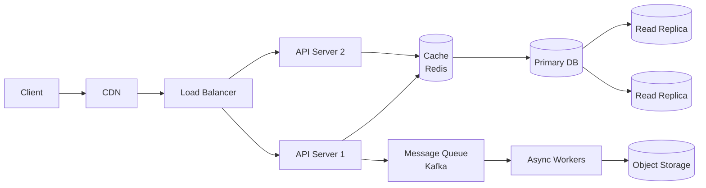

# System design — fundamentals

System design rounds (45-60 min, especially for mid/senior roles) ask you *"design Twitter / WhatsApp / Uber / YouTube"*. They don't want you to actually build that system, but want to see **how you structure an ambiguous problem**, know the building blocks, make explicit trade-offs.

This chapter gives you the foundations. The next (ch. 18) has end-to-end examples.

## Part 1 — What "distributed system" means

### The scale problem

A single server can:

- Serve **thousands** of requests per second (maybe tens of thousands).
- Keep **TB** of data on disk.
- Handle **GB** of RAM.

That's fine for a blog or small SaaS. But:

- Facebook has **3 billion** users.
- Google does **8 billion** queries per day.
- Netflix serves **15%** of global internet traffic.

A single server **isn't enough**. You need a **distributed** system: many computers (called **nodes**) working together, each doing a part.

### The challenges

Distributing is easy in words, brutal in practice:

1. **Coordination**: how do nodes talk without creating bottlenecks?
2. **Consistency**: if I update data on one node, do others see it immediately?
3. **Reliability**: if a node falls, does the system survive?
4. **Latency**: messages between nodes are slow vs local access (μs vs ns).
5. **Cost**: 1000 servers cost more than 1.

The art of system design is choosing **reasoned trade-offs**.

## Part 2 — 6-step response framework

In interview, always follow this order:

### Step 1 — Requirements clarification (5-10 min)

**Functional**: what does the user do? (post tweet, see feed, search...)

**Non-functional**: scale, latency, availability, consistency. Concrete numbers:

- DAU (daily active users)?
- QPS (queries per second)?
- Latency target (e.g. < 200 ms at 99th percentile)?
- Availability target (99.9% = 8 hours down/year, 99.99% = 50 minutes/year)?

**Out of scope**: what you DON'T cover (e.g. "skip authentication, skip payment").

### Step 2 — Back-of-envelope estimation

Quick calculations:

- DAU × actions/user = average QPS.
- × peak factor (3-5x) = peak QPS.
- Storage: data per object × total objects × years.
- Bandwidth: average payload × QPS.

Example Twitter: 200M DAU × 2 tweets/day = 400M tweets/day = 4600/sec average.

### Step 3 — API design

Which endpoints? Request/response formats.

```
POST /tweet     { text, user_id }
GET  /feed      { user_id, cursor? }
POST /follow    { follower, followee }
```

### Step 4 — Data model

Tables/document schema. Keys, indexes.

### Step 5 — High-level architecture

Draw the boxes: client → LB → API → cache → DB → storage. Connections and what flows.

Generic template example:



### Step 6 — Deep dive (on 1-2 components)

Pick 1-2 critical components and go deep: sharding, replication, cache invalidation.

**Typical mistake**: deep dive on everything. No time, and the interviewer wants to see how you **prioritize**.

## Part 3 — Essential building blocks

### 1. Load balancer

Distributes traffic among servers. Analogy: traffic cop at an intersection.

**Algorithms**:

- **Round-robin**: take turns. Simple.
- **Least connections**: to who has less load.
- **IP hash**: client X always goes to the same server (for session stickiness).
- **Weighted**: more powerful servers get more traffic.

**Layer**:

- **L4 (transport)**: sees only TCP/UDP packet, not payload. Fast but "dumb".
- **L7 (application)**: sees HTTP. Can route by path/header.

Product examples: HAProxy, NGINX, AWS ELB.

### 2. Reverse proxy

In front of application servers. Functions:

- SSL termination.
- Compression.
- Static cache.
- Rate limiting.

Often an LB **is** a reverse proxy (NGINX, HAProxy).

### 3. Cache

Stores frequent data to avoid recomputing or reading from DB.

**Levels**:

- **Client-side**: browser cache.
- **CDN** (Cloudflare, Akamai): geographically distributed cache for static assets (images, video, JS).
- **Application cache** (Redis, Memcached): sessions, DB queries.
- **Database cache**: query plan, buffer pool.

**Eviction policies**: LRU (least recently used), LFU (least frequently), FIFO, TTL.

**Write strategies**:

- **Write-through**: write to cache AND DB synchronously. Consistent but slow.
- **Write-back**: write only to cache, flush to DB periodically. Fast but risk data loss.
- **Write-around**: bypass cache on write. Cache populated on read miss.

**Cache invalidation**: hardest problem. Strategies: TTL, explicit, write-through, versioning.

> *"There are only two hard problems in computer science: cache invalidation and naming things."* — Phil Karlton

### 4. Database

#### Relational (RDBMS)

PostgreSQL, MySQL, Oracle, SQL Server.

**Features**:

- **Rigid schema**: tables with defined columns.
- **ACID**: transactions with strong guarantees.
- **JOIN**: complex queries across tables.
- **SQL** (standard language).

**When to use them**: referential integrity, complex transactions, analytics queries.

#### NoSQL

Different families, each optimized for a purpose:

- **Document** (MongoDB, CouchDB): JSON-like, flexible schema.
- **Key-value** (Redis, DynamoDB): O(1) lookup by key.
- **Wide-column** (Cassandra, HBase): huge horizontal scalability.
- **Graph** (Neo4j): relationships as first-class citizens.
- **Time-series** (InfluxDB, TimescaleDB): temporal data.

**When NoSQL**: horizontal scale, flexible schema, simple per-key queries, write-heavy.

### 5. Replication

A write → copies to multiple nodes. Purpose: high availability and read parallelism.

**Master-slave (primary-replica)**: writes on master, reads distributed among replicas.

- **Synchronous** replication: write confirmed only after replicas confirm. Consistent but slow.
- **Asynchronous** replication: master confirms immediately, replicas updated "soon". Fast but eventual consistency.

**Multi-master**: writes on any node. More scalable but need conflict resolution.

### 6. Sharding (partitioning)

Splitting data across multiple machines. Needed when a single node isn't enough.

**Strategies**:

- **Range-based**: ID/date ranges. E.g. users A-M on node 1, N-Z on node 2. Simple but hotspot risk.
- **Hash-based**: hash(key) % shard count. Uniform distribution but no range queries.
- **Geo-based**: by region. Reduces user latency.
- **Consistent hashing**: minimizes re-shuffling when you add/remove nodes. Used in DynamoDB, Cassandra.

### 7. Message queue / Pub-sub

Decouples producer and consumer.

**Kafka**: distributed log with high throughput, long retention, replay possible. Streaming.

**RabbitMQ**: traditional queues, flexible routing.

**AWS SQS, Google Pub/Sub**: managed.

**Use cases**: async jobs, event-driven, peak buffering, fan-out.

### 8. CDN

Geographically distributed cache for static assets. Reduces latency for remote users, offloads origin servers.

### 9. API Gateway

Single entry point for microservices: routing, authentication, rate limiting, transformations.

### 10. Object storage

S3, GCS, Azure Blob. For large files (images, video, backups). Not DB.

## Part 4 — CAP theorem

The most famous theorem of distributed systems. **In the presence of network partition**, you can choose only 2 out of 3:

- **C**onsistency: all nodes see the same data simultaneously.
- **A**vailability: every request gets a response.
- **P**artition tolerance: the system works even with network partitions.

In practice P is "mandatory" — partitions happen. So you choose between:

### CP — Consistency over Availability

When there's a partition, **reject** writes (or reads) to avoid divergence.

Examples: HBase, MongoDB (default), Zookeeper, etcd.

### AP — Availability over Consistency

When there's a partition, **accept** writes even if nodes diverge. Reconcile later.

Examples: Cassandra, DynamoDB, CouchDB.

### Practical example

An e-commerce cart in 2 datacenters. Partition between them. CP: block the cart (frustrating). AP: let the user buy, reconcile later (you can have "stock sold more than available").

## Part 5 — PACELC

CAP extension. In **absence** of partition, you still choose between Latency and Consistency:

- **PA/EL**: Cassandra, Dynamo. Always Availability, and absent P prefers Latency.
- **PC/EC**: BigTable, HBase. Always Consistency.
- **PA/EC**: Mongo default. Available in partition, consistent in absence.

In interview rarely cited, but knowing it exists shows depth.

## Part 6 — Scaling techniques

### Vertical scaling

More CPU/RAM/disk on same machine. Simple but with a ceiling.

### Horizontal scaling

More machines. "Shared nothing" architecture. Requires LB, sharding, replication. Theoretically unlimited scale.

### Caching

Already seen. Reduces DB load.

### Asynchronous processing

Long jobs on queue + workers, not in request-response. User gets "in processing, I'll notify".

### Read replicas

Reads from replicas, writes on master. Good trade-off for read-heavy workloads (90% of web apps).

### Denormalization

NoSQL schema often duplicates data to avoid JOINs. Costs storage and complicates writes, but speeds up reads.

### Indexing

Structures (B-tree, hash, inverted index) for fast queries. Costs storage and slows writes.

## Part 7 — Back-of-envelope numbers

To memorize:

| Operation | Time |
|---|---|
| L1 cache | 1 ns |
| L2 cache | 10 ns |
| RAM access | 100 ns |
| SSD read | 100 μs |
| Network within DC | 500 μs |
| HDD seek | 10 ms |
| Network NY → London | 100 ms |
| Network NY → Sydney | 200 ms |

| Quantity | Number |
|---|---|
| 1 day | 86,400 sec |
| 1 year | 31.5M sec |
| 1 KB | 10³ byte |
| 1 MB | 10⁶ byte |
| 1 GB | 10⁹ byte |

### Estimation example

> Twitter has 200M DAU. How many tweets/day? How much storage in 5 years?

- 200M users × 2 tweets/day = **400M tweets/day**.
- 400M / 86,400 ≈ **4,600 tweets/sec**.
- Peak (×3): ~14,000 tweets/sec.
- 1 tweet ≈ 300 bytes payload + 700 bytes meta = **1 KB**.
- 400M × 365 × 5 × 1 KB ≈ **700 TB**.
- Write bandwidth: 4600 × 1 KB = 4.6 MB/sec avg.

Reasonable numbers. Shows the skill.

## Part 8 — Trade-offs to always mention

- **Latency vs throughput**: minimize single latency or maximize requests/sec?
- **Consistency vs availability** (CAP).
- **Storage vs compute**: denormalize (more storage, less compute) or normalize (vice versa)?
- **Push vs pull**: server pushes data to client, or client requests it?
- **SQL vs NoSQL**.
- **Sync vs async**.

The interviewer loves hearing you say *"this choice optimizes for X, but trade-off Y. We can change if priorities are different"*.

## Part 9 — Interview strategy

### What to do

- **Spend time on requirements**. Worth 1/3 of the round.
- **Draw while you talk**. Simple boxes and arrows.
- **Numbers**: every decision justified by an estimate.
- **Explicit trade-offs**: each component "prefers X to Y".
- **Deep dive on 1-2 components** the interviewer wants to go deep on.

### What NOT to do

- **Throw buzzwords without justification**: "I use Kafka". *Why*?
- **Draw boxes without explaining how they talk**.
- **Ignore estimates**.
- **Go deep on everything**.

## Part 10 — Resources to go beyond

- **"Designing Data-Intensive Applications"** (Kleppmann) — modern system design bible.
- **System Design Primer** (donnemartin) on GitHub — free.
- **ByteByteGo, Hello Interview** (YouTube) — visual examples.
- **The Morning Paper** (Adrian Colyer's blog) — accessible academic papers.

## Summary

1. **Distributed system** = many nodes collaborating. Challenges: coordination, consistency, reliability.
2. **Building blocks**: LB, cache, DB (SQL/NoSQL), replication, sharding, queue, CDN, API gateway, object storage.
3. **CAP**: with partition, choose C or A. PACELC: even without partition, choose L or C.
4. **Scaling**: vertical (hardware limit) vs horizontal (preferred).
5. **Back-of-envelope**: ~10⁸ op/s, RAM 100 ns, network DC 500 μs, global network 100 ms.
6. **Response framework**: requirements → estimates → API → data model → architecture → deep dive.

System design is "experience" more than "study". Practice by doing 10+ systems out loud (ch. 18).
