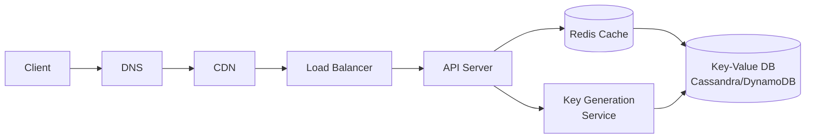
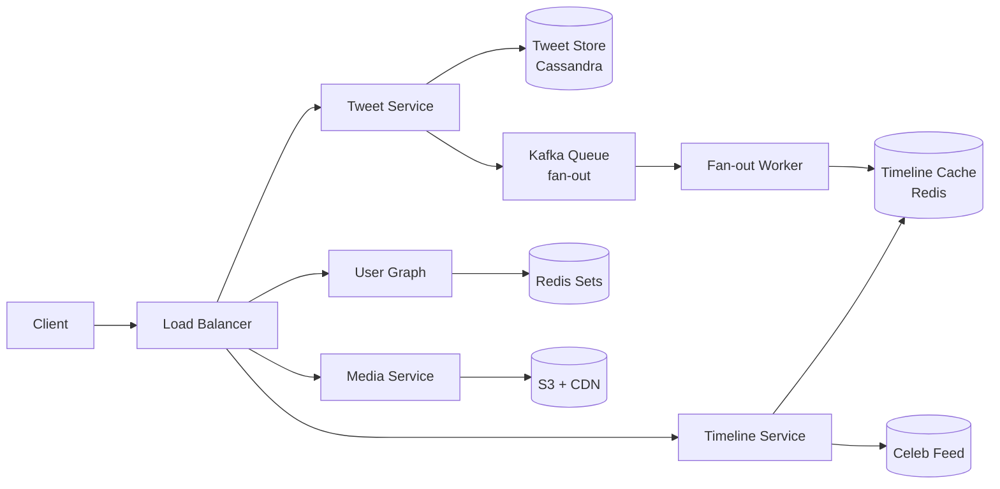
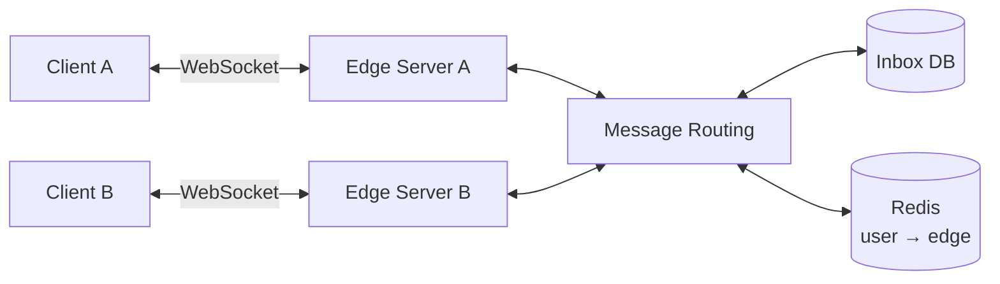
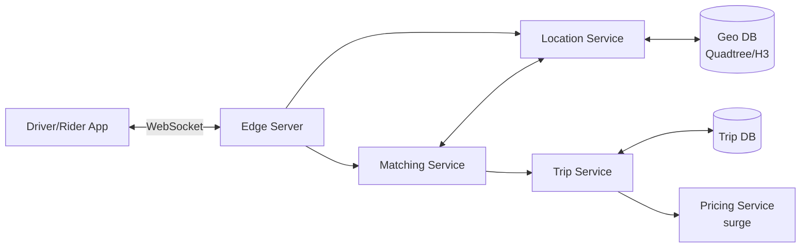
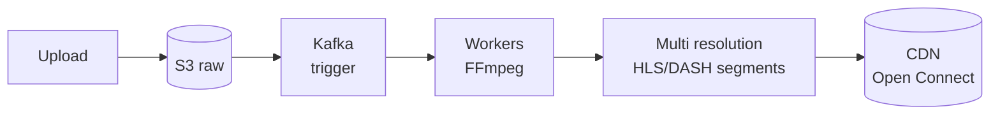
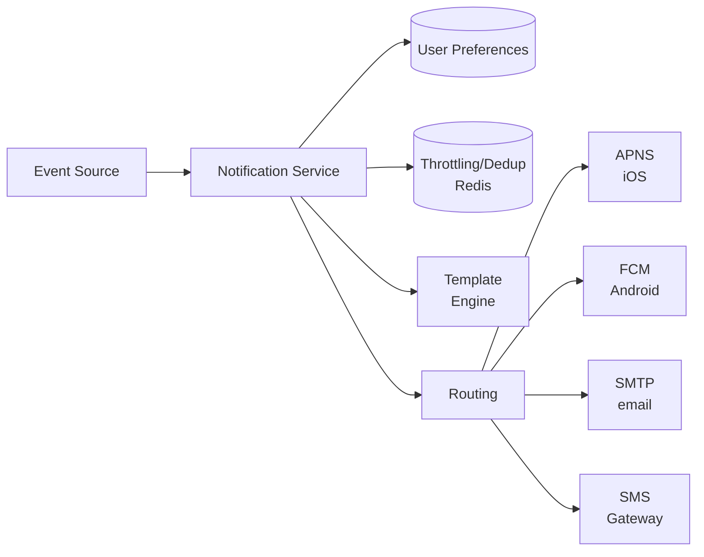

# System design — end-to-end examples

In each example follow the same scheme: **requirements → estimation → API → data model → high-level → deep dive**. Practice doing them **out loud**, with a blank sheet.

---

## 1. Design TinyURL (URL shortener)

> Service like bit.ly: turns long URLs into short URLs, and expands them when someone visits.

### Requirements clarification

**Functional**:
- `shorten(long_url) → short_url`.
- `resolve(short) → 302 redirect to long_url`.
- Custom alias optional.
- Optional expiration.

**Non-functional**:
- Redirect latency < 100 ms.
- Availability 99.99%.
- Short URL not guessable (security).

### Estimation

- 100M new URLs/month → ~40/sec writes. Peak ×5 = 200/sec.
- Read/write ratio: 100:1 → 4000/sec reads, 20000/sec peak.
- 5 years × 100M × 12 = 6 billion total URLs.
- Per URL: ~500 bytes (long_url + metadata) → **3 TB**.
- 80% cache hit rate → only 800 reads/sec on DB.

### API

```
POST /shorten
  body: { url, custom?, ttl? }
  response: { short }

GET /:short
  response: 302 Location: <long_url>
```

### Data model

| Field | Type |
|---|---|
| short_key (PK) | varchar(7) |
| long_url | text |
| created_at | timestamp |
| expires_at | timestamp? |
| user_id | uuid? |

### Short key generation — the critical point

Three approaches:

**Approach 1 — Hash MD5/SHA(long_url) → base62**: deterministic, but collisions. You must re-hash with suffix.

**Approach 2 — Random base62 of 7 chars**: 62⁷ ≈ 3.5×10¹² combinations. DB check if already existing.

**Approach 3 — Pre-generated keys (preferred)**: a **Key Generation Service** pre-generates a range of available keys (e.g. 1 billion) and distributes them in batch to API servers. No collisions, no shared locks, fast distribution.

### Architecture



### Deep dive

**Hot URL (viral)**: cache layer + DB replicas. CDN can cache the redirect (Cache-Control).

**Analytics**: each redirect → Kafka message → consumer batch-aggregates.

**Expiration**: TTL on Redis (auto-cleanup). On DB, nightly job deletes expired.

**Custom alias**: check unique in DB, error 409 if taken.

---

## 2. Design Twitter

> Post tweet, follow, see timeline of who you follow.

### Requirements

- Post tweet (≤ 280 chars).
- Follow/unfollow.
- See own timeline + feed of those you follow.

**Non-functional**:
- 300M users, 200M DAU.
- Timeline load < 200 ms.

### Estimation

- 200M DAU × 2 tweets/day = **400M tweets/day = ~4600/sec**.
- Timeline views: 200M × 5 = 1B/day = 12,000/sec.
- Tweet storage: 1KB × 400M × 365 × 5 ≈ **700 TB**.
- Read/write ratio: ~250:1. Heavy read.

### Architecture: the fan-out pattern

**Approach A — Fan-out on WRITE** (push):
- When you post, insert into all your followers' "timeline cache".
- Read O(1): read your timeline cache.
- Expensive write: for Lady Gaga (90M followers), 1 post = 90M writes.

**Approach B — Fan-out on READ** (pull):
- Timeline computed on-the-fly reading recent tweets of those you follow.
- Expensive read but O(1) write.

**Approach C — Hybrid (Twitter uses this)**:
- Fan-out on write for **normal users** (< 1M followers).
- Fan-out on read for **celebrities**.
- When a user opens timeline: read precomputed from cache + merge with celebrity timelines on-the-fly.

### Components



### Data model

- **tweets**: id, user_id, text, created_at, media_url? → wide-column (Cassandra).
- **followers**: follower_id → set(followee_id) → Redis Set.
- **timeline cache**: user_id → list of tweet_id (length ~800).

### Deep dive

**Trending topics**: count-min sketch streaming on Kafka.

**Search**: Elasticsearch on indexed tweets.

**Push notification**: queue → consumer → APNS/FCM.

**Edge case**: user follows 5000 celebrities → pull becomes slow. Follow limit + aggressive celebrity feed cache.

---

## 3. Design WhatsApp (Chat)

> Real-time messages, groups, online status, read receipts, end-to-end encryption.

### Requirements

- 1-1 chat and groups.
- Reliable delivery even if recipient offline.
- Latency < 100 ms.
- End-to-end encryption.

### Architecture

Central pattern: **WebSocket** for persistent connection.



**Edge servers**: terminate WebSocket. State `user_id → server_id` in Redis (needed to know where to send messages).

**Message flow**:
1. A sends message via WS to its edge.
2. Edge → routing service → looks up where B is in Redis.
3. If B online → forward to B's server → push to B via WS.
4. If B offline → persist in B's **inbox queue**.
5. When B comes back online, edge reads inbox, flushes.

### Data model

- **messages**: id, sender, recipient (user or group), content (encrypted blob), sent_at, status.
- **inbox per user**: queue of not-yet-delivered message_id.

### Group chat

Server does manual fan-out: iterates members, sends to each.

### Delivery guarantees

- Application-level ack (not just TCP). Client confirms receipt.
- Retry with exponential backoff on failures.

### End-to-end encryption (Signal protocol)

Client encrypts the message with recipient's key (obtained via key exchange). Server only sees opaque bytes. Even if compromised, server doesn't read.

### Deep dive

- **Online status**: heartbeat from client. "Lazy update" (not real-time, but "about").
- **Storage**: WhatsApp deletes messages after delivery. Only temporary inbox.
- **Multi-device sync**: all recipient's devices get a copy.

---

## 4. Design Uber

> Rider requests ride, driver accepts, real-time tracking.

### Requirements

- Rider requests ride.
- Driver accepts.
- Real-time tracking.
- Dynamic pricing (surge).

### Estimation

- 5M rides/day globally = 60/sec avg. Peak ×10 = 600/sec.
- 1M active drivers × 0.25 position updates/sec = **250,000 location updates/sec**.

### Architecture



### Geospatial indexing — the critical point

I want to answer "find all drivers within 5 km of P". Two techniques:

**Quadtree**: divides the world into 4 quadrants, recursively. Max cell = 500 drivers. Query "near P" descends the quadtree.

**Geohash**: encodes coordinates in 6-12 char string. 6 chars ≈ 1.2 km. Range query → prefix match.

Uber uses **H3** (Uber's hierarchical hexagons).

### Matching

1. Rider requests ride at coordinates (lat, lng).
2. Geo service query: drivers within radius.
3. For each, compute **ETA** (time of arrival) using road network.
4. Choose driver with lowest ETA + driver quality + load balancing.
5. Notify driver via push.

### Real-time tracking

Server pushes driver's position to rider every 2 sec via WS. Frontend interpolates between updates for smoothness.

### Deep dive

- **Update frequency**: each driver sends every 4 sec. Server aggregates to reduce DB load.
- **Surge pricing**: per zone, supply/demand ratio. If > 1.5, surge.
- **Resilience**: matching must complete in < 5 sec even with peaks.

---

## 5. Design Netflix (video streaming)

### Requirements

- Upload, transcode video.
- Browse catalog.
- Adaptive streaming (4K, 720p, mobile).
- Low global buffering.

### Architecture

#### Upload pipeline



**Transcoding output**: HLS/DASH manifest + 10-sec video segments in 5-10 qualities (240p, 360p, 480p, 720p, 1080p, 4K).

#### Playback

```
Client → DNS → nearest CDN edge → manifest → segments
```

**ABR (Adaptive Bitrate)**: client measures bandwidth, chooses quality for the next segment. Changes at each segment if bandwidth varies.

#### CDN strategy

Netflix has its own CDN ("Open Connect"). Appliances inside large ISPs reduce inter-city transport. 90% of Netflix traffic serves from Open Connect.

### Catalog & Search

- **Browse**: Elasticsearch on catalog.
- **Recommendation**: offline batch ML (ranking) + real-time signals (clicks, watch time).

### Deep dive

- **Resilience**: Chaos Monkey (Netflix) — they kill instances in production to test.
- **A/B testing**: row ordering, artwork.
- **DRM**: Widevine (Android), FairPlay (Apple), PlayReady (Edge).

---

## 6. Design Instagram

> Post photos/videos, follow, see feed.

Similar to Twitter but more "image-heavy".

### Components

- **Upload service**: client → API → direct upload to S3 with presigned URL → metadata in DB.
- **Image processing**: thumbnail, filters, EXIF strip → async pipeline (Kafka + workers).
- **Feed service**: similar Twitter hybrid fan-out.
- **CDN**: serves images globally.

### Schema

```
photos(id, user_id, s3_url, caption, created_at)
follows(follower_id, followee_id)
likes(user_id, photo_id, ts)
```

### Deep dive

**Like counter**: fast count. Use atomic counter in Redis + batch flush to DB.

**Hashtag/explore**: inverted index in Elasticsearch + ML ranking.

**Stories (24h ephemeral)**: temporary storage, TTL.

---

## 7. Design Notification System

> Central system for mobile push, email, SMS, in-app.

### Requirements

- Multiple channels: APNS (iOS), FCM (Android), SMTP, SMS gateway.
- Topics + user preferences.
- Throttling + dedupe.

### Architecture



### Components

- **Topic subscription**: user X subscribed to topic Y? Stored in DB.
- **Throttling**: rate limit per user/topic in Redis (sliding window).
- **Template engine**: server-side rendering with dynamic data.
- **Retry**: exponential backoff on fail (e.g. APNS down → retry 1s, 2s, 4s...).
- **DLQ (dead letter queue)**: after N retries, send to DLQ for investigation.

### Deep dive

**Idempotency**: same event can arrive 2 times (consumer retries). Idempotency key for dedupe.

**Per-channel optimization**:
- APNS requires payload < 4KB.
- SMS is expensive: aggressive rate limit.
- Email: pixel tracking for open rate.

---

## Cheatsheet: typical systems

| System | Key components |
|---|---|
| URL shortener | hash/base62 + cache + KV DB |
| Twitter/Insta | hybrid fan-out + timeline cache + graph |
| WhatsApp | WebSocket + sticky edges + inbox queue |
| Uber | geohash/quadtree + matching + RT tracking |
| Netflix | CDN + transcoding pipeline + ABR |
| Search engine | crawler + inverted index + ranker (BM25/ML) |
| Rate limiter | token bucket / sliding window in Redis |
| Distributed cache | consistent hashing + replication |
| Distributed file system | metadata service + chunk servers |

## Killer interview mistakes

- **Skip requirements**. 1/3 of the round.
- **Buzzword without justification** ("I use Kafka"... why?).
- **Boxes without explaining how they talk**.
- **Ignore scale & estimation**.
- **Deep dive on everything**. Pick 1-2 components.
- **Pretending to know everything**. Perfectly fine to say *"I've never designed X at this scale, but my reasoning is..."*.

## Summary

Every system = same skeleton: clarify → estimate → API → data model → architecture → deep dive.

Practice **out loud** with blank sheet. **10+ systems** before first senior loop.
