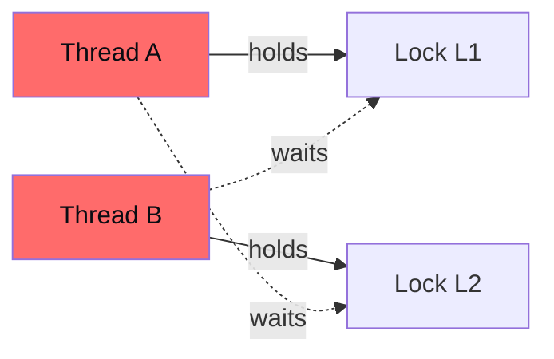

# Concurrency and parallelism

"Deep CS" topic that enters more in backend/infra interviews. For purely algorithmic roles it stays secondary, but a solid grounding distinguishes you.

## Part 1 — Concurrency vs parallelism

### Definitions

- **Concurrency**: multiple tasks **logically** in progress. Can interleave on a single CPU (multitasking).
- **Parallelism**: multiple tasks **physically** running on multiple CPUs.

Analogy (Rob Pike):

- Concurrency: a chef cooking multiple dishes, alternating steps.
- Parallelism: 4 chefs, each with their own dish.

In Python the **GIL** (Global Interpreter Lock) prevents threads from executing Python bytecode in parallel. So threads are useful for I/O-bound (release GIL during I/O), but **not for CPU-bound** parallel. For CPU parallelism, use `multiprocessing` (separate processes) or C-extensions releasing the GIL.

## Part 2 — Processes vs threads

### Process

A **process** is an instance in execution of a program. It has:

- Own memory space (total isolation).
- File descriptors.
- System resources table.
- At least 1 thread.

In Linux you can see them with `ps`, `top`.

### Thread

A **thread** is a scheduling unit within a process. Shares with other threads of the same process:

- Heap (dynamic memory).
- File descriptors.
- Code.

Each one has its own:

- Stack (call stack + local variables).
- CPU registers.

### Comparison table

| | Process | Thread |
|---|---|---|
| Memory | own | shared with peers |
| Communication | IPC (pipe, socket, queue) | shared variables |
| Crash | isolated (other processes live) | risks killing the process |
| Spawn cost | high | low |
| Context switch | expensive | light |

### Context switch

When OS suspends a task and starts another: saves registers/PC of current, loads of next. Cost: 1-10 μs on Linux. Causes cache miss → real impact higher.

## Part 3 — Race condition

The most infamous concurrency problem. Two threads read/write the same data without sync → result depends on **interleaving**.

### Classic example

```python
counter = 0
def inc():
    global counter
    counter += 1
```

What happens at machine level:

1. Load `counter` to register.
2. +1.
3. Write register to memory.

Three separate operations. If two threads execute `inc()` simultaneously:

```
Thread A: load counter (=0) to reg
Thread B: load counter (=0) to reg
Thread A: +1 → reg=1
Thread A: write 1 → counter=1
Thread B: +1 → reg=1
Thread B: write 1 → counter=1
```

Result: counter = 1, not 2. A "lost" increment.

With 1000 threads doing inc(), the final value **won't be 1000**.

### Solution: lock (mutex)

A "critical region" accessible by one thread at a time.

```python
import threading
lock = threading.Lock()
counter = 0

def inc():
    global counter
    with lock:
        counter += 1
```

Now the three steps are **atomic** (from other threads' perspective). 1000 threads → 1000 final, guaranteed.

## Part 4 — Sync primitives

### Mutex (lock)

1 thread at a time. Acquire → work → release.

### Semaphore

Generalization: N threads can enter simultaneously. Internal counter.

```python
sem = threading.Semaphore(5)   # max 5 concurrent
sem.acquire()
# work...
sem.release()
```

Used for: connection limit, resource pools.

### Condition variable

Wait/signal on a predicate. *"Wait until someone wakes me when condition X is true."*

```python
cond = threading.Condition()
with cond:
    while not predicate():
        cond.wait()   # releases lock and waits
    # here predicate is true
```

From another thread:

```python
with cond:
    change_state()
    cond.notify()       # wakes 1 waiting thread
    # or cond.notify_all()
```

### Spinlock

"Busy-wait": loop while the lock is unavailable. Fast for short waits (no context switch). Wastes CPU if wait is long.

### RWLock (reader-writer)

Many readers simultaneously, but writer exclusive. Useful for read-heavy workloads.

### Atomic operations

Hardware operations that read+modify+write in **a single step** (CAS, fetch-add). No locks for simple things.

In Python: most aren't atomic due to GIL. In C/Java there are `AtomicInteger`, `compare_exchange_strong`, etc.

## Part 5 — Deadlock

Two threads waiting for each other's resource.



Circular wait → no one can advance. **Deadlock**.

### Coffman conditions

All 4 must hold:

1. **Mutual exclusion**: resources not shareable.
2. **Hold and wait**: a thread holds a resource while waiting for another.
3. **No preemption**: OS can't yank resources.
4. **Circular wait**: circular chain of waits.

### Prevention

Break at least one condition. Simplest: **global lock ordering**. Every thread acquires in fixed order (e.g. always L1 before L2).

Other: `try_acquire` with timeout. If you can't, release everything and restart.

## Part 6 — Other subtle problems

### Livelock

Threads "notice" each other and dodge mutually, but never advance. E.g. two people dodging the same way in a corridor.

### Starvation

A thread can never get the lock because others are always "luckier". Solution: **fair** lock (FIFO).

### Race condition without data race

Even without concurrent access to the same variable, the **order** of operations can break logic. E.g. non-atomic "check then act".

```python
# Logical race condition:
if file_exists(path):    # check
    open(path)            # act
# If someone deletes file between check and act, crash.
```

## Part 7 — Producer-consumer (the canonical problem)

Producers put items in queue. Consumers take them. Shared queue, **blocking** when empty (consumer waits) or full (producer waits).

```python
import threading, queue

q = queue.Queue(maxsize=10)

def producer():
    while True:
        item = produce()
        q.put(item)   # blocks if full

def consumer():
    while True:
        item = q.get()   # blocks if empty
        consume(item)
        q.task_done()
```

Python's `queue.Queue` is thread-safe (internal lock). Standard solution.

## Part 8 — Async/await (single-threaded concurrency)

Alternative model for **I/O-bound**: no threads. Single thread with an event loop handling thousands of "waiting" tasks.

```python
import asyncio
import aiohttp

async def fetch(session, url):
    async with session.get(url) as r:
        return await r.text()

async def main(urls):
    async with aiohttp.ClientSession() as session:
        results = await asyncio.gather(*[fetch(session, u) for u in urls])
    return results
```

**When**:

- Many concurrent I/O requests (HTTP, DB).
- No CPU-bound (single thread doesn't parallelize CPU).

Pro: no locks, no expensive context switches. Pro: scale to **10000+** tasks in a single thread.

Con: "viral" code — you must propagate `async` everywhere. Less familiar debugging.

## Part 9 — Other models

### Actor model (Erlang, Akka)

Each "actor" has:
- Mailbox (queue of incoming messages).
- Private state (no sharing!).
- Handler processing messages.

Communication **only by messages**. No shared memory, no race conditions.

### CSP / channels (Go)

> *"Don't communicate by sharing memory; share memory by communicating."*

Goroutine (lightweight threads) + channel (typed queue). Elegant model for most concurrent problems.

## Part 10 — Exercises

### Exercise 19.1 — Bounded Blocking Queue <span class="problem-tag medium">MEDIUM</span>

Implement thread-safe queue with max size.

<details><summary>Solution</summary>

```python
import threading
class BoundedBlockingQueue:
    def __init__(self, cap):
        self.cap = cap
        self.q = []
        self.lock = threading.Lock()
        self.not_full = threading.Condition(self.lock)
        self.not_empty = threading.Condition(self.lock)

    def enqueue(self, x):
        with self.not_full:
            while len(self.q) >= self.cap:
                self.not_full.wait()
            self.q.append(x)
            self.not_empty.notify()

    def dequeue(self):
        with self.not_empty:
            while not self.q:
                self.not_empty.wait()
            x = self.q.pop(0)
            self.not_full.notify()
            return x

    def size(self):
        with self.lock:
            return len(self.q)
```

Condition variable pattern: `while not predicate(): cond.wait()`.
</details>

### Exercise 19.2 — Print in Order <span class="problem-tag easy">EASY</span>

Three threads call `first()`, `second()`, `third()` in arbitrary order. Force output 1→2→3.

<details><summary>Solution</summary>

```python
import threading
class Foo:
    def __init__(self):
        self.s2 = threading.Semaphore(0)
        self.s3 = threading.Semaphore(0)
    def first(self, fn):
        fn()
        self.s2.release()
    def second(self, fn):
        self.s2.acquire()
        fn()
        self.s3.release()
    def third(self, fn):
        self.s3.acquire()
        fn()
```

Semaphores initialized to 0. `second` waits for `s2` (released by first). `third` waits for `s3` (released by second). Chain.
</details>

### Exercise 19.3 — Dining Philosophers <span class="problem-tag hard">HARD</span>

5 philosophers, 5 forks in circle. Each needs 2 adjacent forks. No deadlock, no starvation.

<details><summary>Solution (one approach)</summary>

Even philosophers take left first, odd take right first. Breaks circular wait.

Alternative: a "waiter" (global semaphore) lets at most 4 philosophers sit → impossible deadlock.
</details>

### Exercise 19.4 — Building H2O <span class="problem-tag medium">MEDIUM</span>

Threads emit `H` or `O`. Group them into 2H + 1O molecules at a time.

<details><summary>Solution</summary>

```python
import threading
class H2O:
    def __init__(self):
        self.h_sem = threading.Semaphore(2)
        self.o_sem = threading.Semaphore(0)
        self.barrier = threading.Barrier(3)
    def hydrogen(self, rel):
        self.h_sem.acquire()
        self.barrier.wait()
        rel()
        self.o_sem.release()
    def oxygen(self, rel):
        self.o_sem.acquire(); self.o_sem.acquire()
        self.barrier.wait()
        rel()
        self.h_sem.release(); self.h_sem.release()
```

Barrier synchronizes 3 threads (2H + 1O) before releasing.
</details>

### Exercise 19.5 — Multithreaded Web Crawler <span class="problem-tag medium">MEDIUM</span>

Conceptual approach: pool of workers, queue of pending URLs, thread-safe visited set (with lock), rate limiting per host (token bucket).

### Exercise 19.6 — Multithreaded Fizz Buzz <span class="problem-tag medium">MEDIUM</span>

4 threads: print "Fizz", "Buzz", "FizzBuzz", number. Coordinate order.

<details><summary>Solution (skeleton)</summary>

Lock + condition variable. Each thread waits until it's its turn (based on `i % 3 == 0` or `% 5 == 0`).
</details>

## Summary

1. **Concurrency ≠ parallelism**. In Python (GIL), threads useful for I/O, not for CPU-bound.
2. **Processes**: isolated, IPC to communicate. **Threads**: share memory in same process.
3. **Race condition**: two threads concurrently access → nondeterministic bugs. Solve with locks.
4. **Deadlock**: 4 Coffman conditions. Break one (e.g. global lock ordering).
5. **Sync primitives**: mutex, semaphore, condition variable, RWLock, atomic.
6. **Producer/consumer**: canonical pattern. In Python `queue.Queue` thread-safe.
7. **Async/await**: single-threaded alternative for I/O-bound.

Concurrency is "muscle" built with practice and real failures. In interview: master the basic patterns above.
